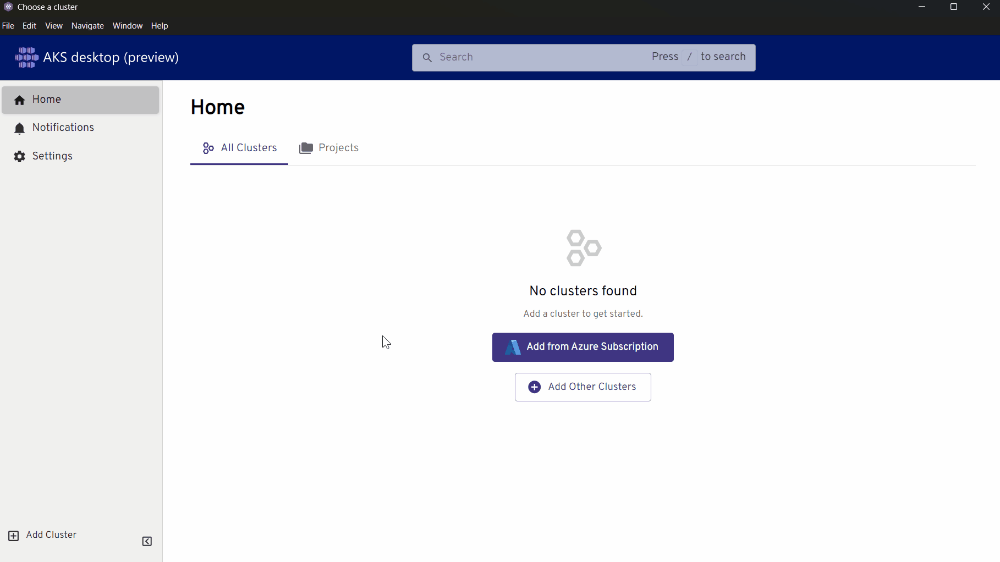
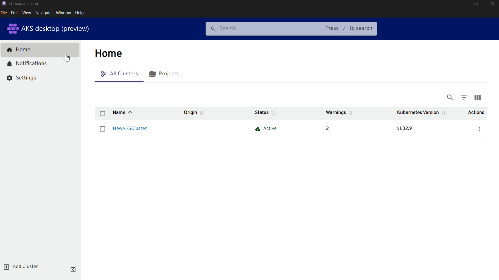
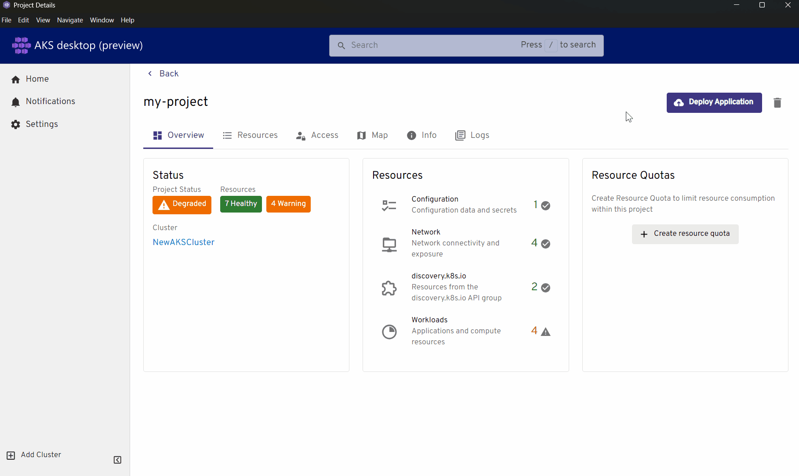

# Deploy an application to AKS desktop (Preview)

This article guides you through deploying an application using AKS desktop, enabling you to manage your containerized workloads with an intuitive, application-centric interface.

> [!NOTE]
> AKS desktop is in early stages of public preview. During the public preview, AKS desktop might undergo design changes, add or delete additional features, and more. If you're interested in shaping the AKS desktop experience, engage with the engineers and product team at the official [AKS desktop GitHub repository][AKS desktop GitHub repository].

## Prerequisites

- You need an Azure subscription. If you don't have an Azure subscription, you can create a free [Azure account][Azure account].
- You must have an AKS cluster available through the Azure portal or an Azure Container Registry with your application image that you want to deploy.
- The [Azure CLI](/cli/azure/install-azure-cli?view=azure-cli-latest&preserve-view=true) must be installed on your device.
- [Install AKS desktop][install AKS desktop]. AKS desktop supports the following operating systems:

  - Windows

  - Linux

  - Mac

- If you decide to create an AKS managed project, your cluster must be Microsoft Entra ID authenticated. We recommend you use AKS Automatic for your cluster SKU in AKS desktop as Microsoft Entra ID comes standard. You can run the following command on an existing cluster to perform this action. You can also add multiple admin groups by adding `ObjectID_1,ObjectID_2,...`:

  ```azurecli
  az aks update --resource-group YourResourceGroupName --name YourManagedClusterName --enable-aad --aad-admin-group-object-ids <ObjectID_1> --aad-tenant-id <TenantID>
  ```

## Sign into your account

The first time you open AKS desktop, you need to sign into your Azure account. Signing in allows you to see AKS clusters and Projects that you have access to. To sign in, follow these steps:

1. In the left pane, select **Home**, then select **Sign in with Azure**.
1. Select the account that you want to use.

Once signed in, you have the ability to add clusters that you have access to into AKS desktop.

## Add a cluster

> [!NOTE]
> The recommendation is to use an AKS Automatic cluster when using AKS desktop. While standard SKU clusters work in AKS desktop, you might not see the full benefits of the project view. AKS Automatic includes built-in metrics, observability, and other tools that enable AKS desktop to surface important insights for users.

When you sign in, you're given two options to add a cluster to AKS desktop. The available options are:

- From your Azure subscription
- Uploading a KubeConfig file

If you have a single Azure subscription, AKS desktop auto populates your subscription once you sign in.

# [Azure](#tab/azure)

1. Select **Add from Azure Subscription**.
1. Type the name of your Azure subscription if you have more than one.

   *Alternatively*, select the arrow to open the drop-down list, then select your Azure subscription.

1. Choose your cluster, then select **Register Cluster**.

   

# [KubeConfig](#tab/kubeconfig)

If KubeConfig is your first method of choice, follow these steps:

1. Select **Home**, then select **Add Other Clusters**.
1. Select **Load from KubeConfig**, from here, pick one of two options:

   1. Select **Choose file**, locate your Kubconfig file, select it, then select **Open**.

   1. Drag and drop your Kubeconfig file into AKS desktop. Then select **Next**.

If you followed the Azure method first, follow these steps:

1. In the left pane, select **Add Cluster**, then select **Load from KubeConfig**.
1. From here, pick one of two options:

   1. Select **Choose file**, locate your Kubconfig file, select it, then select **Open**.

   1. Drag and drop your Kubeconfig file into AKS desktop. Then select **Next**.

---

## Add additional clusters

1. In the bottom left pane, select **Add Cluster**. You can choose to load from your kubeconfig file or from Azure.
1. Using the Azure method, under **Providers**, select **Add**.
1. Type the name of your Azure subscription if you have more than one.

   *Alternatively*, select the arrow to open the drop-down list, then select your Azure subscription.

1. Choose your cluster, then select **Register Cluster**.

   

## Remove a cluster

To delete a cluster from AKS desktop, follow these steps:

1. Under the **Home** screen, tick the box next to the cluster you want to remove.
1. To the far right under **Actions**, select the three dots, then select **Delete**.
1. The **Delete Cluster** window appears asking if you want to remove the specified cluster. Select **Delete**.

   

## Create a new Project

When you create a project on a cluster, any user with access to the associated namespace can view the project. Namespace access and labeling determine which users can see each project, since projects are tied to namespaces.

There are three methods you can choose from to deploy your application using AKS desktop:

# [AKS managed project](#tab/aks-managed-project)

To manage your project using this method, the **aks-preview** extension must be installed by running the following command:

```azurecli
az extension add --name aks-preview
```

*Alternatively*, under **AKS Preview Extension Required**, select the **Install Extension** button.

You must also register the namespace preview feature for first time use. Under **Feature Flag Required**, select the **Register ManagedNamespacePreview Feature** button.

Once these prerequisites are complete, perform the following steps:

1. Provide a project name. Adding a project description is optional.
1. Select your subscription.
1. Select your cluster. Your cluster must be Microsoft Entra ID authenticated.
1. Select **Next**.
1. Under **Networking Policies**, choose the ingress and egress for your network traffic. Then select **Next**.
1. Under **Compute Quota**, adjust the quota based on your needs. Then select **Next**.
1. Under **Access**, assign the project to one or more users and permission level for each under **Role**. Then select **Next**.
1. Under **Review**, verify the settings for your project, then select **Create Project**.


# [YAML project](#tab/yaml-project)

1. Provide a project name.
1. Select a cluster to add to your project.
1. Under **Load resources**, you can choose the following:

   1. Select a `.yaml` or `.yml` file to load. You can also drag and drop your file into AKS desktop. Then select **Create**.

   1. Select **Load from URL**, paste your YAML URL, select **Load**, then select **Create**.

# [New project](#tab/new-project)

1. Provide a project name.
1. Select a cluster to add to your project. You can add more once a cluster is selected.
1. Use an existing namespace or type a new namespace to use.
1. Select **Create**.

---

## Remove a project

To delete a project from AKS desktop, follow these steps:

1. In the left pane, select the **Home** button.
1. Under **Projects**, select your project under the **Name** column.
1. Within your project, to the far right, select the trash can button.
1. Under the **Delete Project** window, select the **Delete Project** button to remove your project from the given namespace.

   If you also want to the delete the namespace along with your project (which also removes associated resources), tick the box **Also delete the namespaces**. Then select **Delete Project**.

## Deploy an application into a Project

We recommend that you always create a new project when deploying a new application.

Once you create your first project, AKS desktop places you directly into the newly created project. Within your project, select **Deploy Application** from the top right corner. There are two sources you can choose from to deploy your app. Choose one of the two, then select **Next**:

# [Container Image](#tab/container-image)

1. Provide a name for your app.
1. Under **Container image**, paste the path to your container image. It must be in the format `<YourACR>.azurecr.io/<YourImageName>:<YourImageTag>`.

   > [!NOTE]
   > The **latest** tag can't be used for your container images as it results in best practice violation on AKS Automatic.

1. Select your replica amount.
1. Under **Networking**, input your network port. Choose whether your app is meant for internal only or for public access, then select **Continue**.
1. Under **Health checks**, choose which checks you want to perform, then select **Continue**.
1. Under **Resource Limits**, configure per your app requirements, then select **Continue**.
1. Under **Environment Variables**, add your `key:value` pair variable for your app, then select **Continue**.
1. Under **HPA**, select whether to enable Horizontal Pod Autoscaler (HPA) for your app. HPA automatically adjusts the number of pods in response to resource usage, helping maintain optimal performance and resource efficiency. Configure per your needs, then select **Continue**.
1. Under **Advanced**, choose which settings you'd like to apply to your app, then select **Next**.
1. Review your app deployment configuration. Select **Deploy**, then select **Close**.

   

# [Kubernetes YAML](#tab/kubernetes-yaml)

1. Select **Upload files** to upload one or more `.yaml` or `.yml` files. Then select **Next**.

   *Alternatively*, you can paste the contents within your YAML files into the text editor, then select **Next**.

1. Review the resources to deploy, select **Deploy**, then select **Close**.

---

## View cluster data and metrics

AKS desktop provides a unified view of your application resources, health status, resource quotas, workloads, and configuration settings all in a single dashboard. Use the tabs to explore detailed information and manage each aspect of your deployment efficiently.

To access this information for your specific cluster, follow these steps:

1. A cluster must be added into AKS desktop to view this information.
1. Select **Home**, under the **Name** tab, select the cluster you wish to view.
1. In the left pane, choose the specific setting to view detailed cluster data and metrics.

## Join the community and provide feedback for AKS desktop (Preview)

You can provide feedback by visiting the [official AKS desktop GitHub repository][AKS desktop GitHub repository]. To provide your feedback, follow these steps:

1. Select the **Issue** button.
1. Select **New Issue**, and select the appropriate issue.
1. Fill out the appropriate fields for the issue. Then select the **Create** button to submit your information.

## Next steps

- Learn more about [AKS desktop overview](aks-desktop-overview.md)
- Learn how to [Get started with AKS desktop (Preview)](aks-desktop-permissions.md)
- Explore [AKS Automatic clusters](auto-upgrade-cluster.md)

<!-- LINKS - external -->
[AKS desktop GitHub repository]: https://github.com/Azure/aks-desktop
[Azure account]: https://azure.microsoft.com/free
[install AKS desktop]: https://github.com/Azure/aks-desktop/releases