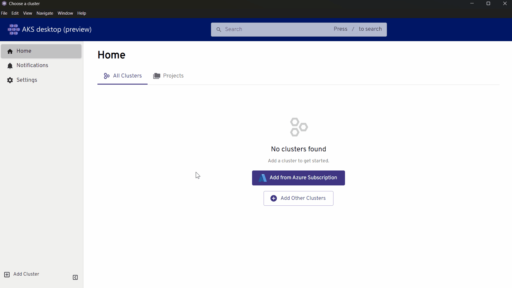
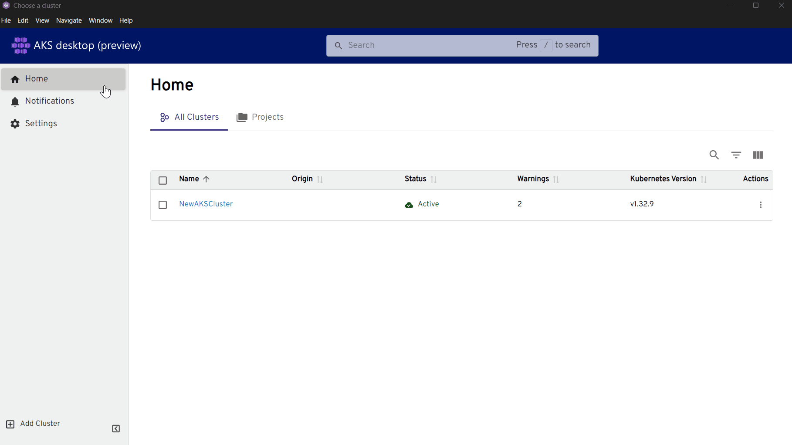
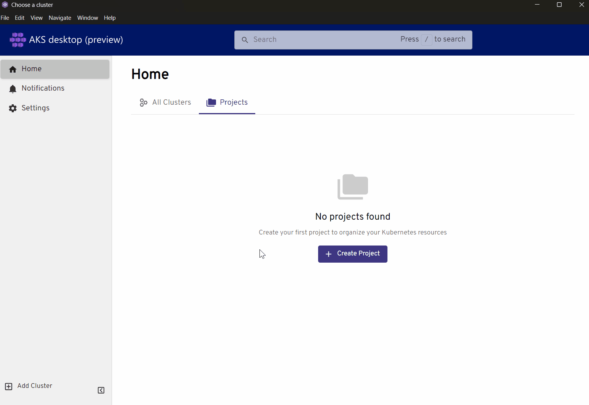

# Deploy an application using AKS desktop

This article shows you how to sign in, add a cluster, create a [Project](aks-desktop-overview.md#projects-in-aks-desktop), deploy an application, and view metrics in AKS desktop for Azure Kubernetes Service (AKS). For an overview of AKS desktop, see [AKS desktop overview](aks-desktop-overview.md).

## Prerequisites

- An Azure subscription. If you don't have an Azure subscription, you can create a free [Azure account](https://azure.microsoft.com/free).
- An existing [AKS Automatic cluster](intro-aks-automatic.md) with Microsoft Entra authentication. The cluster needs to be available through the Azure portal or an [Azure Container Registry (ACR)](/azure/container-registry/container-registry-intro) with your application image that you want to deploy.
- Azure CLI version 2.64.0 or later. Check your version using the [`az --version`](/cli/azure/reference-index#az-version) command. To install or upgrade, see [Install Azure CLI](/cli/azure/install-azure-cli).
- The `aks-preview` Azure CLI extension. Install it using the `az extension add --name aks-preview` command.
- [AKS desktop](https://github.com/Azure/aks-desktop/releases) installed. AKS desktop supports the following operating systems (OS): Windows, Linux, and Mac.
- Appropriate Role-Based Access Control (RBAC) roles assigned for your team. For more information, see [Set up permissions and RBAC for AKS desktop](aks-desktop-permissions.md).

## Sign in to your account

The first time you open AKS desktop, you need to sign into your Azure account. Signing in allows you to see AKS clusters and Projects that you have access to.

1. In the left pane, select **Home** > **Sign in with Azure**.
1. Select the account that you want to use.

Once signed in, you have the ability to add clusters that you have access to into AKS desktop.

## Add a cluster to AKS desktop

> [!NOTE]
> AKS Automatic is the recommended cluster type to use with AKS desktop. While AKS Standard SKU works in AKS desktop, you might not see the full benefits of the Project view. AKS Automatic includes built-in metrics, observability, and other tools that enable AKS desktop to surface important insights for users.

When you sign in, you can add clusters into AKS desktop from your Azure subscription or by uploading a kubeconfig file. If you have a single Azure subscription, AKS desktop autopopulates your subscription once you sign in.

### [Use your Azure subscription](#tab/azure-subscription)

1. Select **Add from Azure Subscription**.
1. Enter the name of your Azure subscription if you have more than one. (Alternatively, select the arrow to open the drop-down list, and then select your Azure subscription.)
1. Select your cluster, and then select **Register Cluster**.

   

### [Upload a kubeconfig file](#tab/kubeconfig-file)

1. Select **Home** > **Add Other Clusters** > **Load from KubeConfig**. (If you followed the Azure subscription method first, select **Add Cluster** > **Load from KubeConfig**.)
1. Select one of the following options:

   - Select **Choose file**, locate and select your kubeconfig file, and then select **Open**.
   - Drag and drop your kubeconfig file into AKS desktop, and then select **Next**.

---

## Add additional clusters to AKS desktop

1. In the bottom left pane, select **Add Cluster**. You can choose to load from your kubeconfig file or from Azure.
1. Under **Providers**, select **Add**.
1. Enter the name of your Azure subscription if you have more than one. (Alternatively, select the arrow to open the drop-down list, and then select your Azure subscription.)
1. Select your cluster, and then select **Register Cluster**.

   

## Remove a cluster from AKS desktop

Delete a cluster from AKS desktop and your kubeconfig using the following steps:

1. Under the **Home** screen, select the box next to the cluster you want to remove.
1. Under **Actions**, select the three dots, and then select **Delete**.
1. The **Delete Cluster** window appears asking if you want to remove the specified cluster. Select **Delete**.

   

## Create a new Project in AKS desktop

When you create a Project on a cluster, any user with access to the associated namespace can view the Project. Namespace access and labeling determine which users can see each Project, since Projects are tied to namespaces. For more information, see the [Overview of Projects in AKS desktop](aks-desktop-projects.md).

There are three methods you can choose from to deploy your application using AKS desktop: **AKS managed Project**, **YAML Project**, or **New Project**.

### [Create an AKS managed project](#tab/aks-managed-project)

> [!IMPORTANT]
> Make sure you register the namespace preview feature for first time use. Under **Feature Flag Required**, select **Register ManagedNamespacePreview Feature**.

1. Provide a Project name. Adding a Project description is optional.
1. Select your subscription, your cluster, and then select **Next**.
1. Under **Networking Policies**, select the ingress and egress for your network traffic, and then select **Next**.
1. Under **Compute Quota**, adjust the quota based on your needs, and then select **Next**.
1. Under **Access**, assign the Project to one or more users and permission level for each under **Role**, and then select **Next**.
1. Under **Review**, verify the settings for your Project, and then select **Create Project**.
1. Add your application name, and then select **Create Application**.

    

### [Create a YAML project](#tab/yaml-project)

1. Provide a Project name.
1. Select a cluster to add to your Project.
1. Under **Load resources**, you can choose the following:

   - Select a `.yaml` or `.yml` file to load. You can also drag and drop your file into AKS desktop. Then select **Create**.
   - Select **Load from URL**, paste your YAML URL, and then select **Load** > **Create**.

### [Create a new project](#tab/new-project)

1. Provide a Project name.
1. Select a cluster to add to your Project. You can add more once a cluster is selected.
1. Use an existing namespace or type a new namespace to use.
1. Select **Create**.

---

## Remove a Project from AKS desktop

1. In the left pane, select the **Home** button.
1. Under **Projects**, select your Project from the **Name** column.
1. Within your Project, select the trash can icon.
1. Under the **Delete Project** window, select **Delete Project** to remove your Project from the given namespace.

   > [!NOTE]
   > If you also want to the delete the namespace along with your Project (which also removes associated resources), select **Also delete the namespaces** > **Delete Project**.

## Deploy an application into a Project in AKS desktop

> [!TIP]
> When you deploy an application to AKS Desktop for the first time, metrics might take 5–10 minutes to appear as data begins flowing into managed Prometheus. After this initial delay, metrics should load within seconds. If metrics don't appear, try refreshing AKS desktop.

Always create a new Project when deploying a new application. Once you create your first Project, AKS desktop places you directly into the newly created Project. Within your Project, select **Deploy Application**. There are two sources you can choose from to deploy your application: **Container Image** or **Kubernetes YAML**.

### [Container Image deployment](#tab/container-image)

1. Provide a name for your application.
1. Under **Container image**, paste the path to your container image. It must be in the format `<YourACR>.azurecr.io/<YourImageName>:<YourImageTag>`.

   > [!NOTE]
   > You can't use the **latest** tag for your container images, as it results in best practice violation on AKS Automatic.

1. Select your replica amount.
1. Configure settings for the following sections, selecting **Continue** after each section:

   - **Networking**: Input your network port, select whether your application is meant for internal only or for public access.
   - **Health checks**: Select which checks you want to perform.
   - **Resource Limits**: Configure per your application requirements.
   - **Environment Variables**: Add your `key:value` pair variable for your application.
   - **HPA**: Select whether to enable Horizontal Pod Autoscaler (HPA) for your application. HPA automatically adjusts the number of pods in response to resource usage, helping maintain optimal performance and resource efficiency. If you enable HPA, configure per your application requirements.
   - **Advanced**: Select any extra settings to apply.
1. Review your application deployment configuration.
1. Select **Deploy** > **Close**.

### [Kubernetes YAML deployment](#tab/kubernetes-yaml)

1. Select **Upload files** to upload one or more `.yaml` or `.yml` files, and then select **Next**. (Alternatively, you can paste the contents within your YAML files into the text editor, and then select **Next**.)
1. Review the resources to deploy.
1. Select **Deploy** > **Close**.

---

## View cluster data and metrics in AKS desktop

AKS desktop provides a unified view of your application resources, health status, resource quotas, workloads, and configuration settings all in a single dashboard. You can use the tabs to view detailed information and manage each aspect of your deployment. You must have a cluster added into AKS desktop to view this information.

View cluster data and metrics in AKS desktop using the following steps:

1. Select **Home**.
1. Under the **Name** tab, select the cluster you want to view.
1. In the left pane, select the specific setting to view detailed cluster data and metrics.

## Related content

For more information about AKS desktop, see the following resources:

- [Troubleshoot an application using Insights (preview)](aks-desktop-deploy-troubleshooting.md)
- [Use the AI troubleshooting assistant (preview)](aks-desktop-deploy-ai-assistant.md)
- [Set up permissions and RBAC for AKS desktop](aks-desktop-permissions.md)
- [AKS desktop overview](aks-desktop-overview.md)
