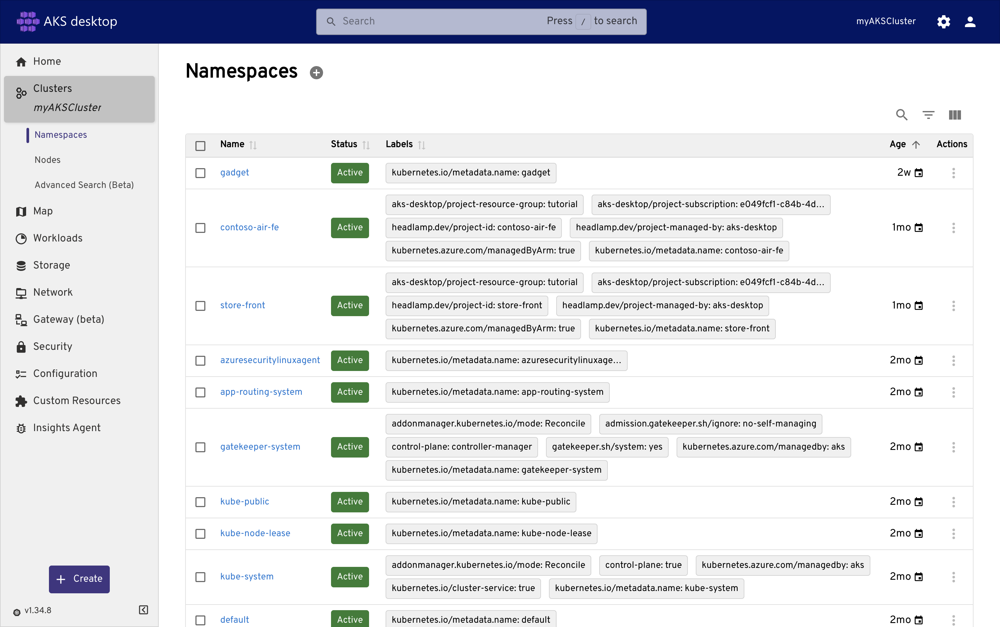

# Connect to AKS clusters, view resources, and manage applications using AKS desktop

AKS desktop is an application-focused developer local desktop UI tool  for Azure Kubernetes Service (AKS) built on [Headlamp](https://headlamp.dev/). It lets Kubernetes operators and developers connect to clusters, explore all running resources, deploy new applications, and manage or troubleshoot existing workloads from dashboards without writing Kubernetes manifests or running kubectl commands.

This article covers how to:

> [!div class="checklist"]
>
> - Connect to an AKS cluster using AKS desktop.
> - View cluster resources across all namespaces and resource types.
> - Deploy new applications using guided workflows.
> - Import and manage existing applications.
> - Observe and troubleshoot applications using logs, metrics, and insights.

## Prerequisites

- [AKS desktop](./aks-desktop-overview.md) installed. AKS desktop supports Windows, Linux, and macOS.
- An existing AKS cluster. The cluster must use Microsoft Entra ID authentication. For the best experience, use an [AKS Automatic cluster](intro-aks-automatic.md). For Standard cluster requirements, see [AKS Standard clusters for AKS desktop](aks-desktop-install-cluster-setup.md#aks-standard-clusters).
- The [Azure Kubernetes Service RBAC Cluster Admin role](manage-azure-rbac.md#aks-built-in-roles) or equivalent permissions on the target cluster.

## Connect to an AKS cluster

Before you can view resources or manage applications, you must register your AKS cluster with AKS desktop.

1. Sign in to AKS desktop using the same account that has access to your AKS cluster.
1. Select **Add from Azure Subscription**.
1. If you have more than one subscription, enter or select the name of your Azure subscription.
1. Select your cluster from the list, and then select **Register Cluster**.

    

Once registered, you will see a list of clusters, click on one and your cluster appears in the left-hand navigation. You can add multiple clusters and switch between them at any time.

> [!TIP]
> To add additional clusters later, select **Add** in the cluster list and repeat the steps in this section.
> You can also add non-AKS clusters (for example: on premise Kubernetes or cloud vendor managed Kubernetes). When adding these clusters, you need the kubeconfig for the cluster and networking connectivity.

:::image type="content" source="./media/aks-desktop-app/aks-desktop-app-add-additional-clusters.gif" alt-text="A video demonstrating how to add additional clusters to AKS desktop.":::

## View cluster resources

AKS desktop gives you visibility into all Kubernetes resources running in your cluster across all namespaces and resource types. From the left-hand navigation, select your registered cluster to expand the resource tree. You can browse the following resource categories:

| Category | Description |
|---|---|
| **Map** | Visualize the relationships between all resources in your cluster, showing how components depend on and interact with each other. |
| **Workloads** | View deployments, pods, replica sets, stateful sets, daemon sets, jobs, and cron jobs across all namespaces. |
| **Storage** | View persistent volumes, persistent volume claims, and storage classes configured in your cluster. |
| **Network** | View services, ingresses, and network policies that control traffic flow between pods and external endpoints. |
| **Gateway** (beta) | View Kubernetes Gateway API resources for advanced ingress and load balancing configurations. |
| **Security** | View pod security policies, role-based access control (RBAC) settings, and network policies. |
| **Configuration** | View ConfigMaps and secrets that store configuration and sensitive data for your applications. |
| **Custom Resources** | View any custom resource definitions (CRDs) and custom resources deployed to the cluster. |

> [!NOTE]
> AKS desktop shows the full cluster resource tree to users with cluster admin access. Access to individual namespaces and Projects is governed by Kubernetes RBAC roles. For more information, see [Set up permissions for AKS desktop](aks-desktop-permissions.md).

### View workload details

Select any workload resource to view its details, including:

- Container status, restarts, and readiness probes.
- Events related to that resource.
- Labels and annotations.
- The live YAML definition.

:::image type="content" source="./media/aks-desktop-app/aks-desktop-app-resources.png" alt-text="Screenshot of the workload Resources view in AKS desktop.":::

## Deploy new applications

AKS desktop uses [Projects](aks-desktop-projects.md) to group everything an application needs, such as deployments, services, and configuration into a single, manageable unit. To deploy a new application, you first create a Project, and then deploy one or more applications into it.

For a complete step-by-step deployment walkthrough, including creating the cluster, building a container image, and deploying the application, see [Quickstart: Deploy and manage applications using AKS desktop](aks-desktop-quickstart-auto.md).

The following images show the key steps in the AKS desktop deployment experience:

Create a new Project to group your application resources:

:::image type="content" source="./media/aks-desktop-app/aks-desktop-new-project.png" alt-text="Screenshot of creating a new Project in AKS desktop.":::

Choose a deployment source — container image, Kubernetes YAML, or Helm chart:

:::image type="content" source="./media/aks-desktop-app/aks-desktop-select-app-src.png" alt-text="Screenshot of selecting a deployment source in AKS desktop.":::

Review and confirm the deployment, then monitor resource status from the Project overview:

:::image type="content" source="./media/aks-desktop-app/aks-desktop-app-project-overview.png" alt-text="Screenshot of the Project overview screen in AKS desktop after deployment." lightbox="./media/aks-desktop-app/aks-desktop-app-project-overview.png":::

## Manage existing applications

You don't need to deploy a new application to benefit from AKS desktop. If you have workloads already running in the cluster, you can import the namespace into AKS desktop as a Project and manage it from there.

### Import an existing namespace as a Project

1. In AKS desktop, navigate to the **Projects** tab.
1. Select **Create a New Managed Project** or **Import existing namespace**.
1. Select **Use an existing namespace**, then choose the namespace where your application is running.

AKS desktop adds labels to the namespace and exposes it as a Project. Your existing workloads continue running without interruption.

> [!NOTE]
> For more information on namespace labeling and how access is managed for imported Projects, see [Namespace labeling and access for Projects in AKS desktop](aks-desktop-projects.md#namespace-labeling-and-access-for-projects).

### Observe and troubleshoot application health

From the Project overview screen, you can monitor the health and performance of any application managed by AKS desktop:

- **Resources**: View all Kubernetes resources deployed in the Project, including workloads, services, and configuration.
- **Map**: Visualize how resources interact and depend on each other.
- **Logs**: Stream pod logs for real-time debugging.
- **Metrics**: View CPU and memory consumption for application components.
- **Scaling**: View current replica counts and configure Horizontal Pod Autoscaler (HPA) settings.

:::image type="content" source="./media/aks-desktop-app/aks-desktop-app-metrics.png" alt-text="Screenshot of the Metrics view in AKS desktop showing CPU and memory usage.":::

## Related content

- [AKS desktop overview](aks-desktop-overview.md)
- [Overview of Projects in AKS desktop](aks-desktop-projects.md)
- [Quickstart: Deploy and manage applications using AKS desktop](aks-desktop-quickstart-auto.md)
- [AKS desktop cluster setup and requirements](aks-desktop-install-cluster-setup.md)
- [Set up permissions for AKS desktop](aks-desktop-permissions.md)
- [Troubleshoot an application using AKS desktop Insights (preview)](aks-desktop-deploy-troubleshooting.md)
- [Use the AI troubleshooting assistant in AKS desktop (preview)](aks-desktop-deploy-ai-assistant.md)
