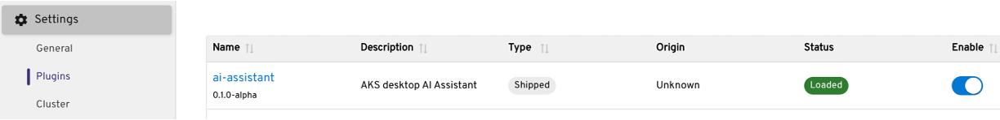
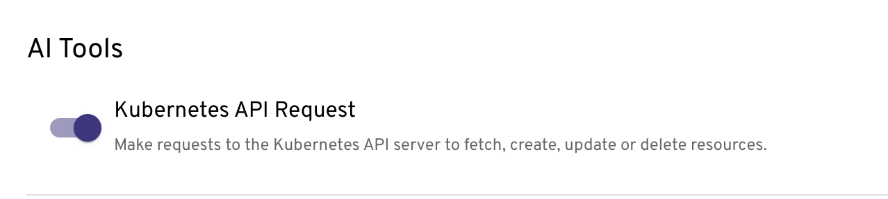
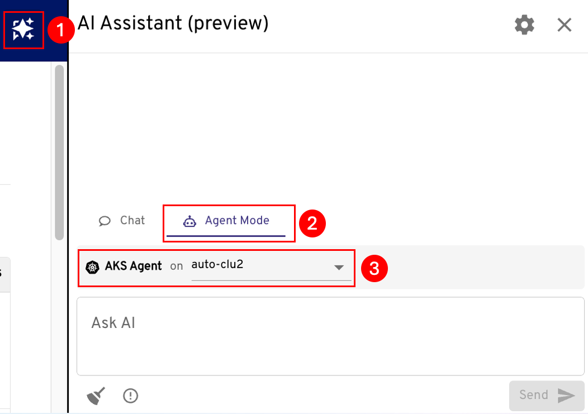
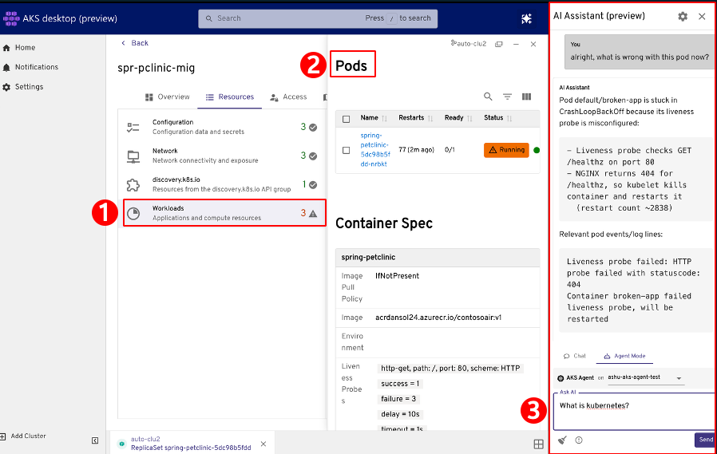

# Troubleshoot and understand workloads with natural language in AKS desktop

Troubleshooting Kubernetes workloads is often complex and time consuming, it typically relies on a mix of CLI commands, dashboards, and documentation to piece together what went wrong. Common issues like DNS failures, pod crashes, and upgrade blockers can be difficult to diagnose, especially when the root cause is buried across logs, events, and configurations.

Now using a single tool, this new AI-powered in-context experience is designed to help developers and Kubernetes operators diagnose and resolve issues in AKS clusters faster and with greater confidence, where AKS desktop AI knows what you're looking at, and can now investigate problems using guided, explainable insights, all within the familiar AKS desktop interface.

> [!NOTE]
> This feature is currently in Preview/Alpha and is subject to updates. To raise issues, see the [AKS Desktop issue tracker](https://github.com/Azure/aks-desktop/issues).

## Functionality and usage
The AKS desktop troubleshooting assistant is built into [AKS desktop](aks-desktop-overview.md) and provides a guided experience for diagnosing issues in your cluster. You can:
- Select a project, namespace, or workload to investigate.
- Run scoped diagnostics that analyze logs, events, and metrics.
- Receive AI-generated summaries with clear reasoning and evidence.
- Preview recommended actions and apply them with confidence.
- Use your own language models or connect to Azure managed options.
- Work alongside existing dashboards in AKS desktop for a cohesive troubleshooting experience.

> [!WARNING]
> This plugin is in early development and is not ready for production use. Using it may incur costs from your AI provider.

## Getting started
There are two options for enabling this functionality:
1. **Utilize the [Azure AKS Agentic CLI Agent](https://blog.aks.azure.com/2025/08/15/cli-agent-for-aks)** - (recommended for AKS), this an AI-powered tool that acts as an intelligent sidekick to diagnose, troubleshoot, and optimize AKS clusters using natural language queries. It provides root cause analysis by connecting to your AKS cluster (using your permissions) and remediation suggestions. This is backed by a LLM of your choice.

Here AKS Desktop connects to the Agentic CLI Agent endpoint running in your selected cluster to send troubleshooting queries and receive AI-generated analysis.

2. **AKS desktop Agent** - AKS desktop will act as an Agent itself, providing context to your model of your choice. 

### What is the difference between these?
Asking a standalone LLM a question is similar to asking an expert for advice based only on what you tell them. In contrast, the AKS Agentic CLI integrates the HolmesGPT agentic framework with the AKS Model Context Protocol (MCP) server. Combined, they know which tools, troubleshooting techniques, and other MCP servers to use, enabling the agent to securely access live cluster state, logs, metrics, and Azure resource data to perform iterative, context-aware investigations within role-based access control (RBAC) boundaries rather than relying solely on static user-provided input. 

### Should I use a hosted model or host my own?
By default, the AKS Agentic CLI connects to a hosted LLM endpoint using a customer‑provided API key, but organizations with strict data residency or compliance requirements may instead choose to deploy a model within their own environment. Below we will walk you through an end to end example of setting up a model in your own environment.

## Prerequisites

1. Enable the AI Assistant plugin in AKS desktop.
   - Go to **Settings** > **Plugins**.
   - Make sure the AI Assistant plugin is enabled.
   - Select **AI Assistant** in the list of plugins.
   - Toggle **Preview** to the enabled state. After this, the AI Assistant icon appears in the top right.

2. Configure a provider.
   - Go to **Settings** > **Plugins** > **AI Assistant** > **Add provider**.

3. Choose how the AI Assistant is backed (see below for a complete end to end set of steps)
**Option 1**: Use the Azure AKS Agentic CLI Agent (recommended for AKS)
- Install the [Agentic CLI Agent](agentic-cli-for-aks-install.md) on your cluster and configure it to connect to a model.
- Ensure the cluster running the Agentic CLI Agent is a registered cluster in AKS desktop (you should see it in your cluster list).
- Details on how to set this up end to end below.

**Option 2**: Use an existing model
- Configure the provider so that AKS desktop can act as an agent and send cluster context to your existing model.

4. Enable the **AI tool Kubernetes Requests** setting

   This setting allows the AI Assistant to make live Kubernetes API requests against your cluster. When enabled, the assistant can query resource state, pod logs, events, and metrics to provide context-aware analysis. If disabled, the assistant can only reason from information you manually provide in the chat.

   - Go to **Settings** > **Plugins** > **AI Assistant**.
   - Enable the **AI tool Kubernetes Requests** toggle.

## Set the AI Assistant to use the AKS Agentic CLI Agent
1. Open the AI Assistant.
2. Select Agent.
3. Select the cluster where the Agentic CLI Agent is running (from the previous install step). 

## Investigate degraded resources

The assistant is context-aware. When you see errors or warnings highlighted in the interface, select the resource and ask the assistant for an explanation and recommended resolution.

1. Go to the cluster resource, for example a service, or go to the AKS desktop project and select the workload.
2. Select the Kubernetes resource that is degraded or showing errors in the event log.
3. Select **Agent** and start chatting.

## Next steps

- [Troubleshoot an application using Insights (preview)](aks-desktop-deploy-troubleshooting.md)
- [Deploy an application using AKS desktop](aks-desktop-app.md)

## Related content

- [Report issues or provide feedback for AKS desktop](https://github.com/Azure/aks-desktop/issues)
- [AKS desktop quickstart](aks-desktop-quickstart-auto.md)
- [AKS desktop overview](aks-desktop-overview.md)

