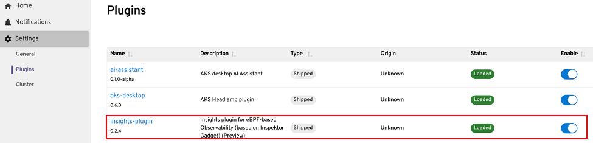
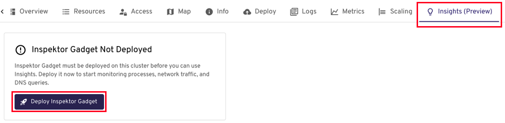
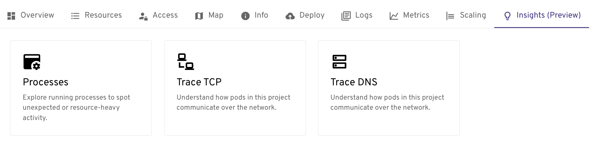
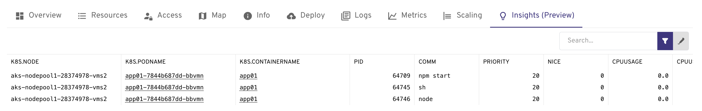
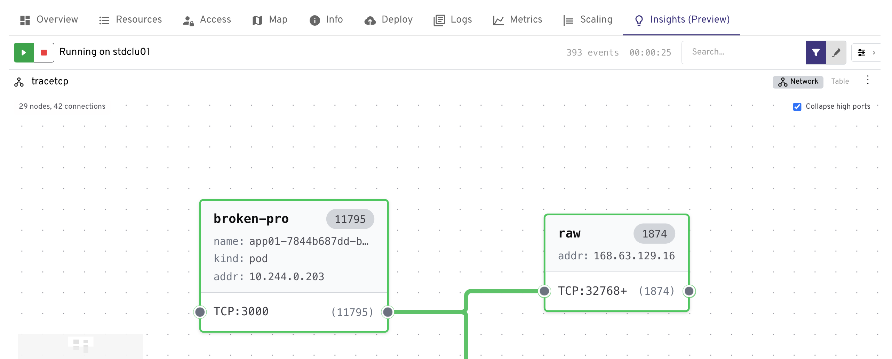
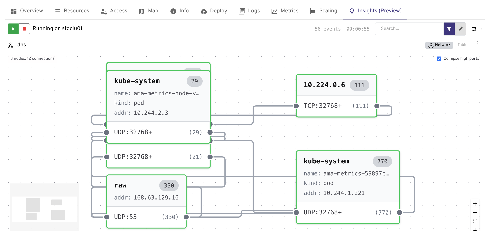

# Troubleshoot an application using AKS desktop

> [!NOTE]
> This feature is currently in Preview/Alpha and is subject to updates. To raise issues, see the [AKS Desktop issue tracker](https://github.com/Azure/aks-desktop/issues).

Troubleshooting a Kubernetes application typically means identifying a problem, reviewing resources, and then reaching for a mix of CLI tools, dashboards, and documentation to piece together what went wrong. This often involves many tools, switching between screens, and doing all of this in real time — which introduces friction and risk.

AKS Desktop includes an integrated troubleshooting suite called **Insights**, powered by [Inspektor Gadget](https://inspektor-gadget.io/) — an open-source eBPF (extended Berkeley Packet Filter)-based debugging tool. Without modifying your code or restarting anything, it lets you understand network traffic between pods, trace DNS failures, and explore running processes to spot unexpected or resource-heavy activity, all through an intuitive UI with a few clicks.

This article walks you through enabling Insights and using it to diagnose common application issues in your AKS cluster.

## Prerequisites

- **AKS Desktop** installed and signed in to your AKS cluster. See [Set up an AKS cluster for AKS desktop](aks-desktop-install-cluster-setup.md) or [Deploy applications with AKS Automatic using AKS desktop](aks-desktop-quickstart-auto.md).
- **Cluster-admin** or equivalent RBAC permissions on the target AKS cluster. Installing Inspektor Gadget requires creating a `ClusterRole`, `ClusterRoleBinding`, and a privileged `DaemonSet`.
- Your cluster nodes must run **Linux** with kernel version **≥ 5.4**. Windows node pools are not supported.
- If your cluster uses Azure Policy or OPA Gatekeeper with restricted pod security, add an exemption for the `gadget` namespace to allow privileged pods.
- The target cluster must be an AKS Standard cluster.

## Enabling Insights

Follow these steps to enable the Insights feature in AKS Desktop:

### Step 1: Open AKS Desktop

Launch the AKS Desktop application and ensure you are signed in and connected to your AKS cluster.

### Step 2: Enable the Insights Plugin

1. In the left-hand navigation, click **Settings**.
2. From the Settings submenu, select **Plugins**.
3. Locate the **Insights** plugin in the list and click the **Enable** toggle to turn it on.



### Step 3: Navigate to Your Project

In the left-hand navigation, select the **Project** you want to use Insights with. The **Insights** tab will now be visible in the project view.



### Step 4: Deploy Inspektor Gadget to the Cluster

On the Insights tab, you are prompted to deploy **Inspektor Gadget** to your cluster if it is not already installed.

1. Select **Deploy Inspektor Gadget**.
2. AKS Desktop deploys the Inspektor Gadget DaemonSet to the `gadget` namespace on your cluster.
3. Wait for the deployment to complete. A status indicator confirms when Inspektor Gadget is ready.


### Step 5: Start Exploring Insights

Once Inspektor Gadget is deployed, the Insights tab populates with live observability data from your cluster. See [What you can do with Insights](#what-you-can-do-with-insights) for the full set of capabilities.



## What you can do with Insights

### Performance troubleshooting with Processes

The Processes view shows you every running process across your cluster's pods in real time, along with CPU, memory, and disk I/O usage. Use it to:

- Identify which pods are consuming excessive CPU or memory
- Spot abnormal block I/O activity — unusually high disk reads or writes that can indicate a misconfigured app, a runaway log writer, or a storage bottleneck
- Detect unexpected processes that shouldn't be running in a container




### Network visibility with Trace TCP

Trace TCP captures live TCP connection events at the kernel level using eBPF — without a proxy or sidecar. Use it to:

- See which pods are opening outbound connections and to which destination IPs and ports
- Detect unexpected or unauthorized connections that may indicate a misconfiguration or security issue
- Correlate network anomalies with specific pods or workloads




> [!NOTE]
> You must stop the trace when you have finished, click on the red stop button in the top right of the trace.

### Solve DNS issues with Trace DNS

Trace DNS captures every DNS query and response made by pods in your cluster. Use it to:

- Identify DNS queries that are failing to resolve — a common cause of pod-to-service connectivity failures
- Measure DNS latency to determine whether CoreDNS (the in-cluster DNS server) or an upstream DNS resolver is slow
- Check the health of CoreDNS and whether external DNS resolution is working correctly





> [!NOTE]
> You must stop the trace when you have finished, click on the red stop button in the top right of the trace.

## Uninstalling Inspektor Gadget

To remove Inspektor Gadget from your cluster, delete its namespace:

```bash
kubectl delete ns gadget
```

> [!WARNING]
> This command removes all resources in the `gadget` namespace, not only those created by Inspektor Gadget. If you have deployed other resources to this namespace, they will also be deleted.
---

## Troubleshooting

| Issue | Resolution |
|---|---|
| **Insights tab is not visible** | Ensure the Insights plugin is enabled. Go to **Settings** > **Plugins** and toggle **Insights** on. |
| **Deployment of Inspektor Gadget fails** | Verify you have sufficient RBAC permissions to create DaemonSets and ClusterRoles in the cluster. |
| **No data appears after deployment** | Confirm the cluster nodes are running a supported Linux kernel (≥ 5.4). Check the Inspektor Gadget pod logs for errors. |

## Next steps

- [Use the AI troubleshooting assistant (preview)](aks-desktop-deploy-ai-assistant.md)
- [Deploy an application using AKS desktop](aks-desktop-app.md)


## Related content

- [Inspektor Gadget on GitHub](https://github.com/inspektor-gadget/inspektor-gadget)
- [Inspektor Gadget Desktop on GitHub](https://github.com/inspektor-gadget/ig-desktop)
- [Report issues or provide feedback for AKS desktop](https://github.com/Azure/aks-desktop/issues)
- [AKS desktop cluster requirements](.aks-desktop-install-cluster-setup.md)
- [AKS desktop overview](aks-desktop-overview.md)


