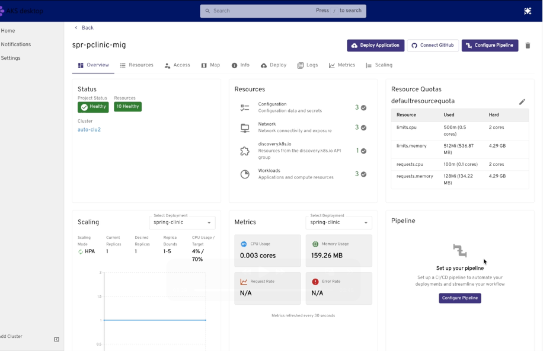
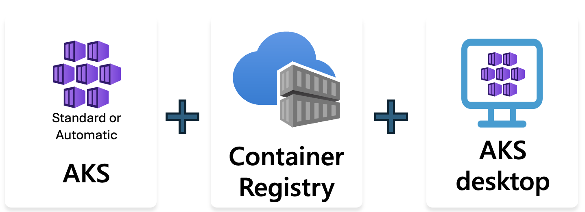
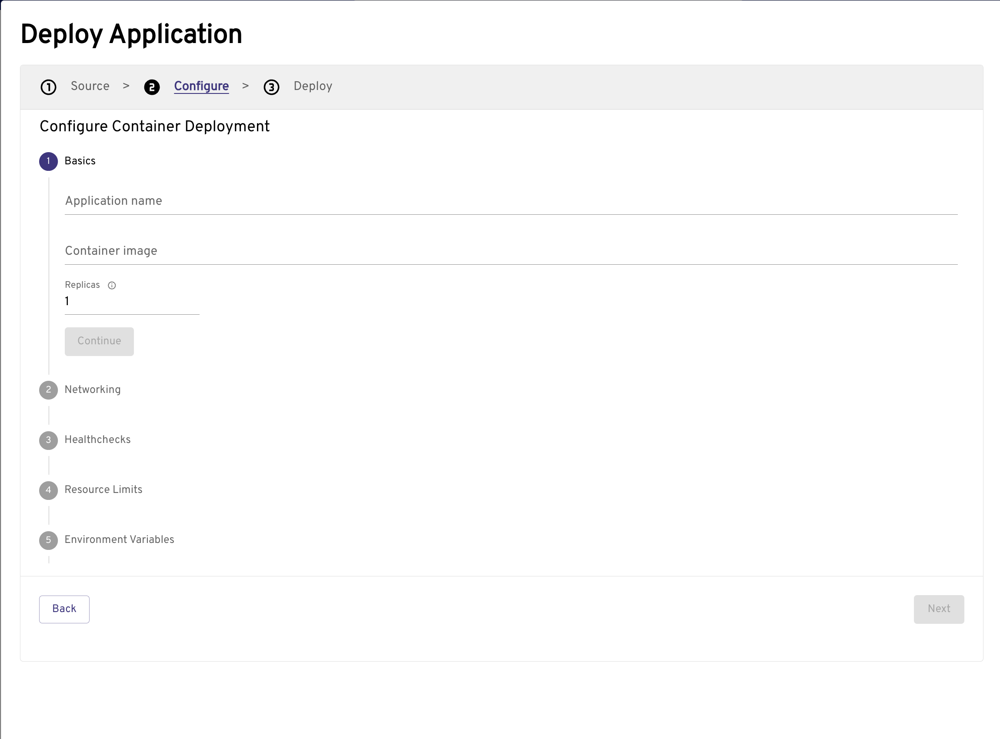
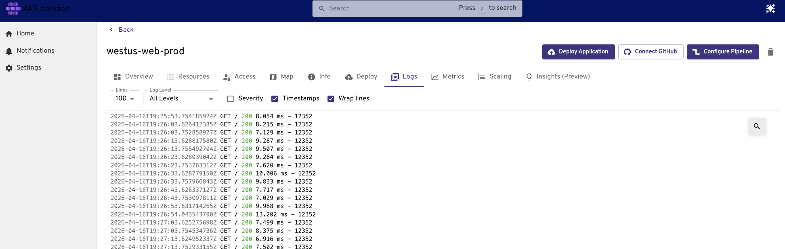
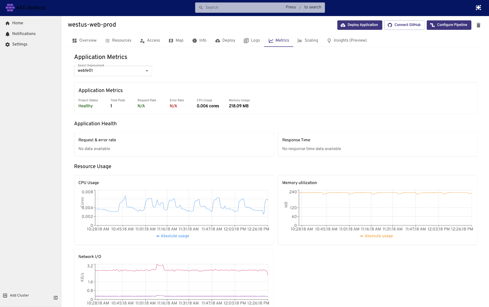
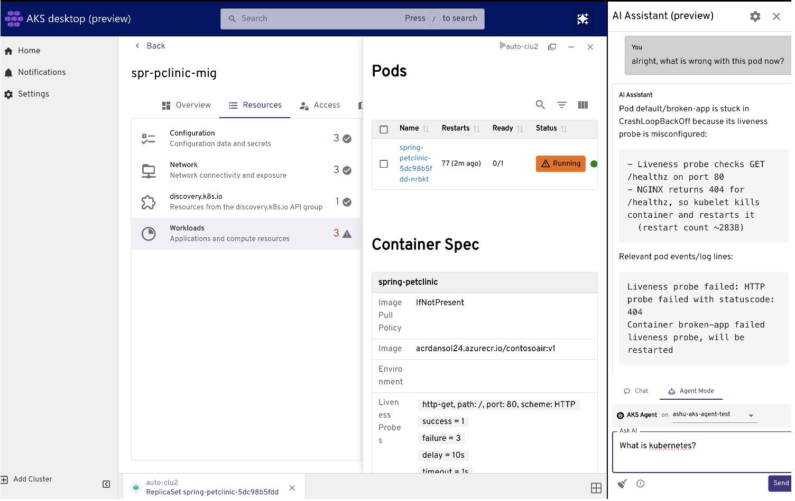

# AKS desktop for Azure Kubernetes Service (AKS)

Kubernetes application development often requires writing and maintaining YAML manifests, switching between multiple tools (kubectl, dashboards, monitoring), understanding low-level infrastructure concepts, and building custom observability UIs. For development teams, this increases time to business value and demand for specialized skills.

AKS desktop is an application-focused developer portal for Azure Kubernetes Service (AKS). Instead of working directly with YAML or kubectl, AKS desktop introduces a higher-level concept called a **Project**, which groups everything your application needs into a single, manageable unit. It provides guided workflows for deploying, monitoring, scaling, and troubleshooting applications.

> [!IMPORTANT]
> AKS desktop abstracts Kubernetes complexity but does not remove access. You can still use kubectl, YAML, and your existing tools alongside AKS desktop at any time.

AKS desktop works within your existing environment and tools — including Visual Studio Code, GitHub, and CI/CD pipelines. It connects to your existing AKS clusters and supports multi-environment scenarios across dev, test, staging, and production, including Azure hybrid and edge deployments.

Built on supported AKS features, best practices, and open-source [Headlamp](https://headlamp.dev/), to install AKS desktop, see the [AKS desktop GitHub repository](https://github.com/Azure/aks-desktop/releases).

## Who is AKS desktop for?

### DevOps and platform engineers
- Provide a simplified interface for developers to manage applications and their resources
- Delegate access to applications on AKS using guardrails and RBAC
- Manage multiple clusters and applications with a consistent experience

### Application developers
- Deploy and update applications without writing Kubernetes manifests
- Debug issues using logs, metrics, live tracing, and visualizations
- Observe, scale, and monitor applications in real time

## Why AKS Desktop?

Kubernetes workflows often require:
- Writing and maintaining YAML  
- Switching between tools (kubectl, dashboards, monitoring)  
- Understanding low-level infrastructure concepts  

AKS desktop simplifies this by:
- Focusing on **applications instead of infrastructure**
- Providing **guided workflows** for common tasks
- Unifying **deployment, observability, and scaling** in one place
- Enabling **troubleshooting** in one screen with natural language and logs
- **Abstracting but not removing** Kubernetes access — kubectl, YAML, and existing tools still work alongside AKS desktop
- **Enabling team collaboration** through RBAC-based Project sharing
- Working within your **existing tools** — Visual Studio Code, GitHub, CI/CD pipelines, and terminal
- Supporting **multi-environment workflows** across dev, test, staging, and production, including Azure hybrid and edge clusters

## Core concept: Projects

A **Project** is the primary unit for managing applications in AKS Desktop.

A Project groups related Kubernetes resources—such as deployments, services, and configuration—into a single logical unit.

| Concept | AKS Desktop Project | Kubernetes Namespace |
|--------|--------------------|---------------------|
| Purpose | Application-level grouping | Resource isolation |
| Abstraction level | High (developer-friendly) | Low (infrastructure-focused) |
| Mapping | Typically 1:1 | Native Kubernetes concept |

Projects make it easier to:
- Understand application boundaries  
- Manage access using RBAC  
- View all resources in one place  
- Attribute ownership of K8s and Azure resources and therefore cost management

## Quick start
You just need an AKS cluster and an Azure Container Registry (ACR) to get started. Follow the [AKS desktop quick start](./aks-desktop-quickstart-auto.md) to deploy your first application.

### Deploy applications through guided flows

### View logs and debug applications

### Unified observability

### Troubleshoot

### Natural language troubleshooting

## Key capabilities

| Capability | Description |
|------------|-------------|
| **Application-centric management** | Focus on applications instead of individual Kubernetes resources. Projects group deployments, services, and config into a single unit. |
| **Guided workflows** | Deploy, scale, and update applications without writing Kubernetes manifests. |
| **Unified observability** | View logs, metrics, health status, and dependency maps in one place. |
| **Natural language troubleshooting** (preview) | Ask questions in natural language to diagnose and resolve issues in your cluster. Powered by the [AKS Agentic CLI Agent](agentic-cli-for-aks-overview.md) + AKS MCP server — the AI accesses live cluster state, logs, events, and metrics within your existing RBAC boundaries. Use a hosted model or bring your own. |
| **Insights** (preview) | eBPF-based deep observability powered by [Inspektor Gadget](https://inspektor-gadget.io/) — no code changes, no pod restarts, no sidecar required. Includes **Processes** (CPU, memory, I/O per pod), **Trace TCP** (live connection events), and **Trace DNS** (query failures, latency). |
| **Multi-cluster & multi-environment support** | Manage applications across dev, test, staging, and production on Azure, hybrid, and edge clusters. |
| **Role-based access control** | Delegate access at the Project level using Azure RBAC — platform engineers control what developers can see and do. |
| **Works within your tools** | Integrates with Visual Studio Code, GitHub, CI/CD pipelines, and the terminal. Existing kubectl and YAML workflows remain available. |
| **Built on AKS best practices** | Built on supported AKS features including AKS Deployment Safeguards, Managed Prometheus, and Entra ID authentication. |

## Preview Features

AKS desktop is generally available with the following features currently in preview:

- Natural language troubleshooting
- Insights - deeper observability of high resource usage, network tracing and DNS issues

## FAQ
* I am using HeadLamp, how is this different? 
  * You have all the HeadLamp features within AKS desktop.
* Can I manage existing applications with AKS desktop?
  * Yes, you can import them into AKS desktop - see [importing existing Namespaces](aks-desktop-install-cluster-setup.md).
* Can I view all the resources that are deployed outside of AKS desktop
  * Yes - once your app is deployed, you can view it using other Kubernetes tools.
* Does AKS desktop support Standard AKS cluster
   * It does now, though they need to meet specific requirements, see [AKS desktop cluster setup and requirements](aks-desktop-install-cluster-setup.md)

## Additional Resources
- [For help, feedback, raise issues at AKS desktop GitHub Issue](https://github.com/Azure/aks-desktop/issues)

## Next steps
- [AKS desktop quick start](aks-desktop-quickstart-auto.md)
- [AKS desktop cluster setup and requirements](aks-desktop-install-cluster-setup.md)
- [Set up permissions for AKS desktop](aks-desktop-permissions.md)
- Learn how to [Deploy an application with AKS desktop](aks-desktop-app.md)
- [Troubleshoot an application using Insights (preview)](aks-desktop-deploy-troubleshooting.md)
- [Use the AI troubleshooting assistant (preview)](aks-desktop-deploy-ai-assistant.md)

