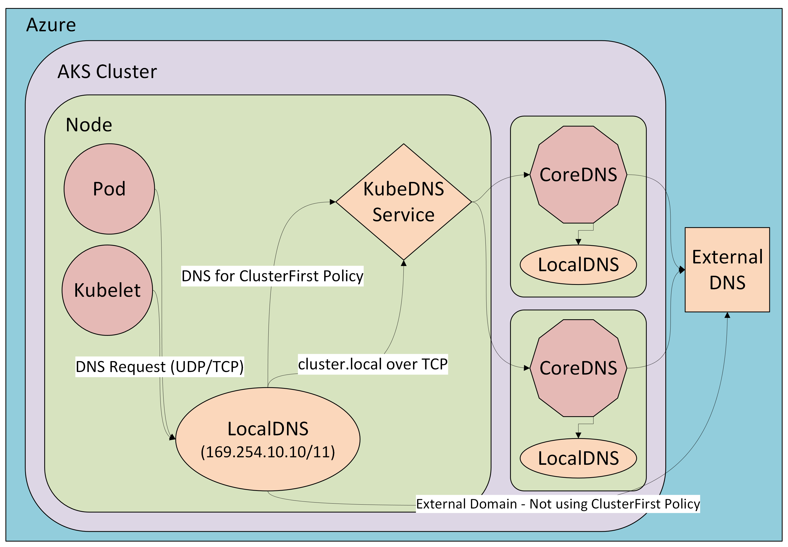

# LocalDNS in Azure Kubernetes Service (Preview)

[!INCLUDE [preview features callout](~/reusable-content/ce-skilling/azure/includes/aks/includes/preview/preview-callout.md)]

## Overview

LocalDNS is an advanced feature in Azure Kubernetes Service (AKS) that deploys a Domain Name System (DNS) proxy on each node to provide highly resilient, low-latency DNS resolution. By handling DNS queries locally, this proxy reduces traffic to the CoreDNS addon pods, improving overall DNS reliability and performance in the cluster. LocalDNS is especially beneficial in large clusters or environments with high DNS query volumes, where centralized DNS resolution can become a bottleneck.

When LocalDNS is enabled, AKS deploys a local DNS cache as a `systemd` service on each node. Pods on the node send their DNS queries to this local cache, enabling faster resolution by reducing network hops. This approach also minimizes `conntrack` table usage, lowering the risk of table exhaustion. Additionally, if upstream DNS becomes unavailable, LocalDNS can continue serving cached responses for a configurable duration, helping maintain pod connectivity and service reliability.



### Key Capabilities

- **Reduced DNS resolution Latency:**
    Each AKS node runs a `localdns` `systemd` service. Workloads running on the node send DNS queries to this service, which resolves them locally, reducing network hops and speeding up DNS lookups.

- **Customizable DNS behavior:**
    You can use `kubeDNSOverrides` and `vnetDNSOverrides` to control DNS behavior in the cluster.

- **Avoid conntrack races & conntrak table exhaustion:**
    Pods send DNS queries to the `localdns` service on the same node without creating new `conntrack` table entries. Skipping the connection tracking helps reduce [conntrack races](https://github.com/kubernetes/kubernetes/issues/56903) and avoids User Datagram Protocol (UDP) DNS entries from filling up `conntrack` tables. This optimization prevents dropped and rejected connections caused by `conntrack` table exhaustion and race conditions.

- **Connection upgraded to TCP:**
    The connection from the `localdns` cache to the cluster’s CoreDNS service uses Transmission Control Protocol (TCP). TCP allows for connection rebalancing and removes `conntrack` table entries when the server closes the connection (in contrast to UDP connections, which have a default 30-second timeout). Applications don't need changes, because the `localdns` service still listens for UDP traffic.

- **Caching:**
    The localDNS cache plugin can be configured with serveStale and TTL settings. `serveStale`,`serveStaleDurationInSeconds` , and `cacheDurationInSeconds` parameters can be configured to achieve DNS resiliency, even during an upstream DNS outage.

- **Protocol control:**
    You can set the DNS query protocol (such as PreferUDP or ForceTCP) for each domain. This flexibility lets you optimize DNS traffic for specific domains or meet network requirements.

By using LocalDNS, you get faster and more reliable DNS resolution for your workloads, reduce the risk of DNS-related outages, and gain more control over DNS traffic in your AKS environment.

## Before you begin

* Your AKS cluster can't have node autoprovisioning enabled to use LocalDNS.
* LocalDNS requires your AKS cluster to be running Kubernetes version 1.33 or later.
* LocalDNS is only supported on node pools running Ubuntu 22.04 or newer.
* This article assumes that you have an existing AKS cluster with Kubernetes versions 1.33+. If you need an AKS cluster, you can create one using [Azure CLI][aks-quickstart-cli], [Azure PowerShell][aks-quickstart-powershell], or the [Azure portal][aks-quickstart-portal].
* This article requires version X.X.X or later of the Azure CLI. If you're using Azure Cloud Shell, the latest version is already installed there.
* This article requires the `aks-preview` Azure CLI extension version X.X.XXX or later

## Enable LocalDNS

The following commands enable localDNS on your node pools. To modify the localDNS config file with coreDNS plugins and to add custom server blocks, refer to [Configuring LocalDNS](#configuring-localdns).

### Enable localDNS in a new node pool

```azure-cli-interactive
az aks nodepool add --name mynodepool1 --cluster-name myAKSCluster --resource-group myResourceGroup --localdns-config ./localdnsconfig.json
```

### Enable localDNS in an existing node pool

```azure-cli-interactive
az aks nodepool update --name mynodepool1 --cluster-name myAKSCluster --resource-group myResourceGroup --localdns-config ./localdnsconfig.json
```

> [!IMPORTANT]
> Enabling localDNS on a node pool triggers a reimage operation on the nodes for the new setting to take effect.

## Verify if localDNS is enabled

Once LocalDNS is enabled, you can verify its operation by running DNS queries from pods in the specified node pool and inspecting the `SERVER` field in the responses to confirm LocalDNS addresses are returned (169.254.10.10 or 169.254.10.11).

Before running the validation steps, ensure the following conditions are met:
1. You have `kubectl` installed and configured to access your AKS cluster.
1. Your user account has sufficient permissions to create and exec into pods.
1. The node pool where you want to validate LocalDNS is in a Ready state.
1. The BusyBox image (`busybox:1.28`) is accessible from your cluster nodes.

Here's an example of how to verify:

1. Create a debug pod in the node pool where localDNS is enabled:
   ```azure-cli-interactive
   kubectl run dnstest --image=busybox:1.28 -- sleep 3600
   ```

1. Once the pod is running, execute the following command to check DNS resolution:
   ```azure-cli-interactive
   kubectl exec -it dnstest -- nslookup kubernetes.default
   ```

1. Check the output. If localDNS is working correctly, you should see a response with the server address of 169.254.10.10 or 169.254.10.11:
   ```
   Server:    169.254.10.10
   Address 1: 169.254.10.10

   Name:      kubernetes.default
   Address 1: 10.0.0.1 kubernetes.default.svc.cluster.local
   ```

## Disable localDNS

To disable localDNS, you need to update the _localdnsconfig.json_ file to use `"mode":"Disabled"`. Once the file is updated, you can apply the configuration to the node pool to update with the change.

```azure-cli-interactive
az aks nodepool update --name mynodepool1 --cluster-name myAKSCluster --resource-group myResourceGroup --localdns-config ./localdnsconfig.json
```

## Configuring localDNS

If you enable localDNS on your node pool without specifying a custom _localdnsconfig.json_ file, AKS applies a default configuration as follows:

```json
{
  "localDNSProfile": {
    "mode": "Preferred",
    "vnetDNSOverrides": {
      ".": {
        "queryLogging": "Error",
        "protocol": "PreferUDP",
        "forwardDestination": "VnetDNS",
        "forwardPolicy": "sequential",
        "maxConcurrent": 1000,
        "cacheDurationInSeconds": 3600,
        "serveStaleDurationInSeconds": 3600,
        "serveStale": "verify"
      },
      "cluster.local": {
        "queryLogging": "Error",
        "protocol": "ForceTCP",
        "forwardDestination": "ClusterCoreDNS",
        "forwardPolicy": "sequential",
        "maxConcurrent": 1000,
        "cacheDurationInSeconds": 3600,
        "serveStaleDurationInSeconds": 3600,
        "serveStale": "verify"
      }
    },
    "kubeDNSOverrides": {
      ".": {
        "queryLogging": "Error",
        "protocol": "PreferUDP",
        "forwardDestination": "ClusterCoreDNS",
        "forwardPolicy": "sequential",
        "maxConcurrent": 1000,
        "cacheDurationInSeconds": 3600,
        "serveStaleDurationInSeconds": 3600,
        "serveStale": "verify"
      },
      "cluster.local": {
        "queryLogging": "Error",
        "protocol": "ForceTCP",
        "forwardDestination": "ClusterCoreDNS",
        "forwardPolicy": "sequential",
        "maxConcurrent": 1000,
        "cacheDurationInSeconds": 3600,
        "serveStaleDurationInSeconds": 3600,
        "serveStale": "verify"
      }
    }
  }
}
```

### Setting the `mode` for localDNS

LocalDNS can be enabled in three possible modes that define the extent of enforcement of localDNS for the workload:
* `Preferred` (*default*): LocalDNS is enabled, but the configuration proceeds even if some settings are invalid.
* `Required`: In this mode, LocalDNS is enforced, but it fails if any settings in the configuration are invalid.
* `Disabled`: Disables the local DNS feature, meaning DNS queries aren't resolved locally within the AKS cluster.

### Server Blocks and Supported Plugins for localDNS 

The default configuration applies to queries from pods using `dnsPolicy:default` (under `vnetDNSOverrides`) and pods using `dnsPolicy:ClusterFirst` (under `kubeDNSOverrides`). Within each, there are two default server blocks defined: `.` and  `cluster.local`. 

* `.` represents all external DNS queries from pods that are trying to resolve public or non cluster domains (for example, *microsoft.com*)
* `cluster.local` represents all internal Kubernetes service discovery queries from pods that are trying to resolve kubernetes service names or internal cluster resources. These queries are routed through CoreDNS for resolution within the cluster.

### Supported Plugins

| Plugin                                                            | Description                                                                             | Default                                                              | Allowed Inputs                     | 
|-------------------------------------------------------------------|-----------------------------------------------------------------------------------------|----------------------------------------------------------------------|------------------------------------|
| [`queryLogging`](https://coredns.io/plugins/log/)                 | Define the logging level for DNS queries.                                               | `Error`                                                              | `Error` `Log`                      | 
| [`protocol`](https://coredns.io/plugins/forward/)                 | Sets the protocol used for DNS queries (UDP/TCP preference).                            | `ForceTCP` for cluster.local, else `PreferUDP`                       | `PreferUDP` `ForceTCP`             | 
| [`forwardDestination`](https://coredns.io/plugins/forward/)       | Specifies the DNS server to forward queries to.                                         | `ClusterCoreDNS` for cluster.local & kubeDNS traffic, else `VnetDNS` | `VnetDNS` `ClusterCoreDNS`         |
| [`forwardPolicy`](https://coredns.io/plugins/forward/)            | Determines the policy to use when selecting the upstream DNS server. Default is `random`| `sequential`                                                         | `random` `round_robin` `sequential`|
| [`maxConcurrent`](https://coredns.io/plugins/forward/)            | Maximum number of concurrent DNS queries handled by the proxy.                          | `1000`                                                               | Integer                            | 
| [`cacheDurationInSeconds`](https://coredns.io/plugins/cache)      | Maximum TTL (Time To Live) in seconds for which DNS responses are cached                | `3600`                                                               | Integer                            |
| [`serveStaleDurationInSeconds`](https://coredns.io/plugins/cache) | Duration (in seconds) to serve stale DNS responses if upstream is unavailable.          | `3600`                                                               | Integer                            |
| [`serveStale`](https://coredns.io/plugins/cache)                  | Policy for serving stale DNS responses during upstream failures.                        | `verify`                                                             | `verify` `immediate`               | 

### Defining a custom server block in localDNS

CoreDNS matches queries to a specific server block based on an exact match for domain being queried and not on partial matches. If you have the need for custom server blocks, you can add them to your localDNS configuration by creating a file called _localdnsconfig.json_ with the added configurations.

For example, if you have specific DNS needs when accessing microsoft.com, you could use the following server block:
```json
"microsoft.com": {
  "queryLogging": "Error",
  "protocol": "ForceTCP",
  "forwardDestination": "ClusterCoreDNS",
  "forwardPolicy": "Sequential",
  "maxConcurrent": 1000,
  "cacheDurationInSeconds": 3600,
  "serveStaleDurationInSeconds": 3600,
  "serveStale": "Verify"
}
```

## Best Practices for LocalDNS Configuration

When implementing LocalDNS in your AKS clusters, consider the following best practices:

1. **Start with a minimal configuration**: Begin with a simple configuration that uses the `Preferred` mode before moving to `Required` mode. This setup allows you to validate that LocalDNS works as expected without breaking your cluster.

1. **Implement proper caching strategies**: Configure cache settings based on your workload characteristics:
   * For frequently changing records, use shorter `cacheDurationInSeconds` values.
   * For stable records, use longer cache durations to reduce DNS queries.
   * Enable `serveStale` with appropriate settings to maintain service during DNS outages.

1. **Monitor DNS performance**: After enabling LocalDNS, monitor your application's DNS performance using:
   * Application performance metrics
   * Node metrics to detect reduced network pressure
   * Log entries when `queryLogging` is set to `Log`

1. **Follow least privilege principle**: When configuring DNS forwarding rules, only allow access to the required DNS servers and domains.

1. **Test before production deployment**: Always test LocalDNS configuration in a nonproduction environment before rolling it out to production clusters.

1. **Use Infrastructure as Code (IaC)**: Store your _localdnsconfig.json_ file in your infrastructure repository and include it in your AKS deployment templates.

## Troubleshooting LocalDNS

### DNS queries to specific domains are failing

If DNS queries to specific domains are failing after enabling LocalDNS:

1. Check if you have domain-specific overrides in your _localdnsconfig.json_ that might be misconfigured.
1. Temporarily try removing domain-specific overrides and using only the default `.` configuration.
1. Check if the issue occurs with both UDP and TCP protocols by adjusting the `protocol` setting.

## Next steps

For information on the CoreDNS project, see [the CoreDNS upstream project page][coreDNS].

To learn more about core network concepts, see [Network concepts for applications in AKS][concepts-network].

<!-- LINKS - external -->
[coreDNS]: https://coredns.io/

<!-- LINKS - internal -->
[concepts-network]: concepts-network.md
[aks-quickstart-cli]: ./learn/quick-kubernetes-deploy-cli.md
[aks-quickstart-portal]: ./learn/quick-kubernetes-deploy-portal.md
[aks-quickstart-powershell]: ./learn/quick-kubernetes-deploy-powershell.md