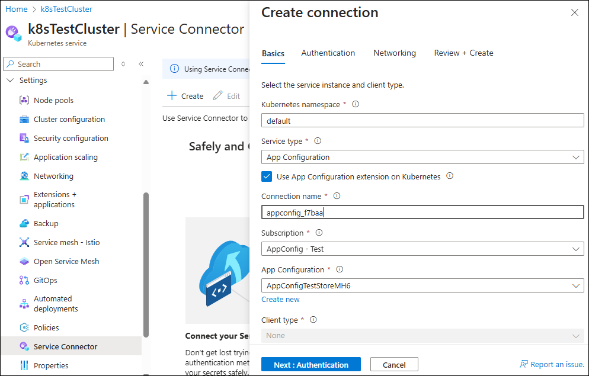

# Quickstart: Generate ConfigMap from Azure App Configuration

You can externalize the configurations of your Azure Kubernetes Service (AKS) workloads and manage them in [Azure App Configuration](/azure/azure-app-configuration/overview). The [Azure App Configuration Kubernetes provider](https://mcr.microsoft.com/artifact/mar/azure-app-configuration/kubernetes-provider/about) runs as a container in your cluster. Key benefits include:

   - **Seamless integration**: Pulls data from Azure App Configuration and Key Vault, making them accessible as ConfigMap and Secret without code changes in your workloads.
   - **Dynamic update**: Built-in caching and refreshing capabilities for dynamic configuration, feature flagging, and automatic secret rotation.

The Azure App Configuration Kubernetes provider is available as an AKS extension. By following this document, you can easily install the extension and connect your AKS cluster with an App Configuration store using the Service Connector in the Azure portal. For information on setting up the provider using Helm, see the [Quickstart for Azure App Configuration Kubernetes provider](/azure/azure-app-configuration/quickstart-azure-kubernetes-service).

## Prerequisites

* An Azure Kubernetes Service (AKS) cluster. [Create an AKS cluster](/azure/aks/tutorial-kubernetes-deploy-cluster#create-a-kubernetes-cluster).
* A running workload in Azure Kubernetes Service (AKS) cluster. If you don't have one, you can [create a demo application running in AKS](/azure/azure-app-configuration/quickstart-azure-kubernetes-service#create-an-application-running-in-aks).

## Create a service connection to App Configuration

Create a service connection between your AKS cluster and your App Configuration store using Microsoft Entra Workload Identity.

1. In the [Azure portal](https://portal.azure.com), navigate to your AKS cluster resource.

1. Select **Settings** > **Service Connector** > **Create**.

1. On the **Basics** tab, configure the following settings:
   
   - **Kubernetes namespace**: Specify the namespace you'd like to create ConfigMap or Secret to.
   - **Service type**: Select **App Configuration**.
   - **Use App Configuration Extension on Kubernetes**: Check the box to use the [Azure App Configuration AKS extension](./azure-app-configuration.md) for this connection. Azure App Configuration AKS extension will be installed to current cluster if it's not yet.
   - **Connection name**: Enter a connection name or use the default name.
   - **Subscription**: Select the subscription of your App Configuration store.
   - **App Configuration**: Select your App Configuration store. If you don't have one, click **Create new** to set one up.

    

1. Select **Next: Authentication**. On the **Authentication** tab, keep the default selection of **Workload Identity**, select a **User assigned managed identity** you want to use. If you don't have one, click **Create new** to set one up.

1. Select **Next: Networking** and use the default settings.

1. Select **Next: Review + create** and wait for the validation to pass.

1. Select **Create** to create the service connection.

> [!NOTE]
> The Service Connector simplifies the installation of the Azure App Configuration AKS extension from the Azure portal. You can also install it without Service Connector using Azure CLI, Bicep, or an ARM template. For more information, see [Install Azure App Configuration AKS extension](./azure-app-configuration.md).

## Generate ConfigMap from App Configuration

Update the service connection to create and deploy an `AzureAppConfigurationProvider` YAML resource in your AKS cluster. This resource generates a ConfigMap with data from your App Configuration store.

1. In the [Azure portal](https://portal.azure.com), navigate to your AKS cluster resource and select **Settings** > **Service Connector**.

1. Select the newly created connection, select **Yaml snippet** in the top menu.

1. On the **AzureAppConfigurationProvider** tab, configure the following settings:
   
   - **Using configuration as**: Choose to consume the configuration as a **mounted file** or **environment variables**.
   - **Mounted file**: If selected, specify the **file type** and **file name**.
   - **Selector**: Set the **Key filter** and **Label filter** to load data from your App Configuration store.

1. A YAML is generated based on your input. Click **Apply** to add it to your AKS cluster. It will create a ConfigMap in your AKS cluster with data from your App Configuration store.

    

1. Click **Next**. On the **Workload** tab, configure the following settings:
   
   - **File mount path**: Specify the file mount path if the mounted file option was selected.
   - **Kubernetes Workload**: Select the workload where the generated ConfigMap will be injected.
   - Click **Apply** to update the workload.

## Next Steps

To learn more about installing and customizing the Azure App Configuration AKS extension, refer to the following documents:

> [!div class="nextstepaction"]
> [Install Azure App Configuration AKS extension](./azure-app-configuration.md)

> [!div class="nextstepaction"]
> [Configure Azure App Configuration AKS extension](./azure-app-configuration-settings.md)

For a complete feature rundown of the Azure App Configuration Kubernetes Provider, see

> [!div class="nextstepaction"]
> [Azure App Configuration Kubernetes Provider](/azure/azure-app-configuration/reference-kubernetes-provider)