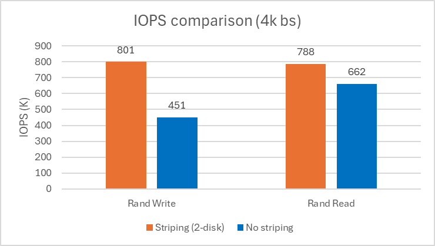
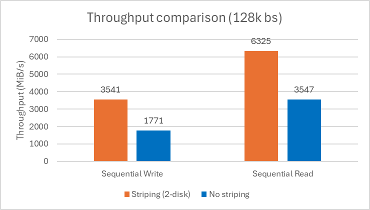

# Best practices for ephemeral NVMe data disks in Azure Kubernetes Service (AKS)

Ephemeral NVMe data disks provide high-performance, low-latency storage that's ideal for demanding workloads running on Azure Kubernetes Service (AKS). Many modern applications, such as AI/ML training, data analytics, and high-throughput databases, require fast temporary storage to process large volumes of intermediate data efficiently. By using ephemeral NVMe disks, you can significantly improve application responsiveness and throughput, while optimizing for cost and scalability in their AKS clusters.

This best practices article focuses on storage considerations for cluster operators. In this article, you learn:

> [!div class="checklist"]
> * Common scenarios where ephemeral NVMe data disks provide performance benefits.
> * How to identify which VM sizes support ephemeral NVMe data disks.
> * How to use ephemeral NVMe data disks for your Kubernetes workloads.
> * How ephemeral NVMe data disks work when your AKS nodes use ephemeral OS disks.
> * How to measure the performance of your workloads using ephemeral NVMe data disks.

## Common scenarios of high-performance workloads

Ephemeral NVMe data disks are ideal for workloads that demand high throughput, low latency, and fast access to temporary or intermediate data. The following scenarios highlight where local NVMe disks provide the most significant benefits:

### 1. High-Performance Databases (for example, PostgreSQL)

For databases such as PostgreSQL, especially in high-availability (HA) or read-intensive deployments, local NVMe disks can dramatically improve transaction throughput and reduce query latency. When used for temporary tablespaces, write-ahead logs (WAL), or as a cache layer, NVMe disks help offload I/O from persistent storage, accelerating analytics and transactional workloads.

**Best practices:**
- Use NVMe-backed volumes for PostgreSQL temp directories and WAL logs to maximize IOPS and minimize latency.
- For HA scenarios, ensure that persistent data directories remain on durable storage, while using NVMe for non-persistent, high-churn data.
- See [PostgreSQL HA on AKS](/azure/aks/postgresql-ha-overview) for architecture guidance.

### 2. AI Model Hosting and Inference (for example, KAITO)

AI model serving platforms like [KAITO](https://kaito-project.github.io/kaito) benefit from NVMe disks for rapid model loading, artifact caching, and high-throughput inference. When models are stored as Open Container Initiative (OCI) artifacts and loaded on demand, local NVMe storage ensures minimal cold start times and efficient batch processing.

**Best practices:**
- Use NVMe-backed volumes for model cache directories to accelerate model pulls and reduce inference latency.
- For distributed inference, ensure each node has sufficient NVMe capacity to cache frequently used models.
- Integrate with Kubernetes-native storage solutions (for example, Azure Container Storage) for automated management and monitoring.
- See [KAITO model as OCI artifacts](https://kaito-project.github.io/kaito/docs/next/model-as-oci-artifacts) for architecture guidance.

### 3. Data Analytics and ETL Pipelines

Workloads that process large volumes of intermediate data, such as [Spark](https://spark.apache.org/), [Dask](https://www.dask.org/), or custom ETL jobs, can apply NVMe disks for shuffle storage, temporary files, and scratch space. This approach reduces bottlenecks during data transformation and aggregation.

**Best practices:**
- Configure shuffle and temp directories to use NVMe-backed storage.
- Clean up temporary data promptly to maximize available space.

### 4. Caching Layers and Key-Value Stores

In-memory databases and caching solutions (for example, Redis, Memcached, RocksDB) can use NVMe disks as a fast persistence layer or for overflow storage, providing a balance between speed and durability.

**Best practices:**
- Use NVMe for write-heavy cache workloads where persistence isn't critical.
- Monitor disk usage to avoid eviction or data loss due to node restarts.

### 5. High-Performance Computing (HPC) and Simulation

HPC workloads, including genomics, financial modeling, and scientific simulations, often require rapid access to large datasets and scratch space for intermediate results. NVMe disks provide the necessary bandwidth and low latency for these scenarios.

## Check VM sizes with ephemeral NVMe data disks

Ephemeral NVMe data disks are available on select Azure VM sizes that offer local, high-performance storage directly attached to the physical host. These disks are ideal for temporary data, such as caches, scratch files, or intermediate processing, and aren't persisted after a VM is deallocated or stopped. The number and capacity of NVMe disks vary by VM size and family.

To determine which VM sizes support ephemeral NVMe data disks and their configurations, refer to the [Azure VM documentation](/azure/virtual-machines/sizes) and the [AKS supported VM sizes](https://learn.microsoft.com/azure/aks/quotas-skus-regions). Look for VM series such as [Lsv4](/azure/virtual-machines/sizes/storage-optimized/lsv4-series), and [Ddsv6](/azure/virtual-machines/sizes/general-purpose/ddsv6-series), which are designed for high-throughput, low-latency workloads.

The following table lists example VM sizes and their NVMe disk configurations:

| VM Size           | Number of NVMe Disks | Total NVMe Capacity (GiB) |
|-------------------|----------------------|---------------------------|
| Standard_L4s_v4   | 2                    | 894                       |
| Standard_L8s_v4   | 4                    | 1,788                     |
| Standard_L96s_v4  | 12                   | 21,456                    |
| Standard_D16ds_v6 | 2                    | 880                       |
| Standard_D32ds_v6 | 4                    | 1,760                     |
| Standard_D96ds_v6 | 6                    | 5,280                     |

For AI workloads that require GPU acceleration, consider VM sizes in the NC, ND, and NV series. Some GPU-enabled VM sizes, such as `Standard_NC48ads_A100_v4` and `Standard_ND96isr_H100_v5`, offer local NVMe storage in addition to powerful GPUs. These VMs are suitable for AI training, inference, and other compute-intensive scenarios where both GPU and fast local storage are needed.

Example GPU VM sizes with NVMe disks:

| VM Size                  | GPU Type       | Number of NVMe Disks | Total NVMe Capacity (GB) |
|--------------------------|----------------|----------------------|--------------------------|
| Standard_NC48ads_A100_v4 | 2 x A100       | 2                    | 1,788                    |
| Standard_NC96ads_A100_v4 | 4 x A100       | 4                    | 3,576                    |
| Standard_ND96isr_H100_v5 | 8 x H100       | 8                    | 28,610                   |
| Standard_ND96isr_H200_v5 | 8 x H200       | 8                    | 28,610                   |

> [!Note]
> Actual NVMe disk capacity and number may vary by region and VM generation and not all GPU VM sizes include local NVMe storage. Always verify the latest VM specifications and NVMe disk availability in the Azure documentation, as configurations may change. 

## Validate ephemeral NVMe data disks configuration

To ensure your AKS node is provisioned with ephemeral NVMe data disks, you can validate the configuration using the Azure CLI and by inspecting the node directly.

### Option 1: Use Azure CLI to check NVMe disk configuration

You can use the Azure CLI to inspect the VM size and attached NVMe disks with the following sample commands.

```bash
# Modify location and VM size if needed
locationName="eastus"
vmSize="Standard_L8s_v4"
az vm list-skus --resource-type virtualMachines --location $locationName \
  --query "[?name=='$vmSize'].{
    SkuName: name,
    NvmeDiskSizeInMiB: capabilities[?name=='NvmeDiskSizeInMiB'] | [0].value,
    NvmeSizePerDiskInMiB: capabilities[?name=='NvmeSizePerDiskInMiB'] | [0].value
  }" -o table

SkuName          NvmeDiskSizeInMiB    NvmeSizePerDiskInMiB
---------------  -------------------  ----------------------
Standard_L8s_v4  1830912              457728
```

### Option 2: Use `lsblk` to check disk and mount layout on the node

Login into an AKS node:

```bash
kubectl get nodes

# Modify the node name from above list as needed
nodeName="aks-myworkload-22647054-vmss000000"

# Use your approach to login into the node. Use kubectl-exec alternatively (Reference: https://github.com/mohatb/kubectl-exec/blob/master/kubectl-exec)

./kubectl-exec $nodeName
```

Once connected, use `lsblk` to list block devices and identify NVMe disks:

```bash
lsblk -o NAME,HCTL,SIZE,MOUNTPOINT,MODEL

NAME        HCTL       SIZE MOUNTPOINT MODEL
sr0         0:0:0:2    750K            Virtual DVD-ROM
nvme0n1                110G            Microsoft NVMe Direct Disk v2
```

NVMe disks typically appear as `nvme*n1` and are configured with `Microsoft NVMe Direct Disk*` on model. This result confirms the presence and configuration of ephemeral NVMe data disks on your AKS node.

## Use ephemeral NVMe data disks in workloads

There are several ways to use ephemeral NVMe data disks in your AKS workloads. The most common approaches are:

### 1. `emptyDir` Volumes

- **How it works:**  
    `emptyDir` is a Kubernetes volume type that uses the node's local storage. When backed by NVMe disks, `emptyDir` provides high throughput and low latency for temporary data.
- **Usage:**  
    Define an `emptyDir` volume in your Pod spec. By default, it uses the fastest available storage (NVMe if present).
- **Pros:**  
    - Simple to use and configure.
    - No external dependencies.
    - High performance when backed by NVMe.
- **Cons:**  
    - Data is lost if the Pod is rescheduled to another node.
    - No data persistence or replication.
    - Limited to single NVMe disk.

### 2. `hostPath` Volumes

- **How it works:**  
    `hostPath` mounts a specific directory or disk from the node’s filesystem into the Pod. You can target NVMe mount points directly.
- **Usage:**  
    Specify the NVMe disk path (for example, `/mnt` or `/mnt/nvme0n1`) in the Pod spec.
- **Pros:**  
    - Direct access to NVMe disk.
    - Useful for advanced scenarios (for example, custom formatting, partitioning).
- **Cons:**  
    - Tightly coupled to node layout; not portable.
    - Security risks if not properly restricted.
    - Limited to single NVMe disk.

### 3. Azure Container Storage (Recommended)

- **How it works:**  
    [Azure Container Storage](https://learn.microsoft.com/azure/container-storage/) is a Kubernetes-native storage solution that abstracts and manages local NVMe disks as persistent volumes, with advanced orchestration and data services.
- **Usage:**  
    Deploy Azure Container Storage in your AKS cluster and provision volumes using standard Kubernetes PVCs.
- **Pros:**  
    - Kubernetes-native experience with PersistentVolumeClaims.
    - Automated discovery and management of NVMe disks for any VM sizes.
    - Supports advanced features: dynamic provisioning, data security, and native integration with AKS.
    - Improved reliability and operational simplicity.
    - Enables high-performance workloads with default volume striping cross all available disks.
- **Cons:**  
    - Requires installation of Azure Container Storage.

**Recommendation:**  
Azure Container Storage is the best option for Kubernetes workloads to orchestrate ephemeral NVMe data disks. It combines the raw performance of NVMe disks with Kubernetes-native management, security, and built-in integration with Azure’s monitoring features and Prometheus. This approach reduces operational complexity, improves reliability, and enables advanced scenarios (such as scaling and failover) that are difficult to achieve with `emptyDir` or `hostPath`.

For more information, see [Azure Container Storage documentation](https://learn.microsoft.com/azure/container-storage/).

## Ephemeral NVMe data disks with ephemeral OS disks

When deploying AKS nodes with local NVMe data disks, such as the `Standard_D2ads_v6` VM size (single 100-GiB NVMe disk) with ephemeral OS disks setting opt-in, you may observe that the ephemeral OS disk (for example, 60 GiB) is provisioned from the NVMe capacity. However, the unused NVMe space (like the extra 40 GiB) isn’t available to use, and there’s no supported way to access or recover it after the node is created.

This behavior is by design, as the ephemeral OS disk requirements dictate how the NVMe device is partitioned at provisioning time. It can be confusing since you don’t get access to all of its storage, especially with many VM sizes that come with only one NVMe disk.

Use the following example to validate this behavior:

```bash
# Create Standard_D2ads_v6 (Single 100-GiB NVMe disk) node pool using ephemeral OS disk with 60 GiB capacity

az aks nodepool add --resource-group $resourceGroup --cluster-name $clusterName --name $nodePoolName --node-count 1 --node-vm-size Standard_D2ads_v6 --node-osdisk-type Ephemeral --node-osdisk-size 60

# Login to the node to check block devices. You can see 60 GiB only and allocated for OS.

lsblk -o NAME,FSTYPE,LABEL,MOUNTPOINT,SIZE,VENDOR,MODEL
NAME         FSTYPE LABEL           MOUNTPOINT  SIZE VENDOR   MODEL
sr0                                             750K Msft     Virtual DVD-ROM
nvme0n1                                          60G          MSFT NVMe Accelerator v1.0
|-nvme0n1p1  ext4   cloudimg-rootfs /          59.9G
|-nvme0n1p14                                      4M
`-nvme0n1p15 vfat   UEFI            /boot/efi   106M
```

When you use VM sizes with a single local NVMe data disk and enable ephemeral OS disk, the OS consumes the entire NVMe disk, leaving no space available for Kubernetes workloads to provision persistent volumes. For VM sizes with two or more local NVMe data disks, one disk is used for the ephemeral OS, and the others can be used to provision persistent volumes for your workloads.

**Current limitations:**
- The ephemeral OS disk consumes a portion of one local NVMe drive, with the remainder left inaccessible.
- There's no supported way to access or mount the unused NVMe space after node creation.
- You cann't update or repartition the NVMe disk post-deployment.

**Customer impact:**
- Reduced usable NVMe capacity compared to what is advertised for the VM size.
- Inability to fully use high-performance local storage for workloads.
- Potential confusion and inconvenience during upgrades or node replacement.

**Recommendation:**

- Decide the intended use of local NVMe disks, either for the OS disk or for Kubernetes workload storage—before provisioning AKS nodes. Ephemeral OS disk configuration is immutable after node creation, so planning ahead avoids the need to recreate nodes if requirements change.

- Omit the OS disk size input when creating AKS nodes with ephemeral OS disks on NVMe-backed VMs. This prevents misconfiguration and aligns with product documentation, reducing the risk of inaccessible capacity and upgrade issues.

> **Note:**  
> These improvements are important for user experience and operational efficiency, especially as more VM SKUs with single NVMe disks become available. Follow the latest AKS documentation and monitor Azure updates for enhancements in ephemeral disk management.

## Measure workload performance with ephemeral NVMe data disks

Ephemeral NVMe data disks deliver high throughput and low latency for AKS workloads, but it's important to validate performance against your application's requirements. Benchmark your workloads on different VM sizes to identify the optimal configuration, and adjust VM sizes or disk configurations as needed.

Set up your application using local NVMe volumes, then use workload-specific benchmarking tools to measure IOPS, throughput, and latency. For example, with PostgreSQL, follow [Create infrastructure for PostgreSQL](/azure/aks/create-postgresql-ha) to deploy your environment, and use [pgbench](https://cloudnative-pg.io/documentation/1.26/benchmarking/#pgbench) to evaluate database performance.

The following steps introduce generic benchmarking with fio and local NVMe volumes managed by Azure Container Storage.

1. Enable Azure Container Storage on your AKS cluster. See [Azure Container Storage Quickstart](/azure/storage/container-storage/container-storage-aks-quickstart)

2. Deploy storage class, generic volume, fio pod with local NVMe volumes. See [Use local NVMe with Azure Container Storage](/storage/container-storage/use-container-storage-with-local-disk)

3. Run the following fio command and modify as needed.

    ```bash
    # Run fio benchmark

    kubectl exec -it fiopod -- fio --directory=/mnt/cns --size=4000MB --filename_format='testfile.$jobnum' --wait_for_previous \
        --thread --group_reporting --direct=1 --randrepeat=0 --norandommap=1 \
        --ioengine=io_uring --numjobs=8 --disable_clat=1 --disable_slat=1 \
        --name=precondition --bs=1M --iodepth=64 --rw=write \
        --name=randwritebench --rw=randwrite --bs=4k --iodepth=16 --time_based --runtime=60 \
        --name=randreadbench --rw=randread --bs=4k --iodepth=16 --time_based --runtime=60 \
        --name=seqwritebench --rw=write --bs=128k --iodepth=16 --time_based --runtime=60 \
        --name=seqreadbench --rw=read --bs=128k --iodepth=16 --time_based --runtime=60 > ./fio.log

    result=$(cat ./fio.log | \
        awk '
            BEGIN {
            print "Scenario,Type,IOPS,BW(MiB/s)"
            }
            /^[a-z]+bench:/ {
            split($1, a, ":")
            scenario = a[1]
            }
            /read: IOPS=/ && scenario ~ /(randreadbench|seqreadbench)/ {
            type = "read"
            match($0, /IOPS=([0-9.]+)([kM]?)/, iops_arr)
            match($0, /BW=([0-9.]+)MiB\/s/, bw_arr)
            iops = iops_arr[1]
            unit = iops_arr[2]
            if (unit == "k") iops *= 1000
            else if (unit == "M") iops *= 1000000
            bw = bw_arr[1]
            printf "%s,%s,%.0f,%.2f\n", scenario, type, iops, bw
            }
            /write: IOPS=/ && scenario ~ /(randwritebench|seqwritebench)/ {
            type = "write"
            match($0, /IOPS=([0-9.]+)([kM]?)/, iops_arr)
            match($0, /BW=([0-9.]+)MiB\/s/, bw_arr)
            iops = iops_arr[1]
            unit = iops_arr[2]
            if (unit == "k") iops *= 1000
            else if (unit == "M") iops *= 1000000
            bw = bw_arr[1]
            printf "%s,%s,%.0f,%.2f\n", scenario, type, iops, bw
            }
        ' | column -t -s,)
    ```

4. Run fio on the VM with single NVMe disk (for example, standard_l8s_v3) and the VM with two NVMe disks (for example, Standard_L16s_v3). Evaluate the performance improvements from the NVMe volume striping cross multiple NVMe disks. See the following charts as examples:

    

    
