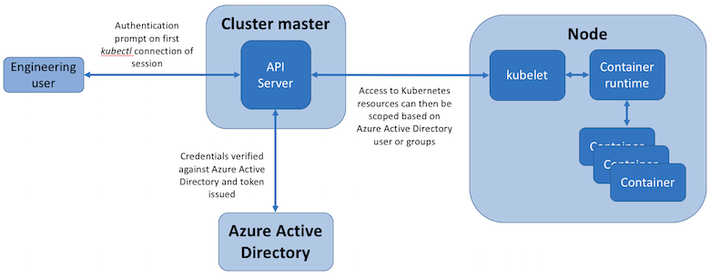

# Cluster authentication concepts in Azure Kubernetes Service (AKS)

This article describes how Azure Kubernetes Service (AKS) authenticates callers to the Kubernetes API — that is, who can connect to the control plane. It covers the recommended Microsoft Entra ID-based authentication path and how to lock down break-glass access.

For how AKS evaluates what an authenticated caller is *allowed to do*, see [Cluster authorization concepts](concepts-cluster-authorization.md).

For the other identity scenarios in AKS, see:

* [Managed identities in AKS](use-managed-identity.md) for cluster-to-Azure access (such as pulling images from ACR or attaching disks).
* [Microsoft Entra Workload ID overview](workload-identity-overview.md) for pod-to-Azure access (such as workloads calling Key Vault).

For an orientation across all four AKS identity scenarios, see [Access and identity options for AKS](concepts-identity.md).

## Authenticate to the Kubernetes API server (control plane)

### Microsoft Entra ID (recommended)

Kubernetes itself doesn't provide an identity directory. Without an external identity provider, you'd need to manage local credentials per cluster, which doesn't scale and creates audit gaps.

We recommend deploying AKS clusters with [Microsoft Entra ID authentication for the control plane][entra-id-cp-auth]. With this integration, the cluster validates incoming Kubernetes API requests against Microsoft Entra ID and uses the caller's Entra identity for authorization decisions. Microsoft Entra ID centralizes the identity layer — any change in user or group status is automatically reflected in cluster access — and enables Conditional Access, multifactor authentication, and Privileged Identity Management.

For setup, see [Enable Microsoft Entra ID authentication for the AKS control plane][entra-id-cp-auth]. Note the following:

* The Microsoft Entra tenant configured for cluster authentication must be the same as the tenant of the subscription that holds the AKS cluster.
* For non-interactive logins or older `kubectl` versions, use the [`kubelogin`](https://github.com/Azure/kubelogin) plugin.

### External identity providers (preview)

Some organizations need to authenticate cluster users with an OIDC-compliant identity provider other than Microsoft Entra ID — for example, GitHub, Google Workspace, Okta, or a self-hosted IdP. AKS supports this through structured authentication, which configures the Kubernetes API server's JWT authenticators to validate tokens issued by your external provider.

Use this option only when you have a hard requirement to keep cluster identity outside Microsoft Entra ID. Otherwise, prefer the Microsoft Entra ID path for richer integration with Conditional Access, multifactor authentication, and Privileged Identity Management.

For an overview, see [External identity provider authentication for AKS clusters][external-idp-overview]. For setup, see [Configure external identity providers with AKS structured authentication][external-idp-configure].

### Disable local accounts

Local accounts use a built-in cluster admin certificate that bypasses Microsoft Entra ID. Any caller who can list this credential gets full cluster admin access without going through Entra ID, which breaks centralized audit, Conditional Access, and Privileged Identity Management. In production, disable local accounts so that all access flows through Microsoft Entra ID.

To enforce this at scale across many clusters, assign the built-in Azure Policy **Azure Kubernetes Service Clusters should have local authentication methods disabled** at a subscription or management group scope. The policy audits or denies clusters that are created or updated with local accounts enabled. For the full list of AKS-related built-in policies, see [Azure Policy built-in definitions for AKS](/azure/governance/policy/samples/built-in-policies#kubernetes).

For details, see [Manage local accounts in AKS](local-accounts.md).

## Authenticate to cluster nodes

### SSH access modes

Beyond authenticating to the Kubernetes API, you might also need to authenticate directly to a node over SSH for troubleshooting. AKS supports three SSH access modes that you set per cluster or node pool:

* **Disabled SSH (preview)**: Block SSH access to nodes entirely. Recommended for production where node-level access is governed only through `kubectl debug` or other Kubernetes-native paths.
* **Microsoft Entra ID based SSH (preview)**: Sign in to nodes using Microsoft Entra identities, with no SSH keys to manage. This mode is consistent with the rest of cluster authentication: it inherits Conditional Access and multifactor authentication from Entra ID, supports just-in-time elevation through Azure RBAC and Privileged Identity Management, and centralizes audit through Entra ID sign-in logs.
* **Local user SSH**: Traditional SSH key–based access. Use this only when Entra ID based SSH isn't an option, and rotate keys regularly.

For setup and per-mode configuration steps, see [Manage SSH access on AKS cluster nodes](manage-ssh-node-access.md).

## Next steps

* [Enable Microsoft Entra ID authentication for the AKS control plane][entra-id-cp-auth]
* [Cluster authorization concepts](concepts-cluster-authorization.md)
* [Managed identities in AKS](use-managed-identity.md)
* [Microsoft Entra Workload ID overview](workload-identity-overview.md)

<!-- INTERNAL LINKS -->
[entra-id-cp-auth]: entra-id-control-plane-authentication.md
[external-idp-overview]: external-identity-provider-authentication-overview.md
[external-idp-configure]: external-identity-provider-authentication-configure.md
