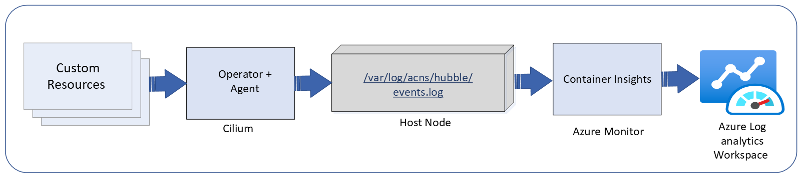
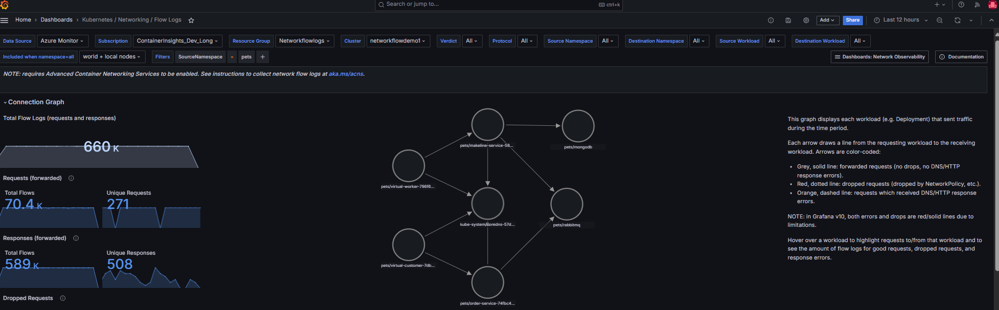
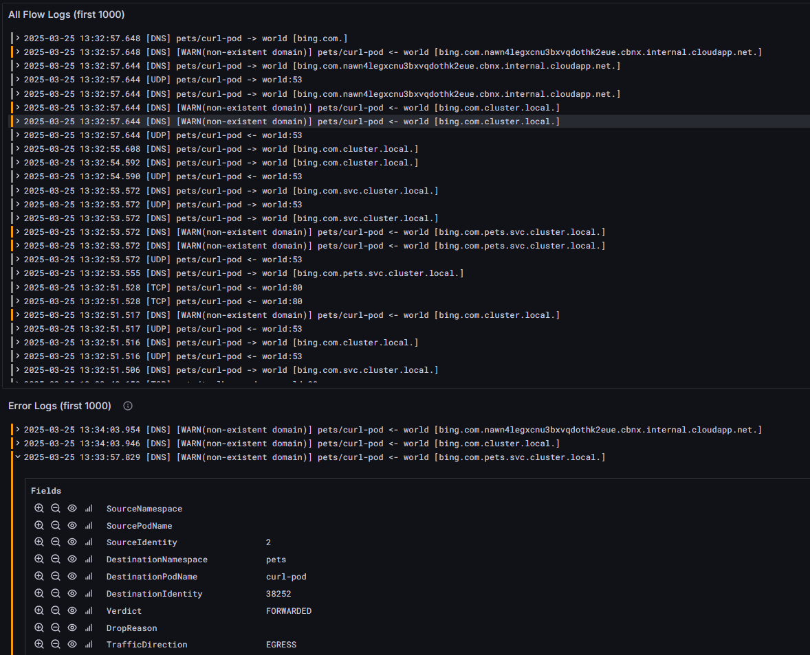
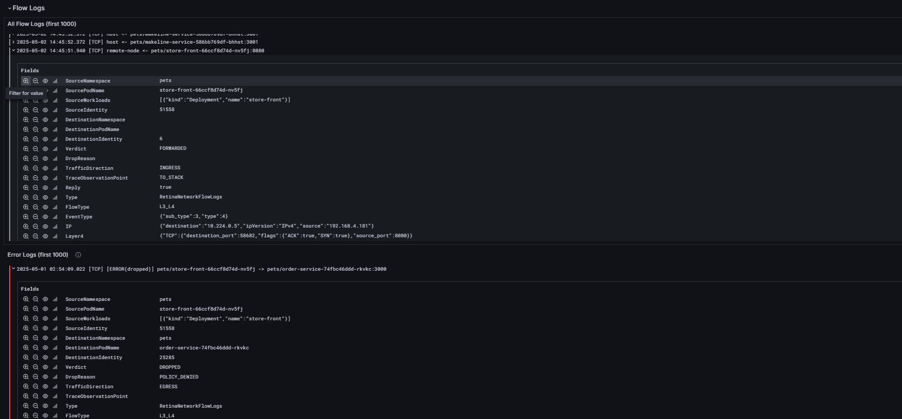
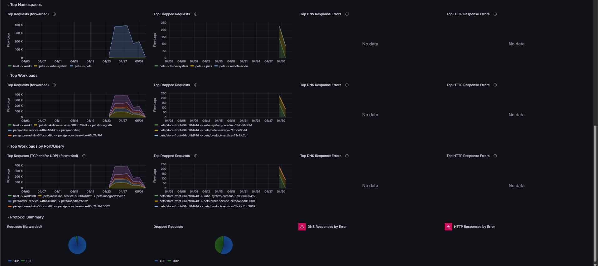

# Overview of Container Network Logs

Container Network Logs for Azure Kubernetes Service (AKS) in [Advanced Container Networking Services (ACNS)](advanced-container-networking-services-overview.md) provide deep visibility into network traffic within the cluster. These logs capture essential metadata including source and destination IP addresses, pod/service names, ports, protocols, and traffic direction, offering detailed insights into network behaviour. By continuously collecting flow logs for Layer 3 (IP), Layer 4 (TCP/UDP), and Layer 7 (application-level) traffic—covering protocols like HTTP, gRPC, and Kafka—Container Network Logs enable users to effectively monitor connectivity, troubleshoot issues, visualize network topology, and enforce security policies.Filtering capabilities ensures that only relevant traffic data is captured, reducing noise and storage overhead while enhancing the efficiency of troubleshooting and analysis.

## How it works

Container Network Logs in Advanced Container Networking Services (ACNS) works by collecting network flow data through Kubernetes Custom Resource Definitions (CRDs), which define the traffic to be logged. The retina/cilium operator consolidates these configurations into a central ConfigMap. The retina/cilium agent periodically retrieves this ConfigMap and generates flow logs using Hubble’s dynamic flow exporter. These logs, including Layer 3 (IP), Layer 4 (TCP/UDP), and Layer 7 (HTTP, gRPC, Kafka) traffic data, are then ingested into Azure Monitor or other external tools. The system aggregates and stores logs efficiently, providing visibility into network traffic for monitoring, troubleshooting, and security. Users can also visualize network flow logs in Azure Managed Grafana using pre-configured dashboards. The service dependency graph is particularly useful, as it offers a visual representation of relationships and communication paths between services within an application or cluster. This helps identify how services interact, revealing traffic flow, bottlenecks, or dependencies critical for troubleshooting and optimization.

## Key Capabilities of Container Network Logs

### Customizable Filters

Logging is configurable via Custom Resource Definitions (CRDs) of type "RetinaNetworkFlowLog." With these CRDs, users can apply granular filters by namespace, pod, service, port, protocol, verdict, or traffic direction (ingress/egress). This flexibility ensures precise data collection tailored to specific use cases, logs only relevant traffic, and optimizes storage usage for better performance, compliance, and efficient troubleshooting.

### Log Storage Options

There are two primary storage options for Container Network Logs: Managed Storage and Unmanaged Storage.

#### Unmanaged Storage Option

By default, network flow logs are stored locally on the host nodes at the fixed mount location /var/log/acns/hubble. However, this storage is temporary, as the node itself is not a persistent storage solution. Once the log files reach a size of 50 MB, they are automatically rotated, which means older logs are overwritten. This method is suitable for real-time monitoring but does not support long-term storage or retention. For users seeking additional log management capabilities, third-party logging services such as an OpenTelemetry collector can be integrated. This provides flexibility to manage logs outside of the Azure ecosystem and is useful for customers who already use specific log management platforms.

#### Managed Storage Option

For long-term storage and comprehensive analysis, it is recommended to configure Azure monitoring within your cluster to collect and retain logs into Azure Log Analytics Workspace. Logs stored in Azure Log Analytics provide the advantage of secure storage, compliance tracking, anomaly detection, and in-depth performance optimization insights. Additionally, the data is available for visualization and querying using tools like Grafana or directly within the Azure portal. This approach ensures that logs are securely stored and readily available for long-term analysis, helping teams maintain visibility into network behaviour, ensure compliance, and optimize performance over time.

### Supported Plans

For container network logs, both Analytics and Basic table plans are supported. For more detailed information on table plans, refer to the ([Azure Monitor Logs Documentation](https://learn.microsoft.com/en-us/azure/azure-monitor/logs/data-platform-logs)).

## Simple Visualization in Azure Monitor and Grafana dashboards

### Visualization of Container Network logs in Azure portal

User can visualize, query and analyze Flow logs in azure portal in azure log analytics workspace of their cluster:

### Visualization of Container Network logs in Grafana Dashboards

User can visualize Network Flow log for analysis with Azure Managed Grafana and with BYO Grafana. For configuring Grafana, refer Setting up Azure Managed Grafana with ACNS.

To simplify the analysis of these, we provide preconfigured Azure Managed Grafana dashboards. You can find them under the Dashboards > Azure Managed Prometheus folder, with filename "Kubernetes/Networking/Flow Logs”. Following is the snapshot of the Flow log dashboard.

Users will be able to see three major components in this dashboard:

- Summary statistics give a quick overview of network health by summarizing metrics like total flow logs, unique requests, dropped requests, and forwarded requests, helping users identify anomalies for efficient operation and improvements.A service dependency graph shows the relationships between services in an application or cluster, helping users see interactions, traffic flow, bottlenecks, and dependencies to troubleshoot issues and optimize performance.

- Flow logs and error logs for quick analysis. These logs can be filtered out for root cause analysis. For example, for DNS issues, one can filter out error logs based on the DNS protocol.

User can filter out these logs just by expanding log and filter out the fields of their choice. Separating sections of flow logs and error logs helps in quicker analysis of issues. This organization allows users to quickly identify and address errors without sifting through unrelated information, improving efficiency in troubleshooting and debugging processes. Additionally, using clear labels and timestamps for each log entry can further enhance the ability to pinpoint specific events or errors within the system.

The third section of this dashboard lets users view top namespaces, workloads, DNS errors, etc. The network flow log visualization is vital for monitoring and analyzing communication within a Kubernetes cluster. It provides insights into namespaces, workloads, port/query usage, and helps identify trends, detect bottlenecks, and diagnose issues. Users can spot significant network activity, drop requests, and assess protocol distribution (e.g., TCP vs. UDP). This overview supports cluster health, resource optimization, and security by detecting unusual traffic patterns.

## Container Network Logs: On-Demand Monitoring

Advanced Container Networking Services (ACNS) enables the on-demand capture of network flow logs, providing real-time visibility without requiring prior configuration or persistent storage using Hubble CLI and Hubble UI.

### Hubble CLI

The command-line interface provides a flexible and interactive way to query, filter, and analyze flow logs directly from the terminal. Users can execute real-time commands to inspect traffic flows, view packet metadata, and troubleshoot network issues without leaving their operational environment.

### Hubble UI

The web-based interface offers an intuitive and visual platform for monitoring. With features like live traffic dashboards, flow summaries, and searchable logs, users can easily track service-to-service communication, detect anomalies, and gain insights into cluster activity.

Together, these tools provide real-time visibility and actionable insights, enabling faster troubleshooting and improved network management.

## Key Benefits of Container Network Logs for Customers

- **Faster Issue Resolution**: With detailed and actionable insights into network traffic, customers can identify and resolve connectivity or performance issues more quickly, minimizing downtime and disruptions.
- **Optimized Operational Efficiency**: Aggregated and efficiently stored logs reduce data management overhead, allowing teams to focus on analysis and decision-making instead of managing large volumes of raw data.
- **Enhanced Application Reliability**: By monitoring service-to-service communication and detecting anomalies, customers can proactively address potential issues, ensuring a smoother and more reliable application experience.
- **Improved Decision-Making**: Visualizing network patterns in Azure Managed Grafana and leveraging service maps provides customers with clear insights into their application’s network behaviour, aiding in better infrastructure planning and optimization.
- **Cost Savings**: Efficient log aggregation and customizable logging scopes reduce storage and data ingestion costs, providing a cost-effective solution for long-term network monitoring.
- **Streamlined Compliance and Security**: Persistent and comprehensive logs support audit trails, regulatory compliance, and quick identification of suspicious traffic, helping customers maintain a secure and compliant environment.

## Considerations

- Container Network Log with storage is only available for Cilium Data plane in public preview.
- Storage option for container Network Logs is not turned on by default. Logs will only be stored when the Retina Network Flow Log CRD is applied to the cluster.
- If there is no CRD applied, no flow logs would be stored.
- Rate limiting configured in the Azure profile always takes precedence over CRD for limiting the number of logs stored in Azure Analytics.

## Pricing

> [!IMPORTANT]
> Advanced Container Networking Services is a paid offering. For more information about pricing, see [Advanced Container Networking Services - Pricing](https://azure.microsoft.com/pricing/details/azure-container-networking-services/).

## Next Steps

- Learn how to enable Container Network Logs, Refer RetinaNetworkflowlogshowtoguide.docx.
- Learn how to enable Hubble Flow logs, Refer Configure Hubble Flow [Visualise Hubble flow](container-network-observability-how-to.md).
- For more information about Advanced Container Networking Services for Azure Kubernetes Service (AKS), see [advanced-container-networking-services-overview](https://azure.microsoft.com/pricing/details/azure-container-networking-services/).
- Explore Container Network Observability features in Advanced Container Networking Services in [What is Container Network Observability?](https://azure.microsoft.com/pricing/details/azure-container-networking-services/).
