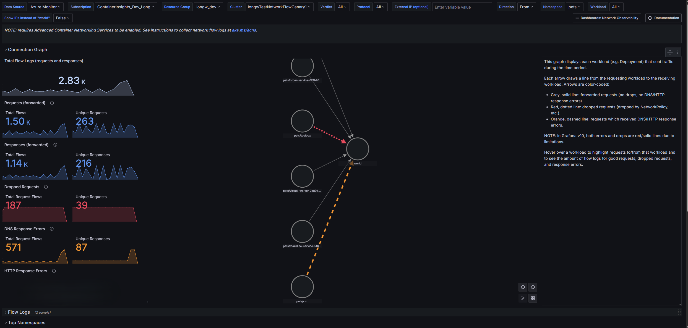
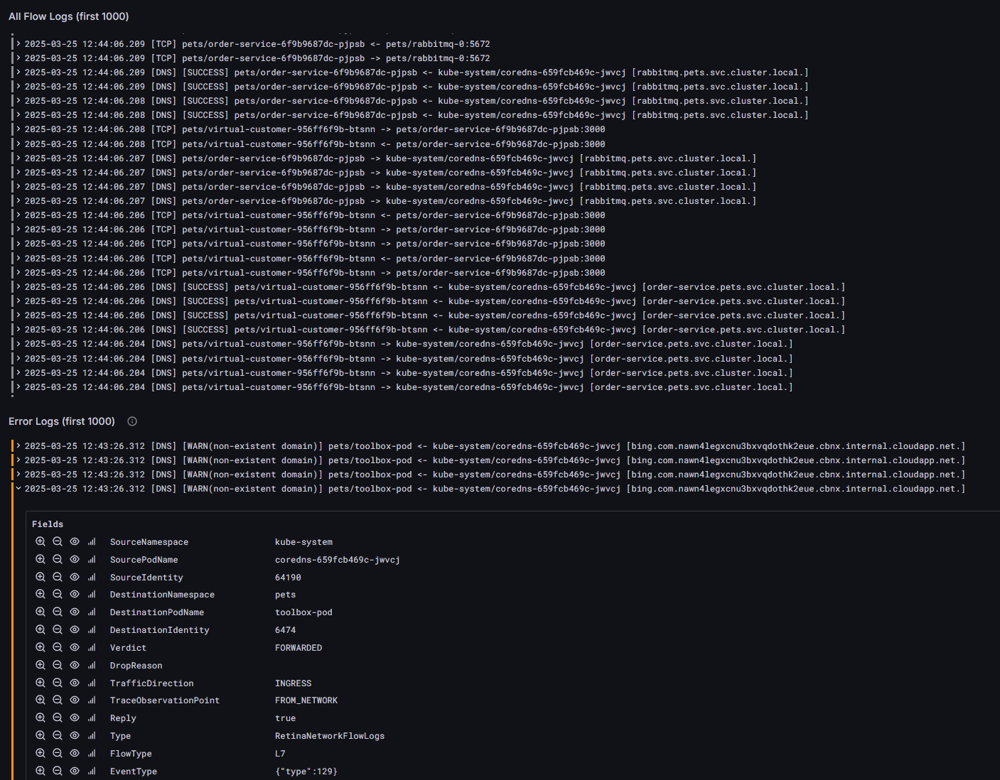
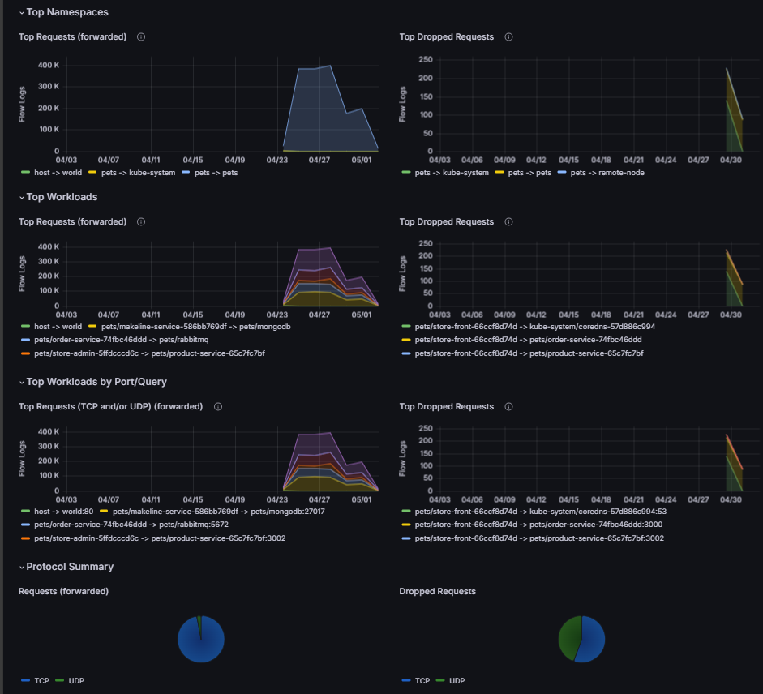
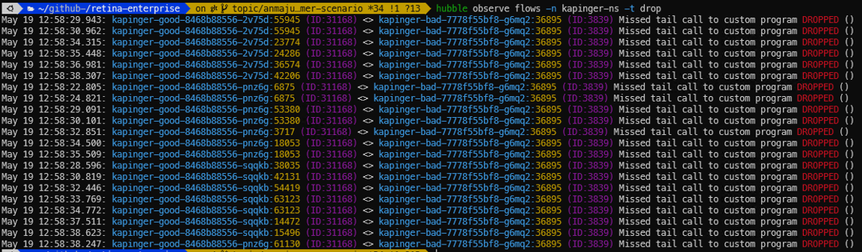
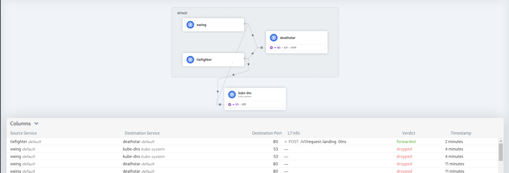

# Overview of Container Network Logs

Container Network Logs for Azure Kubernetes Service (AKS) in [Advanced Container Networking Services (ACNS)](advanced-container-networking-services-overview.md) provide deep visibility into network traffic within the cluster. These logs capture essential metadata including source and destination IP addresses, pod/service names, ports, protocols, and traffic direction, offering detailed insights into network behavior. Container Network Logs captures Layer 3 (IP), Layer 4 (TCP/UDP), and Layer 7 (HTTP/gRPC/Kafka) traffic. This enables effective monitoring of connectivity, troubleshooting, network topology visualization, and security policy enforcement. There can be two ways of using this capability - always-on and on-demand. 

## Container Network Logs:always-on
Conatiner Network Logs:always-on, ensures continuous log generation and collection on the AKS cluster when ACNS is enabled and custom filters are configured. This feature remains active until explicitly disabled by the customer, allowing extended log retention. Container Network logs:always-on feature supports filtering of traffic, which allows collection and retention of logs relevant to user, thus reducing storage cost, and making analysis easier. Traffic filtering can be achieved by defining a specific type of Custom Resource (CR).

### How Container Network Logs:always-on works

Container Network Logs:always-on levrages ebpf technology with cilium to fetch logs from nodes. To start collecting logs, users define one or more Custom Resources (CRs) to specify the types of traffic they want to monitor. These CRs allow fine-grained control, ensuring only relevant traffic is captured. The Cilium agent, running on each node, collects the network traffic that matches the criteria set in the CRs. Then the Logs are stored in JSON format on the host, providing a structured and accessible format for further use. Alternatively, if the Azure Monitoring add-on is enabled, Container Insights collects the logs from the host, applies the default throttling limits, and sends them to the Azure Log Analytics workspace. The system aggregates and stores log efficiently, providing visibility into network traffic for monitoring, troubleshooting, and security. 

To read more about throttling and Container Insights, refer [Container Insights documentation](https://aka.ms/ContainerNetworkLogsDoc_CI)

### Key Capabilities of Container Network Logs

1. Customizable Filters: Logging is configurable via defining Custom Resources(CR) of type [RetinaNetworkFlowLog](./how-to-apply-containernetworklogs.md#cr-template). With these CRs, users can apply granular filters by namespace, pod, service, port, protocol, verdict, or traffic direction (ingress/egress). This flexibility ensures precise data collection tailored to specific use cases, logs only relevant traffic, and optimizes storage usage for better performance, compliance, and efficient troubleshooting.

2. Log Storage Options: There are two primary storage options for Container Network Logs: Managed Storage and Unmanaged Storage.

- Unmanaged Storage Option: By default, network flow logs are stored locally on the host nodes at the fixed mount location /var/log/acns/hubble. However, this storage location is temporary, as the node itself isn't a persistent storage solution. Aditionally, Once the log files reach a size of 50 MB, they're automatically rotated, which means older logs are overwritten. This storage solution is suitable for real-time monitoring but doesn't support long-term storage or retention. For users seeking additional log management capabilities, third-party logging services such as an OpenTelemetry collector can be integrated. This provides flexibility to manage logs outside of the Azure ecosystem and is useful for customers who already use specific log management platforms.

- Managed Storage Option: For long-term retention and advanced analytics, it's recommended to configure Azure Monitoring within your AKS cluster to collect and store logs in an Azure Log Analytics Workspace. This setup not only ensures secure and compliant log storage but also enables powerful capabilities such as anomaly detection, performance tuning, and historical data analysis. By leveraging historical logs, users can identify trends, baseline behaviors, and proactively address recurring issues.
For example, with Azure Managed Prometheus, users can configure alerts on both metrics and logs, enabling real-time monitoring and rapid detection of outliers.  
Workspace used for logs storage is the same which is configured during onboarding. In context of supported plans for storage for this feature, both Analytics and Basic table plans are supported. For more detailed information on table plans, refer to the ([Azure Monitor Logs Documentation](/azure/azure-monitor/logs/data-platform-logs))

3. Simple Visualization in Azure log analytics and Grafana Dashboards: By presenting logs and data in grafana, dashboards simplify complex information, facilitate faster data comprehension, and enable quicker decision-making. 

### Visualization of Container Network logs in Azure portal

User can visualize, query, and analyze Flow logs in Azure portal in Azure log analytics workspace of their cluster:

### Visualization of Container Network logs in Grafana Dashboards

User can visualize Network Flow log for analysis with several prebuilt Grafana dashboards. Customers have several options to access these dashboards

- Access in the Azure portal with the "Dashbaords with Grafana" option
  For more information refer [Container Insights documentation](https://aka.ms/ContainerNetworkLogsDoc_CI)

- Access in Azure Managed Grafana instances

For configuring Grafana, refer Setting up Azure Managed Grafana with ACNS with following link:  For configuring Grafana, refer Setting up Azure Managed Grafana with ACNS, refer [Setting up Grfana](./how-to-apply-containernetworklogs.md#visualization-in-azure-managed-grafana-instances)

To simplify the analysis of logs, we provide preconfigured two Azure Managed Grafana dashboards. You can find them as 
- Azure / Insights / Containers / Networking / Flow Logs - This dashboard provides visualizations into which Kubernetes workloads are communicating with each other, including network requests, responses, drops, and errors

- Azure / Insights / Containers / Networking / Flow Logs (External Traffic) - This dashboard provides visualizations into which Kubernetes workloads are sending/receiving communications from outside a Kubernetes cluster, including network requests, responses, drops, and errors. 

Users are able to see three major components in these dashboards:

1. Summary statistics give a quick overview of network health by summarizing metrics like total flow logs, unique requests, dropped requests, and forwarded requests, helping users identify anomalies for efficient operation and improvements.A service dependency graph shows the relationships between services in an application or cluster, helping users see interactions, traffic flow, bottlenecks, and dependencies to troubleshoot issues and optimize performance.

2. Flow logs and error logs for quick analysis. These logs can be filtered out for root cause analysis. For example, for DNS issues, one can filter out error logs based on the Domain Name Server(DNS) protocol.

User can filter out these logs just by expanding log and filter out the fields of their choice. Separating sections of flow logs and error logs helps in quicker analysis of issues. This organization allows users to quickly identify and address errors without sifting through unrelated information, improving efficiency in troubleshooting and debugging processes. Additionally, using clear labels and timestamps for each log entry can further enhance the ability to pinpoint specific events or errors within the system.

3. The third section of this dashboard lets users view top namespaces, workloads, DNS errors, etc. The network flow log visualization is vital for monitoring and analyzing communication within a Kubernetes cluster. It provides insights into namespaces, workloads, port/query usage, and helps identify trends, detect bottlenecks, and diagnose issues. Users can spot significant network activity, drop requests, and assess protocol distribution (for example, TCP vs. UDP). This overview supports cluster health, resource optimization, and security by detecting unusual traffic patterns.

- Import into Bring your Own(BYO) Grafana instances from the Grafana gallery.  For configuring BYO Grafana, refer Setting up BYO Managed Grafana with ACNS, refer [Setting up BYO Grfana](./how-to-apply-containernetworklogs.md#visualization-using-byo-grafana)

## Container Network Logs:on-demand

Advanced Container Networking Services (ACNS) enables the on-demand capture of network flow logs, providing real-time visibility without requiring prior configuration or persistent storage using Hubble CLI and Hubble UI.

### Hubble CLI

The command-line interface provides a flexible and interactive way to query, filter, and analyze flow logs directly from the terminal. Users can execute real-time commands to inspect traffic flows, view packet metadata, and troubleshoot network issues without leaving their operational environment.

### Hubble UI

The web-based interface offers an intuitive and visual platform for monitoring. With features like live traffic dashboards, flow summaries, and searchable logs, users can easily track service-to-service communication, detect anomalies, and gain insights into cluster activity.

Together, these tools provide real-time visibility and actionable insights, enabling faster troubleshooting and improved network management.

## Key Benefits of Container Network Logs for Customers

- **Faster Issue Resolution**: With detailed and actionable insights into network traffic, customers can identify and resolve connectivity or performance issues more quickly, minimizing downtime and disruptions.
- **Optimized Operational Efficiency**: Aggregated and efficiently stored logs reduce data management overhead, allowing teams to focus on analysis and decision-making instead of managing large volumes of raw data.
- **Enhanced Application Reliability**: By monitoring service-to-service communication and detecting anomalies, customers can proactively address potential issues, ensuring a smoother and more reliable application experience.
- **Improved Decision-Making**: Visualizing network patterns in Azure Managed Grafana and leveraging service maps provides customers with clear insights into their application’s network behaviour, aiding in better infrastructure planning and optimization.
- **Cost Savings**: Efficient log aggregation and customizable logging scopes reduce storage and data ingestion costs, providing a cost-effective solution for long-term network monitoring.
- **Streamlined Compliance and Security**: Persistent and comprehensive logs support audit trails, regulatory compliance, and quick identification of suspicious traffic, helping customers maintain a secure and compliant environment.

## Pricing

> [!IMPORTANT]
> Advanced Container Networking Services is a paid offering. For more information about pricing, see [Advanced Container Networking Services - Pricing](https://azure.microsoft.com/pricing/details/azure-container-networking-services/).

## Next Steps

* Learn how to enable Container Network Logs, Refer [Configure Conatiner Network Logs](how-to-apply-containernetworklogs.md).
* For more information about Advanced Container Networking Services for Azure Kubernetes Service (AKS), see [advanced-container-networking-services-overview](./advanced-container-networking-services-overview.md).
* Explore Container Network Observability features in Advanced Container Networking Services in [What is Container Network Observability](./advanced-container-networking-services-overview.md#container-network-observability)
* Explore Container Network Security features in Advanced Container Networking Services in [What is Container Network Security?](./advanced-container-networking-services-overview.md#container-network-security).
