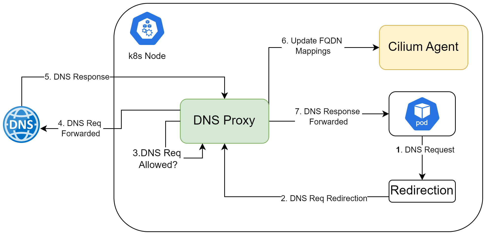

# Overview of FQDN filtering

Containerized environments present unique security challenges. Traditional network security methods, often reliant on IP-based filtering, can become cumbersome and less effective as IP addresses frequently change. Additionally, understanding network traffic patterns and identifying potential threats can be complex.

FQDN filtering offers an efficient and user-friendly approach for managing network policies. By defining these policies based on domain names rather than IP addresses, organizations can significantly simplify the process of policy management. This approach eliminates the need for frequent updates that are typically required when IP addresses change, as a result reducing the administrative burden and minimizing the risk of configuration errors.

In a Kubernetes cluster, pod IP addresses can change often, which makes it challenging to secure the pods with security policies using IP addresses. FQDN filtering allows you to create pod level policies using domain names rather than IP addresses, which eliminates the need to update policies when an IP address changes.

> [!NOTE]
> Azure CNI Powered by Cilium and Kubernetes version 1.29 or greater is required in order to use Container Network security features of Advanced Container Networking Services.

## Components of FQDN filtering

**Cilium Agent**: The Cilium Agent is a critical networking component that runs as a DaemonSet within Azure CNI clusters powered by Cilium. It handles networking, load balancing, and network policies for pods in the cluster. For pods with enforced FQDN policies, the Cilium Agent redirects packets to the ACNS Security Agent for DNS resolution and updates the network policy using the FQDN-IP mappings obtained from the ACNS Security Agent.

**ACNS Security Agent**: ACNS Security Agent runs as DaemonSet in Azure CNI powered by Cilium cluster with Advanced Container Networking services enabled. It handles DNS resolution for pods and on successful DNS resolution, it updates Cilium Agent with FQDN to IP mappings.

## How FQDN filtering works

When FQDN Filtering is enabled, DNS requests are first evaluated to determine if they should be allowed after which pods can only access specified domain names based on the network policy. The Cilium Agent marks DNS request packets originating from the pods, redirecting them to the ACNS Security Agent. This redirection occurs only for pods that are enforcing FQDN policies.

The ACNS Security Agent then decides whether to forward a DNS request to the DNS server based on the policy criteria. If permitted, the request is sent to the DNS server, and upon receiving the response, the ACNS Security Agent updates the Cilium Agent with FQDN mappings. This allows the Cilium Agent to update the network policy within the policy engine. The following image illustrates the high-level flow of FQDN Filtering.

[](./media/advanced-container-networking-services/how-dns-proxy-works.png#lightbox)

## Key benefits

**Scalable security policy management**: Cluster and security admins don't have to update security policies each time an IP address changes making operations more efficient.

**Enhanced security compliance**: FQDN filtering supports a Zero Trust security model. Network traffic is restricted to trusted domains only mitigating risks from unauthorized access.

**Resilient Policy enforcement**: The ACNS Security Agent that is implemented with FQDN filtering ensures that DNS resolution continues seamlessly even if the Cilium agent goes down and policies continue to remain enforced. This implementation critically ensures that security and stability are maintained in dynamic and distributed environments.

## Considerations:

* Container Network Security features require Azure CNI Powered by Cilium and Kubernetes version 1.29 and above.

## Limitations:

* Wildcard FQDN policies are partially supported. This means you can create policies that match specific patterns with a leading wildcard (for example, *.example.com), but you cannot use a universal wildcard (*) to match all domains on the field `spec.egress.toPorts.rules.dns.matchPattern`
- Supported Pattern:

    `*.example.com` - This allows traffic to all subdomains under example.com.

    `app*.example.com` - This rule is more specific and only allows traffic to subdomains that start with "app" under example.com

- Unsupported Pattern
    
    `*` This attempts to match any domain name, which isn't supported.

* FQDN filtering is currently not supported with node-local DNS.
* Kubernetes service names aren't supported.
* Other L7 policies aren't supported.
* FQDN pods may exhibit performance degradation when handling more than 1,000 requests per second.
* If Advanced Container Networking Services(ACNS) security is disabled, FQDN and L7 policies (HTTP(s), Kafka and gRPC) will be blocked.
* Alpine-based container images may encounter DNS resolution issues when used with Cilium Network Policies. This is due to musl libc's limited search domain iteration. To work around this, explicitly define all search domains in the Network Policy's DNS rules using wildcard patterns, like the below example

```yml
rules:
  dns:
  - matchPattern: "*.example.com"
  - matchPattern: "*.example.com.*.*"
  - matchPattern: "*.example.com.*.*.*"
  - matchPattern: "*.example.com.*.*.*.*"
  - matchPattern: "*.example.com.*.*.*.*.*"
- toFQDNs:
  - matchPattern: "*.example.com"
```

## Pricing
> [!IMPORTANT]
> Advanced Container Networking Services is a paid offering. For more information about pricing, see [Advanced Container Networking Services - Pricing](https://azure.microsoft.com/pricing/details/azure-container-networking-services/).


## Next steps

* Learn how to apply [fqdn filtering policies](how-to-apply-fqdn-filtering-policies.md) on AKS.

* Explore how the open source community builds [Cilium Network Policies](https://docs.cilium.io/en/latest/security/policy/).

* For more information about Advanced Container Networking Services for Azure Kubernetes Service (AKS), see [What is Advanced Container Networking Services for Azure Kubernetes Service (AKS)?](advanced-container-networking-services-overview.md).

* Explore Container Network Observability features in Advanced Container Networking Services in [What is Container Network Observability?](container-network-observability-concepts.md).
