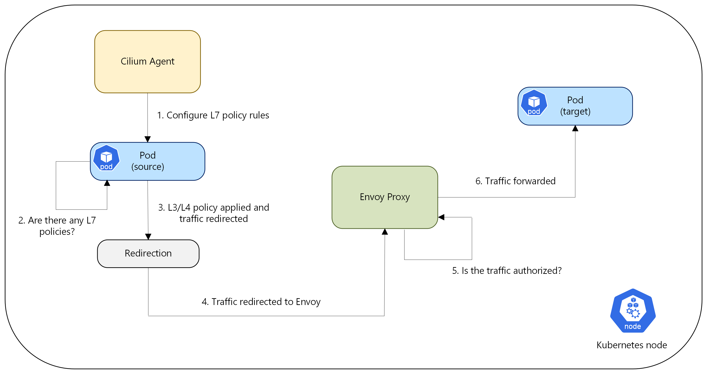

# Overview of Layer 7 (L7) policy (Preview) 

Network policies are essential for securing Kubernetes clusters by defining and controlling pod communication. They mitigate unauthorized access and potential security breaches by regulating traffic flow. Advanced Container Networking Services strengthens security with [FQDN-based network policies](./container-network-security-fqdn-filtering-concepts.md). Expanding on this foundation, Advanced Container Networking Services now provides L7 policy support, enabling detailed inspection and management of application-level traffic. This advancement enhances both the security and efficiency of network communications within AKS clusters. The offering includes comprehensive support for widely adopted protocols, including HTTP, gRPC, and Kafka.

## Components of L7 policy

**Envoy proxy**: Envoy, part of ACNS security agent acts as the enforcement point for L7 policies. A TPROXY inspects application traffic, comparing it against the defined L7 policies. To enhance scalability and resource management, Envoy is deployed as a separate DaemonSet, decoupled from the Cilium Agent.

## How L7 Policy works

When L7 policy enforcement is enabled for an application or pod, outgoing network traffic is first 
evaluated to determine compliance with the configured application-level rules. The eBPF probe attached to the source pod’s network interface marks the packets, which are then redirected to a node-local Envoy Proxy. This redirection occurs only for pods enforcing L7 policies, ensuring that policy enforcement is applied selectively.

The Envoy proxy, augmented with Cilium network filters, then decides whether to forward the traffic to the destination pod based on policy criteria. If permitted, the traffic proceeds; if not, Envoy returns an appropriate error code to the originating pod. Upon successful authorization, the Envoy proxy facilitates the traffic flow, providing application-level visibility and control. This allows the Cilium agent to enforce detailed network policies within the policy engine. The following diagram illustrates the high-level flow of L7 policy enforcement.

## Monitoring L7 Traffic with Hubble and Grafana

To gain insights into L7 traffic flows, specifically HTTP, gRPC, and Kafka, Azure CNI Powered by Cilium leverages hubble agent, which is enabled by default with Advanced Container Networking Services. Hubble provides detailed flow-level metrics.

To simplify the analysis of these L7 metrics, we provide pre-configured Azure Managed Grafana dashboards. You can find them under the **Dashboards > Azure Managed Prometheus** folder, with filenames like  **"Kubernetes/Networking/L7 (Namespace)"** and **"Kubernetes/Networking/L7 (Workload)"**.

These dashboards offer granular visibility into L7 flow data at the cluster, namespace, and workload levels.

> [!NOTE]
> These dashboards will only display data if you have this feature enabled on your cluster and have relevant policies applied.
> Additionally, the monitoring metrics are **not** required to flow through Envoy, a component of the ACNS security agent. Rather, these metrics are collected by the Hubble agent, which is installed on your cluster as part of the Advanced Container Networking Service's observability feature.
## Key benefits

**Granular Application-Level Control**: L7 policies allow for fine-grained control over network traffic based on application-specific attributes, such as HTTP methods, gRPC paths, and Kafka topics. This extends beyond the basic IP address and port-based control of traditional network policies.

**Enhanced Security**: By inspecting application-level traffic, L7 policies can prevent attacks that exploit vulnerabilities at the application layer. This includes blocking unauthorized access to specific APIs or services. Furthermore, L7 policies are an important component of a Zero Trust security strategy, enabling the enforcement of the principle of least privilege at the application layer.

**Graceful Error Handling**: Unlike L3/L4 policies that typically drop unauthorized traffic silently, L7 policies can return application-level error codes (for example, HTTP 403, Kafka authorization failures), allowing applications to handle errors more gracefully.

**Observability**: With observability enabled for Advanced Container Networking Services and L7 policies applied to your AKS cluster, you can monitor traffic and policy effectiveness using Grafana dashboards.

## Limitations and considerations:

*	Current feature support relies on Cilium's Layer 7 policy enforcement based on HTTP, HTTPS, gRPC, and Kafka.
*	In preview, the maximum supported cluster size is up to 1,000 nodes or 40,000 pods, whichever is greater.
*    Traffic traversing Envoy proxies do come with latency. Users may experience noticeable latency degradation beyond 3,000 requests per second.
*    As part of our observability solution, we provide envoy_http_rq_total metrics. These metrics give the total request count, which could be used to derive requests per seconds (rps).
*    During a Cilium upgrade or rollout, existing sessions can be gracefully closed. Applications are expected to handle these interruptions gracefully—typically by implementing retry mechanisms at the connection or request level. New connections initiated during the rollout aren't impacted.
*	L7 policy through Advanced Container Networking Services (ACNS)  isn't  compatible with L7 policies implemented via alternate methods such as Istio. The following table summarizes the supported scenarios.
 
| Feature/Component                                  | L7 Policies using AKS, Istio - Managed addon    |
|----------------------------------------------------|-----------|
| K8s network policies by Azure CNI powered by Cilium | Supported |
| L4 (FQDN) Policies by Azure CNI powered by Cilium and ACNS                | Supported |
| L7 (HTTP(s)/GRPC/Kafka) Policies by Azure CNI powered by Cilium and ACNS  | Not Supported |
  
## Pricing
> [!IMPORTANT]
> Advanced Container Networking Services is a paid offering. For more information about pricing, see [Advanced Container Networking Services - Pricing](https://azure.microsoft.com/pricing/details/azure-container-networking-services/).

## Next steps

* Learn how to apply [L7 policies](how-to-apply-l7-policies.md) on AKS.

* Explore how the open source community builds [Cilium Network Policies](https://docs.cilium.io/en/latest/security/policy/).

* For more information about Advanced Container Networking Services for Azure Kubernetes Service (AKS), see [What is Advanced Container Networking Services for Azure Kubernetes Service (AKS)?](advanced-container-networking-services-overview.md).

* Explore Container Network Observability features in Advanced Container Networking Services in [What is Container Network Observability?](container-network-observability-concepts.md).