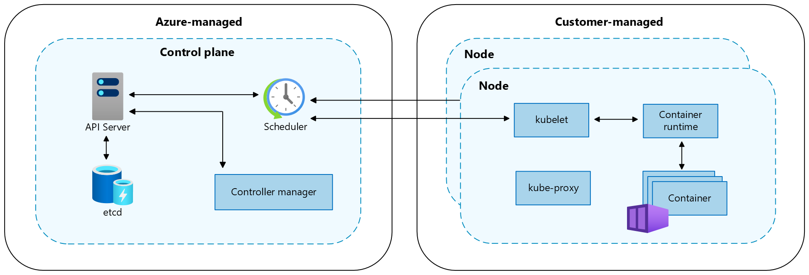
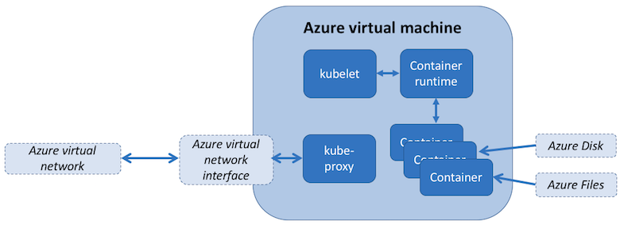
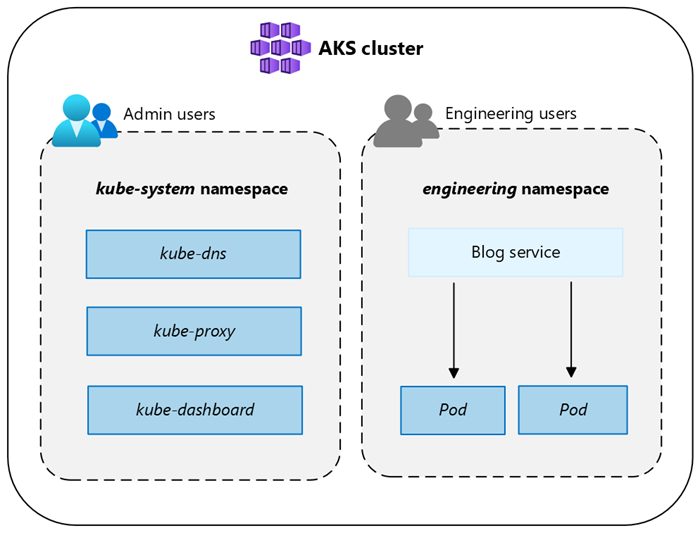

# Core concepts for Azure Kubernetes Service (AKS)

This article describes core concepts of Azure Kubernetes Service (AKS), a managed Kubernetes service that you can use to deploy and operate containerized applications at scale on Azure.

[!INCLUDE [azure linux 2.0 retirement](./includes/azure-linux-retirement.md)]

## What is Kubernetes?

Kubernetes is an open-source container orchestration platform for automating the deployment, scaling, and management of containerized applications. For more information, see the official [Kubernetes documentation][kubernetes-docs].

## What is AKS?

AKS is a managed Kubernetes service that simplifies deploying, managing, and scaling containerized applications that use Kubernetes. AKS supports two cluster modes:

- **AKS Automatic**, a more fully managed experience with production-ready defaults for common operational tasks.
- **AKS Standard**, a more configurable experience for teams that want deeper control over cluster setup and operations.

For more information, see [What is Azure Kubernetes Service (AKS)?][aks-overview] and [What is AKS Automatic?](./intro-aks-automatic.md)

## Cluster modes

In AKS, you can create clusters in either Automatic mode or Standard mode. Both modes use core Kubernetes concepts, but operational responsibility differs.

- AKS Automatic is designed for teams that want reduced operational overhead. It includes preconfigured defaults for node management, scaling, security guardrails, and upgrades.
- AKS Standard is designed for teams that want maximum flexibility and direct control over cluster configuration, node pools, scaling, networking, and operations.

Use AKS Automatic when you want a production-ready baseline with less day-2 platform management. Use AKS Standard when you need custom operating patterns and deeper tuning across cluster features.

For detailed capability differences, see [AKS Automatic and Standard feature comparison][automatic-standard].

> [!NOTE]
> AKS Automatic and AKS Standard differ in service-level agreement (SLA) experience. AKS Automatic includes uptime SLA and qualifying pod readiness SLA coverage by default. In AKS Standard, uptime SLA is tied to pricing tier and cluster setup. For more information, see [AKS Automatic and Standard feature comparison][automatic-standard] and [Pricing tiers for AKS cluster management](./free-standard-pricing-tiers.md).

## Cluster components

An AKS cluster is divided into two main components:

- **Control plane**: The control plane provides the core Kubernetes services and orchestration of application workloads.
- **Nodes**: Nodes are the underlying virtual machines (VMs) that run your applications.

These architecture concepts are the same in both [AKS cluster modes](#cluster-modes). What differs is the operational model: AKS Automatic applies more preconfigured platform operations by default, while AKS Standard gives you more direct control over how node and cluster operations are configured and managed.

> [!NOTE]
> AKS managed components have the label `kubernetes.azure.com/managedby`: `aks`.
>
> AKS manages the Helm releases with the prefix `aks-managed`. Continuously increasing revisions on these releases are expected and safe.

### Control plane

The Azure managed control plane is composed of several components that help manage the cluster:

| Component | Description |
| --------- | ----------- |
| `kube-apiserver` | The API server ([kube-apiserver][kube-apiserver]) exposes the Kubernetes API to enable requests to the cluster from inside and outside of the cluster. |
| `etcd` | The highly available key-value store [etcd][etcd] helps to maintain the state of your Kubernetes cluster and configuration. |
| `kube-scheduler` | The scheduler ([kube-scheduler][kube-scheduler]) helps to make scheduling decisions. It watches for new pods with no assigned node and selects a node for them to run on. |
| `kube-controller-manager` | The controller manager ([kube-controller-manager][kube-controller-manager]) runs controller processes, such as noticing and responding when nodes go down. |
| `cloud-controller-manager` | The cloud controller manager ([cloud-controller-manager][cloud-controller-manager]) embeds cloud-specific control logic to run controllers specific to the cloud provider. |

The control plane remains Azure-managed in both AKS Automatic and AKS Standard. In both modes, Azure operates critical control plane components such as `kube-apiserver`, `etcd`, `kube-scheduler`, `kube-controller-manager`, and `cloud-controller-manager`.

### Nodes

Each AKS cluster has at least one node, which is an Azure VM that runs Kubernetes node components. The following components run on each node:

| Component | Description |
| --------- | ----------- |
| `kubelet` | The [kubelet][kubelet] ensures that containers are running in a pod. |
| `kube-proxy` | The [kube-proxy][kube-proxy] is a network proxy that maintains network rules on nodes. |
| `container runtime` | The [container runtime][container-runtime] manages the execution and lifecycle of containers. |

Nodes run the same core Kubernetes node components in both [AKS cluster modes](#cluster-modes), including `kubelet`, `kube-proxy`, and the `container runtime`. The difference is in the default operations experience:

- AKS Automatic uses preconfigured defaults for common node-related operations.
- AKS Standard provides more flexibility to configure and operate node behavior directly.

For a detailed capability comparison, see [AKS Automatic and Standard feature comparison][automatic-standard].

## Node configuration

Configure the following settings for nodes.

### VM size and image

The _Azure VM size_ for your nodes defines CPUs, memory, size, and the storage type available, such as a high-performance solid-state drive or a regular hard-disk drive. The VM size you choose depends on the workload requirements and the number of pods that you plan to run on each node. Starting May 2025, the default VM SKU and size is dynamically selected by AKS based on available capacity and quota if the parameter is left blank during deployment. For more information, see [Supported VM sizes in Azure Kubernetes Service (AKS)][aks-vm-sizes].

In AKS, the _VM image_ for your cluster's nodes is based on Ubuntu Linux, [Azure Linux](use-azure-linux.md), or Windows Server 2022. When you create an AKS cluster or scale out the number of nodes, the Azure platform automatically creates and configures the requested number of VMs. Agent nodes are billed as standard VMs. Any VM size discounts, including [Azure reservations][reservation-discounts], are automatically applied.

### OS disks

Default OS disk sizing is used on new clusters or node pools only when a default OS disk size isn't specified. This behavior applies to both managed and ephemeral OS disks. For more information, see [Default OS disk sizing][default-os-disk].

### Resource reservations

AKS uses node resources to help the nodes function as part of the cluster. This usage can cause a discrepancy between the node's total resources and the allocatable resources in AKS. To maintain node performance and functionality, AKS reserves two types of resources, CPU and memory, on each node. For more information, see [Resource reservations in AKS][resource-reservations].

### OS

AKS supports two Linux distros: Ubuntu and Azure Linux. Ubuntu is the default Linux distro on AKS. Windows node pools are also supported on AKS with the [Long Term Servicing Channel (LTSC)][servicing-channels-comparison] as the default channel on AKS. For more information on default OS versions, see documentation on [node images][node-images].

### Container runtime

A container runtime is software that executes containers and manages container images on a node. The runtime helps abstract away system calls or OS-specific functionality to run containers on Linux or Windows. For Linux node pools, [containerd][containerd] is used on Kubernetes version 1.19 and higher. For Windows Server 2019 and 2022 node pools, [containerd][containerd] is generally available and is the only runtime option on Kubernetes version 1.23 and higher.

## Pods

A _pod_ is a group of one or more containers that share the same network and storage resources and a specification for how to run the containers. Pods typically have a 1:1 mapping with a container, but you can run multiple containers in a pod.

## Node pools

> [!NOTE]
> [AKS Automatic](./intro-aks-automatic.md) preconfigures and manages system node pool behavior and node provisioning defaults. AKS Standard expects explicit node pool design and lifecycle choices. For more information, see [AKS Automatic and Standard feature comparison][automatic-standard].

In AKS, nodes of the same configuration are grouped together into _node pools_. These node pools contain the underlying virtual machine scale sets and virtual machines (VMs) that run your applications.

When you create an AKS cluster, you define the initial number of nodes and their size and version, which creates a [_system node pool_][use-system-pool]. System node pools serve the primary purpose of hosting critical system pods, such as CoreDNS (`coredns`) and konnectivity (`konnectivity-agent`).

To support applications that have different compute or storage demands, you can create _user node pools_. User node pools serve the primary purpose of hosting your application pods.

For more information, see [Create node pools in AKS][create-node-pools] and [Manage node pools in AKS][manage-node-pools].

## Node resource group

When you create an AKS cluster in an Azure resource group, the AKS resource provider automatically creates a second resource group called the _node resource group_. This resource group contains all the infrastructure resources associated with the cluster, including VMs, virtual machine scale sets, and storage.

For more information, see the following resources:

- [Why are two resource groups created with AKS?][node-resource-group]
- [Can I provide my own name for the AKS node resource group?][custom-nrg]
- [Can I modify tags and other properties of the resources in the AKS node resource group?][modify-nrg-resources]

## Namespaces

Kubernetes resources, such as pods and deployments, are logically grouped into _namespaces_ to divide an AKS cluster and create, view, or manage access to resources.

The following namespaces are created by default in an AKS cluster:

| Namespace | Description |
| --------- | ----------- |
| `default` | The [default][kubernetes-namespaces] namespace allows you to start using cluster resources without creating a new namespace. |
| `kube-node-lease` | The [kube-node-lease][kubernetes-namespaces] namespace enables nodes to communicate their availability to the control plane. |
| `kube-public` | The [kube-public][kubernetes-namespaces] namespace isn't typically used, but you can use it so that resources are visible across the whole cluster by any user. |
| `kube-system` | The [kube-system][kubernetes-namespaces] namespace is used by Kubernetes to manage cluster resources, such as `coredns`, `konnectivity-agent`, and `metrics-server`. We don't recommend deploying your own applications to this namespace. For rare cases where deploying your own applications to this namespace is necessary, see the [FAQ](faq.yml#can-admission-controller-webhooks-affect-kube-system-and-internal-aks-namespaces-). |

## Pricing tiers

AKS offers three pricing tiers for cluster management: Free, Standard, and Premium. The pricing tier you choose determines the features that are available for managing your cluster.

For more information, see [Pricing tiers for AKS cluster management][pricing-tiers].

## Supported Kubernetes versions

For more information, see [Supported Kubernetes versions in AKS][supported-kubernetes-versions].

## Related content

For information on AKS and AKS Automatic, see the following resources:

- [Introduction to AKS Automatic](./intro-aks-automatic.md)
- [Create an AKS Automatic cluster](./automatic/quick-automatic-managed-network.md)
- [AKS access and identity][access-identity]
- [AKS security][security]
- [AKS networking][networking]
- [AKS storage][storage]
- [AKS scaling][scaling]
- [AKS monitoring][monitoring]
- [AKS backup and recovery][backup-recovery]

<!---LINKS--->
[kube-apiserver]: https://kubernetes.io/docs/concepts/overview/components/#kube-apiserver
[etcd]: https://kubernetes.io/docs/concepts/overview/components/#etcd
[kube-scheduler]: https://kubernetes.io/docs/concepts/overview/components/#kube-scheduler
[kube-controller-manager]: https://kubernetes.io/docs/concepts/overview/components/#kube-controller-manager
[cloud-controller-manager]: https://kubernetes.io/docs/concepts/overview/components/#cloud-controller-manager
[kubelet]: https://kubernetes.io/docs/concepts/overview/components/#kubelet
[kube-proxy]: https://kubernetes.io/docs/concepts/overview/components/#kube-proxy
[container-runtime]: https://kubernetes.io/docs/concepts/overview/components/#container-runtime
[create-node-pools]: ./create-node-pools.md
[manage-node-pools]: ./manage-node-pools.md
[node-resource-group]: ./faq.yml
[custom-nrg]: ./faq.yml
[modify-nrg-resources]: ./faq.yml
[kubernetes-namespaces]: https://kubernetes.io/docs/concepts/overview/working-with-objects/namespaces/#initial-namespaces
[use-system-pool]: ./use-system-pools.md
[automatic-standard]: ./intro-aks-automatic.md#aks-automatic-and-standard-feature-comparison
[pricing-tiers]: ./free-standard-pricing-tiers.md
[access-identity]: ./concepts-identity.md
[security]: ./concepts-security.md
[networking]: ./concepts-network.md
[storage]: ./concepts-storage.md
[scaling]: ./concepts-scale.md
[monitoring]: ./monitor-aks.md
[backup-recovery]: /azure/backup/azure-kubernetes-service-backup-overview
[kubernetes-docs]: https://kubernetes.io/docs/home/
[resource-reservations]: ./node-resource-reservations.md
[reservation-discounts]: /azure/cost-management-billing/reservations/save-compute-costs-reservations
[supported-kubernetes-versions]: ./supported-kubernetes-versions.md
[default-os-disk]: ./concepts-storage.md#default-os-disk-sizing
[ephemeral-os-disks]: ./concepts-storage.md#ephemeral-os-disk
[aks-overview]: ./what-is-aks.md
[containerd]: https://containerd.io/
[aks-vm-sizes]: ./quotas-skus-regions.md#supported-vm-sizes
[windows-considerations]: ./windows-vs-linux-containers.md
[upgrade-2019-2022]: ./upgrade-windows-os.md
[node-images]: ./node-images.md
[servicing-channels-comparison]: /windows-server/get-started/servicing-channels-comparison
