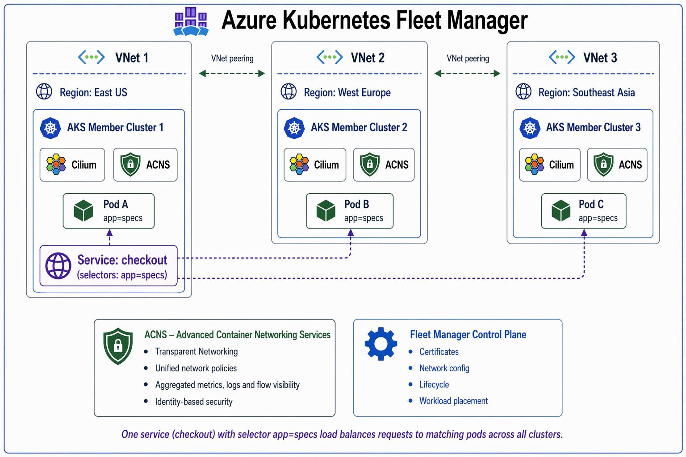
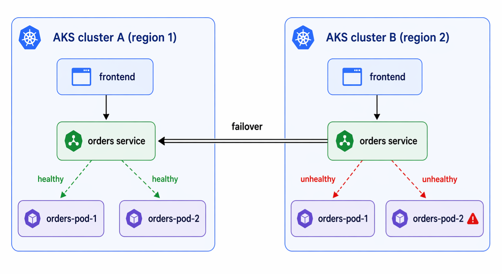
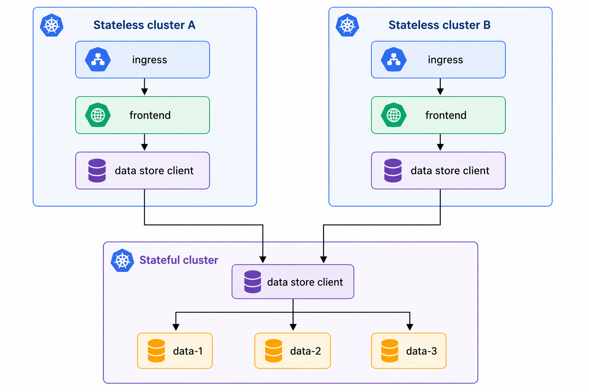

# Cross-cluster networking use cases for Azure Kubernetes Fleet Manager (preview)

Cross-cluster networking for Azure Kubernetes Fleet Manager (Fleet) is a managed offering built on [Cilium Cluster Mesh](https://cilium.io/use-cases/cluster-mesh/) that allows you to establish direct pod-to-pod communication across multiple Azure Kubernetes Service (AKS) clusters. By creating a cross-cluster network, you can enable seamless east-west connectivity without the need for gateways, while also gaining multi-cluster observability and consistent security enforcement.

## Architecture and capabilities

In a cross-cluster networking setup, a flat virtual network allows pods in different clusters to route traffic directly across cluster boundaries. Each cluster is typically assigned two subnets: one for nodes and one for pods. This consistent architecture ensures that the pod network remains flat across the cross-cluster network, without the use of overlays or tunnels.

Key components and capabilities for this scenario include:
- **Azure CNI with Cilium data plane**: Both AKS clusters must use Azure CNI with the Azure CNI powered by Cilium data plane.
- **Advanced Container Networking Services (ACNS)**: ACNS must be enabled on the clusters to support this scenario.
- **Azure Kubernetes Fleet Manager**: Fleet manages the lifecycle and configuration of the cross-cluster network through resources like the `ClusterMesh` profile. 
- **Native performance**: Pod IP routing happens across clusters at native performance via direct-routing, circumventing the need for any gateways or proxies.
- **Unified Network Policy Enforcement**: Extends Cilium's Layer 3-7 network policy enforcement to all clusters in the cross-cluster network, ensuring a consistent security approach.
- **Multi-cluster observability**: Provides end-to-end visibility into traffic flows across clusters. This visibility helps you monitor application health, troubleshoot connectivity issues, and analyze traffic patterns across the cross-cluster network.

## Use cases

Cross-cluster networking enables several key multi-cluster scenarios. The following sections describe the most common use cases for cross-cluster networking with Fleet.

### Use case: Transparent service discovery and load balancing

When you use standard Kubernetes services and mark them as global, Cilium automatically discovers endpoints for those services across all clusters in the cross-cluster network. Any traffic destined for a global service's `ClusterIP` is automatically load-balanced across all contributing clusters, simplifying cross-cluster communication.

Applications can discover and interact with services regardless of the cluster they reside in, without requiring application-level changes or external service registries.

### Use case: High availability and fault tolerance

High availability is the most common use case for cross-cluster networking. This use case includes operating Kubernetes clusters across multiple regions or availability zones and running replicas of the same services in each cluster. Upon failure, requests can fail over to other clusters in the cross-cluster network.

The failure scenario covered in this use case isn't primarily the complete unavailability of an entire region or failure domain. A more likely scenario is the temporary unavailability of resources or misconfiguration in one cluster, leading to the inability to run or scale particular services in that cluster. With cross-cluster networking, traffic destined for the affected service is automatically routed to healthy endpoints in other clusters, keeping your application available.

### Use case: Shared services

While the initial trend of Kubernetes-based platforms was to build large, multitenant clusters, it's becoming increasingly common to build individual clusters per tenant or to build clusters for different categories of services, such as different levels of security sensitivity.

However, some services such as secrets management, logging, monitoring, or DNS are often still shared between all clusters. Centralizing these services in a shared "service" cluster avoids the operational overhead of maintaining them in each tenant cluster.

The primary motivation of this model is isolation between tenant clusters. To maintain that goal, tenant clusters are connected only to the shared services cluster and aren't connected to other tenant clusters.

### Use case: Stateful and stateless separation

You can isolate the operational complexity of stateful services, such as databases and storage, in dedicated clusters. This separation keeps stateless application clusters agile and easy to migrate. It also improves security, simplifies cluster lifecycle management, and lets you scale stateless workloads independently from stateful ones.

### Use case: Multi-cluster security and policy enforcement

Cross-cluster networking extends Cilium's Layer 3-7 network policy enforcement across all clusters in the cross-cluster network. This unified enforcement ensures a consistent security posture and simplifies policy management by avoiding the need to manually replicate policies in every environment. Policies applied on one cluster are honored across the other clusters, providing unified, identity-aware security across your fleet.

### Use case: Multi-cluster observability

Cross-cluster networking provides end-to-end visibility into traffic flowing between services across clusters. By aggregating flow data from every cluster in the cross-cluster network, you can visualize east-west traffic, monitor application health across regions, troubleshoot cross-cluster connectivity issues, and analyze traffic patterns for capacity planning.

With [container network logs](./container-network-observability-logs.md), operators get a unified view of pod-to-pod communication regardless of which cluster the source or destination resides in, without instrumenting applications.

## Global services

To enable traffic flow between clusters, you must configure your Kubernetes services as global services. In a cross-cluster network, a global service is a standard Kubernetes service that is shared across multiple clusters. When you mark a service as global, Cilium automatically discovers endpoints for that service in all clusters within the cross-cluster network and performs load balancing across them.

Once a service is marked as global, any policies applied on one cluster are honored across the other clusters in the cross-cluster network, providing a consistent security posture. This configuration allows for:
- **Transparent Service Discovery**: Applications can discover and interact with services regardless of the cluster they reside in.
- **High Availability**: If a service in one cluster becomes unavailable, traffic is automatically shifted to a healthy instance in another cluster.

Cilium manages this discovery by watching for services with the `io.cilium/global-service: "true"` annotation. For these services, all endpoints with the same name and namespace across clusters are merged into a single global service. Any traffic destined for that service's `ClusterIP` is then load-balanced across all contributing clusters.

## Limitations

- A member cluster can participate in only one cross-cluster network at a time.
- A single cross-cluster network supports up to 255 member clusters.
- Self-managed Cilium multi-cluster configurations aren't supported alongside Fleet-managed cross-cluster networking.
- Cilium CLI commands that modify the mesh, such as `cilium clustermesh connect` or `cilium upgrade`, are unsupported because Fleet manages these operations.
- Cross-cluster networking is restricted to clusters within the same reachable flat routing domain. It doesn't support mesh connectivity across nonpeered virtual networks.

## Next steps

- Explore [Azure Kubernetes Fleet Manager concepts](../kubernetes-fleet/concepts-fleet.md).
- Learn more about [Advanced Container Networking Services](./advanced-container-networking-services-overview.md).
