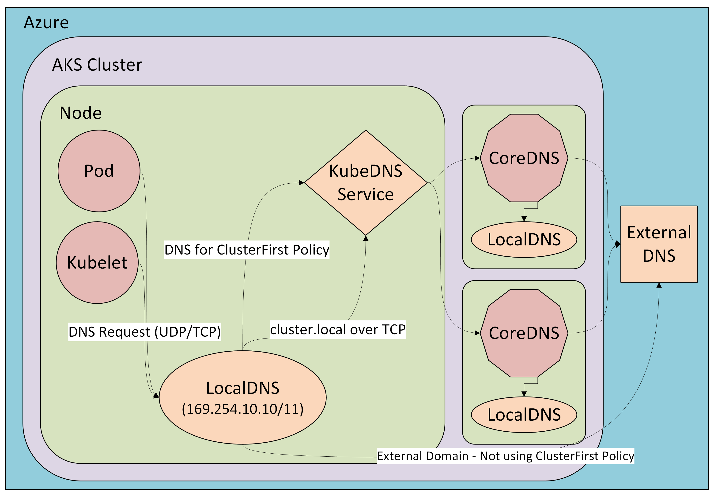

# DNS Resolution in Azure Kubernetes Service (AKS)

**Applies to**: :heavy_check_mark: AKS Automatic :heavy_check_mark: AKS Standard

Domain Name System (DNS) resolution is a critical component in Azure Kubernetes Service (AKS), enabling pods and services to communicate using human-readable names instead of IP addresses. AKS provides built-in DNS services to ensure seamless name resolution for both internal cluster resources and external endpoints. Understanding how DNS works in AKS helps cluster operators and developers ensure reliable connectivity, optimize performance, and troubleshoot networking issues effectively.

AKS Automatic is the recommended production-ready default for most AKS workloads. AKS Automatic clusters come preconfigured with LocalDNS to improve DNS performance, reduce conntrack pressure, and increase resiliency without requiring extra setup.

On AKS Standard, LocalDNS is optional and you can enable and configure it separately.

For more information about AKS Automatic, see [What is AKS Automatic?](./intro-aks-automatic.md)

## CoreDNS in Azure Kubernetes Service

[CoreDNS][coreDNS] is the default DNS service in AKS. It provides internal name resolution and service discovery for workloads running in the cluster. It operates as a set of pods in the `kube-system` namespace and is tightly integrated with Kubernetes networking.

When a pod in AKS issues a DNS query, such as resolving the name of another service, the request goes to the CoreDNS pods. These pods process the query and return the appropriate IP address or forward the request to an upstream DNS server for external domains.

This architecture ensures a balance between flexibility and operational safety in a managed environment. For details on how to customize CoreDNS in AKS, refer to the [CoreDNS customization guide](./coredns-custom.md).

For information on the CoreDNS project, see [the CoreDNS upstream project page][coreDNS].

## LocalDNS in Azure Kubernetes Service

> [!NOTE]
> This article provides an overview of what LocalDNS is and its benefits in AKS.
>
> For AKS Automatic, LocalDNS is preconfigured.
>
> For AKS Standard, see the [LocalDNS how-to guide](./localdns-custom.md) for guidance on enabling and configuring LocalDNS.

### Overview

LocalDNS is an advanced feature in Azure Kubernetes Service (AKS) that deploys a Domain Name System (DNS) proxy on each node to provide highly resilient, low-latency DNS resolution. By handling DNS queries locally, this proxy reduces traffic to the CoreDNS add-on pods, improving overall DNS reliability and performance in the cluster. LocalDNS is especially beneficial in large clusters or environments with high DNS query volumes, where centralized DNS resolution can become a bottleneck.

When LocalDNS is enabled, AKS deploys a local DNS cache as a `systemd` service on each node. Pods on the node send their DNS queries to this local cache, enabling faster resolution by reducing network hops. This approach also minimizes `conntrack` table usage, lowering the risk of table exhaustion. Additionally, if upstream DNS becomes unavailable, LocalDNS can continue serving cached responses for a configurable duration, helping maintain pod connectivity and service reliability.

### LocalDNS and AKS Automatic

AKS Automatic preconfigures LocalDNS as part of its production-ready defaults. You don't need to run a separate enable command on AKS Automatic clusters.

Use this article to understand how LocalDNS works and why it improves DNS behavior for AKS workloads. If you need enablement and configuration steps for AKS Standard, use the [LocalDNS how-to guide](./localdns-custom.md).

### Key capabilities

- **Reduced DNS resolution latency**: Each AKS node runs a LocalDNS `systemd` service. Workloads running on the node send DNS queries to this service, which resolves them locally, reducing network hops and speeding up DNS lookups.
- **Customizable DNS behavior**: Use `kubeDNSOverrides` and `vnetDNSOverrides` to control DNS behavior in the cluster.
- **Avoid conntrack races and conntrack table exhaustion**: Pods send DNS queries to the LocalDNS service on the same node without creating new `conntrack` table entries. Skipping the connection tracking helps reduce [conntrack races](https://github.com/kubernetes/kubernetes/issues/56903) and avoids User Datagram Protocol (UDP) DNS entries from filling up `conntrack` tables. This optimization prevents dropped and rejected connections caused by `conntrack` table exhaustion and race conditions.
- **Connection upgraded to TCP**: The connection from the `localdns` cache to the cluster’s CoreDNS service uses Transmission Control Protocol (TCP). TCP allows for connection rebalancing and removes `conntrack` table entries when the server closes the connection (in contrast to UDP connections, which have a default 30-second timeout). Applications don't need changes, because the `localdns` service still listens for UDP traffic.
- **Caching**: You can configure the LocalDNS cache plugin with `serveStale` and Time to Live (TTL) settings. Set the `serveStale`, `serveStaleDurationInSeconds`, and `cacheDurationInSeconds` parameters to achieve DNS resiliency, even during an upstream DNS outage.
- **Protocol control**: Set the DNS query protocol (such as `PreferUDP` or `ForceTCP`) for each domain. This flexibility lets you optimize DNS traffic for specific domains or meet network requirements.

### Other benefits and considerations

| Benefits | Considerations |
| -------- | -------------- |
| **Better scalability**: Reduces load on centralized CoreDNS pods | **Minimal resource overhead**: Uses a small amount of CPU and memory on each node |
| **Seamless integration**: Doesn't require changes to existing application connections | **Configuration changes**: Updates require node image upgrades, which can cause temporary disruptions |
| **Block invalid search domains**: Prevents invalid DNS queries at the node level | **Availability planning**: Teams using AKS Standard should evaluate whether DNS performance and resiliency justify enabling LocalDNS |

### AKS Automatic and AKS Standard behavior

| Cluster mode | LocalDNS behavior |
| ------------ | ----------------- |
| AKS Automatic | Preconfigured |
| AKS Standard | Optional |

By using LocalDNS, you get faster and more reliable DNS resolution for your workloads, reduce the risk of DNS-related outages, and gain more control over DNS traffic in your AKS environment.

## Related content

- To learn more about AKS Automatic, see [What is Azure Kubernetes Service (AKS) Automatic?](./intro-aks-automatic.md)
- To learn how to create an AKS Automatic cluster, see [Quickstart: Create an AKS Automatic cluster](./automatic/quick-automatic-managed-network.md).
- To learn how to enable LocalDNS and configure its settings in your AKS cluster, see the [LocalDNS how-to guide](./localdns-custom.md).
- To learn more about core network concepts, see [Network concepts for applications in AKS][concepts-network].

<!-- LINKS - external -->
[coreDNS]: https://coredns.io/

<!-- LINKS - internal -->
[concepts-network]: concepts-network.md
