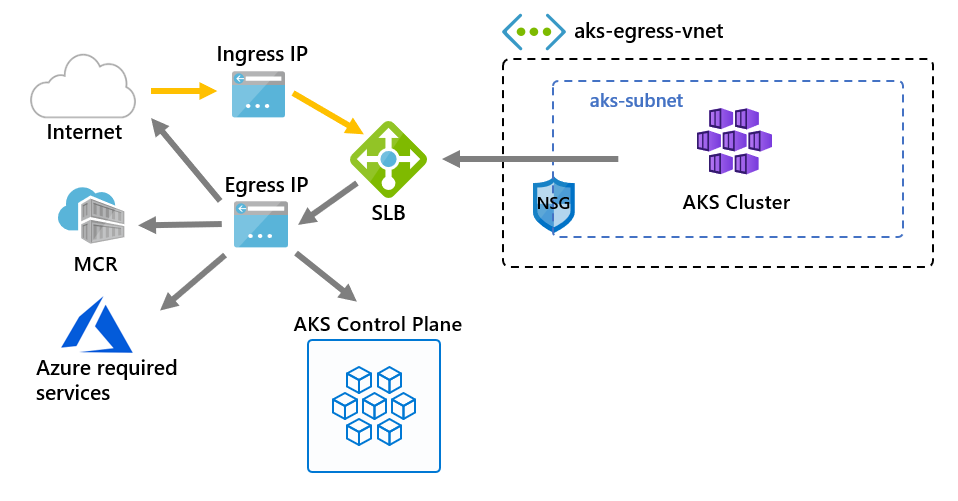

# Customize cluster egress with outbound types in Azure Kubernetes Service (AKS)

[!INCLUDE [vm-default-outbound-access-retirement](includes/vm-default-outbound-access-retirement.md)]

By default, AKS uses a Standard Load Balancer for egress. You can customize this configuration for scenarios that prohibit public IP addresses or require extra egress hops.

This article describes the outbound connectivity types available for AKS clusters.

> [!NOTE]
> You can now update the `outboundType` after cluster creation.

> [!IMPORTANT]
> In nonprivate clusters, AKS routes and processes API server traffic through the cluster's outbound type. To prevent AKS from processing API server traffic as public traffic, use a [private cluster][private-cluster] or [API Server VNet Integration][api-server-vnet-integration].

## Limitations

- Setting `outboundType` requires AKS clusters with a `vm-set-type` of `VirtualMachineScaleSets` and `load-balancer-sku` of `Standard`.

## Outbound types in AKS

You can configure an AKS cluster using the following outbound types: load balancer, NAT gateway, user-defined routes, `none`, or `block`. The outbound type affects only the egress traffic of your cluster. For more information, see [ingress networking concepts](concepts-network-ingress.md).

## <a id="outbound-type-of-loadbalancer"></a>Outbound type: Load Balancer

The load balancer is used for egress through an AKS-assigned public IP. An outbound type of `loadBalancer` supports Kubernetes services of type `loadBalancer`, which expect egress out of the load balancer created by the AKS resource provider.

If `loadBalancer` is set, AKS automatically completes the following configuration:

- A public IP address is created for cluster egress.
- The public IP address is assigned to the load balancer resource.
- Backend pools for the load balancer are set up for agent nodes in the cluster.



For more information, see [using a standard load balancer in AKS](load-balancer-standard.md).

## <a id="outbound type-of-managedNatGateway-or-userAssignedNatGateway"></a>Outbound type: NAT Gateway

When you select `managedNATGatewayV2` (Preview), `managedNATGateway`, or `userAssignedNATGateway` for `outboundType`, AKS uses [Azure NAT Gateway](/azure/virtual-network/nat-gateway/manage-nat-gateway) for cluster egress.

- Select `managedNATGatewayV2` or `managedNATGateway` for AKS-managed virtual networks. AKS provisions and attaches a StandardV2 NAT gateway for `managedNATGatewayV2` or a Standard NAT gateway for `managedNATGateway`. StandardV2 NAT Gateway is recommended because it's zone-redundant by default and offers higher bandwidth and throughput. For more information, see [StandardV2 NAT Gateway](/azure/nat-gateway/nat-overview#standardv2-nat-gateway).
- Select `userAssignedNATGateway` for bring-your-own virtual networks. Create a NAT gateway before you create the cluster. Both the Standard and StandardV2 NAT Gateway SKUs are supported.

> [!IMPORTANT]
> The `managedNATGatewayV2` outbound type is currently in preview.
> To use `managedNATGatewayV2`, install the latest Azure CLI and the `aks-preview` extension version `20.0.0b1` or later, and register the `ManagedNATGatewayV2Preview` feature flag. For setup instructions, see [using NAT gateway with AKS](nat-gateway.md#create-an-aks-cluster-with-a-managed-standardv2-nat-gateway-managednatgatewayv2).
> See the [Supplemental Terms of Use for Microsoft Azure Previews](https://azure.microsoft.com/support/legal/preview-supplemental-terms/) for legal terms that apply to Azure features that are in beta, preview, or otherwise not yet released into general availability.

For more information, see [using NAT gateway with AKS](nat-gateway.md).

## <a id="outbound-type-of-userdefinedrouting"></a>Outbound type: User-Defined Routes

> [!NOTE]
> The `userDefinedRouting` outbound type is an advanced networking scenario and requires proper network configuration.

If you set `userDefinedRouting`, AKS doesn't automatically configure egress paths. You configure the egress path.

You must deploy the AKS cluster into an existing virtual network with a subnet that you configure. Since you're not using a Standard Load Balancer architecture, you must establish explicit egress. Configure a route table with a `0.0.0.0/0` route that points to a gateway or network virtual appliance, and associate the route table with the cluster subnet.

For more information, see [configuring cluster egress via user-defined routing](egress-udr.md).

## Outbound type: none

> [!IMPORTANT]
> The `none` outbound type is only available with [Network Isolated Cluster](concepts-network-isolated.md) and requires careful planning to ensure the cluster operates as expected without unintended dependencies on external services. For fully isolated clusters, see [isolated cluster considerations](concepts-network-isolated.md).

If you set `none`, AKS doesn't automatically configure egress paths. This option is similar to `userDefinedRouting` but doesn't require a default route as part of validation.

The `none` outbound type supports both bring-your-own (BYO) and AKS-managed virtual networks. For a BYO virtual network, deploy the cluster into an existing virtual network with a configured subnet. AKS doesn't create a Standard Load Balancer or other egress infrastructure, so configure any required egress path through a firewall, proxy, gateway, or other custom network component.

## Outbound type: block (Preview)

> [!IMPORTANT]
> The `block` outbound type is only available with [Network Isolated Cluster](concepts-network-isolated.md) in a managed VNet and requires careful planning to ensure no unintended network dependencies exist. In a BYO VNet, use the `none` outbound type and configure network security group (NSG) rules to block egress traffic. For fully isolated clusters, see [isolated cluster considerations](concepts-network-isolated.md).
> To use `block`, install Azure CLI version `2.71.0` or later and the `aks-preview` Azure CLI extension version `9.0.0b2` or later. For setup instructions, see [create a network isolated cluster](network-isolated.md#before-you-begin).

If you set `block`, AKS configures network rules to block egress traffic from the cluster. This option is useful for highly secure environments where outbound connectivity must be restricted.

When using `block`:

- AKS ensures that no public internet traffic can leave the cluster through network security group (NSG) rules. VNet traffic isn't affected.
- You must explicitly allow any required egress traffic through extra network configurations.

The `block` option provides network isolation but requires careful planning to avoid disrupting workloads or dependencies.

## Update `outboundType` after cluster creation

Changing the outbound type after cluster creation deploys or removes resources as required to put the cluster into the new egress configuration.

The following tables show the supported migration paths between outbound types for managed and BYO virtual networks. Each row shows whether the outbound type can be migrated to the types listed across the top. "Supported" means migration is possible, while "Not Supported" or "N/A" means it isn't.

> [!WARNING]
> Migrating the outbound type to `managedNATGatewayV2`, `userAssignedNATGateway`, or `userDefinedRouting` changes the cluster's outbound public IP addresses.
> If you enabled [authorized IP ranges](./api-server-authorized-ip-ranges.md), add the new outbound IP range to the authorized ranges.

> [!WARNING]
> Changing the outbound type disrupts network connectivity, changes the cluster's egress IP address, and causes downtime for existing connections. Update any firewall rules that restrict cluster traffic to use the new egress IP address.

### Supported migration paths for managed VNet

The following table lists supported outbound type migration paths for AKS clusters that use AKS-managed virtual networks.

| From\|To                 | `loadBalancer` | `managedNATGatewayV2` | `managedNATGateway` | `none`        | `block`       |
|--------------------------|----------------|---------------------|-----------------------|---------------|---------------|
| `loadBalancer`           | N/A            | Supported           | Supported             | Supported     | Supported     |
| `managedNATGatewayV2`    | Not Supported  | N/A                 | Not Supported         | Not Supported | Not Supported |
| `managedNATGateway`      | Not Supported  | Supported           | N/A                   | Supported     | Supported     |
| `none`                   | Supported      | Supported           | Supported             | N/A           | Supported     |
| `block`                  | Supported      | Supported           | Supported             | Supported     | N/A           |

### Supported migration paths for BYO VNet

The following table lists supported outbound type migration paths for AKS clusters that use BYO virtual networks.

| From\|To                 | `loadBalancer` | `userAssignedNATGateway` | `userDefinedRouting` | `none`        | `block`       |
|--------------------------|----------------|--------------------------|----------------------|---------------|---------------|
| `loadBalancer`           | N/A            | Supported                | Supported            | Supported     | Not Supported |
| `userAssignedNATGateway` | Supported      | N/A                      | Supported            | Supported     | Not Supported |
| `userDefinedRouting`     | Supported      | Supported                | N/A                  | Supported     | Not Supported |
| `none`                   | Supported      | Supported                | Supported            | N/A           | Not Supported |

### Update cluster outbound type with Azure CLI

> [!NOTE]
> You must use Azure CLI version `2.56` or later to migrate stable outbound types. Preview outbound types have additional Azure CLI or extension requirements noted in their sections. Use `az upgrade` to update to the latest version of Azure CLI.

Update the outbound configuration of your cluster using the [`az aks update`][az-aks-update] command.

### <a id="update-cluster-from-loadbalancer-to-managednatgateway"></a>Update cluster from `loadBalancer` to `managedNATGatewayV2`

The following command updates the cluster to use a managed StandardV2 NAT gateway and assigns the specified number of managed outbound IPv6 addresses.

```azurecli-interactive
az aks update --resource-group <resourceGroup> --name <clusterName> --outbound-type managedNATGatewayV2 --nat-gateway-managed-outbound-ipv6-count <number of managed outbound ipv6>
```

> [!IMPORTANT]
> The `managedNATGatewayV2` outbound type is currently in preview.
> Before running the update command, install the latest Azure CLI and the `aks-preview` extension version `20.0.0b1` or later, and register the `ManagedNATGatewayV2Preview` feature flag. For setup instructions, see [using NAT gateway with AKS](nat-gateway.md#create-an-aks-cluster-with-a-managed-standardv2-nat-gateway-managednatgatewayv2).
> See the [Supplemental Terms of Use for Microsoft Azure Previews](https://azure.microsoft.com/support/legal/preview-supplemental-terms/) for legal terms that apply to Azure features that are in beta, preview, or otherwise not yet released into general availability. For more information, see [using NAT gateway with AKS](nat-gateway.md).

### Update cluster from `managedNATGateway` to `loadBalancer`

The following command updates the cluster to use a load balancer for egress. Choose one outbound IP option: `--load-balancer-managed-outbound-ip-count` for AKS-managed public IPs, `--load-balancer-outbound-ips` for existing public IP resource IDs, or `--load-balancer-outbound-ip-prefixes` for existing public IP prefix resource IDs.

```azurecli-interactive
az aks update --resource-group <resourceGroup> --name <clusterName> \
--outbound-type loadBalancer \
< --load-balancer-managed-outbound-ip-count <number of managed outbound ip> | --load-balancer-outbound-ips <outbound ip ids> | --load-balancer-outbound-ip-prefixes <outbound ip prefix ids> >
```

> [!WARNING]
> Don't reuse an IP address that is already in use in prior outbound configurations.

### Update cluster from `managedNATGateway` to `userDefinedRouting`

Before running the update command, add a `0.0.0.0/0` route to the route table associated with the cluster subnet, and set the next hop to a gateway or network virtual appliance. For full configuration steps, see [Customize cluster egress with a user-defined routing table in Azure Kubernetes Service (AKS)](egress-udr.md).

```azurecli-interactive
az aks update --resource-group <resourceGroup> --name <clusterName> --outbound-type userDefinedRouting
```

### Update cluster from `loadBalancer` to `userAssignedNATGateway` in BYO VNet scenario

Before running the update command, associate an existing NAT gateway with the cluster subnet. For full configuration steps, see [Create a managed or user-assigned NAT gateway](nat-gateway.md).

```azurecli-interactive
az aks update --resource-group <resourceGroup> --name <clusterName> --outbound-type userAssignedNATGateway
```

## Related content

- [Configure standard load balancing in an AKS cluster](load-balancer-standard.md)
- [Configure NAT gateway in an AKS cluster](nat-gateway.md)
- [Configure user-defined routing in an AKS cluster](egress-udr.md)
- [Azure networking UDR overview](/azure/virtual-network/virtual-networks-udr-overview)
- [Manage route tables](/azure/virtual-network/manage-route-table)

<!-- LINKS - internal -->
[api-server-vnet-integration]: api-server-vnet-integration.md
[az-aks-update]: /cli/azure/aks#az-aks-update
[private-cluster]: private-clusters.md
