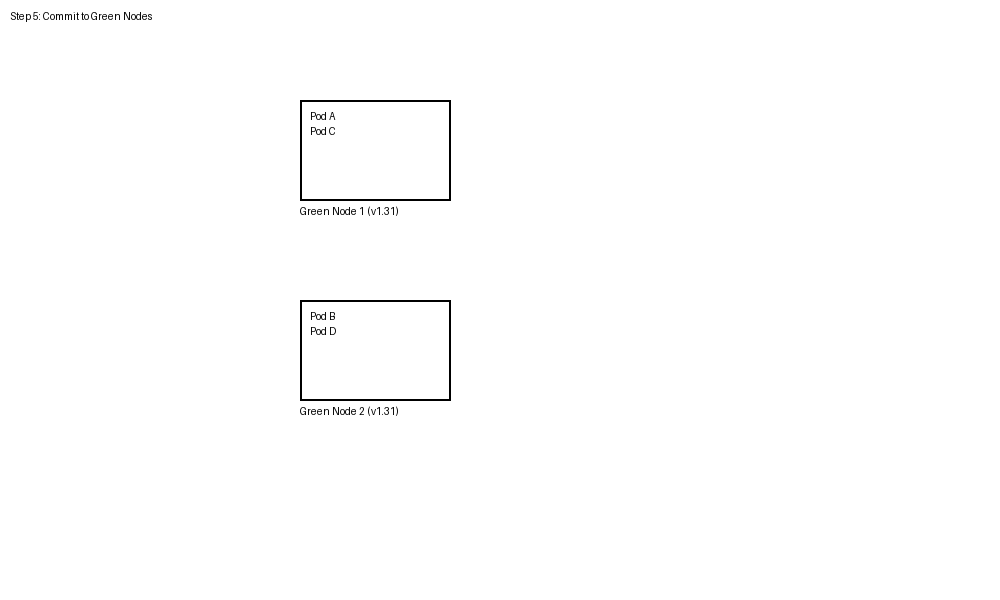

# How Azure Kubernetes Service (AKS) cluster upgrades work

Azure Kubernetes Service (AKS) performs rolling upgrades to minimize disruption to your running workloads. This article explains the step-by-step process of how nodes are upgraded in your cluster.

## Prerequisites

- Understanding of [Kubernetes upgrade best practices](./upgrade-cluster.md)
- Familiarity with [pod disruption budgets](./operator-best-practices-scheduler.md#plan-for-availability-using-pod-disruption-budgets)

## Rolling upgrade process

During a rolling upgrade, AKS creates temporary surge nodes to maintain cluster capacity while existing nodes are upgraded. The following example demonstrates upgrading a two-node cluster from Kubernetes 1.30 to 1.31 with `maxSurge` set to 1.

### Step 1: Initial setup

The cluster starts with two nodes running version 1.30, each hosting application pods.

- **Node 1**: Pod A, Pod B
- **Node 2**: Pod C, Pod D
- **Surge Node**: Empty (newly created)

### Step 2: Cordon and drain first node

AKS cordons Node 1 to prevent new pod scheduling, then drains existing pods.

- **Pod A** → Rescheduled to Surge Node
- **Pod B** → Rescheduled to Node 2

### Step 3: Upgrade first node

Node 1 is reimaged with Kubernetes version 1.31 while pods continue running on other nodes.

- **Node 1**: Upgraded to v1.31 (empty)
- **Node 2**: Pod B, Pod C, Pod D
- **Surge Node**: Pod A

### Step 4: Cordon and drain second node

AKS repeats the process for Node 2, redistributing pods across available nodes.

- **Pod C** → Rescheduled to Node 1
- **Pod D** → Rescheduled to Surge Node
- **Node 2**: Cordoned and reimaged to v1.31

### Step 5: Remove surge node

After all permanent nodes are upgraded, the surge node is drained and deleted.

- **Pod A** → Rescheduled to Node 1
- **Pod D** → Rescheduled to Node 2
- **Surge Node**: Deleted

### Final state

All nodes are now running Kubernetes version 1.31 with pods redistributed across the cluster.

- **Node 1 (v1.31)**: Pod A, Pod C
- **Node 2 (v1.31)**: Pod B, Pod D

## Considerations

- **MaxSurge setting**: Controls the number of surge nodes created during upgrades. Higher values speed up upgrades but consume more resources.
- **Pod disruption budgets**: Configure PDBs to ensure application availability during the upgrade process.
- **Node pool upgrades**: Each node pool upgrades independently. Plan your upgrade strategy accordingly.

## Upgrade behavior with restrictive Pod Disruption Budget

When a restrictive PDB blocks node draining, AKS can use the `Cordon` undrainable node behavior to continue the upgrade process. This example shows upgrading a two-node cluster from Kubernetes 1.30 to 1.31 with `maxSurge` set to 1 and a PDB blocking the first node's drain operation.

### Step 1: Initial setup with restrictive PDB

The cluster starts with two nodes running version 1.30, with a PDB protecting Pod A from eviction.

- **Node 1**: Pod A (protected by PDB), Pod B
- **Node 2**: Pod C, Pod D
- **Surge Node**: Empty (newly created)
- **PDB**: Prevents Pod A eviction

### Step 2: Attempt to drain first node (blocked)

AKS cordons Node 1 but cannot drain Pod A due to PDB restrictions.

- **Node 1**: Cordoned and marked as quarantined (Pod A stuck)
- **Pod B** → Rescheduled to Surge Node
- **Status**: Node 1 upgrade blocked

### Step 3: Proceed to second node

With Node 1 quarantined, AKS continues upgrading Node 2.

- **Node 1**: Remains quarantined (v1.30)
- **Node 2**: Cordoned and drained successfully
- **Pod C** → Rescheduled to Surge Node
- **Pod D** → Rescheduled to Surge Node

### Step 4: Upgrade second node

Node 2 is successfully reimaged to Kubernetes version 1.31.

- **Node 1**: Still quarantined (v1.30) with Pod A
- **Node 2**: Upgraded to v1.31
- **Surge Node**: Pod B, Pod C, Pod D

### Step 5: Surge node becomes permanent replacement

Since Node 1 remains quarantined, the surge node becomes the permanent replacement running v1.31.

- **Node 1**: Quarantined (v1.30) - requires manual intervention
- **Node 2 (v1.31)**: Pod C, Pod D
- **Surge Node (v1.31)**: Pod B (now permanent)

### Final state with quarantined node

The upgrade completes with one quarantined node requiring manual intervention.

- **Node 1**: Quarantined (v1.30) with Pod A - **Customer must manually resolve** (see [undrainable node behavior](./upgrade-aks-cluster.md#configure-undrainable-node-behavior))
- **Node 2 (v1.31)**: Running normally
- **Former Surge Node (v1.31)**: Now permanent replacement

> [!IMPORTANT]
> The quarantined node (Node 1) remains the customer's responsibility to handle. You must either:
> - Adjust the PDB to allow Pod A eviction
> - Manually delete Pod A
> - Delete and recreate the node after resolving the blocking condition

### Key considerations for PDB-blocked upgrades

- **Undrainable node behavior**: Must be set to `Cordon` for the node pool to enable this quarantine behavior
- **Customer responsibility**: Quarantined nodes require manual intervention to resolve
- **Cluster capacity**: The surge node becomes permanent, potentially affecting cluster capacity planning
- **Monitoring**: Track quarantined nodes through Azure Monitor or kubectl to ensure timely resolution

## Blue-Green agent pool upgrades (Coming soon)

Blue-Green upgrades offer a safer, more controlled upgrade approach by creating a complete set of new nodes before migrating workloads. This feature is currently in development and will be available soon.

### Key concepts

- **Blue nodes**: Your existing nodes running the current Kubernetes version
- **Green nodes**: New nodes running the target Kubernetes version
- **MaxSurge**: Always set to 100% for Blue-Green upgrades (ensure you have sufficient quota)
- **Batch size**: Number of nodes to drain simultaneously during the migration
- **Batch soak period**: Wait time between draining node batches for validation
- **Node pool soak period**: Final validation period after all nodes are drained before committing or rolling back

### Blue-Green upgrade process example

This example demonstrates upgrading a two-node cluster from Kubernetes 1.30 to 1.31 using Blue-Green deployment.

#### Step 1: Initial state and green node creation

The upgrade begins by creating a complete duplicate set of nodes (green) with the new version.

- **Blue Node 1 (v1.30)**: Pod A, Pod B
- **Blue Node 2 (v1.30)**: Pod C, Pod D
- **Green Node 1 (v1.31)**: Empty (newly created)
- **Green Node 2 (v1.31)**: Empty (newly created)

#### Step 2: Batch migration (Batch size = 1)

Nodes are drained in batches based on the configured batch size. With batch size = 1, one node drains at a time.

- **Blue Node 1**: Cordoned and drained
- **Pod A, Pod B** → Migrated to Green nodes
- **Batch soak period**: System waits for validation

#### Step 3: Continue batch migration

After the batch soak period, the next batch proceeds if no issues are detected.

- **Blue Node 2**: Cordoned and drained
- **Pod C, Pod D** → Migrated to Green nodes
- **All workloads** now running on Green nodes (v1.31)

#### Step 4: Node pool soak period

After all nodes are drained, the node pool soak period begins. This is your final validation window.

During this period, you can:
- **Validate**: Check application performance on green nodes
- **Abort and rollback**: Return workloads to blue nodes if issues are found
- **Commit**: Proceed to delete blue nodes if validation succeeds

#### Step 5: Commit or rollback

Based on validation results, either commit to green nodes or rollback to blue.

**Option A - Commit (Success):**

- Blue nodes are deleted
- Green nodes become the new production nodes

**Option B - Rollback (Issues detected):**

- Workloads return to blue nodes
- Green nodes are deleted
- Cluster remains on v1.30

### Advantages of Blue-Green upgrades

- **Zero-downtime migration**: Complete infrastructure ready before workload migration
- **Validation periods**: Multiple checkpoints to verify upgrade success
- **Easy rollback**: Original nodes remain available until explicitly deleted
- **Batch control**: Configure migration pace based on risk tolerance

### Important considerations

- **Quota requirements**: Requires 2x the node capacity during upgrade
- **Cost implications**: Temporary doubling of compute resources
- **Configuration**: Batch size and soak periods should align with your validation requirements

## Next steps

- [Upgrade an AKS cluster](./upgrade-cluster.md)
- [Configure upgrade settings](./upgrade-aks-cluster.md#customize-node-surge-upgrade)
- [Best practices for cluster upgrades](./operator-best-practices-cluster-isolation.md)
- [Set up cluster autoupgrade](./auto-upgrade-cluster.md)