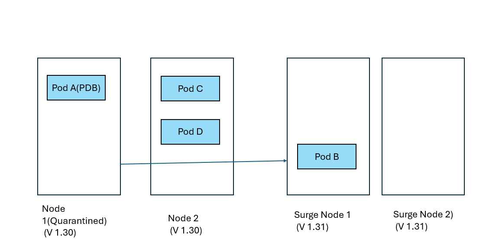
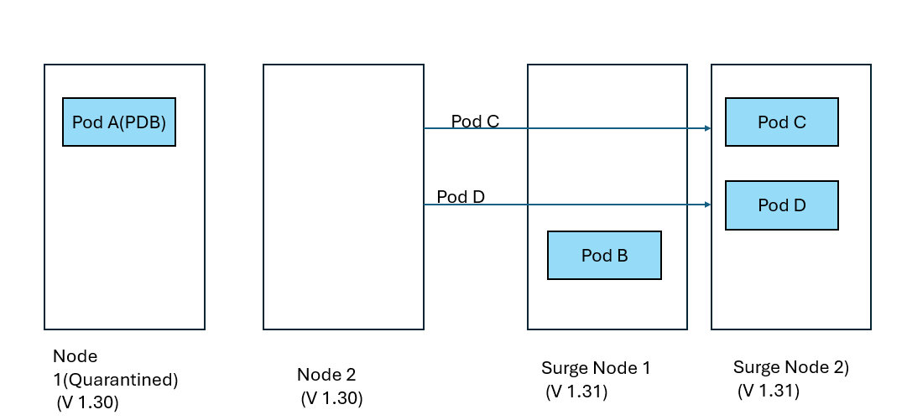
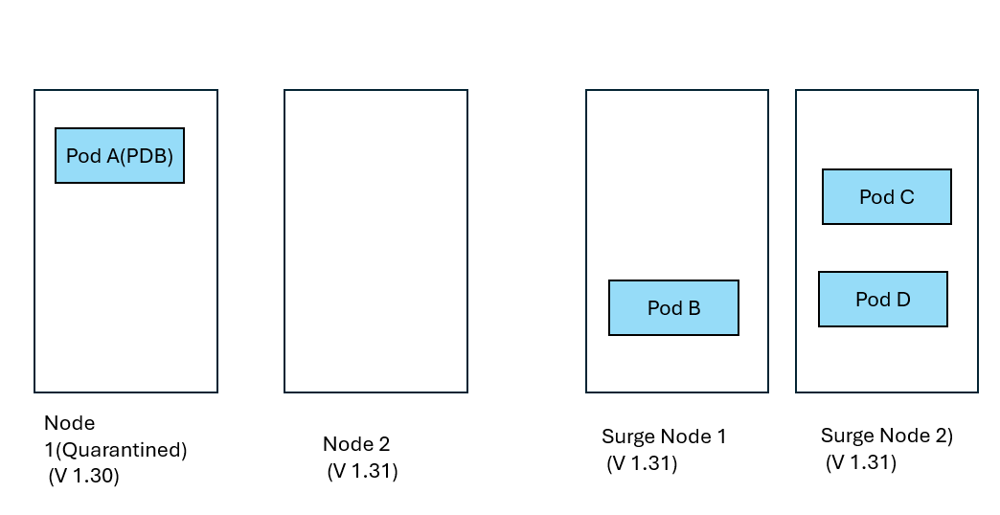
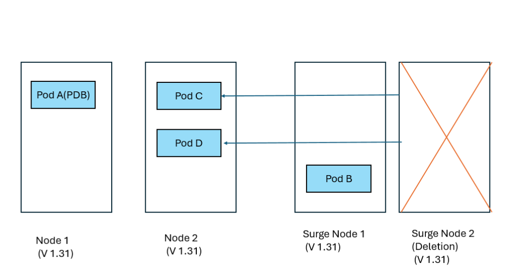
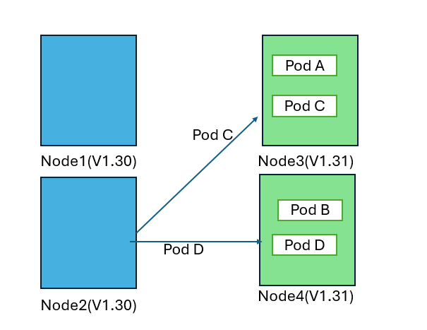
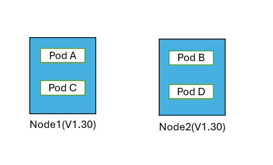

# How Azure Kubernetes Service (AKS) cluster upgrades work

Azure Kubernetes Service (AKS) performs rolling upgrades to minimize disruption to your running workloads. This article explains the step-by-step process of how nodes are upgraded in your cluster.

## Prerequisites

- Understanding of [Kubernetes upgrade best practices](./upgrade-cluster.md)
- Familiarity with [pod disruption budgets](./operator-best-practices-scheduler.md#plan-for-availability-using-pod-disruption-budgets)

## Rolling upgrade process

During a rolling upgrade, AKS creates temporary surge nodes to maintain cluster capacity while existing nodes are upgraded. The following example demonstrates upgrading a two-node cluster from Kubernetes 1.30 to 1.31 with `maxSurge` set to 1.

### Step 1: Initial setup

The cluster starts with two nodes running version 1.30, each hosting application pods.


- **Node 1**: Pod A, Pod B
- **Node 2**: Pod C, Pod D
- **Surge Node**: Empty (except for DaemonSets and new pods)

### Step 2: Cordon and drain first node

AKS cordons Node 1 to prevent new pod scheduling, then drains existing pods.


- **Pod A** → Evicted and replaced on Surge Node
- **Pod B** → Evicted and replaced on Node 2

### Step 3: Upgrade first node

Node 1 is reimaged with Kubernetes version 1.31 while pods continue running on other nodes.


- **Node 1**: Upgraded to v1.31 
- **Node 2**: Pod B, Pod C, Pod D
- **Surge Node**: Pod A

### Step 4: Cordon and drain second node

AKS repeats the process for Node 2, pods get evicted and the scheduler redistributes them to appropriate available nodes.


- **Pod C, B** → Evicted and replaced on Node 1
- **Pod D** → Evicted and replaced on Surge Node
- **Node 2**: Cordoned and reimaged to v1.31

### Step 5: Remove surge node

After all permanent nodes are upgraded, the surge node is cordoned, drained and deleted.


- **Pod A** → Evicted and replaced on Node 1
- **Pod D** → Evicted and replaced on Node 2
- **Surge Node**: Deleted

### Final state

All nodes are now running Kubernetes version 1.31 with pods scheduled across the cluster.

- **Node 1 (v1.31)**: Pod A, Pod C
- **Node 2 (v1.31)**: Pod B, Pod D

## Considerations

- **MaxSurge setting**: Controls the number of surge nodes created during upgrades. Higher values speed up upgrades but consume more resources.
- **Pod disruption budgets**: Configure PDBs to ensure application availability during the upgrade process.
- **Node pool upgrades**: Each node pool upgrades independently. Plan your upgrade strategy accordingly.

## Upgrade behavior with restrictive Pod Disruption Budget

When a restrictive PDB blocks node draining, AKS can use the `Cordon` undrainable node behavior to continue the upgrade process. This example shows upgrading a two-node cluster from Kubernetes 1.30 to 1.31 with `maxSurge` set to 1 and a PDB blocking the first node's drain operation.

### Step 1: Initial setup with restrictive PDB

The cluster starts with two nodes running version 1.30, with a PDB protecting Pod A from eviction.


- **Node 1**: Pod A (protected by PDB), Pod B
- **Node 2**: Pod C, Pod D
- **Surge Nodes**: newly created 2 nodes.
- **PDB**: Prevents Pod A eviction

### Step 2: Attempt to drain first node (blocked)

AKS cordons Node 1 but cannot drain Pod A due to PDB restrictions.



- **Node 1**: Cordoned and marked as quarantined (Pod A stuck)
- **Pod B** → Evicted and replaced on Surge Node 1, while Surge Node 2 temporarily is not used.
- **Status**: Node 1 upgrade blocked

### Step 3: Proceed to second node

With Node 1 quarantined, AKS continues upgrading Node 2.



- **Node 1**: Remains quarantined (v1.30)
- **Node 2**: Cordoned and drained successfully
- **Pod C** → Evicted and replaced on Surge Node 2
- **Pod D** → Evicted and replaced on Surge Node 2

### Step 4: Upgrade second node

Node 2 is successfully reimaged to Kubernetes version 1.31.



- **Node 1**: Still quarantined (v1.30) with Pod A
- **Node 2**: Upgraded to v1.31
- **Surge Node 1**: Pod B
- **Surge Node 2**: Pod C, Pod D

### Step 5: one Surge node becomes permanent replacement as another gets removed.

Since Node 1 remains quarantined, the surge node 1 becomes the permanent replacement running v1.31 and surge node 2 gets deleted.



- **Node 1**: Quarantined (v1.30) - requires manual intervention
- **Pod C, Pod D** → Evicted from Surge Node 2 and replaced on Node 2.
- **Surge Node 1 (v1.31)**: Pod B (now permanent)
- **Surge Node 2 (v1.31)**: Deleted.

### Final state with quarantined node

The upgrade completes with one quarantined node requiring manual intervention.

- **Node 1**: Quarantined (v1.30) with Pod A - **Customer must manually resolve** (see [customize unavailable nodes during upgrade](./upgrade-aks-cluster.md#customize-unavailable-nodes-during-upgrade))
- **Node 2 (v1.31)**: Running normally
- **Former Surge Node (v1.31)**: Now permanent replacement

> [!IMPORTANT]
> The quarantined node (Node 1) remains the customer's responsibility to handle. You must either:
> - Adjust the PDB to allow Pod A eviction
> - Manually delete Pod A
> - Delete and recreate the node after resolving the blocking condition

### Key considerations for PDB-blocked upgrades

- **Undrainable node behavior**: Must be set to `Cordon` for the node pool to enable this quarantine behavior
- **Customer responsibility**: Quarantined nodes require manual intervention to resolve
- **Cluster capacity**: The surge node becomes permanent, potentially affecting cluster capacity planning
- **Monitoring**: Track quarantined nodes through Azure Monitor or kubectl to ensure timely resolution


## Blue-Green node pool upgrades (manual)

Blue-Green upgrades offer a safer, more controlled upgrade approach by manually creating a complete set of new node pools before migrating workloads. This manual approach gives you full control over the upgrade process and timing.

### Key concepts

- **Blue node pool**: Your existing node pool running the current Kubernetes version
- **Green node pool**: New node pool you create running the target Kubernetes version
- **Manual control**: You manage all aspects of the migration process
- **Validation checkpoints**: You decide when to proceed, pause, or rollback

### Manual Blue-Green upgrade process example

This example demonstrates manually upgrading a two-node cluster from Kubernetes 1.30 to 1.31 using Blue-Green deployment.

#### Step 1: Create green node pool

You begin by manually creating a new node pool with the target Kubernetes version alongside your existing node pool.


- **Blue Node Pool (v1.30)**: Pod A, Pod B, Pod C, Pod D (existing)
- **Green Node Pool (v1.31)**: Empty (manually created by you)
- **Your action**: `az aks nodepool add` with new Kubernetes version

#### Step 2: Manually cordon blue nodes

You cordon the blue nodes to prevent new pod scheduling while keeping existing pods running.


- **Your action**: `kubectl cordon` on each blue node
- **Blue nodes**: Cordoned, no new pods scheduled
- **Green nodes**: Ready to receive workloads

#### Step 3: Manually drain blue nodes (controlled pace)

You control the migration pace by manually draining nodes one at a time or in batches.




- **Your action**: `kubectl drain` on selected blue nodes
- **Pod migration**: Pods automatically reschedule to green nodes
- **Validation**: You verify workloads on green nodes before proceeding

#### Step 4: Validate and decide

After migrating workloads, you validate application performance on green nodes.


During this phase, you can:
- **Monitor**: Check application metrics and logs
- **Test**: Run validation tests on green node pool
- **Decide**: Commit to green or rollback to blue

#### Step 5: Commit or rollback

Based on your validation, you manually complete the upgrade or rollback.

**Option A - Commit (Success):**


- **Your action**: Delete blue node pool using `az aks nodepool delete`
- **Result**: Green node pool becomes primary

**Option B - Rollback (Issues detected):**



- **Your action**: 
    1. Uncordon blue nodes using `kubectl uncordon`
    2. Drain green nodes using `kubectl drain`
    3. Delete green node pool using `az aks nodepool delete`
- **Result**: Workloads return to blue nodes

### Manual Blue-Green upgrade commands

```bash
# Step 1: Create green node pool
az aks nodepool add \
    --resource-group myResourceGroup \
    --cluster-name myAKSCluster \
    --name greennodepool \
    --kubernetes-version 1.31 \
    --node-count 2

# Step 2: Cordon blue nodes
kubectl cordon <blue-node-1>
kubectl cordon <blue-node-2>

# Step 3: Drain blue nodes (with your preferred options)
kubectl drain <blue-node-1> --ignore-daemonsets --delete-emptydir-data
kubectl drain <blue-node-2> --ignore-daemonsets --delete-emptydir-data

# Step 4: Validate (your custom validation process)

# Step 5A: Commit - Delete blue node pool
az aks nodepool delete \
    --resource-group myResourceGroup \
    --cluster-name myAKSCluster \
    --name bluenodepool

# Step 5B: Rollback - Return to blue nodes
kubectl uncordon <blue-node-1>
kubectl uncordon <blue-node-2>
kubectl drain <green-node-1> --ignore-daemonsets --delete-emptydir-data
kubectl drain <green-node-2> --ignore-daemonsets --delete-emptydir-data
az aks nodepool delete \
    --resource-group myResourceGroup \
    --cluster-name myAKSCluster \
    --name greennodepool
```

### Advantages of manual Blue-Green upgrades

- **Full control**: You decide exactly when each step occurs
- **Custom validation**: Implement your own validation criteria and timing
- **Gradual migration**: Move workloads at your preferred pace
- **Easy rollback**: Original nodes remain available until you delete them

### Important considerations

- **Manual effort**: Requires active management throughout the process
- **Quota requirements**: Requires 2x the node capacity during upgrade
- **Planning**: Document your validation criteria and rollback procedures


## Next steps

- [Upgrade an AKS cluster](./upgrade-cluster.md)
- [Configure upgrade settings](./upgrade-aks-cluster.md#customize-node-surge-upgrade)
- [Best practices for cluster upgrades](./operator-best-practices-cluster-isolation.md)
- [Set up cluster autoupgrade](./auto-upgrade-cluster.md)