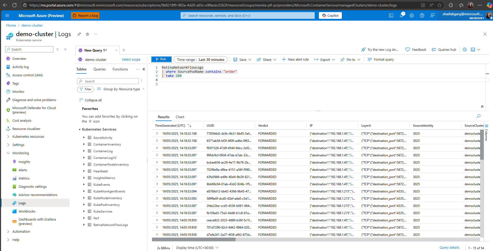
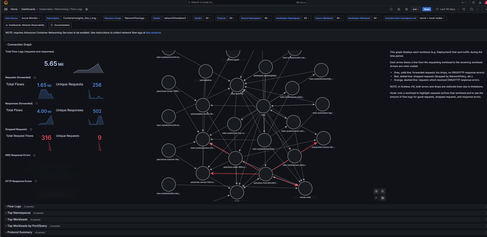

# Set up Container Network Logs with Advanced Container Networking Services

This document is designed to provide clear steps for configuring and utilizing Container Network Logs feature using Advanced Container Networking Services (ACNS). These logs offer persistent network flow monitoring tailored to enhance visibility within containerized environments. By capturing Container Network Logs, you can effectively track network traffic, detect anomalies, optimize performance, and ensure compliance with established policies. Follow the detailed instructions provided to set up and integrate Container Network Logs for your system. For more information about Container Network Logs Feature, see 
 [Overview of Container Network Logs](container-network-observaility-containernetworklogs.md)

## Prerequisites

* An Azure account with an active subscription. If you don't have one, create a [free account](https://azure.microsoft.com/free/?WT.mc_id=A261C142F) before you begin.
[!INCLUDE [azure-CLI-prepare-your-environment-no-header.md](~/reusable-content/azure-cli/azure-cli-prepare-your-environment-no-header.md)]

*  The minimum version of Azure CLI required for the steps in this article is 2.71.0. To find the version, Run `az --version` . If you need to install or upgrade, see [Install Azure CLI](/cli/azure/install-azure-cli).

* Container Network Log is available for Cilium Data planes only. 

### Install the `aks-preview` Azure CLI extension

Install or update the Azure CLI preview extension using the [`az extension add`](/cli/azure/extension#az_extension_add) or [`az extension update`](/cli/azure/extension#az_extension_update) command.

 The minimum version of the aks-preview Azure CLI extension is `14.0.0b6`

```azurecli-interactive
# Install the aks-preview extension
az extension add --name aks-preview
# Update the extension to make sure you have the latest version installed
az extension update --name aks-preview
``` 

### Register the `AdvancedNetworkingFlowLogsPreview' feature flag

Register the `AdvancedNetworkingFlowLogsPreview` feature flag using the  [`az feature register`](/cli/azure/feature#az_feature_register) command.

```azurecli-interactive 
az feature register --namespace "Microsoft.ContainerService" --name "AdvancedNetworkingFlowLogsPreview"
```
Verify successful registration using the [`az feature show`](/cli/azure/feature#az_feature_show) command. It takes a few minutes for the registration to complete.

```azurecli-interactive
az feature show --namespace "Microsoft.ContainerService" --name "AdvancedNetworkingFlowLogsPreview"
```

Once the feature shows `Registered`, refresh the registration of the `Microsoft.ContainerService` resource provider using the [`az provider register`](/cli/azure/provider#az_provider_register) command.


### Enable Advanced Container Networking Services on a new cluster

The `az aks create` command with the Advanced Container Networking Services flag, `--enable-acns`, creates a new AKS cluster with all Advanced Container Networking Services features. These features encompass:
* **Container Network Observability:**  Provides insights into your network traffic. To learn more visit [Container Network Observability](./advanced-container-networking-services-overview.md#container-network-observability).

* **Container Network Security:** Offers security features like Fully Qualified Domain filtering(FQDN). To learn more visit  [Container Network Security](./advanced-container-networking-services-overview.md#container-network-security).

#### [**Cilium**](#tab/cilium)

> [!NOTE]
> Clusters with the Cilium data plane support Container Network Observability and Container Network security starting with Kubernetes version 1.29.

```azurecli-interactive
# Set an environment variable for the AKS cluster name. Make sure to replace the placeholder with your own value.
export CLUSTER_NAME="<aks-cluster-name>"

# Create an AKS cluster
az aks create \
    --name $CLUSTER_NAME \
    --resource-group $RESOURCE_GROUP \
    --generate-ssh-keys \
    --location eastus \
    --max-pods 250 \
    --network-plugin azure \
    --network-plugin-mode overlay \
    --network-dataplane cilium \
    --node-count 2 \
    --pod-cidr 192.168.0.0/16 \
    --kubernetes-version 1.29 \
    --enable-acns
```

#### [**Non-Cilium**](#tab/non-cilium)

> [!NOTE]
> Containers Network Logs feature isn't available for Non-Cilium clusters.

```azurecli-interactive
# Set an environment variable for the AKS cluster name. Make sure to replace the placeholder with your own value.
export CLUSTER_NAME="<aks-cluster-name>"

# Create an AKS cluster
az aks create \
    --name $CLUSTER_NAME \
    --resource-group $RESOURCE_GROUP \
    --generate-ssh-keys \
    --network-plugin azure \
    --network-plugin-mode overlay \
    --pod-cidr 192.168.0.0/16 \
    --enable-acns
```

---
### Configuring Container Network Logs 
Container Network Logs is part of the Advanced Container Networking Services feature. It is enabled by default. One additional step required is to configure filters for collection of logs by applying a Custom Resource Definition (CRD). 
When ACNS is enabled and at least one CRD is applied, container network logs are collected and stored on the host node as /var/log/acns/hubble/event.log.
 
- Creating and configuring the CRD of type RetinaNetworkFlowLog:
 Logging can be configured using Custom Resource Definitions (CRDs) of type "RetinaNetworkFlowLog" to filter logs for collection at the source by namespace, pod, service, port, protocol, or verdict. Users must apply at least one CRD with non-empty filters to trigger log collection by ACNS. At one instance, any cluster can have multiple CRDs. If there would be no CRD applied, there wouldn't be any logs saved at /var/log/acns/hubble.
This sample CRD demonstrates how to configure Retina network flow logs:

```azurecli-interactive
apiVersion: acn.azure.com/v1alpha1
kind: RetinaNetworkFlowLog
metadata:
  name: test
spec:
  includefilters: # List of filters
    - name: sample-filter # Filter name
      from:
        namespacedPod:
          - default/kapinger-
      to:
        namespacedPod:
          - default/kapinger-
      protocol:
        - tcp
        - dns
        - udp
      verdict:
        - forwarded
        - dropped
```

- Apply RetinaNetworkFlowLog CRD to enable log collection at cluster with this command:

```azurecli-interactive
kubectl apply -f <crd.yaml>
```
Logs stored Locally on host nodes are temporary, as the host or node itself isn't a persistent storage solution. Furthermore, logs on host nodes are rotated upon reaching 50 MB in size. For longer-term storage and analysis, it is recommended to configure the Azure Monitor Agent on the cluster to collect and retain logs into the Log analytics workspace. Alternatively, third-party logging services an OpenTelemetry collector can be integrated for additional log management options. 

### Configuring Azure Monitor agent to scrap logs in Azure log analytics workspace for new cluster

```azurecli-interactive
# Set an environment variable for the AKS cluster name. Make sure to replace the placeholder with your own value.
export CLUSTER_NAME="<aks-cluster-name>"

# Set up new cluster with ACNS services with Azure monitor agent to collect 
az aks create \
    --name $CLUSTER_NAME \
    --resource-group $RESOURCE_GROUP \
    --generate-ssh-keys \
    --location eastus \
    --max-pods 250 \
    --network-plugin azure \
    --network-plugin-mode overlay \
    --network-dataplane cilium \
    --node-count 2 \
    --pod-cidr 192.168.0.0/16 \
    --kubernetes-version 1.29 \
    --enable-acns \
    --enable-addons-monitoring \
    --enable-high-log-scale-mode \
```


### Enable Advanced Container Networking Services on an existing cluster

The [`az aks update`](/cli/azure/aks#az_aks_update) command with the Advanced Container Networking Services flag, `--enable-acns`, updates an existing AKS cluster with all Advanced Container Networking Services features which includes [Container Network Observability](./advanced-container-networking-services-overview.md#container-network-observability) and the [Container Network Security](./advanced-container-networking-services-overview.md#container-network-security) feature.


> [!NOTE]
> Only clusters with the Cilium data plane support Container Network Security features of Advanced Container Networking Services.

```azurecli-interactive
az aks update \
    --resource-group $RESOURCE_GROUP \
    --name $CLUSTER_NAME \
    --enable-acns
```

### Configuring Container Network Logs with Azure Monitor Agent on existing cluster

To enable the container network logs on existing cluster, follow these steps:
1. Check if monitoring addon is already enabled on that cluster with following command
   ```azurecli-interactive
    az aks addon list -g $RESOURCE_GROUP -n $CLUSTER_NAME
   ```
1. If monitoring is already enabled, disable monitoring addon with following command
    ```azurecli-interactive
    az aks disable-addons -a monitoring -g $RESOURCE_GROUP -n $CLUSTER_NAME
   ```
1. Enable azure monitor with high log scale mode
     ```azurecli-interactive
    az aks enable-addons -a monitoring --enable-high-log-scale-mode -g $RESOURCE_GROUP -n $CLUSTER_NAME 
   ```
1. Update the aks cluster with enable retina flow log flag 
   ```azurecli-interactive
      az aks cluster update --enable-acns \
         --enable-retina-flow-logs \
         -g $RESOURCE_GROUP \
         -n $CLUSTER_NAME
   ```
---    

## Get cluster credentials 

Once you have Get your cluster credentials using the [`az aks get-credentials`](/cli/azure/aks#az_aks_get_credentials) command.

```azurecli-interactive
az aks get-credentials --name $CLUSTER_NAME --resource-group $RESOURCE_GROUP
```
## Validate the Setup
Validate if Retina Network flow log capability is enabled with following command –
```azurecli-interactive
   az aks show -g $RESOURCE_GROUP -n $CLUSTER_NAME
```
Expected Output from command above is:
[](./media/advanced-container-networking-services/enableretinaflowlogstrue.png#lightbox)

Validate if CRD of type RetinaNetworkFlowLog is applied 
```azurecli-interactive
   kubectl describe retinanetworkflowlogs <cr-name>
```
Expected Output with sample CRD provided above is – 
[](./media/advanced-container-networking-services/CRDappliedsuccessfuly.png#lightbox)

### Visualization of Container Network Logs in Azure portal. 

User can visualize, query, and analyze Flow logs in Azure portal in Azure log analytics workspace of their cluster:
[](./media/advanced-container-networking-services/Azureloganalytics.png#lightbox)

### Visualization of Container Network Logs in Grafana Dashboards 

User can visualize Container Network logs for analysis with Azure Managed Grafana and with BYO Grafana. For configuring Grafana, refer Setting up Azure Managed Grafana with ACNS, refer [Setting up Grfana](articles/aks/container-network-observability-how-to.md#visualisation)
To simplify the analysis of logs, we provide preconfigured Azure Managed Grafana dashboards. You can find them under the Dashboards > Azure Managed Prometheus folder, with filename "Kubernetes/Networking/Flow Logs”. Following is the snapshot of the Flow log dashboard. 

[](./media/advanced-container-networking-services/PFLdashboard.png#lightbox)

For more information about usage of this dashboard, refer [Overview of Container Network Logs](container-network-observaility-containernetworklogs.md)

### Disable Container Network Logs on existing cluster 
If all the CRDs get deleted, Flow log collection would stop as there would be no filters defined for collection. 
To disable retina flow log collection by azure monitor agent, use following command 
```azurecli-interactive
   az aks update -n $CLUSTER_NAME -g $RESOURCE_GROUP –disable-retina-flow-logs 
```
## Clean up resources

If you don't plan on using this application, delete the other resources you created in this article using the [`az group delete`](/cli/azure/#az_group_delete) command.

```azurecli-interactive
  az group delete --name $RESOURCE_GROUP
```

## Next steps

In this how-to article, you learned how to enable Container Network logs with Advanced Container Networking Services for your AKS cluster.

* For more information about Advanced Container Networking Services for Azure Kubernetes Service (AKS), see [What is Advanced Container Networking Services for Azure Kubernetes Service (AKS)?](advanced-container-networking-services-overview.md).
