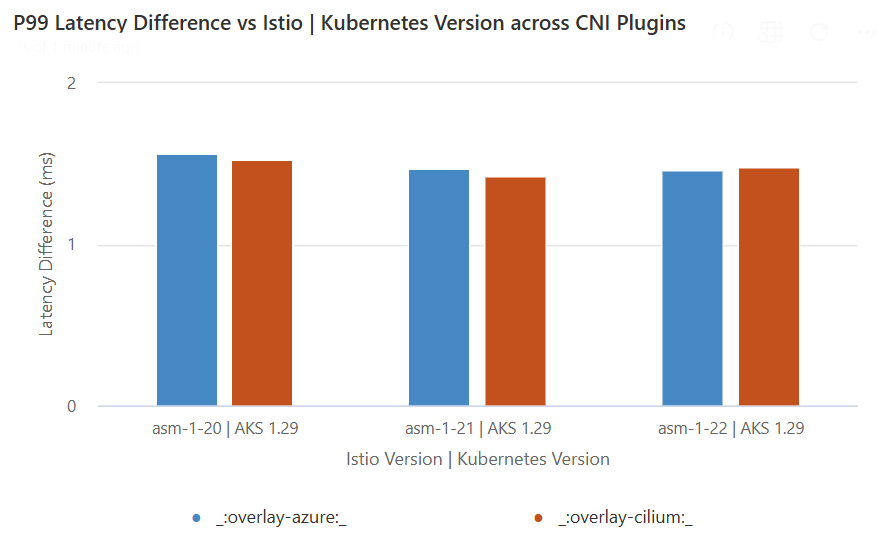
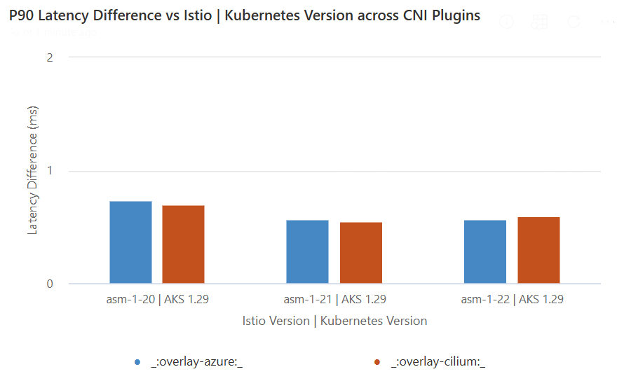

# Latency comparison across versions
This document elaborates on the [data plane latency performance](./istio-scale.md#data-plane-performance) across Istio add-on versions and Kubernetes version. The results evaluate the impact of adding sidecar proxies to the data path, showcasing the P90 and P99 latency difference. The comparison measures the difference between traffic routed through the sidecar and traffic sent directly to the pod.
- Traffic going through the sidecar: client --> client-sidecar --> server-sidecar --> server
- Traffic directly going to the pod: client --> server

## Test Specifications
- Node SKU: Standard D16 v5 (16 vCPU, 64-GB memory)
- Two proxy workers
- 1-KB payload
- 1,000 Queries per second (QPS) at varying client connections
- `http/1.1` protocol and mutual Transport Layer Security (TLS) enabled

| P99 Latency Difference | P90 Latency Difference |
|:-------------------------:|:-------------------------:|
 |  
