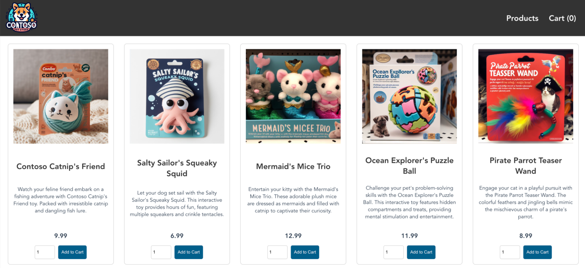

# Quickstart: Deploy an Azure Container Linux (ACL) for AKS cluster using an ARM template

Get started with Azure Container Linux (ACL) for AKS by deploying an AKS cluster using an [Azure Resource Manager (ARM) template](/azure/azure-resource-manager/templates/overview).

In this quickstart, you learn how to:

> [!div class="checklist"]
>
> - Create an AKS cluster using ACL for AKS.
> - Deploy the cluster using an ARM template.
> - Run a sample multi-container application with a group of microservices and web front ends simulating a retail scenario.

> [!NOTE]
> To get started with quickly provisioning an AKS cluster, this article includes steps to deploy a cluster with default settings for evaluation purposes only. Before deploying a production-ready cluster, we recommend that you familiarize yourself with our [baseline reference architecture](/azure/architecture/reference-architectures/containers/aks/baseline-aks?toc=/azure/aks/toc.json&amp;bc=/azure/aks/breadcrumb/toc.json) to consider how it aligns with your business requirements.

[!INCLUDE [azure container linux limitations](../includes/azure-container-linux-limitations.md)]

## Prerequisites

- This article assumes a basic understanding of Kubernetes concepts. For more information, see [Kubernetes core concepts for Azure Kubernetes Service (AKS)](../core-aks-concepts.md).
- If you don't have an Azure account, create a [free account](https://azure.microsoft.com/pricing/purchase-options/azure-account?cid=msft_learn) before you begin.
- Make sure that the identity you use to create your cluster has the appropriate minimum permissions. For more details on access and identity for AKS, see [Access and identity options for Azure Kubernetes Service (AKS)](../concepts-identity.md).
- To deploy an ARM template, you need write access on the resources you're deploying and access to all operations on the `Microsoft.Resources/deployments` resource type. For example, to deploy a virtual machine, you need `Microsoft.Compute/virtualMachines/write` and `Microsoft.Resources/deployments/*` permissions. For a list of roles and permissions, see [Azure built-in roles](/azure/role-based-access-control/built-in-roles).

After you deploy the cluster from the template, you can use either Azure CLI or Azure PowerShell to connect to the cluster and deploy the sample application.

## Register the required resource providers

You might need to register the required resource providers, such as `Microsoft.ContainerService` in your Azure subscription.

### Check registration status

Check the registration status using the [`az provider show`](/cli/azure/provider#az-provider-show) command.

```azurecli-interactive
az provider show --namespace Microsoft.ContainerService --query registrationState
```

### Register the resource provider

If necessary, register the `Microsoft.ContainerService` resource provider using the [`az provider register`](/cli/azure/provider#az-provider-register) command.

```azurecli-interactive
az provider register --namespace Microsoft.ContainerService
```

## Create an SSH key pair

To create an AKS cluster using an ARM template, you provide an SSH public key. If you need this resource, follow the steps in this section. Otherwise, skip to the [Review the template](#review-the-template) section.

To access AKS nodes, you connect using an SSH key pair (public and private), which you generate using the `ssh-keygen` command. By default, these files are created in the _~/.ssh_ directory. Running the `ssh-keygen` command overwrites any SSH key pair with the same name already existing in the given location. For more information about creating SSH keys, see [Create and manage SSH keys for authentication in Azure](/azure/virtual-machines/linux/create-ssh-keys-detailed).

1. Navigate to [https://shell.azure.com](https://shell.azure.com) to open Cloud Shell in your browser.
1. Create a resource group using the [`az group create`](/cli/azure/group#az-group-create) command. The following example creates a resource group named _myResourceGroup_ in the _East US_ region:

    ```azurecli-interactive
    az group create \
      --name myResourceGroup \
      --location eastus
    ```

1. Create an SSH key pair using the [`az sshkey create`](/cli/azure/sshkey#az-sshkey-create) command or the `ssh-keygen` command.

    ```azurecli-interactive
    az sshkey create --name mySSHKey --resource-group myResourceGroup
    ```

    Or create an SSH key pair using `ssh-keygen`:

    ```bash
    ssh-keygen -t rsa -b 4096
    ```

1. To deploy the template, you must provide the public key from the SSH pair. Retrieve the public key using the [`az sshkey show`](/cli/azure/sshkey#az-sshkey-show) command.

    ```azurecli-interactive
    az sshkey show --name mySSHKey --resource-group myResourceGroup --query publicKey
    ```

## Review the template

The following deployment uses an ARM template from [Azure Quickstart Templates](https://azure.microsoft.com/resources/templates/aks/):

```json
{
  "$schema": "https://schema.management.azure.com/schemas/2019-04-01/deploymentTemplate.json#",
  "contentVersion": "1.0.0.0",
  "metadata": {
    "_generator": {
      "name": "bicep",
      "version": "0.26.170.59819",
      "templateHash": "14823542069333410776"
    }
  },
  "parameters": {
    "clusterName": {
      "type": "string",
      "defaultValue": "aks101cluster",
      "metadata": {
        "description": "The name of the Managed Cluster resource."
      }
    },
    "location": {
      "type": "string",
      "defaultValue": "[resourceGroup().location]",
      "metadata": {
        "description": "The location of the Managed Cluster resource."
      }
    },
    "dnsPrefix": {
      "type": "string",
      "metadata": {
        "description": "Optional DNS prefix to use with hosted Kubernetes API server FQDN."
      }
    },
    "osDiskSizeGB": {
      "type": "int",
      "defaultValue": 0,
      "minValue": 0,
      "maxValue": 1023,
      "metadata": {
        "description": "Disk size (in GB) to provision for each of the agent pool nodes. This value ranges from 0 to 1023. Specifying 0 will apply the default disk size for that agentVMSize."
      }
    },
    "agentCount": {
      "type": "int",
      "defaultValue": 3,
      "minValue": 1,
      "maxValue": 50,
      "metadata": {
        "description": "The number of nodes for the cluster."
      }
    },
    "agentVMSize": {
      "type": "string",
      "defaultValue": "standard_d2s_v3",
      "metadata": {
        "description": "The size of the Virtual Machine."
      }
    },
    "linuxAdminUsername": {
      "type": "string",
      "metadata": {
        "description": "User name for the Linux Virtual Machines."
      }
    },
    "sshRSAPublicKey": {
      "type": "string",
      "metadata": {
        "description": "Configure all linux machines with the SSH RSA public key string. Your key should include three parts, for example 'ssh-rsa AAAAB...snip...UcyupgH azureuser@linuxvm'"
      }
    }
  },
  "resources": [
    {
      "type": "Microsoft.ContainerService/managedClusters",
      "apiVersion": "2026-03-01",
      "name": "[parameters('clusterName')]",
      "location": "[parameters('location')]",
      "identity": {
        "type": "SystemAssigned"
      },
      "properties": {
        "dnsPrefix": "[parameters('dnsPrefix')]",
        "agentPoolProfiles": [
          {
            "name": "agentpool",
            "osDiskSizeGB": "[parameters('osDiskSizeGB')]",
            "count": "[parameters('agentCount')]",
            "vmSize": "[parameters('agentVMSize')]",
            "osType": "Linux",
            "osSKU": "AzureContainerLinux",
            "mode": "System"
          }
        ],
        "linuxProfile": {
          "adminUsername": "[parameters('linuxAdminUsername')]",
          "ssh": {
            "publicKeys": [
              {
                "keyData": "[parameters('sshRSAPublicKey')]"
              }
            ]
          }
        }
      }
    }
  ],
  "outputs": {
    "controlPlaneFQDN": {
      "type": "string",
      "value": "[reference(resourceId('Microsoft.ContainerService/managedClusters', parameters('clusterName')), '2026-03-01').fqdn]"
    }
  }
}
```

The resource type defined in the ARM template is [**Microsoft.ContainerService/managedClusters**](/azure/templates/microsoft.containerservice/managedclusters?pivots=deployment-language-arm-template).

For more AKS samples, see the [AKS quickstart templates](https://azure.microsoft.com/resources/templates/?term=Azure+Kubernetes+Service) site.

## Deploy the template

1. Select **Deploy to Azure** to sign in and open a template.

    [](https://portal.azure.com/#create/Microsoft.Template/uri/https%3A%2F%2Fraw.githubusercontent.com%2FAzure%2Fazure-quickstart-templates%2Fmaster%2Fquickstarts%2Fmicrosoft.kubernetes%2Faks%2Fazuredeploy.json)

2. Configure the template parameters in the **Custom deployment** page. For this quickstart, leave the default values for the _OS Disk Size GB_, _Agent Count_, _Agent VM Size_, and _OS Type_. Provide your own values for the following parameters:

    - **Subscription**: Select an Azure subscription.
    - **Resource group**: Select **Create new**. Enter a unique name for the resource group, such as _myResourceGroup_, then select **OK**.
    - **OS SKU**: Specify **AzureContainerLinux**. If you don't update the OS SKU, the default is `Ubuntu`.
    - **Location**: Select a location, such as **East US**.
    - **Cluster name**: Enter a unique name for the AKS cluster, such as _myAKSCluster_.
    - **DNS prefix**: Enter a unique DNS prefix for your cluster, such as _myakscluster_.
    - **Linux Admin Username**: Enter a username to connect using SSH, such as _azureuser_.
    - **SSH public key source**: Select **Use existing public key**.
    - **Key pair name**: Copy and paste the _public_ part of your SSH key pair (by default, the contents of _~/.ssh/id\_rsa.pub_).

3. Select **Review + Create** > **Create**.

It takes a few minutes to create the AKS cluster. Wait for the cluster to be successfully deployed before you move on to the next step.

## Connect to the cluster

To manage a Kubernetes cluster, use the Kubernetes command-line client, [kubectl](https://kubernetes.io/docs/reference/kubectl/). If you use Azure Cloud Shell, `kubectl` is already installed.

### [Azure CLI](#tab/azure-cli)

To install and run `kubectl` locally, use the [`az aks install-cli`](/cli/azure/aks#az_aks_install_cli) command.

1. Configure `kubectl` to connect to your Kubernetes cluster using the [`az aks get-credentials`](/cli/azure/aks#az_aks_get_credentials) command. This command downloads credentials and configures the Kubernetes CLI to use them.

    ```azurecli-interactive
    az aks get-credentials \
      --resource-group myResourceGroup \
      --name myAKSCluster
    ```

1. Verify the connection to your cluster using the [`kubectl get`](https://kubernetes.io/docs/reference/generated/kubectl/kubectl-commands#get) command. This command returns a list of the cluster nodes.

    ```bash
    kubectl get nodes
    ```

    The following example output shows the three nodes created in the previous steps. Make sure the node status is _Ready_:

    ```output
    NAME                                STATUS   ROLES   AGE   VERSION
    aks-agentpool-12345678-vmss000000   Ready    <none>   5m53s   v1.32.7
    aks-agentpool-12345678-vmss000001   Ready    <none>   6m31s   v1.32.7
    aks-agentpool-12345678-vmss000002   Ready    <none>   6m35s   v1.32.7
    ```

### [Azure PowerShell](#tab/azure-powershell)

To install `kubectl` locally, use the [`Install-AzAksCliTool`](/powershell/module/az.aks/install-azaksclitool) cmdlet.

1. Configure `kubectl` to connect to your Kubernetes cluster using the [`Import-AzAksCredential`](/powershell/module/az.aks/import-azakscredential) cmdlet. This command downloads credentials and configures the Kubernetes CLI to use them.

    ```azurepowershell-interactive
    Import-AzAksCredential -ResourceGroupName myResourceGroup -Name myAKSCluster
    ```

1. Verify the connection to your cluster using the [`kubectl get`](https://kubernetes.io/docs/reference/generated/kubectl/kubectl-commands#get) command. This command returns a list of the cluster nodes.

    ```bash
    kubectl get nodes
    ```

    The following example output shows the three nodes created in the previous steps. Make sure the node status is _Ready_:

    ```output
    NAME                                STATUS   ROLES   AGE   VERSION
    aks-agentpool-12345678-vmss000000   Ready    <none>   5m53s   v1.32.7
    aks-agentpool-12345678-vmss000001   Ready    <none>   6m31s   v1.32.7
    aks-agentpool-12345678-vmss000002   Ready    <none>   6m35s   v1.32.7
    ```

---

## Deploy the application

To deploy the application, you use a manifest file to create all the objects required to run the [AKS Store application](https://github.com/Azure-Samples/aks-store-demo). A Kubernetes manifest file defines a cluster's desired state, such as which container images to run. The manifest includes the following Kubernetes deployments and services:

[](media/quick-kubernetes-deploy-rm-template/aks-store-architecture.png#lightbox)

- **Store front**: Web application for customers to view products and place orders.
- **Product service**: Shows product information.
- **Order service**: Places orders.
- **Rabbit MQ**: Message queue for an order queue.

> [!NOTE]
> We don't recommend running stateful containers, such as Rabbit MQ, without persistent storage for production. These are used here for simplicity, but we recommend using managed services, such as Azure Cosmos DB or Azure Service Bus.

1. Create a file named `aks-store-quickstart.yaml` and copy in the following manifest:

    ```yaml
    apiVersion: apps/v1
    kind: Deployment
    metadata:
      name: rabbitmq
    spec:
      replicas: 1
      selector:
        matchLabels:
          app: rabbitmq
      template:
        metadata:
          labels:
            app: rabbitmq
        spec:
          nodeSelector:
            "kubernetes.io/os": linux
          containers:
          - name: rabbitmq
            image: mcr.microsoft.com/mirror/docker/library/rabbitmq:3.10-management-alpine
            ports:
            - containerPort: 5672
              name: rabbitmq-amqp
            - containerPort: 15672
              name: rabbitmq-http
            env:
            - name: RABBITMQ_DEFAULT_USER
              value: "username"
            - name: RABBITMQ_DEFAULT_PASS
              value: "password"
            resources:
              requests:
                cpu: 10m
                memory: 128Mi
              limits:
                cpu: 250m
                memory: 256Mi
            volumeMounts:
            - name: rabbitmq-enabled-plugins
              mountPath: /etc/rabbitmq/enabled_plugins
              subPath: enabled_plugins
          volumes:
          - name: rabbitmq-enabled-plugins
            configMap:
              name: rabbitmq-enabled-plugins
              items:
              - key: rabbitmq_enabled_plugins
                path: enabled_plugins
    ---
    apiVersion: v1
    data:
      rabbitmq_enabled_plugins: |
        [rabbitmq_management,rabbitmq_prometheus,rabbitmq_amqp1_0].
    kind: ConfigMap
    metadata:
      name: rabbitmq-enabled-plugins
    ---
    apiVersion: v1
    kind: Service
    metadata:
      name: rabbitmq
    spec:
      selector:
        app: rabbitmq
      ports:
        - name: rabbitmq-amqp
          port: 5672
          targetPort: 5672
        - name: rabbitmq-http
          port: 15672
          targetPort: 15672
      type: ClusterIP
    ---
    apiVersion: apps/v1
    kind: Deployment
    metadata:
      name: order-service
    spec:
      replicas: 1
      selector:
        matchLabels:
          app: order-service
      template:
        metadata:
          labels:
            app: order-service
        spec:
          nodeSelector:
            "kubernetes.io/os": linux
          containers:
          - name: order-service
            image: ghcr.io/azure-samples/aks-store-demo/order-service:latest
            ports:
            - containerPort: 3000
            env:
            - name: ORDER_QUEUE_HOSTNAME
              value: "rabbitmq"
            - name: ORDER_QUEUE_PORT
              value: "5672"
            - name: ORDER_QUEUE_USERNAME
              value: "username"
            - name: ORDER_QUEUE_PASSWORD
              value: "password"
            - name: ORDER_QUEUE_NAME
              value: "orders"
            - name: FASTIFY_ADDRESS
              value: "0.0.0.0"
            resources:
              requests:
                cpu: 1m
                memory: 50Mi
              limits:
                cpu: 75m
                memory: 128Mi
          initContainers:
          - name: wait-for-rabbitmq
            image: busybox
            command: ['sh', '-c', 'until nc -zv rabbitmq 5672; do echo waiting for rabbitmq; sleep 2; done;']
            resources:
              requests:
                cpu: 1m
                memory: 50Mi
              limits:
                cpu: 75m
                memory: 128Mi
    ---
    apiVersion: v1
    kind: Service
    metadata:
      name: order-service
    spec:
      type: ClusterIP
      ports:
      - name: http
        port: 3000
        targetPort: 3000
      selector:
        app: order-service
    ---
    apiVersion: apps/v1
    kind: Deployment
    metadata:
      name: product-service
    spec:
      replicas: 1
      selector:
        matchLabels:
          app: product-service
      template:
        metadata:
          labels:
            app: product-service
        spec:
          nodeSelector:
            "kubernetes.io/os": linux
          containers:
          - name: product-service
            image: ghcr.io/azure-samples/aks-store-demo/product-service:latest
            ports:
            - containerPort: 3002
            resources:
              requests:
                cpu: 1m
                memory: 1Mi
              limits:
                cpu: 1m
                memory: 7Mi
    ---
    apiVersion: v1
    kind: Service
    metadata:
      name: product-service
    spec:
      type: ClusterIP
      ports:
      - name: http
        port: 3002
        targetPort: 3002
      selector:
        app: product-service
    ---
    apiVersion: apps/v1
    kind: Deployment
    metadata:
      name: store-front
    spec:
      replicas: 1
      selector:
        matchLabels:
          app: store-front
      template:
        metadata:
          labels:
            app: store-front
        spec:
          nodeSelector:
            "kubernetes.io/os": linux
          containers:
          - name: store-front
            image: ghcr.io/azure-samples/aks-store-demo/store-front:latest
            ports:
            - containerPort: 8080
              name: store-front
            env:
            - name: VUE_APP_ORDER_SERVICE_URL
              value: "http://order-service:3000/"
            - name: VUE_APP_PRODUCT_SERVICE_URL
              value: "http://product-service:3002/"
            resources:
              requests:
                cpu: 1m
                memory: 200Mi
              limits:
                cpu: 1000m
                memory: 512Mi
    ---
    apiVersion: v1
    kind: Service
    metadata:
      name: store-front
    spec:
      ports:
      - port: 80
        targetPort: 8080
      selector:
        app: store-front
      type: LoadBalancer
    ```

    For a breakdown of YAML manifest files, see [Deployments and YAML manifests](https://kubernetes.io/docs/concepts/workloads/controllers/deployment/).

    If you create and save the YAML file locally, then you can upload the manifest file to your default directory in CloudShell by selecting the **Upload/Download files** button and selecting the file from your local file system.

1. Deploy the application using the [`kubectl apply`](https://kubernetes.io/docs/reference/generated/kubectl/kubectl-commands#apply) command and specify the name of your YAML manifest.

    ```bash
    kubectl apply -f aks-store-quickstart.yaml
    ```

    The following example output shows the deployments and services:

    ```output
    deployment.apps/rabbitmq created
    service/rabbitmq created
    deployment.apps/order-service created
    service/order-service created
    deployment.apps/product-service created
    service/product-service created
    deployment.apps/store-front created
    service/store-front created
    ```

## Test the application

1. Check the status of the deployed pods using the [`kubectl get pods`](https://kubernetes.io/docs/reference/generated/kubectl/kubectl-commands#get) command. Make all pods are `Running` before proceeding.

    ```bash
    kubectl get pods
    ```

1. Check for a public IP address for the store-front application. Monitor progress using the [`kubectl get service`](https://kubernetes.io/docs/reference/generated/kubectl/kubectl-commands#get) command with the `--watch` argument.

    ```bash
    kubectl get service store-front --watch
    ```

    The **EXTERNAL-IP** output for the `store-front` service initially shows as _pending_:

    ```output
    NAME          TYPE           CLUSTER-IP    EXTERNAL-IP   PORT(S)        AGE
    store-front   LoadBalancer   10.0.100.10   <pending>     80:30025/TCP   4h4m
    ```

1. Once the **EXTERNAL-IP** address changes from _pending_ to an actual public IP address, use `CTRL-C` to stop the `kubectl` watch process.

    The following example output shows a valid public IP address assigned to the service:

    ```output
    NAME          TYPE           CLUSTER-IP    EXTERNAL-IP    PORT(S)        AGE
    store-front   LoadBalancer   10.0.100.10   20.62.159.19   80:30025/TCP   4h5m
    ```

1. Open a web browser to the external IP address of your service to see the Azure Store app in action:

    [](media/quick-kubernetes-deploy-rm-template/aks-store-application.png#lightbox)

## Delete the cluster

If you don't plan on going through the [AKS tutorial](../tutorial-kubernetes-prepare-app.md), clean up unnecessary resources to avoid Azure charges.

### [Azure CLI](#tab/azure-cli)

Remove the resource group, container service, and all related resources using the [`az group delete`](/cli/azure/group#az_group_delete) command.

```azurecli-interactive
az group delete --name myResourceGroup --yes --no-wait
```

### [Azure PowerShell](#tab/azure-powershell)

Remove the resource group, container service, and all related resources using the [`Remove-AzResourceGroup`](/powershell/module/az.resources/remove-azresourcegroup) cmdlet.

```azurepowershell-interactive
Remove-AzResourceGroup -Name myResourceGroup -Force
```

---

> [!NOTE]
> The AKS cluster was created with a system-assigned managed identity, which is the default identity option used in this quickstart. The platform manages this identity, so you don't need to manually remove it.

## Related content

In this quickstart, you deployed an AKS cluster with ACL for AKS using an ARM template. To learn more about ACL for AKS, see [Azure Container Linux (ACL) for Azure Kubernetes Service (AKS)](../azure-container-linux-overview.md).
