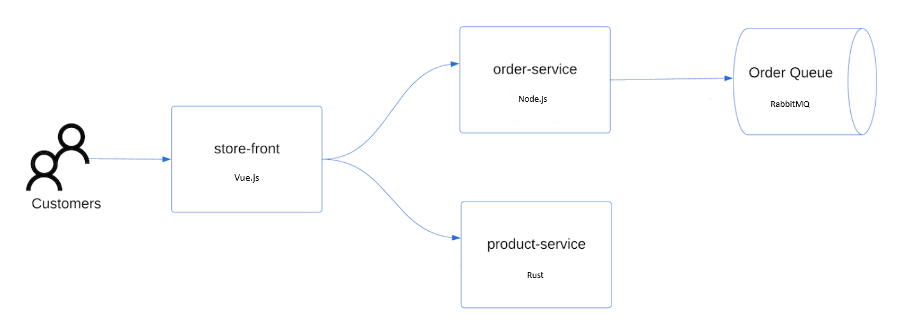

# Quickstart: Deploy an Azure Container Linux (ACL) for AKS cluster using Azure CLI

Get started with Azure Container Linux (ACL) for AKS by deploying an AKS cluster using the Azure CLI.

In this quickstart, you learn how to:

> [!div class="checklist"]
>
> - Create an AKS cluster using ACL for AKS.
> - Deploy the cluster using Azure CLI.
> - Run a sample multi-container application with a group of microservices and web front ends that simulate a retail scenario.

> [!NOTE]
> This article includes steps to deploy a cluster with default settings for evaluation purposes only. Before you deploy a production-ready cluster, we recommend that you familiarize yourself with our [baseline reference architecture](/azure/architecture/reference-architectures/containers/aks/baseline-aks?toc=/azure/aks/toc.json&amp;bc=/azure/aks/breadcrumb/toc.json) to consider how it aligns with your business requirements.

## Before you begin

- This quickstart assumes a basic understanding of Kubernetes concepts. For more information, see [Kubernetes core concepts for Azure Kubernetes Service (AKS)](../core-aks-concepts.md).
- If you don't have an Azure account, create a [free account](https://azure.microsoft.com/pricing/purchase-options/azure-account?cid=msft_learn) before you begin.
- Use the Bash environment in [Azure Cloud Shell](/azure/cloud-shell/overview). For more information, see [Get started with Azure Cloud Shell](/azure/cloud-shell/quickstart).

    [](https://shell.azure.com)

- If you prefer to run CLI reference commands locally, [install the Azure CLI](/cli/azure/install-azure-cli). If you're running on Windows or macOS, consider running Azure CLI in a Docker container. For more information, see [How to run the Azure CLI in a Docker container](/cli/azure/run-azure-cli-docker).

  - If you're using a local installation, sign in to the Azure CLI using the [`az login`](/cli/azure/reference-index#az-login) command. To finish the authentication process, follow the steps displayed in your terminal. For other sign-in options, see [Authenticate to Azure using Azure CLI](/cli/azure/authenticate-azure-cli).
  - When you're prompted, install the Azure CLI extension on first use. For more information about extensions, see [Use and manage extensions with the Azure CLI](/cli/azure/azure-cli-extensions-overview).
  - Run [`az version`](/cli/azure/reference-index?#az-version) to find the version and dependent libraries that are installed. To upgrade to the latest version, run [`az upgrade`](/cli/azure/reference-index?#az-upgrade).

- Make sure that the identity you're using to create your cluster has the appropriate minimum permissions. For more information on access and identity for AKS, see [Access and identity options for Azure Kubernetes Service (AKS)](../concepts-identity.md).
- If you have multiple Azure subscriptions, select the appropriate subscription ID in which the resources should be billed using the [`az account set`](/cli/azure/account#az-account-set) command. For more information, see [How to manage Azure subscriptions – Azure CLI](/cli/azure/manage-azure-subscriptions-azure-cli?tabs=bash#change-the-active-subscription).
- Dependent upon your Azure subscription, you might need to request a vCPU quota increase. For more information, see [Increase VM-family vCPU quotas](/azure/quotas/per-vm-quota-requests).

## Register the required resource providers

You might need to register the required resource providers, such as `Microsoft.ContainerService` in your Azure subscription.

### Check registration status

Check the registration status using the [`az provider show`](/en-us/cli/azure/provider#az-provider-show) command.

```azurecli-interactive
az provider show --namespace Microsoft.ContainerService --query registrationState
```

### Register the resource provider

If necessary, register the `Microsoft.ContainerService` resource provider using the [`az provider register`](/en-us/cli/azure/provider#az-provider-register) command.

```azurecli-interactive
az provider register --namespace Microsoft.ContainerService
```

## Define environment variables

Define the following environment variables for use throughout this quickstart. You can replace the values with your own custom names if you prefer.

```bash
export RESOURCE_GROUP="myAKSResourceGroup"
export REGION="westus"
export CLUSTER_NAME="myAKSCluster"
```

## Create a resource group

An [Azure resource group](/azure/azure-resource-manager/management/overview) is a logical group in which Azure resources are deployed and managed. When you create a resource group, you're prompted to specify a location. This location is the storage location of your resource group metadata and where your resources run in Azure if you don't specify another region during resource creation.

Create a resource group using the [`az group create`](/cli/azure/group#az-group-create) command.

```azurecli-interactive
az group create \
  --name $RESOURCE_GROUP \
  --location $REGION
```

Example output:

```output
{
  "id": "/subscriptions/aaaa0a0a-bb1b-cc2c-dd3d-eeeeee4e4e4e/resourceGroups/myAKSResourceGroup",
  "location": "westus",
  "managedBy": null,
  "name": "myAKSResourceGroup",
  "properties": {
    "provisioningState": "Succeeded"
  },
  "tags": null,
  "type": "Microsoft.Resources/resourceGroups"
}
```

## Create an AKS cluster

Create an AKS cluster using the [`az aks create`](/cli/azure/aks#az-aks-create) command. The `--os-sku AzureContainerLinux` parameter configures the node pool to use ACL as the node OS. The following example creates a cluster with one node and enables a system-assigned managed identity:

```azurecli-interactive
az aks create \
  --resource-group $RESOURCE_GROUP \
  --name $CLUSTER_NAME \
  --os-sku AzureContainerLinux \
  --node-count 1 \
  --generate-ssh-keys
```

> [!NOTE]
> When you create a new cluster, AKS automatically creates a second resource group to store the AKS resources. For more information, see [Why are two resource groups created with AKS?](../faq.yml)

## Connect to the cluster

To manage a Kubernetes cluster, use the Kubernetes command-line client, [kubectl](https://kubernetes.io/docs/reference/kubectl/). `kubectl` is already installed if you use Azure Cloud Shell. To install `kubectl` locally, use the [`az aks install-cli`](/cli/azure/aks#az-aks-install-cli) command.

1. Configure `kubectl` to connect to your Kubernetes cluster using the [`az aks get-credentials`](/cli/azure/aks#az-aks-get-credentials) command. This command downloads credentials and configures the Kubernetes CLI to use them.

    ```azurecli-interactive
    az aks get-credentials \
      --resource-group $RESOURCE_GROUP \
      --name $CLUSTER_NAME
    ```

1. Verify the connection to your cluster using the [`kubectl get`](https://kubernetes.io/docs/reference/generated/kubectl/kubectl-commands#get) command. This command returns a list of the cluster nodes.

    ```bash
    kubectl get nodes
    ```

## Deploy the application

To deploy the application, you use a manifest file to create all the objects required to run the [AKS Store application](https://github.com/Azure-Samples/aks-store-demo). A Kubernetes manifest file defines a cluster's desired state, such as which container images to run. The manifest includes the following Kubernetes deployments and services:

[](media/quick-kubernetes-deploy-portal/aks-store-architecture.png#lightbox)

- Store front: Web application for customers to view products and place orders.
- Product service: Shows product information.
- Order service: Places orders.
- `RabbitMQ`: Message queue for an order queue.

> [!NOTE]
> We don't recommend running stateful containers, such as `RabbitMQ`, without persistent storage for production. We use it here for simplicity, but we recommend using managed services, such as Azure Cosmos DB or Azure Service Bus.

1. Create a file named _aks-store-quickstart.yaml_ and copy in the following manifest:

    ```yaml
    apiVersion: apps/v1
    kind: StatefulSet
    metadata:
      name: rabbitmq
    spec:
      serviceName: rabbitmq
      replicas: 1
      selector:
        matchLabels:
          app: rabbitmq
      template:
        metadata:
          labels:
            app: rabbitmq
        spec:
          nodeSelector:
            "kubernetes.io/os": linux
          containers:
          - name: rabbitmq
            image: mcr.microsoft.com/mirror/docker/library/rabbitmq:3.10-management-alpine
            ports:
            - containerPort: 5672
              name: rabbitmq-amqp
            - containerPort: 15672
              name: rabbitmq-http
            env:
            - name: RABBITMQ_DEFAULT_USER
              value: "username"
            - name: RABBITMQ_DEFAULT_PASS
              value: "password"
            resources:
              requests:
                cpu: 10m
                memory: 128Mi
              limits:
                cpu: 250m
                memory: 256Mi
            volumeMounts:
            - name: rabbitmq-enabled-plugins
              mountPath: /etc/rabbitmq/enabled_plugins
              subPath: enabled_plugins
          volumes:
          - name: rabbitmq-enabled-plugins
            configMap:
              name: rabbitmq-enabled-plugins
              items:
              - key: rabbitmq_enabled_plugins
                path: enabled_plugins
    ---
    apiVersion: v1
    data:
      rabbitmq_enabled_plugins: |
        [rabbitmq_management,rabbitmq_prometheus,rabbitmq_amqp1_0].
    kind: ConfigMap
    metadata:
      name: rabbitmq-enabled-plugins
    ---
    apiVersion: v1
    kind: Service
    metadata:
      name: rabbitmq
    spec:
      selector:
        app: rabbitmq
      ports:
        - name: rabbitmq-amqp
          port: 5672
          targetPort: 5672
        - name: rabbitmq-http
          port: 15672
          targetPort: 15672
      type: ClusterIP
    ---
    apiVersion: apps/v1
    kind: Deployment
    metadata:
      name: order-service
    spec:
      replicas: 1
      selector:
        matchLabels:
          app: order-service
      template:
        metadata:
          labels:
            app: order-service
        spec:
          nodeSelector:
            "kubernetes.io/os": linux
          containers:
          - name: order-service
            image: ghcr.io/azure-samples/aks-store-demo/order-service:latest
            ports:
            - containerPort: 3000
            env:
            - name: ORDER_QUEUE_HOSTNAME
              value: "rabbitmq"
            - name: ORDER_QUEUE_PORT
              value: "5672"
            - name: ORDER_QUEUE_USERNAME
              value: "username"
            - name: ORDER_QUEUE_PASSWORD
              value: "password"
            - name: ORDER_QUEUE_NAME
              value: "orders"
            - name: FASTIFY_ADDRESS
              value: "0.0.0.0"
            resources:
              requests:
                cpu: 1m
                memory: 50Mi
              limits:
                cpu: 75m
                memory: 128Mi
            startupProbe:
              httpGet:
                path: /health
                port: 3000
              failureThreshold: 5
              initialDelaySeconds: 20
              periodSeconds: 10
            readinessProbe:
              httpGet:
                path: /health
                port: 3000
              failureThreshold: 3
              initialDelaySeconds: 3
              periodSeconds: 5
            livenessProbe:
              httpGet:
                path: /health
                port: 3000
              failureThreshold: 5
              initialDelaySeconds: 3
              periodSeconds: 3
          initContainers:
          - name: wait-for-rabbitmq
            image: busybox
            command: ['sh', '-c', 'until nc -zv rabbitmq 5672; do echo waiting for rabbitmq; sleep 2; done;']
            resources:
              requests:
                cpu: 1m
                memory: 50Mi
              limits:
                cpu: 75m
                memory: 128Mi
    ---
    apiVersion: v1
    kind: Service
    metadata:
      name: order-service
    spec:
      type: ClusterIP
      ports:
      - name: http
        port: 3000
        targetPort: 3000
      selector:
        app: order-service
    ---
    apiVersion: apps/v1
    kind: Deployment
    metadata:
      name: product-service
    spec:
      replicas: 1
      selector:
        matchLabels:
          app: product-service
      template:
        metadata:
          labels:
            app: product-service
        spec:
          nodeSelector:
            "kubernetes.io/os": linux
          containers:
          - name: product-service
            image: ghcr.io/azure-samples/aks-store-demo/product-service:latest
            ports:
            - containerPort: 3002
            env:
            - name: AI_SERVICE_URL
              value: "http://ai-service:5001/"
            resources:
              requests:
                cpu: 1m
                memory: 1Mi
              limits:
                cpu: 2m
                memory: 20Mi
            readinessProbe:
              httpGet:
                path: /health
                port: 3002
              failureThreshold: 3
              initialDelaySeconds: 3
              periodSeconds: 5
            livenessProbe:
              httpGet:
                path: /health
                port: 3002
              failureThreshold: 5
              initialDelaySeconds: 3
              periodSeconds: 3
    ---
    apiVersion: v1
    kind: Service
    metadata:
      name: product-service
    spec:
      type: ClusterIP
      ports:
      - name: http
        port: 3002
        targetPort: 3002
      selector:
        app: product-service
    ---
    apiVersion: apps/v1
    kind: Deployment
    metadata:
      name: store-front
    spec:
      replicas: 1
      selector:
        matchLabels:
          app: store-front
      template:
        metadata:
          labels:
            app: store-front
        spec:
          nodeSelector:
            "kubernetes.io/os": linux
          containers:
          - name: store-front
            image: ghcr.io/azure-samples/aks-store-demo/store-front:latest
            ports:
            - containerPort: 8080
              name: store-front
            env:
            - name: VUE_APP_ORDER_SERVICE_URL
              value: "http://order-service:3000/"
            - name: VUE_APP_PRODUCT_SERVICE_URL
              value: "http://product-service:3002/"
            resources:
              requests:
                cpu: 1m
                memory: 200Mi
              limits:
                cpu: 1000m
                memory: 512Mi
            startupProbe:
              httpGet:
                path: /health
                port: 8080
              failureThreshold: 3
              initialDelaySeconds: 5
              periodSeconds: 5
            readinessProbe:
              httpGet:
                path: /health
                port: 8080
              failureThreshold: 3
              initialDelaySeconds: 3
              periodSeconds: 3
            livenessProbe:
              httpGet:
                path: /health
                port: 8080
              failureThreshold: 5
              initialDelaySeconds: 3
              periodSeconds: 3
    ---
    apiVersion: v1
    kind: Service
    metadata:
      name: store-front
    spec:
      ports:
      - port: 80
        targetPort: 8080
      selector:
        app: store-front
      type: LoadBalancer
    ```

    For a breakdown of YAML manifest files, see [Deployments and YAML manifests](https://kubernetes.io/docs/concepts/workloads/controllers/deployment/).

    If you create and save the YAML file locally, then you can upload the manifest file to your default directory in Cloud Shell by selecting the **Upload/Download files** button and selecting the file from your local file system.

1. Deploy the application using the [`kubectl apply`](https://kubernetes.io/docs/reference/generated/kubectl/kubectl-commands#apply) command and specify the name of your YAML manifest.

    ```bash
    kubectl apply -f aks-store-quickstart.yaml
    ```

    The following example output shows the deployments and services:

    ```output
    deployment.apps/rabbitmq created
    service/rabbitmq created
    deployment.apps/order-service created
    service/order-service created
    deployment.apps/product-service created
    service/product-service created
    deployment.apps/store-front created
    service/store-front created
    ```

## Test the application

When the application runs, a Kubernetes service exposes the application front end to the internet. This process can take a few minutes to complete.

1. Check the status of the deployed pods using the [`kubectl get pods`](https://kubernetes.io/docs/reference/generated/kubectl/kubectl-commands#get) command. Make sure all pods are `Running` before proceeding.

    ```bash
    kubectl get pods
    ```

1. Check for a public IP address for the `store-front` application. Monitor progress using the [`kubectl get service`](https://kubernetes.io/docs/reference/generated/kubectl/kubectl-commands#get) command with the `--watch` argument.

    ```bash
    kubectl get service store-front --watch
    ```

    The **EXTERNAL-IP** output for the `store-front` service initially shows as _pending_:

    ```output
    NAME          TYPE           CLUSTER-IP    EXTERNAL-IP   PORT(S)        AGE
    store-front   LoadBalancer   10.0.100.10   <pending>     80:30025/TCP   4h4m
    ```

    Once the **EXTERNAL-IP** address changes from _pending_ to an actual public IP address, use `CTRL-C` to stop the `kubectl` watch process.

    The following example output shows a valid public IP address assigned to the service:

    ```output
    NAME          TYPE           CLUSTER-IP    EXTERNAL-IP    PORT(S)        AGE
    store-front   LoadBalancer   10.0.100.10   20.62.159.19   80:30025/TCP   4h5m
    ```

1. Open a web browser to the external IP address of your service to see the Azure Store app in action.

    [](media/quick-kubernetes-deploy-portal/aks-store-application.png#lightbox)

## Delete the cluster

If you don't plan on going through the [AKS tutorial](../tutorial-kubernetes-prepare-app.md), clean up unnecessary resources to avoid Azure billing charges.

Remove the resource group, container service, and all related resources using the [`az group delete`](/cli/azure/group#az-group-delete) command.

```azurecli-interactive
az group delete --name $RESOURCE_GROUP
```

The AKS cluster was created with a system-assigned managed identity, which is the default identity option used in this quickstart. The platform manages this identity so you don't need to manually remove it.

## Related content

In this quickstart, you deployed an AKS cluster with ACL for AKS using Azure CLI. To learn more about ACL for AKS, see [Azure Container Linux (ACL) for Azure Kubernetes Service (AKS)](../azure-container-linux-overview.md).
