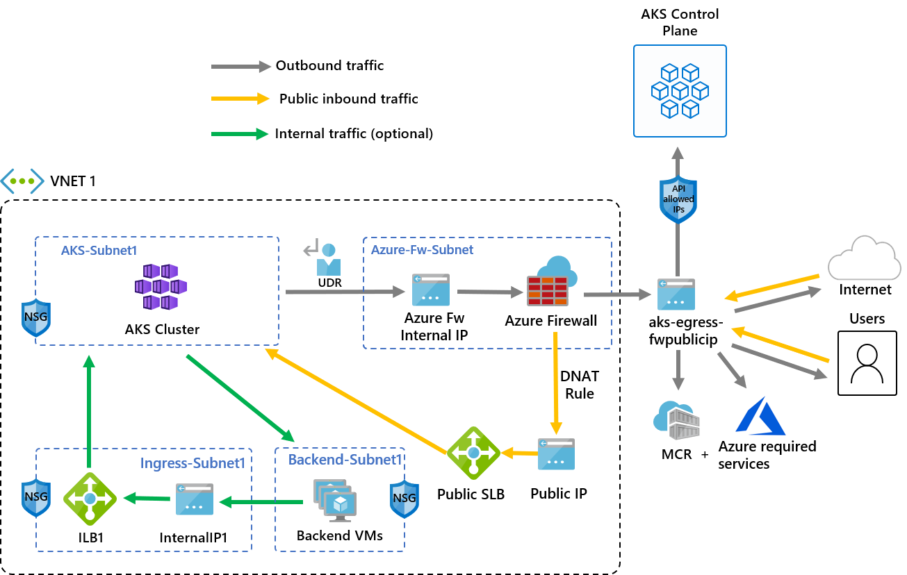

# Limit network traffic with Azure Firewall in Azure Kubernetes Service (AKS)

This article shows you how to use the [outbound network and fully qualified domain name (FQDN) rules for AKS clusters][outbound-fqdn-rules] to control egress traffic using Azure Firewall. To simplify this configuration, Azure Firewall provides an Azure Kubernetes Service (`AzureKubernetesService`) FQDN tag that restricts outbound traffic from the AKS cluster.

:::zone pivot="terraform"

## Prerequisites

- An Azure account with an active subscription. If you don't have one, create a [free account](https://azure.microsoft.com/free/) before you begin.
- [Install and configure Terraform][terraform-install-configure].
- Azure CLI installed and signed in with `az login`, used to verify the deployment. [Install Azure CLI][install-azurecli] if you don't already have it.
- `kubectl` installed to connect to the cluster. If you use Azure Cloud Shell, `kubectl` is already installed. To install it locally, use the [`az aks install-cli`][az-aks-installcli] command.

:::zone-end

## Firewall frontend IP requirements

- **Production starting point**: Plan for at least 20 frontend IPs on Azure Firewall, and size the configuration for your workload to avoid source network address translation (SNAT) port exhaustion.
- **High-traffic clusters**: If your cluster creates many outbound connections to the same destinations, you might need more frontend IPs or [Azure Firewall integration with NAT Gateway](/azure/firewall/integrate-with-nat-gateway) to increase SNAT capacity.
- **API server protection**: Add the firewall's public frontend IP to [API server authorized IP ranges](./api-server-authorized-ip-ranges.md) for enhanced security
- **Developer access**: When using authorized IP ranges, either use a jumpbox in the firewall's virtual network (VNet) or add developer endpoint IPs to the authorized range

This guidance applies throughout the configuration process described in this article.

> [!NOTE]
>
> The FQDN tag contains all the FQDNs listed in [outbound network and FQDN rules for AKS clusters][outbound-fqdn-rules] and is automatically updated.

## Architecture overview

The following diagram illustrates the architecture of an AKS cluster with restricted egress traffic using Azure Firewall:



The diagram shows AKS agent nodes in a dedicated subnet routing outbound traffic through Azure Firewall by using a UDR. For inbound traffic, a DNAT rule translates the firewall public IP address to the public load balancer frontend IP address.

Key components of this architecture include:

- **Public ingress is forced to flow through firewall filters**:
  - AKS agent nodes are isolated in a dedicated subnet.
  - [Azure Firewall](/azure/firewall/overview) is deployed in its own subnet.
  - A DNAT rule translates the firewall public IP into the load balancer frontend IP.
- **Outbound requests start from agent nodes to the Azure Firewall private IP using a [user-defined route (UDR)](egress-outboundtype.md)**:
  - Requests from AKS agent nodes follow a UDR that has been placed on the subnet the AKS cluster was deployed into.
  - Azure Firewall egresses out of the VNet from a public IP frontend.
  - Access to the public internet or other Azure services flows to and from the firewall frontend IP address.
  - You can protect access to the AKS control plane using [API server authorized IP ranges](./api-server-authorized-ip-ranges.md), including the firewall public frontend IP address.
- **Internal traffic**:
  - You can use an [internal load balancer](internal-lb.md) for internal traffic, which you could isolate on its own subnet, instead of or alongside a [public load balancer](load-balancer-standard.md).

:::zone pivot="system,user"

## Configure environment variables

The following table lists the environment variables used in this article. Set these variables in your shell before proceeding, or modify the commands to use your own values.

| Variable | Description | Example value |
| -------- | ----------- | ------------- |
| `RESOURCE_GROUP` | Name of the resource group | `aks-egress-rg` |
| `LOCATION` | Azure region for resources | `eastus` |
| `CLUSTER_NAME` | Name of the AKS cluster | `aks-egress` |
| `VNET_NAME` | Name of the virtual network | `aks-egress-vnet` |
| `AKS_SUBNET_NAME` | Name of the subnet for AKS | `aks-subnet` |
| `FW_SUBNET_NAME` | Name of the subnet for Azure Firewall | `AzureFirewallSubnet` |
| `FW_NAME` | Name of the Azure Firewall | `aks-egress-fw` |
| `FW_PUBLICIP_NAME` | Name of the public IP for Azure Firewall | `aks-egress-fwpublicip` |
| `FW_IPCONFIG_NAME` | Name of the IP configuration for Azure Firewall | `aks-egress-fwconfig` |
| `FW_ROUTE_TABLE_NAME` | Name of the route table for Azure Firewall | `aks-egress-fwrt` |
| `FW_ROUTE_NAME_1` | Name of the route for Azure Firewall | `aks-egress-fwrn` |
| `FW_ROUTE_NAME_2` | Name of the internet route for Azure Firewall | `aks-egress-fwrn-internet` |

## Create a resource group

- Create a resource group using the [`az group create`][az-group-create] command.

    ```azurecli-interactive
    az group create --name $RESOURCE_GROUP --location $LOCATION
    ```

## Create a virtual network with multiple subnets

Provision a VNet with two separate subnets: one for the cluster and one for the firewall. Optionally, you can create one for internal service ingress. The following diagram illustrates the empty network topology before deploying any resources:


The diagram shows the VNet with separate subnets for AKS and Azure Firewall before resources are deployed.

1. Create a VNet using the [`az network vnet create`][az-network-vnet-create] command.

    ```azurecli-interactive
    az network vnet create \
        --resource-group $RESOURCE_GROUP \
        --name $VNET_NAME \
        --location $LOCATION \
        --address-prefixes 10.42.0.0/16 \
        --subnet-name $AKS_SUBNET_NAME \
        --subnet-prefix 10.42.1.0/24
    ```

1. Create a subnet for Azure Firewall using the [`az network vnet subnet create`][az-network-vnet-subnet-create] command.

    ```azurecli-interactive
    # Dedicated subnet for Azure Firewall (subnet must be named "AzureFirewallSubnet")
    az network vnet subnet create \
        --resource-group $RESOURCE_GROUP \
        --vnet-name $VNET_NAME \
        --name $FW_SUBNET_NAME \
        --address-prefix 10.42.2.0/24
    ```

## Create a public IP for Azure Firewall

- Create a standard SKU public IP resource using the [`az network public-ip create`][az-network-public-ip-create] command. Use this resource as the frontend IP address for the Azure Firewall. The single-IP configuration in this article is intended for testing. For production, use the [firewall frontend IP requirements](#firewall-frontend-ip-requirements) to plan SNAT capacity for your workload.

    ```azurecli-interactive
    az network public-ip create --resource-group $RESOURCE_GROUP --name $FW_PUBLICIP_NAME --location $LOCATION --sku "Standard"
    ```

## Install the Azure Firewall CLI extension

- Register the [Azure Firewall CLI extension](https://github.com/Azure/azure-cli-extensions/tree/main/src/azure-firewall) to create an Azure Firewall using the [`az extension add`][az-extension-add] command.

    ```azurecli-interactive
    az extension add --name azure-firewall
    ```

## Create an Azure Firewall and enable DNS proxy

> [!NOTE]
> For high-traffic scenarios, see the [firewall frontend IP requirements](#firewall-frontend-ip-requirements) section.
>
> For more information on how to create an Azure Firewall with multiple IPs, see [Create an Azure Firewall with multiple public IP addresses using Bicep](/azure/firewall/quick-create-multiple-ip-bicep).


The diagram shows Azure Firewall deployed in its subnet, with a UDR directing traffic from the AKS subnet to the firewall private IP address.

- Create an Azure Firewall and enable DNS proxy using the [`az network firewall create`][az-network-firewall-create] command with `--enable-dns-proxy` set to `true`.

    ```azurecli-interactive
    az network firewall create --resource-group $RESOURCE_GROUP --name $FW_NAME --location $LOCATION --enable-dns-proxy true
    ```

  Setting up the public IP address to the Azure Firewall might take a few minutes. Once it's ready, you can assign the IP address to the firewall front end.

  > [!NOTE]
  >
  > To use FQDN on network rules, you need DNS proxy enabled. When DNS proxy is enabled, the firewall listens on port 53 and forwards DNS requests to the DNS server you specify. This setting allows the firewall to automatically translate the FQDN.

## Create an IP configuration for Azure Firewall

- Create an Azure Firewall IP configuration using the [`az network firewall ip-config create`][az-network-firewall-ip-config-create] command.

    ```azurecli-interactive
    az network firewall ip-config create --resource-group $RESOURCE_GROUP --firewall-name $FW_NAME --name $FW_IPCONFIG_NAME --public-ip-address $FW_PUBLICIP_NAME --vnet-name $VNET_NAME
    ```

## Get the Azure Firewall IP addresses

- Save the public and private firewall frontend IP addresses for configuration later using the following commands:

    ```azurecli-interactive
    export FW_PUBLIC_IP=$(az network public-ip show --resource-group $RESOURCE_GROUP --name $FW_PUBLICIP_NAME --query "ipAddress" -o tsv)
    export FW_PRIVATE_IP=$(az network firewall show --resource-group $RESOURCE_GROUP --name $FW_NAME --query "ipConfigurations[0].privateIPAddress" -o tsv)
    ```

    > [!NOTE]
    > For API server security, see the [firewall frontend IP requirements](#firewall-frontend-ip-requirements) section.

## Configure the virtual network to use Azure Firewall as its DNS server

- Configure the virtual network to use the Azure Firewall private IP address as its DNS server by using the [`az network vnet update`][az-network-vnet-update] command. This configuration ensures that the AKS nodes and Azure Firewall resolve the destination FQDNs in the network rules consistently.

    ```azurecli-interactive
    az network vnet update \
        --resource-group $RESOURCE_GROUP \
        --name $VNET_NAME \
        --dns-servers $FW_PRIVATE_IP
    ```

:::zone-end

## UDR requirements for AKS egress through Azure Firewall

Azure automatically routes traffic between Azure subnets, VNets, and on-premises networks. To modify default routing, create a route table with the following requirements:

| Category | Requirement | Value or description |
| -------- | ----------- | -------------------- |
| Route parameter | Destination | `0.0.0.0/0` (all traffic) |
| Route parameter | Next hop type | Network virtual appliance (NVA) |
| Route parameter | Next hop IP | Azure Firewall private IP address |
| Route parameter | Association | One route table per subnet (_zero_ or _one_ allowed) |
| UDR constraint | Default internet route | `0.0.0.0/0` already exists but requires a public IP address for SNAT. |
| UDR constraint | Next hop | The route must point to a gateway or NVA, not directly to the internet. |
| UDR constraint | AKS validation | AKS validates the route configuration and prevents direct internet routes. |
| UDR constraint | Route table limit | Each subnet supports a maximum of _one_ associated route table. |
| Outbound type impact | UDR (`userDefinedRouting`) | No load balancer public IP address is created for outbound requests. |
| Outbound type impact | Load balancer public IP address | Created only for inbound requests that use a `LoadBalancer` service. |
| Outbound type impact | SNAT configuration | Requires a properly configured public IP address for outbound connectivity. |

For more information, see [Outbound rules for Azure Load Balancer](/azure/load-balancer/outbound-rules#scenario6out).

:::zone pivot="system,user"

## Create a route with a hop to Azure Firewall

1. Create an empty route table using the [`az network route-table create`][az-network-route-table-create] command. The route table defines the Azure Firewall as the next hop. Each subnet can have _zero_ or _one_ route table associated to it.

    ```azurecli-interactive
    az network route-table create --resource-group $RESOURCE_GROUP --location $LOCATION --name $FW_ROUTE_TABLE_NAME
    ```

1. Create routes in the route table for the subnets using the [`az network route-table route create`][az-network-route-table-route-create] command.

    ```azurecli-interactive
    az network route-table route create --resource-group $RESOURCE_GROUP --name $FW_ROUTE_NAME_1 --route-table-name $FW_ROUTE_TABLE_NAME --address-prefix 0.0.0.0/0 --next-hop-type VirtualAppliance --next-hop-ip-address $FW_PRIVATE_IP

    az network route-table route create --resource-group $RESOURCE_GROUP --name $FW_ROUTE_NAME_2 --route-table-name $FW_ROUTE_TABLE_NAME --address-prefix $FW_PUBLIC_IP/32 --next-hop-type Internet
    ```

For information on how to override Azure's default system routes or add more routes to a subnet's route table, see the [Virtual network route table documentation](/azure/virtual-network/virtual-networks-udr-overview#user-defined).

:::zone-end

## Required outbound rules for AKS egress through Azure Firewall

> [!NOTE]
>
> For applications outside of the `kube-system` or `gatekeeper-system` namespaces that need to talk to the API server, an extra network rule to allow TCP communication to port 443 for the API server IP in addition to adding application rule for `fqdn-tag` of `AzureKubernetesService` is required.

The following network rules allow the egress traffic used in this article:

- The first and second network rules allow access to pull containers from GitHub Container Registry (`ghcr.io`) and Docker Hub (`docker.io`).

AKS clusters that use the konnectivity agent, including the cluster created in this article, don't require outbound access on TCP port 9000 or UDP port 1194. Nodes provisioned after March 2021 also don't require outbound NTP access on UDP port 123. For the rules required by other cluster configurations and Azure clouds, see [outbound network and FQDN rules for AKS clusters][outbound-fqdn-rules].

:::zone pivot="system,user"

## Create network rules on Azure Firewall

- Create the network rules using the following [`az network firewall network-rule create`][az-network-firewall-network-rule-create] commands.

    ```azurecli-interactive
    az network firewall network-rule create --resource-group $RESOURCE_GROUP --firewall-name $FW_NAME --collection-name 'aksfwnr' --name 'ghcr' --protocols 'TCP' --source-addresses '*' --destination-fqdns ghcr.io pkg-containers.githubusercontent.com --destination-ports '443' --action allow --priority 100

    az network firewall network-rule create --resource-group $RESOURCE_GROUP --firewall-name $FW_NAME --collection-name 'aksfwnr' --name 'docker' --protocols 'TCP' --source-addresses '*' --destination-fqdns docker.io registry-1.docker.io production.cloudflare.docker.com --destination-ports '443'
    ```

## Create application rules on Azure Firewall

- Create the application rule using the [`az network firewall application-rule create`][az-network-firewall-application-rule-create] command.

    ```azurecli-interactive
    az network firewall application-rule create --resource-group $RESOURCE_GROUP --firewall-name $FW_NAME --collection-name 'aksfwar' --name 'fqdn' --source-addresses '*' --protocols 'http=80' 'https=443' --fqdn-tags "AzureKubernetesService" --action allow --priority 100
    ```

To learn more about Azure Firewall, see the [Azure Firewall documentation](/azure/firewall/overview).

## Associate the route table to AKS

To associate the cluster with the firewall, the dedicated subnet for the cluster's subnet must reference the route table.

- Associate the route table to AKS using the [`az network vnet subnet update`][az-network-vnet-subnet-update] command.

    ```azurecli-interactive
    az network vnet subnet update --resource-group $RESOURCE_GROUP --vnet-name $VNET_NAME --name $AKS_SUBNET_NAME --route-table $FW_ROUTE_TABLE_NAME
    ```

## Deploy an AKS cluster that follows your outbound rules

You can now deploy an AKS cluster into the existing VNet. You use the [`userDefinedRouting` outbound type](egress-outboundtype.md), which ensures that any outbound traffic is forced through the firewall and no other egress paths exist. You can also use the [`loadBalancer` outbound type](egress-outboundtype.md#outbound-type-of-loadbalancer).


The diagram shows the AKS cluster deployed in the existing VNet, with outbound traffic routed through Azure Firewall by using the UDR.

- Set an environment variable for the subnet ID of the target subnet using the following command:

    ```azurecli-interactive
    SUBNET_ID=$(az network vnet subnet show --resource-group $RESOURCE_GROUP --vnet-name $VNET_NAME --name $AKS_SUBNET_NAME --query id -o tsv)
    ```

You define the outbound type to use the UDR that already exists on the subnet. This configuration enables AKS to skip the setup and IP provisioning for the load balancer.

> [!TIP]
> You can add extra features to the cluster deployment, such as [**private clusters**](private-clusters.md).
>
> For API server authorized IP ranges setup and developer access considerations, see the [firewall frontend IP requirements](#firewall-frontend-ip-requirements) section.

:::zone-end

---

:::zone pivot="system"

## Create an AKS cluster with a system-assigned control plane identity

> [!NOTE]
> This cluster uses a system-assigned control plane identity. AKS creates a user-assigned kubelet identity in the node resource group if you don't [specify your own kubelet managed identity][Use a pre-created kubelet managed identity].
>
> For user-defined routing, system-assigned identity only supports the CNI network plugin.

- Create an AKS cluster using a system-assigned managed identity with the CNI network plugin using the [`az aks create`][az-aks-create] command.

    ```azurecli-interactive
    az aks create --resource-group $RESOURCE_GROUP --name $CLUSTER_NAME --location $LOCATION \
        --node-count 3 \
        --network-plugin azure \
        --outbound-type userDefinedRouting \
        --vnet-subnet-id $SUBNET_ID \
        --api-server-authorized-ip-ranges $FW_PUBLIC_IP \
        --generate-ssh-keys
    ```

:::zone-end

:::zone pivot="user"

## Create user-assigned managed identities

If you don't have user-assigned identities, follow the steps in this section. If you already have user-assigned identities, skip to [Create an AKS cluster with user-assigned identities](#create-an-aks-cluster-with-user-assigned-identities).

1. Create a managed identity using the [`az identity create`][az-identity-create] command.

    ```azurecli-interactive
    az identity create --name myIdentity --resource-group $RESOURCE_GROUP
    ```

    The output should resemble the following example output:

    ```json
     {
       ...
       "id": "/subscriptions/<subscriptionid>/resourcegroups/aks-egress-rg/providers/Microsoft.ManagedIdentity/userAssignedIdentities/myIdentity",
       "location": "eastus",
       "name": "myIdentity",
       ...
       "type": "Microsoft.ManagedIdentity/userAssignedIdentities"
     }
    ```

1. Create a kubelet managed identity using the [`az identity create`][az-identity-create] command.

    ```azurecli-interactive
    az identity create --name myKubeletIdentity --resource-group $RESOURCE_GROUP
    ```

    The output should resemble the following example output:

    ```json
    {
      ...
      "id": "/subscriptions/<subscriptionid>/resourcegroups/aks-egress-rg/providers/Microsoft.ManagedIdentity/userAssignedIdentities/myKubeletIdentity",
      "location": "eastus",
      "name": "myKubeletIdentity",
      ...
      "resourceGroup": "aks-egress-rg",
      ...
      "type": "Microsoft.ManagedIdentity/userAssignedIdentities"
    }
    ```

  > [!NOTE]
  > If you create your own VNet and route table where the resources are outside of the worker node resource group, the CLI automatically adds the role assignment. If you're using an ARM template or other method, you need to use the principal ID of the cluster managed identity to perform a [role assignment][add role to identity].

## Create an AKS cluster with user-assigned identities

- Create an AKS cluster with your existing user-assigned managed identities in the subnet using the [`az aks create`][az-aks-create] command. Provide the resource ID of the managed identity for the control plane and the resource ID of the kubelet identity.

    ```azurecli-interactive
    az aks create \
        --resource-group $RESOURCE_GROUP \
        --name $CLUSTER_NAME \
        --location $LOCATION \
        --node-count 3 \
        --network-plugin azure \
        --network-plugin-mode overlay \
        --outbound-type userDefinedRouting \
        --vnet-subnet-id $SUBNET_ID \
        --api-server-authorized-ip-ranges $FW_PUBLIC_IP \
        --assign-identity <identity-resource-id> \
        --assign-kubelet-identity <kubelet-identity-resource-id> \
        --generate-ssh-keys
    ```

:::zone-end

:::zone pivot="terraform"

## Review the Terraform code

> [!NOTE]
> The sample code for this article is in the [Azure Terraform GitHub repository][terraform-sample]. You can view the [test results log for current and previous versions of Terraform][terraform-sample-testrecord].
>
> See more [articles and sample code showing how to use Terraform to manage Azure resources](/azure/terraform).

The Terraform sample deploys the following resources:

- An **Azure virtual network** with two subnets: one for the AKS cluster nodes, and a dedicated `AzureFirewallSubnet` for Azure Firewall.
- A **standard SKU public IP address** and an **Azure Firewall** (`AZFW_VNet` SKU, `Standard` tier) that uses an **Azure Firewall Policy** with DNS proxy enabled.
- A **firewall policy rule collection group** that contains the network and application rules required for AKS egress: network rules for the API server ports (TCP/9000, UDP/1194), NTP (`ntp.ubuntu.com` on UDP/123), GitHub Container Registry, and Docker Hub, plus an application rule that uses the `AzureKubernetesService` FQDN tag on ports 80 and 443.
- A **route table** with a default route (`0.0.0.0/0`) that points to the firewall's private IP address as a virtual appliance next hop, and a route that sends the firewall's own public IP address directly to the internet to avoid asymmetric routing. The route table is associated with the AKS subnet only.
- An **AKS cluster** that uses a system-assigned managed identity, the `azure` network plugin, the `userDefinedRouting` outbound type, and `api_server_access_profile.authorized_ip_ranges` restricted to the firewall's public IP address.
- A **role assignment** that grants the AKS cluster's managed identity the `Network Contributor` role on the resource group, so the cluster can manage the networking resources it depends on.

The sample doesn't create a demo workload, a DNAT rule, or a load balancer service. After you verify the cluster, use `kubectl` to deploy your own application, and then follow the guidance earlier in this article to add a DNAT rule on Azure Firewall if you need inbound connectivity.

1. Create a directory to test the sample Terraform code, and make it the current directory.
1. Create a file named `main.tf` and insert the following code:

    [!code-terraform[master](~/terraform_samples/quickstart/101-aks-network-traffic/main.tf)]

## Initialize Terraform

Run [`terraform init`](https://developer.hashicorp.com/terraform/cli/commands/init) to initialize the Terraform deployment. This command downloads the `azurerm` provider required to manage your Azure resources.

```console
terraform init -upgrade
```

## Format and validate the configuration

Run [`terraform fmt`](https://developer.hashicorp.com/terraform/cli/commands/fmt) to format the configuration file, and [`terraform validate`](https://developer.hashicorp.com/terraform/cli/commands/validate) to confirm the configuration is syntactically valid.

```console
terraform fmt
terraform validate
```

## Create a Terraform execution plan

Run [`terraform plan`](https://developer.hashicorp.com/terraform/cli/commands/plan) to create an execution plan.

```console
terraform plan -out main.tfplan
```

## Apply a Terraform execution plan

Run [`terraform apply`](https://developer.hashicorp.com/terraform/cli/commands/apply) to apply the execution plan to your Azure subscription.

```console
terraform apply main.tfplan
```

Creating the virtual network, Azure Firewall, and AKS cluster takes several minutes to complete.

## Verify egress, firewall, and route configuration

1. Get the resource group name, cluster name, and firewall public IP address from the Terraform outputs.

    ```console
    RESOURCE_GROUP=$(terraform output -raw resource_group_name)
    CLUSTER_NAME=$(terraform output -raw aks_cluster_name)
    FW_PUBLIC_IP=$(terraform output -raw firewall_public_ip)
    ```

1. Confirm the cluster uses the `userDefinedRouting` outbound type and is restricted to the firewall's public IP address by using the [`az aks show`][az-aks-show] command.

    ```azurecli-interactive
    az aks show --resource-group $RESOURCE_GROUP --name $CLUSTER_NAME --query "{outboundType:networkProfile.outboundType, authorizedIpRanges:apiServerAccessProfile.authorizedIpRanges}"
    ```

1. Confirm the AKS subnet's route table sends default traffic to the firewall's private IP address. Get the route table name by using the [`az network route-table list`][az-network-route-table-list] command, and then list its routes by using the [`az network route-table route list`][az-network-route-table-route-list] command.

    ```azurecli-interactive
    ROUTE_TABLE_NAME=$(az network route-table list --resource-group $RESOURCE_GROUP --query "[0].name" -o tsv)
    az network route-table route list --resource-group $RESOURCE_GROUP --route-table-name $ROUTE_TABLE_NAME --output table
    ```

1. Confirm the network and application rules are in place. Get the firewall policy name by using the [`az network firewall policy list`][az-network-firewall-policy-list] command, and then show the rule collection group by using the [`az network firewall policy rule-collection-group show`][az-network-firewall-policy-rule-collection-group-show] command.

    ```azurecli-interactive
    FW_POLICY_NAME=$(az network firewall policy list --resource-group $RESOURCE_GROUP --query "[0].name" -o tsv)
    az network firewall policy rule-collection-group show --resource-group $RESOURCE_GROUP --policy-name $FW_POLICY_NAME --name aks-egress-rules --query "ruleCollections[].name" -o tsv
    ```

## Connect to the cluster

Configure `kubectl` to connect to your cluster by using the [`az aks get-credentials`][az-aks-get-credentials] command, and then verify the connection by using the [`kubectl get nodes`][kubectl-get] command.

```azurecli-interactive
az aks get-credentials --resource-group $RESOURCE_GROUP --name $CLUSTER_NAME
kubectl get nodes
```

Outbound traffic from the cluster now routes through Azure Firewall. The firewall policy allows the required AKS endpoints and blocks all other outbound connections by default.

:::zone-end

:::zone pivot="system,user"

## Enable developer access to the API server

If you used authorized IP ranges for your cluster in the previous step, you need to add your developer tooling IP addresses to the AKS cluster list of approved IP ranges so you access the API server from there. You can also configure a jumpbox with the needed tooling inside a separate subnet in the firewall's VNet.

1. Retrieve your IP address using the following command:

    ```bash
    CURRENT_IP=$(dig @resolver1.opendns.com ANY myip.opendns.com +short)
    ```

1. Add the IP address to the approved ranges by using the [`az aks update`][az-aks-update] command. The `--api-server-authorized-ip-ranges` option replaces the current list, so include the firewall public IP address when you add the developer IP address.

    ```azurecli-interactive
    az aks update --resource-group $RESOURCE_GROUP --name $CLUSTER_NAME --api-server-authorized-ip-ranges $FW_PUBLIC_IP,$CURRENT_IP/32
    ```

## Connect to the AKS cluster

- Configure `kubectl` to connect to your AKS cluster using the [`az aks get-credentials`][az-aks-get-credentials] command.

    ```azurecli-interactive
    az aks get-credentials --resource-group $RESOURCE_GROUP --name $CLUSTER_NAME
    ```

## Deploy a public service on AKS

You can now start exposing services and deploying applications to this cluster. This example exposes a public service, but you also might want to expose an internal service using an [internal load balancer](internal-lb.md).


The diagram shows inbound public traffic arriving at the firewall public IP address, being translated by the DNAT rule, and being forwarded to the public load balancer frontend IP address for the AKS service.

1. Review the [AKS Store Demo quickstart](https://github.com/Azure-Samples/aks-store-demo/blob/main/aks-store-quickstart.yaml) manifest to understand the deployed components.
1. Deploy the service by using the [`kubectl apply`][kubectl-apply] command.

   ```bash
   kubectl apply -f https://raw.githubusercontent.com/Azure-Samples/aks-store-demo/main/aks-store-quickstart.yaml
   ```

## Get the load balancer public frontend IP

1. Get the public frontend IP address assigned to the load balancer by using the [`kubectl get services`][kubectl-get] command.

   ```bash
   kubectl get services
   ```

   The IP address should be listed in the `EXTERNAL-IP` column, as shown in the following example output:

   ```output
   NAME              TYPE           CLUSTER-IP     EXTERNAL-IP   PORT(S)              AGE
   kubernetes        ClusterIP      10.0.0.1       <none>        443/TCP              9m10s
   order-service     ClusterIP      10.0.104.144   <none>        3000/TCP             11s
   product-service   ClusterIP      10.0.237.60    <none>        3002/TCP             10s
   rabbitmq          ClusterIP      10.0.161.128   <none>        5672/TCP,15672/TCP   11s
   store-front       LoadBalancer   10.0.89.139    20.39.18.6    80:32271/TCP         10s
   ```

1. Save the public load balancer frontend IP address by using the `kubectl get svc store-front` command.

   ```bash
   SERVICE_IP=$(kubectl get svc store-front -o jsonpath='{.status.loadBalancer.ingress[*].ip}')
   ```

## Create a DNAT rule on Azure Firewall

> [!IMPORTANT]
>
> When you use Azure Firewall to restrict egress traffic and create a UDR to force all egress traffic, ensure you create an appropriate DNAT rule in Azure Firewall to correctly allow ingress traffic. Using Azure Firewall with a UDR breaks the ingress setup due to asymmetric routing. The issue occurs if the AKS subnet has a default route that goes to the firewall's private IP address, but you're using a public load balancer - ingress or Kubernetes service of type `loadBalancer`. In this case, the incoming load balancer traffic is received via its public IP address, but the return path goes through the firewall's private IP address. Because Azure Firewall is stateful, it drops the returning packet because Azure Firewall isn't aware of an established session. To learn how to integrate Azure Firewall with your ingress or service load balancer, see [Integrate Azure Firewall with Azure Standard Load Balancer](/azure/firewall/integrate-lb).

To configure inbound connectivity, create a DNAT rule on Azure Firewall. To test connectivity to your cluster, the rule translates the firewall frontend public IP address to the public load balancer frontend IP address saved in `$SERVICE_IP`. You can customize the destination address. The translated port must be the exposed port for your Kubernetes service. For a topology that uses a private frontend IP address instead, configure an [internal load balancer](internal-lb.md) and use its private IP address as the translated address.

- Add the NAT rule using the [`az network firewall nat-rule create`][az-network-firewall-nat-rule-create] command.

   ```azurecli-interactive
   az network firewall nat-rule create --collection-name exampleset --destination-addresses $FW_PUBLIC_IP --destination-ports 80 --firewall-name $FW_NAME --name inboundrule --protocols Any --resource-group $RESOURCE_GROUP --source-addresses '*' --translated-port 80 --action Dnat --priority 100 --translated-address $SERVICE_IP
   ```

## Validate connectivity

- Navigate to the Azure Firewall frontend IP address in a browser to validate connectivity. You should see the AKS store app. In this example, the firewall public IP was `52.253.228.132`:

    :::image type="content" source="./media/container-service-kubernetes-tutorials/aks-store-application.png" alt-text="Screenshot showing the Azure Store Front App opened in a local browser." lightbox="./media/container-service-kubernetes-tutorials/aks-store-application.png":::

    On this page, you can view products, add them to your cart, and then place an order.

:::zone-end

## Clean up resources

If you no longer need the resources created in this article, you can delete them to avoid incurring future costs.

:::zone pivot="system,user"

- Delete the AKS resource group using the [`az group delete`][az-group-delete] command.

    ```azurecli-interactive
    az group delete --name $RESOURCE_GROUP
    ```

:::zone-end

:::zone pivot="terraform"

Azure Firewall bills hourly whether or not it's actively processing traffic, in addition to data processing charges. Don't leave the firewall (or the rest of this sample) running longer than you need.

> [!WARNING]
> If you're working with existing or production resources in the same working directory, review the execution plan carefully before you destroy. Running `terraform destroy` removes every resource tracked in the Terraform state file for this configuration, including the virtual network, subnets, Azure Firewall, firewall policy and rules, route table, AKS cluster, and the role assignment. Avoid running it against shared infrastructure unless you're certain it's safe to remove.

Run [`terraform plan`](https://developer.hashicorp.com/terraform/cli/commands/plan) with the `-destroy` flag to review what Terraform removes.

```console
terraform plan -destroy -out main.destroy.tfplan
```

Run [`terraform apply`](https://developer.hashicorp.com/terraform/cli/commands/apply) to apply the destroy plan and remove all resources created by this sample, including Azure Firewall.

```console
terraform apply main.destroy.tfplan
```

:::zone-end

## Related content

- [Configure Static Egress Gateway in Azure Kubernetes Service (AKS)](./configure-static-egress-gateway.md)
- [Deploy egress gateways for Istio service mesh add-on for Azure Kubernetes Service (AKS)](./istio-deploy-egress.md)

<!-- LINKS - internal -->
[az-group-create]: /cli/azure/group#az-group-create
[outbound-fqdn-rules]: ./outbound-rules-control-egress.md
[az-network-vnet-create]: /cli/azure/network/vnet#az-network-vnet-create
[az-network-vnet-update]: /cli/azure/network/vnet#az-network-vnet-update
[az-network-vnet-subnet-create]: /cli/azure/network/vnet/subnet#az-network-vnet-subnet-create
[az-network-vnet-subnet-update]: /cli/azure/network/vnet/subnet#az-network-vnet-subnet-update
[az-network-public-ip-create]: /cli/azure/network/public-ip#az-network-public-ip-create
[az-extension-add]: /cli/azure/extension#az-extension-add
[az-network-firewall-create]: /cli/azure/network/firewall#az-network-firewall-create
[az-network-firewall-ip-config-create]: /cli/azure/network/firewall/ip-config#az-network-firewall-ip-config-create
[az-network-route-table-create]: /cli/azure/network/route-table#az-network-route-table-create
[az-network-route-table-route-create]: /cli/azure/network/route-table/route#az-network-route-table-route-create
[az-network-firewall-network-rule-create]: /cli/azure/network/firewall/network-rule#az-network-firewall-network-rule-create
[az-network-firewall-application-rule-create]: /cli/azure/network/firewall/application-rule#az-network-firewall-application-rule-create
[az-aks-create]: /cli/azure/aks#az-aks-create
[az-aks-update]: /cli/azure/aks#az-aks-update
[az-network-firewall-nat-rule-create]: /cli/azure/network/firewall/nat-rule#az-network-firewall-nat-rule-create
[az-group-delete]: /cli/azure/group#az-group-delete
[add role to identity]: use-managed-identity.md#add-a-role-assignment-for-a-system-assigned-managed-identity
[Use a pre-created kubelet managed identity]: use-managed-identity.md#create-a-kubelet-managed-identity
[az-identity-create]: /cli/azure/identity#az_identity_create
[az-aks-get-credentials]: /cli/azure/aks#az_aks_get_credentials
[az-aks-show]: /cli/azure/aks#az-aks-show
[az-aks-installcli]: /cli/azure/aks#az-aks-install-cli
[az-network-route-table-list]: /cli/azure/network/route-table#az-network-route-table-list
[az-network-route-table-route-list]: /cli/azure/network/route-table/route#az-network-route-table-route-list
[az-network-firewall-policy-list]: /cli/azure/network/firewall/policy#az-network-firewall-policy-list
[az-network-firewall-policy-rule-collection-group-show]: /cli/azure/network/firewall/policy/rule-collection-group#az-network-firewall-policy-rule-collection-group-show
[install-azurecli]: /cli/azure/install-azure-cli
[terraform-install-configure]: /azure/developer/terraform/quickstart-configure
[kubectl-apply]: https://kubernetes.io/docs/reference/kubectl/generated/kubectl_apply/
[kubectl-get]: https://kubernetes.io/docs/reference/kubectl/generated/kubectl_get/
[terraform-sample]: https://github.com/Azure/terraform/tree/master/quickstart/101-aks-network-traffic
[terraform-sample-testrecord]: https://github.com/Azure/terraform/blob/master/quickstart/101-aks-network-traffic/TestRecord.md
