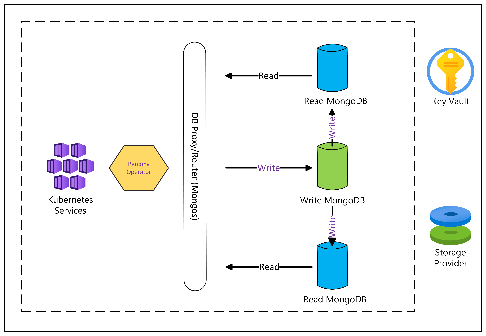

# Deploy a MongoDB cluster on Azure Kubernetes Service (AKS)

This article walks through prerequisite information for deploying a MongoDB cluster on [AKS](what-is-aks.md) and provides an overview of the deployment strategy.

[!INCLUDE [open source disclaimer](./includes/open-source-disclaimer.md)]
## What is MongoDB?

[MongoDB](https://www.mongodb.com/) is a popular NoSQL database management system designed to handle large volumes of unstructured data. Unlike traditional relational databases that use tables and rows, MongoDB uses a flexible, document-oriented approach.

> [!NOTE]
> MongoDB Community Edition isn't open-source software and is licensed under the [Server Side Public License](https://en.wikipedia.org/wiki/Server_Side_Public_License) with "source available."

### MongoDB sharded cluster

A [MongoDB sharded cluster](https://www.mongodb.com/docs/manual/core/sharded-cluster-components/) is designed to handle large datasets and high throughput by distributing data across multiple servers or shards. This architecture enables horizontal scaling, which is essential for applications with growing data and performance needs. 

Here’s a breakdown of its key components and how it works:

* **Shards**: [Shards](https://www.mongodb.com/docs/manual/core/sharded-cluster-shards/) are individual MongoDB instances that hold subsets of the data. Each shard is a replica set, or a group of MongoDB instances that replicate data among themselves, ensuring high availability and fault tolerance.
* **Config servers**: [Config servers](https://www.mongodb.com/docs/manual/core/sharded-cluster-config-servers/) store metadata and configuration settings for the sharded cluster. They keep track of the cluster’s data distribution and routing information. There are typically three config servers to provide redundancy.
* **Mongos instances**: [Mongos](https://www.mongodb.com/docs/manual/core/sharded-cluster-query-router/) is a routing service that directs client requests to the appropriate shard. It acts as an intermediary between the client and the shards, managing query routing and aggregating results from multiple shards.
* **Shard key**: When data is distributed across shards, it's based on a [shard key](https://www.mongodb.com/docs/manual/core/sharding-shard-key/), which is either a single indexed field or multiple fields in the documents. The shard key determines how data is partitioned among the shards. A well-chosen shard key ensures even data distribution and efficient querying.
* **Data distribution**: Data is distributed across shards based on the shard key. This distribution helps balance the load and manage large datasets effectively. MongoDB uses a [range-based](https://www.mongodb.com/docs/manual/core/ranged-sharding/) or [hash-based](https://www.mongodb.com/docs/manual/core/hashed-sharding/) sharding strategy depending on the shard key.
* **High availability**: Each shard is a replica set, meaning it replicates its data across multiple nodes. This setup ensures that data remains available even if one or more nodes fail.

### What is the Percona Operator for MongoDB?

The Percona Operator for MongoDB is an open-source tool developed by [Percona](https://www.percona.com/) designed to automate the deployment, management, and scaling of MongoDB clusters within Kubernetes environments. It simplifies operations by handling tasks such as provisioning, scaling, backup, and recovery, all while ensuring high availability and performance of MongoDB clusters.

The operator uses Kubernetes Custom Resource Definitions (CRDs) to manage MongoDB configurations declaratively and handle failovers, monitoring, and alerts, which results in reduced administrative overhead and consistent management practices. Ideal for development, testing, and production scenarios, the Percona Operator enhances the efficiency and reliability of MongoDB deployments, particularly in cloud-native applications.

## MongoDB solution overview

We'll explain how to run MongoDB on AKS with high availability.

### Deployment strategy

* **Sharded cluster**: Sharding is enabled to distribute data across multiple shards, improving scalability and performance.
* **Configuration servers**: Managed by a three-member replica set to ensure fault tolerance and high availability, with anti-affinity rules to distribute these servers across different failure domains.
* **Mongos instances**: Three query routers handle client requests and are distributed across availability zones and exposed internally within the cluster for load balancing and resiliency.

This strategy ensures that the MongoDB cluster can handle large datasets and high-throughput operations effectively. It also maintains high availability and fault tolerance through the use of replica sets, anti-affinity rules, and proper resource allocation.

## Next steps

> [!div class="nextstepaction"]
> [Create the infrastructure resources for running a MongoDB cluster on AKS](./create-mongodb-infrastructure.md)