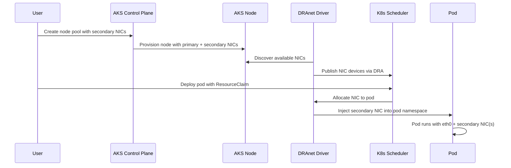

# Multi-NIC pods in Azure Kubernetes Service (AKS) (Preview)

By using multi-NIC pod support in Azure Kubernetes Service (AKS), you can attach one or more secondary network interfaces to pods running on your cluster, along with the standard CNI-assigned primary interface. This capability uses Kubernetes [Dynamic Resource Allocation (DRA)][dra-docs] and a managed [DRAnet network driver][dranet-docs], which automatically discover and inject secondary NICs into pods at runtime.

[!INCLUDE [preview features callout](~/reusable-content/ce-skilling/azure/includes/aks/includes/preview/preview-callout.md)]

## Overview

By default, every pod in an AKS cluster receives a single network interface (`eth0`) managed by the Azure CNI plugin. While this interface is sufficient for most workloads, certain scenarios require pods to have multiple network interfaces connected to different subnets or virtual networks.

Multi-NIC pod support addresses these scenarios by allowing you to:

- Provision AKS node pools with secondary network interfaces attached to each node.
- Use an AKS DRANET driver to automatically discover the secondary NICs on each node.
- Inject those secondary interfaces into pods at scheduling time through resource claims.

>[!Important]
> Secondary NICs with public IPs bypass the Azure Load Balancer and SNAT, so they expose workloads directly to the internet. AKS doesn't provide a default protection layer for this traffic. You must configure and maintain appropriate NSG and firewall rules to restrict inbound and outbound access.

## How it works

Multi-NIC pod support in AKS relies on three key components working together:

### 1. Secondary network interfaces configuration

When you create or update a node pool, specify one or more secondary network interfaces in the node pool's network profile. AKS provisions the nodes with these extra NICs attached, and each NIC connects to the subnet you specify.

```json
"networkProfile": {
    "secondaryNetworkInterfaces": [
        {
            "type": "Standard",
            "vnetSubnetId": "<subnet-resource-id>"
        }
    ]
}
```

### 2. Dynamic Resource Allocation (DRA)

[Dynamic Resource Allocation (DRA)][dra-docs] is a Kubernetes feature (GA in Kubernetes 1.34) that provides a framework for requesting and managing access to hardware resources. In the multi-NIC context, DRA manages the lifecycle of secondary network interfaces as allocatable devices.

The following DRA resources are used:

- **DeviceClass** — Defines a class of devices (secondary NICs) that the DRAnet driver publishes, with selectors to filter which devices match.
- **ResourceClaimTemplate** — A template that pods reference to request a specific number of NICs from a given device class.

### 3. Managed DRAnet network driver

The [DRAnet network driver][dranet-docs] runs as a DaemonSet on each node. It:

- Discovers all network interfaces on the node.
- Publishes available secondary NICs as DRA device resources.
- Handles the attachment and detachment of NICs to and from pod network namespaces at pod scheduling time.

### End-to-end flow



## Limitations

- **Kubernetes version** — Requires Kubernetes **1.34 or later** (for DRA GA support).
- **Virtual network scope** — All secondary NICs must connect to the same virtual network as the primary NIC. You can attach them to different subnets within that virtual network.
- **NIC assignment** — Each secondary NIC can be assigned to only one pod. You can't share a secondary NIC across multiple pods.
- DRANET supports **Linux node pools only**. Windows node pools aren't supported.
- **Network policies** are enforced only on the primary NIC. Traffic flowing through secondary NICs bypasses AKS network policy enforcement.
- **VM size** — The node pool VM size must support the total number of network interfaces (primary + secondary). To verify the maximum number of supported network interfaces and Accelerated Networking capabilities, see the Azure VM size documentation or use the `az vm list-skus` command. Here's an example: 


```bash
az vm list-skus \
  --location eastus \
  --resource-type virtualMachines \
  --all \
  --query "[?name=='Standard_D8s_v5'].{
      SKU:name,
      MaxNICs:capabilities[?name=='MaxNetworkInterfaces']|[0].value,
      AcceleratedNetworking:capabilities[?name=='AcceleratedNetworkingEnabled']|[0].value
  }" \
  -o table
```


## Next steps

- [Configure Multi-NIC Pods using AKS Managed DRANET (preview)](./configure-multiple-network-interfaces-for-pods.md)
- [Kubernetes Dynamic Resource Allocation documentation][dra-docs]

<!-- LINKS -->
[dra-docs]: https://kubernetes.io/docs/concepts/scheduling-eviction/dynamic-resource-allocation/
[dranet-docs]: https://github.com/kubernetes-sigs/dranet
[install-cli]: /cli/azure/install-azure-cli
