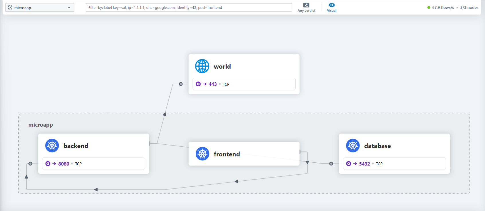

# Best practices for network policies in Azure Kubernetes Service (AKS)
Kubernetes, by default, operates as a flat network where all pods can communicate freely with each other. This unrestricted connectivity can be convenient for developers but poses significant security risks as applications scale. Imagine an organization deploying multiple microservices, each handling sensitive data, customer transactions, or backend operations. Without any restrictions, any compromised pod could potentially access unauthorized data or disrupt services.

To address these security concerns, [Network Policies in Kubernetes](https://kubernetes.io/docs/concepts/services-networking/network-policies/) allow administrators to control and restrict traffic between workloads. They provide a declarative way to enforce traffic rules, ensuring secure and controlled network behavior within a cluster.

## What is Kubernetes Network Policy?

A Network Policy in Kubernetes is a set of rules that control how pods communicate with each other and with external services. It provides fine-grained control over network traffic, allowing administrators to enforce security and segmentation at the namespace level.
By implementing Network Policies, you gain:

- **Stronger security posture**: Prevent unauthorized lateral movement within the cluster.
- **Compliance and governance**: Enforce regulatory requirements by controlling communication pathways.
- **Reduced blast radius**: Limit the impact of a compromised workload by restricting its network access.

Initially, Network Policies were designed to operate at Layer 3 (IP) and Layer 4 (TCP/UDP) of the OSI model, enabling basic control over pod-to-pod and external communications. However, advanced network policy engines like Cilium have extended Network Policies to Layer 7 (Application Layer), allowing deeper control over application traffic for modern cloud-native applications.

Network Policies are defined at the namespace level, meaning each policy applies to workloads within a specific namespace. The main components of a Network Policy include:

- **Pod selector**: Defines which pods the policy applies to based on labels.
- **Ingress rules**: Specify the allowed incoming connections.
- **Egress rules**: Specify the allowed outgoing connections.
- **Policy types**: Define whether the policy applies to ingress (incoming), egress (outgoing), or both.

## Foundations of building effective network policies

Building effective network policies in Kubernetes isn't just about writing YAML configurations—it requires a deep understanding of your application architecture, traffic patterns, and security requirements. Without a clear picture of how workloads communicate, enforcing security policies can lead to unintended disruptions or gaps in protection. The following sections cover how to systematically approach network policy design.

### Understanding your workload connectivity

Before implementing network policies, you need visibility into how workloads communicate with each other and external services. This step ensures that policies don’t inadvertently block critical traffic while effectively limiting unnecessary exposure.

- **Leverage Visibility Tools:** in addition to the network requirements provided by application team you can use tools like [Cilium Hubble](https://github.com/cilium/hubble), and [Retina](https://retina.sh/) help you analyze pod-to-pod traffic, identify which services need to communicate and define their ingress and egress dependencies. For example, a frontend might need to reach a backend API, but it shouldn’t talk directly to a database. Identify which services need to communicate and define their ingress and egress dependencies. For example, a frontend might need to reach a backend API, but it shouldn’t talk directly to a database.

- **The importance of labels in network policies:** Traditionally, network security policies have relied on static IP addresses to define traffic rules. This approach is problematic in Kubernetes because pods are ephemeral—created and destroyed frequently, often with dynamically assigned IP addresses. Maintaining security rules based on constantly changing IPs would require continuous updates, making policy management inefficient and error-prone.

Labels solve this challenge by providing a stable way to group workloads. Instead of relying on fixed IPs, Kubernetes Network Policies use labels to define security rules that remain consistent even as pods restart or shift across nodes. For example, a policy can allow communication between pods labeled `app: frontend` and `app: backend`, ensuring traffic flows as intended regardless of pod IP changes. This label-based approach is critical for achieving scalable, intent-driven network security in cloud-native environments. 

A well-defined labeling strategy simplifies policy management, reduces misconfigurations, and enhances security enforcement across clusters.

- **Define Micro-segmentation:** Organizing workloads into security zones (e.g., frontend, backend, database) helps enforce the principle of least privilege. For instance, microservices handling customer transactions should be isolated from general-purpose applications.

### Layered security approach for Kubernetes

Relying solely on basic Kubernetes Network Policies might not be sufficient for all security needs. A layered approach ensures comprehensive protection across different levels of network communication.

- **(L3/L4) policies**: The foundation of network security, controlling traffic based on pod labels and namespaces at the IP, port, and protocol level.
- **FQDN-based policies**: Restrict egress traffic to specific external domains, ensuring workloads can only reach approved external services (for example: only allowing access to *microsoft.com* for API calls).
- **Layer 7 policies**: Introduces fine-grained control over traffic by filtering requests based on HTTP methods, headers, and paths. This is useful for securing APIs and enforcing application-layer security policies.

### Management of Network Policies

Who should manage network policies? This often depends on an organization’s structure and security requirements. A well-balanced approach allows both security teams and application developers to collaborate effectively.

- **Centralized security administration**: Security or networking teams should define baseline policies to enforce global security requirements, such as default deny-all rules or compliance-driven restrictions.
- **Developer autonomy with guardrails**: Application teams should be able to define service-specific network policies within their namespaces, enabling security while maintaining agility.
- **Policy lifecycle management**: Regularly reviewing and updating policies ensures that security remains aligned with evolving application architectures. Observability tools can help detect policy misconfigurations and missing rules.

#### Example: Securing a multi-tier web application with Network Policies

**Step 1: Understanding workload connectivity**

* Visibility tools: Use Cilium Hubble to observe how pods communicate.

    

- Mapping connectivity:

    |Source	 | Destination |	Protocol | Port |
    |--------|-------------|----------|------|
    |Frontend| Backend     |	TCP | 8080 |
    |Backend | Database    |	TCP | 5432 |
    |Backend | External Payment Gateway   |	TCP | 443 |

**Step 2: Applying labels for policy enforcement**

By labeling workloads correctly, policies can remain stable even if pod IPs change.

- `app: frontend` for UI pods.
- `app: backend` for API pods.
- `app: database` for DB pods.

**Step 3: Implementing application-level Network Policies**

In this example, we use two layers of network policies: an L3/L4 basic policy to control traffic between microservices and a fully qualified domain name (FQDN) policy to control egress traffic with external payment gateway.

| Allow frontend to communicate with backend | Allow backend to access the database | Allow backend to reach external payment API |
|-------------------------------------------|--------------------------------------|-------------------------------------------|
| **Policy 1: Frontend egress**<br> `to:`<br> `  - podSelector:`<br> `      matchLabels:`<br> `        app: backend`<br> `    ports:`<br> `      - protocol: TCP`<br> `        port: 8080`<br><br> **Policy 2: Backend ingress**<br> `from:`<br> `  - podSelector:`<br> `      matchLabels:`<br> `        app: frontend`<br> `    ports:`<br> `      - protocol: TCP`<br> `        port: 8080` | **Policy 1: Backend egress**<br> `to:`<br> `  - podSelector:`<br> `      matchLabels:`<br> `        app: database`<br> `    ports:`<br> `      - protocol: TCP`<br> `        port: 5432`<br><br> **Policy 2: Database ingress**<br> `from:`<br> `  - podSelector:`<br> `      matchLabels:`<br> `        app: backend`<br> `    ports:`<br> `      - protocol: TCP`<br> `        port: 5432` | **Policy 1: Backend**<br> `spec:`<br> `  endpointSelector:`<br> `    matchLabels:`<br> `      app: backend`<br> `  egress:`<br> `    - toFQDNs:`<br> `        - matchName: payments.example.com`<br> `      ports:`<br> `        - protocol: TCP`<br> `          port: 443` |

**Step 4: Managing and maintaining policies**

-Security and platform teams enforce baseline deny rules.

    | Baseline policy             | Platform policy               | Security                                                                 |
    |-----------------------------|-------------------------------|--------------------------------------------------------------------------|
    | - Default deny all traffic  | - Allow DNS <br> - Allow Logs | - Block traffic <br> to known <br> malicious IPs <br> and domains        |

- Ensuring that the application's network policies comply with platform and security requirements while avoiding any policy violations.

    | **Baseline**              | **Platform policy**            | **Security policy**                           | **Allow frontend to communicate with backend** | **Allow backend to access the database** | **Allow backend to reach external payment API** |
    |---------------------------|-------------------------------|-----------------------------------------------|-----------------------------------------------|-------------------------------------------|------------------------------------------------|
    | - Default deny all traffic | - Allow DNS <br> - Allow Logs | - Block traffic to known malicious IPs and domains | **Policy 1: Frontend egress:** <br> - to: <br> &nbsp;&nbsp;- **podSelector:** <br> &nbsp;&nbsp;&nbsp;&nbsp;**matchLabels:** <br> &nbsp;&nbsp;&nbsp;&nbsp;&nbsp;&nbsp;app: backend <br> &nbsp;&nbsp;&nbsp;&nbsp;ports: <br> &nbsp;&nbsp;&nbsp;&nbsp;- **protocol:** TCP <br> &nbsp;&nbsp;&nbsp;&nbsp;&nbsp;&nbsp;port: 8080 <br> <br> **Policy 2: Backend ingress:** <br> - from: <br> &nbsp;&nbsp;- **podSelector:** <br> &nbsp;&nbsp;&nbsp;&nbsp;**matchLabels:** <br> &nbsp;&nbsp;&nbsp;&nbsp;&nbsp;&nbsp;app: frontend <br> &nbsp;&nbsp;&nbsp;&nbsp;ports: <br> &nbsp;&nbsp;&nbsp;&nbsp;- **protocol:** TCP <br> &nbsp;&nbsp;&nbsp;&nbsp;&nbsp;&nbsp;port: 8080 | **Policy 1: Backend egress:** <br> - to: <br> &nbsp;&nbsp;- **podSelector:** <br> &nbsp;&nbsp;&nbsp;&nbsp;**matchLabels:** <br> &nbsp;&nbsp;&nbsp;&nbsp;&nbsp;&nbsp;app: database <br> &nbsp;&nbsp;&nbsp;&nbsp;ports: <br> &nbsp;&nbsp;&nbsp;&nbsp;- **protocol:** TCP <br> &nbsp;&nbsp;&nbsp;&nbsp;&nbsp;&nbsp;port: 5432 <br> <br> **Policy 2: Database ingress:** <br> - from: <br> &nbsp;&nbsp;- **podSelector:** <br> &nbsp;&nbsp;&nbsp;&nbsp;**matchLabels:** <br> &nbsp;&nbsp;&nbsp;&nbsp;&nbsp;&nbsp;app: backend <br> &nbsp;&nbsp;&nbsp;&nbsp;ports: <br> &nbsp;&nbsp;&nbsp;&nbsp;- **protocol:** TCP <br> &nbsp;&nbsp;&nbsp;&nbsp;&nbsp;&nbsp;port: 5432 | **Policy 1: Backend** <br> **spec:** <br> **endpointSelector:** <br> &nbsp;&nbsp;**matchLabels:** <br> &nbsp;&nbsp;&nbsp;&nbsp;app: backend <br> **egress:** <br> - **toFQDNs:** <br> &nbsp;&nbsp;- **matchName:** payments.example.com <br> **ports:** <br> - **protocol:** TCP <br> &nbsp;&nbsp;port: 443 |

    This structured approach ensures security without disrupting application functionality.

## Azure Powered by Cilium

[Azure Container Network Interface (CNI) powered by Cilium](/azure/aks/azure-cni-powered-by-cilium) leverages eBPF (extended Berkeley Packet Filter) to provide high-performance networking, observability, and security for Kubernetes workloads. Unlike traditional CNIs that rely on iptables-based packet filtering, Azure CNI powered by Cilium uses eBPF to operate at the kernel level, enabling efficient and scalable network policy enforcement. On Azure Kubernetes Service (AKS), Cilium is the only supported network policy engine, reflecting Azure’s investment in performance, scalability, and security.
Azure Kubernetes Service integrates Cilium as a managed component, simplifying network security enforcement. Administrators can define Cilium Network Policies directly within their AKS clusters without requiring external controllers.

Cilium extends the usage of labels with Identities. Large clusters with many pods might experience scale issues where constantly updating IP filters occurs with a high pod churn rate. Under the hood, Identities map to labels and allow connections to initiate as soon as the identity resolves rather than needing to update rules on nodes.

With Azure CNI powered by Cilium you don't need to install a separate network policy engine such as Azure Network Policy Manager or Calico.

Use the following command to create a cluster with Azure CNI powered by cilium 


```bash
az aks create \
  --name <clusterName> \
  --resource-group <resourceGroupName> \
  --location <location> \
  --network-plugin azure \
  --network-plugin-mode overlay \
  --pod-cidr 192.168.0.0/16 \
  --network-dataplane cilium \
  --generate-ssh-keys
```

### Anatomy of the Cilium Network Policy

With Azure CNI powered by Cilium, you can configure network policies natively in Kubernetes using two available formats:

- **The standard `NetworkPolicy` resource**, which supports L3 and L4 policies at ingress or egress of the Pod.
- **The extended `CiliumNetworkPolicy` format**, which is available as a CustomResourceDefinition that supports specification of policies at Layers 3-7 for both ingress and egress.

With these CRDs, we can define security policies, and Kubernetes automatically distributes these policies to all the nodes in the cluster.

A Network Policy consists of several key components:

- **Pod selector**: Specifies which pods the policy applies to using labels.
- **Policy types**: Determines whether the policy applies to ingress (incoming traffic), egress (outgoing traffic), or both.
- **Ingress rules**: Defines allowed sources (pods, namespaces, or IP ranges) and ports.
- **Egress rules**: Defines allowed destinations and ports.

    ```yaml
    apiVersion: networking.k8s.io/v1
    kind: NetworkPolicy
    metadata:
      name: frontend-egress
      namespace: default
    spec:
      podSelector:
        matchLabels:
          app: frontend
      policyTypes:
        - Egress
      egress:
        - to:
            - podSelector:
                matchLabels:
                  app: backend
          ports:
            - protocol: TCP
              port: 8080
    ```

## Advanced Network Policy

Azure Kubernetes services offers the [Advanced Container Networking Service (ACNS)](/azure/aks/advanced-container-networking-services-overview?tabs=cilium) a suite of services designed to enhance the networking capabilities of AKS clusters.

A key feature of ACNS is Container Network Security, which offers advanced security functionalities to safeguard containerized workloads. One notable aspect is the ability to implement advanced network policies, including Fully Qualified Domain Name (FQDN) filtering and Layer 7 (L7) policies, allowing for more granular control over both egress traffic and application-layer communication.

### Secure Egress traffic with FQDN Filtering
Traditionally, network policies in Kubernetes are based on IP addresses. However, in dynamic environments where pod IPs frequently change, managing such policies becomes cumbersome. [FQDN filtering](/azure/aks/container-network-security-concepts#overview-of-fqdn-filtering) simplifies this by allowing policies to be defined using domain names instead of IP addresses. This approach provides a more intuitive and user-friendly method of controlling network traffic, allowing organizations to enforce security policies with greater precision and flexibility.

Implementing FQDN filtering in AKS clusters requires enabling ACNS and configuring the necessary policies to define allowed or blocked domains, thereby enhancing the security posture of your containerized applications.

To enable Advanced Container Networking Services (ACNS) in Azure Kubernetes Service (AKS), use the flag --enable-acns

#### Example: Enable Advanced Container Networking Services on an existing cluster

```azurecli-interactive
az aks update \
  --resource-group $RESOURCE_GROUP \
  --name $CLUSTER_NAME \
  --enable-acns

#### Example: Build a network policy that allows traffic to “bing.com”

```yaml
apiVersion: "cilium.io/v2"
kind: CiliumNetworkPolicy
metadata:
  name: "allow-bing-fqdn"
spec:
  endpointSelector:
    matchLabels:
      app: demo-container
  egress:
    - toEndpoints:
        - matchLabels:
            "k8s:io.kubernetes.pod.namespace": kube-system
            "k8s:k8s-app": kube-dns
      toPorts:
        - ports:
            - port: "53"
              protocol: ANY
          rules:
            dns:
              - matchPattern: "*.bing.com"
    - toFQDNs:
        - matchPattern: "*.bing.com"
```

### Protection and security for APIs with L7 policies

As modern applications increasingly rely on APIs for communication, securing these interactions at the network layer alone is no longer sufficient. Standard network policies operate at Layer 3 (IP) and Layer 4 (TCP/UDP), controlling which pods can communicate, but they lack visibility into the actual API requests being made.

Layer 7 (L7) policies provide the following benefits and features:

- **Granular API security**: Enforce policies based on HTTP, gRPC, or Kafka request data, rather than just IP addresses and ports.
- **Reduced attack surface**: Prevent unauthorized access and mitigate API-based attacks by filtering traffic at the application layer.
- **Compliance and auditing**: Ensure adherence to security standards by logging and controlling specific API interactions.
- **Simplified policy management**: Avoid the operational burden of additional sidecar proxies by leveraging built-in Cilium-powered L7 controls.

L7 policies AKS are enabled through ACNS and are available to customers using Azure CNI powered by Cilium. These policies support HTTP, gRPC, and Kafka protocols.

To enforce L7 policies, customers define `CiliumNetworkPolicy` resources, specifying rules for application-layer traffic control. 

#### Example: Enable ACNS on an existing cluster

```azurecli-interactive
az aks update \
  --resource-group $RESOURCE_GROUP \
  --name $CLUSTER_NAME \
  --enable-acns

#### Example: Allow only GET requests to /api from the frontend pod to the backend service on port 8080

```yaml
apiVersion: "cilium.io/v2"
kind: CiliumNetworkPolicy
metadata:
  name: frontend-l7-policy
  namespace: default
spec:
  endpointSelector:
    matchLabels:
      app: frontend
  egress:
    - toEndpoints:
        - matchLabels:
            app: backend
      toPorts:
        - ports:
            - port: "8080"
              protocol: TCP
          rules:
            http:
              - method: "GET"
                path: "/api"
```

## Strategies for network policies

Securing Kubernetes workloads requires a thoughtful approach to defining and enforcing network policies. A well-designed strategy ensures that applications communicate only as intended, reducing the risk of unauthorized access, lateral movement, and potential breaches. The following sections cover key strategies for implementing effective Kubernetes Network Policies.

### Adopt a Zero-Trust model

By default, Kubernetes allows unrestricted communication between all pods in a cluster. A Zero-Trust approach dictates that no traffic should be trusted by default, and only explicitly allowed communication paths should be permitted. Implementing a default deny-all network policy ensures that only necessary traffic flows between workloads.

Example of a deny-all policy:

```yaml
apiVersion: networking.k8s.io/v1
kind: NetworkPolicy
metadata:
  name: default-deny
  namespace: default
spec:
  podSelector: {}
  policyTypes:
    - Ingress
    - Egress

### Namespace and multi-tenancy segmentation

In multi-tenant environments, namespaces help isolate workloads. Different teams typically manage their applications within dedicated namespaces, ensuring logical isolation between workloads. This separation is critical when multiple applications run alongside each other. Applying network policies at the namespace scope is often the first step in securing workloads, as it prevents unrestricted lateral movement between applications managed by different teams.

For example, restrict all ingress traffic to a namespace, allowing only traffic from the same namespace:

```yaml
apiVersion: networking.k8s.io/v1
kind: NetworkPolicy
metadata:
  name: restrict-cross-namespace
  namespace: team-a
spec:
  podSelector: {}
  policyTypes:
    - Ingress
  ingress:
    - from:
        - namespaceSelector:
            matchLabels:
              name: team-a

### Microsegmentation for workload isolation

While namespace-based segmentation is an essential first step in securing multi-tenant Kubernetes clusters, application-level microsegmentation provides fine-grained control over how workloads interact within a namespace. Namespace isolation alone does not prevent unintended or unauthorized communication between different applications within the same namespace. This is where pod-level segmentation becomes critical.

For instance, if a frontend service should only talk to a backend service within the same namespace, a policy using pod labels can enforce this restriction:

```yaml
apiVersion: networking.k8s.io/v1
kind: NetworkPolicy
metadata:
  name: frontend-to-backend
  namespace: team-a
spec:
  podSelector:
    matchLabels:
      app: frontend
  policyTypes:
    - Egress
  egress:
    - to:
        - podSelector:
            matchLabels:
              app: backend
      ports:
        - protocol: TCP
          port: 8080
This prevents frontend pods from making unintended connections to other services, reducing the risk of unauthorized access or lateral movement inside the namespace.

By combining namespace-wide isolation with fine-grained application-level policies, teams can implement a multi-layered security model that prevents unauthorized traffic while allowing necessary communication for application functionality.

### Layered Security Approach

Network security should be implemented in layers, combining multiple levels of enforcement:
- L3/L4 Policies: Restrict traffic at the IP and port level (e.g., allow TCP traffic on port 443).
- FQDN-Based Filtering: Restrict external communication based on domain names rather than IP addresses.
- L7 Policies: Control communication based on application-layer attributes (e.g., allow only HTTP GET requests to specific API paths).

For example, a Cilium L7 policy can restrict frontend services to only issue GET requests to the backend API:

```yaml
apiVersion: "cilium.io/v2"
kind: CiliumNetworkPolicy
metadata:
  name: frontend-l7-policy
  namespace: default
spec:
  endpointSelector:
    matchLabels:
      app: frontend
  egress:
    - toEndpoints:
        - matchLabels:
            app: backend
      toPorts:
        - ports:
            - port: "8080"
              protocol: TCP
          rules:
            http:
              - method: "GET"
                path: "/api"
```
This prevents the frontend from making POST or DELETE requests, limiting the attack surface.

### Integrating RBAC with Network Policy management

Role-based access control (RBAC) plays a crucial role in ensuring that only authorized users or teams can create, modify, or delete network policies. Without proper access controls, a misconfigured policy could either expose workloads to unauthorized access or unintentionally block critical application traffic.

By leveraging Kubernetes RBAC in conjunction with network policies, organizations can enforce separation of duties between platform administrators, security teams, and application developers. A typical approach is:

- Platform or security teams define baseline security policies that enforce compliance and restrict external access.
- Application teams are granted limited permissions to create or update network policies only for their respective namespaces.

For example, the following RBAC policy allows developers to create and modify network policies but only within their assigned namespace:

```yaml
apiVersion: rbac.authorization.k8s.io/v1
kind: Role
metadata:
  name: network-policy-editor
  namespace: team-a
rules:
  - apiGroups: ["networking.k8s.io"]
    resources: ["networkpolicies"]
    verbs: ["get", "list", "create", "update", "delete"]
```

This role can then be bound to a specific team using a RoleBinding:

```yaml
apiVersion: rbac.authorization.k8s.io/v1
kind: RoleBinding
metadata:
  name: team-a-network-policy-binding
  namespace: team-a
subjects:
  - kind: User
    name: developer@example.com
    apiGroup: rbac.authorization.k8s.io
roleRef:
  kind: Role
  name: network-policy-editor
  apiGroup: rbac.authorization.k8s.io
```
By restricting network policy modifications to designated teams and namespaces, organizations can prevent accidental misconfigurations or unauthorized changes while still allowing flexibility for developers to implement application-specific security policies.

This approach reinforces the principle of least privilege while ensuring that network segmentation strategies remain consistent, secure, and aligned with organizational policies.

## Legacy and third-party solutions

### Azure Network Policy Manager (NPM)
Azure Network Policy Manager (NPM) is a legacy solution for enforcing Kubernetes network policies on AKS. As we continue to evolve our networking stack, we intend to deprecate NPM soon.

We strongly recommend all customers transition to Cilium Network Policy, which provides better performance, scalability, and enhanced security through eBPF-based enforcement. Cilium is the future of network policy in AKS and offers a more flexible and feature-rich alternative to NPM.

### NetworkPolicy support for Windows nodes
AKS doesn't natively support Kubernetes NetworkPolicy for Windows nodes out of the box. To enable network policies for Windows workloads, you can use Calico for Windows nodes, which is integrated into AKS to simplify deployment. You can enable it using the `--network-policy calico` flag when creating a cluster.

Microsoft doesn't maintain the Calico images used in this integration. Our support is limited to ensuring Calico is properly integrated with AKS and functions as expected within the platform. Any issues related to Calico upstream bugs, feature requests, or troubleshooting beyond AKS integration should be directed to the Calico open-source community or Tigera, the maintainers of Calico.

### Calico open source – Third-party solution
Calico open source is a widely used third-party solution for enforcing Kubernetes network policies. It supports both Linux and Windows nodes and provides advanced networking and security capabilities, including network policy enforcement, workload identity, and encryption.

While Calico is integrated with AKS for Windows network policies (`--network-policy calico`), it remains an open-source project maintained by Tigera. Microsoft doesn't maintain Calico images and provides limited support focused on ensuring proper integration with AKS. For advanced troubleshooting, feature requests, or issues beyond AKS integration, we recommend reaching out to the Calico open-source community or Tigera.

For Linux nodes, we strongly recommend using Cilium for network policy enforcement. For Windows nodes, we recommend using Calico.


## Conclusion 

Network policies are a fundamental part of Kubernetes security, enabling organizations to control traffic flow, enforce workload isolation, and reduce the attack surface. As cloud-native environments evolve, relying solely on basic Layer 3/4 policies is no longer sufficient. Advanced solutions, such as Layer 7 filtering and FQDN-based policies, provide the granular security and flexibility needed to protect modern applications.

By following best practices including zero-trust model, microsegmentation, and adopting scalable solutions like Azure managed Cilium teams can enhance security while maintaining operational efficiency. As Kubernetes networking continues to evolve, adopting modern, observability-driven approaches will be key to securing workloads effectively.
