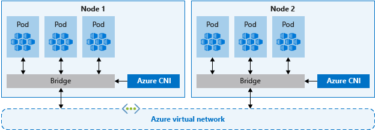
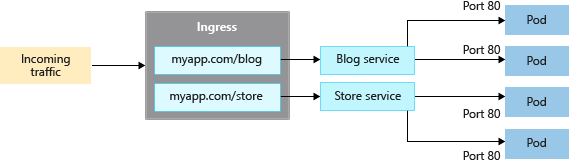
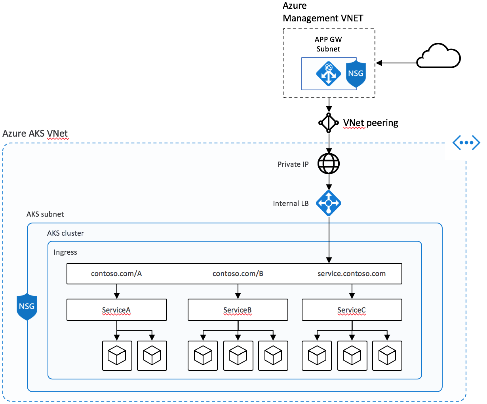
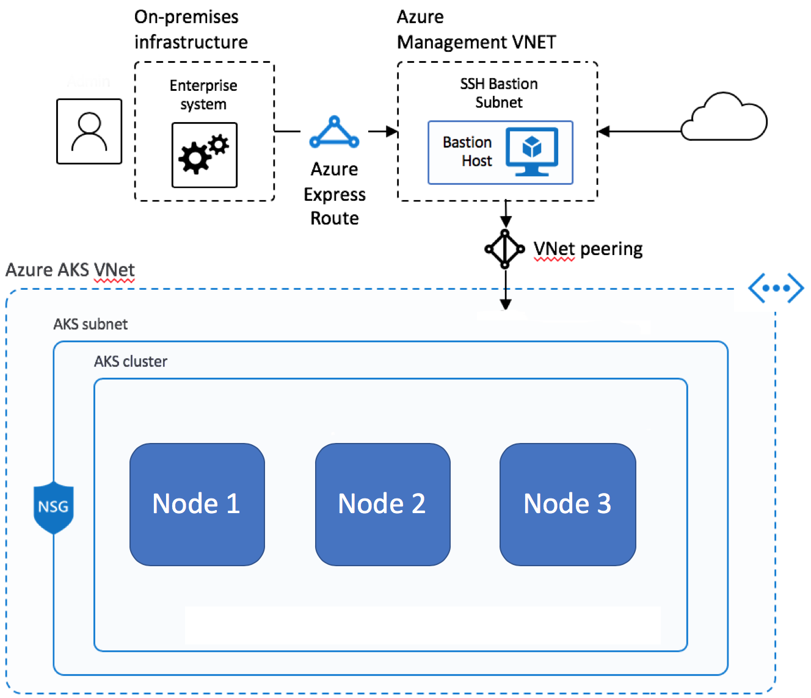

# Best practices for network connectivity and security in Azure Kubernetes Service (AKS)

[!INCLUDE [kubenet retirement](~/reusable-content/ce-skilling/azure/includes/aks/includes/preview/retirement/kubenet-retirement-callout.md)]

As you create and manage clusters in Azure Kubernetes Service (AKS), you provide network connectivity for your nodes and applications. These network resources include IP address ranges, load balancers, and ingress controllers.

This best practices article focuses on network connectivity and security for cluster operators. In this article, you learn how to:

> [!div class="checklist"]
>
> - Explain Azure Container Networking Interface (CNI) network mode in AKS.
> - Plan for required IP addressing and connectivity.
> - Distribute traffic using load balancers, ingress controllers, or a web application firewall (WAF).
> - Securely connect to cluster nodes.

## Choose the appropriate network model

> **Best practice guidance**
>
> Use Azure CNI Overlay for most scenarios. If workloads require direct pod IP access from connected networks, use a flat network with Azure CNI Pod Subnet.

Virtual networks provide the basic connectivity for AKS nodes and customers to access your applications. There are two different ways to deploy AKS clusters into virtual networks:

- **Overlay network**: Azure CNI Overlay assigns pod IP addresses from a separate pod CIDR. Traffic that leaves the cluster is translated to the node's IP address, and pods aren't directly accessible by their private IP addresses from connected networks.
- **Flat network**: Azure CNI Pod Subnet or legacy Azure CNI Node Subnet assigns pod IP addresses from virtual network space. Pods can be reached by their private IP addresses from connected networks.

For more information about selecting a networking model, see [Plan pod networking for AKS][plan-pod-networking].

### Azure CNI networking overview

Azure CNI provides IP address management (IPAM) and connectivity for pods and nodes. The IPAM option is separate from the network data plane. For example, you can use Azure CNI powered by Cilium with Azure CNI Overlay or a flat-network option.



The following diagram shows two AKS nodes, each connected through a network bridge to a shared Azure virtual network.

Azure CNI networking allows separation of control and management of resources. From a security perspective, you often want different teams to manage and secure those resources. The connectivity characteristics depend on the networking model. Overlay pods initiate connections to virtual network and on-premises resources through the node IP address. Flat-network pods can communicate directly with connected resources through their private IP addresses.

When you use Azure CNI networking, the virtual network resource is in a separate resource group to the AKS cluster. Delegate permissions for the AKS cluster identity to access and manage these resources. The cluster identity used by the AKS cluster must have at least [Network Contributor](/azure/role-based-access-control/built-in-roles#network-contributor) permissions on the subnet within your virtual network.

If you wish to define a [custom role](/azure/role-based-access-control/custom-roles) instead of using the built-in Network Contributor role, the following permissions are required:

| Permission | Description |
|---|---|
| `Microsoft.Network/virtualNetworks/subnets/join/action` | Joins the AKS cluster resources to the virtual network subnet. |
| `Microsoft.Authorization/roleAssignments/write` | Creates required role assignments. |
| `Microsoft.Network/virtualNetworks/subnets/read` | Reads subnet configuration when you define your own subnets and CIDRs. |

By default, AKS uses a managed identity for its cluster identity. However, you can use a service principal instead.

- For more information about AKS service principal delegation, see [Delegate access to other Azure resources][sp-delegation].
- For more information about managed identities, see [Use managed identities](use-managed-identity.md).

Plan address ranges based on the networking model. Keep the following criteria in mind:

- With Azure CNI Overlay, size the node subnet for nodes and use a separate private CIDR for pods. Each node receives a `/24` address space from the pod CIDR.
- With a flat network, size the virtual network subnets for both nodes and pods. Azure CNI Pod Subnet uses separate node and pod subnets, while legacy Azure CNI Node Subnet uses one subnet for both.
- Avoid using IP address ranges that overlap with existing network resources.
  - It's necessary to allow connectivity to on-premises or peered networks in Azure.
- To handle scale-out events or cluster upgrades, you need extra IP addresses available in the assigned subnet.
  - This extra address space is especially important if you use Windows Server containers, as those node pools require an upgrade to apply the latest security patches. For more information on Windows Server nodes, see [Upgrade a node pool in AKS][nodepool-upgrade].

To calculate the required IP address space, see [IP address planning for AKS clusters][ip-address-planning].

When creating a cluster with Azure CNI networking, you specify other address ranges for the cluster, such as the DNS service IP and service address range. In general, ensure these address ranges don't overlap each other or any networks associated with the cluster, including any virtual networks, subnets, on-premises networks, and peered networks.

For details about networking models, limits, and address sizing, see [Azure CNI networking overview][cni-overview].


## Distribute ingress traffic

> **Best practice guidance**
>
> To distribute HTTP or HTTPS traffic to your applications, use ingress resources and controllers. Compared to an Azure load balancer, ingress controllers provide extra features and can be managed as native Kubernetes resources.

While an Azure load balancer can distribute customer traffic to applications in your AKS cluster, it's limited in understanding that traffic. A load balancer resource works at _layer 4_ and distributes traffic based on protocol or ports.

Most web applications using HTTP or HTTPS should use Kubernetes ingress resources and controllers, which work at _layer 7_. Ingress can distribute traffic based on the URL of the application and handle TLS/SSL termination. Ingress also reduces the number of IP addresses you expose and map.

With a load balancer, each application typically needs a public IP address assigned and mapped to the service in the AKS cluster. With an ingress resource, a single IP address can distribute traffic to multiple applications.



The diagram shows a single public IP address receiving external traffic and an ingress controller distributing that traffic to multiple services in the AKS cluster.

Ingress has two components: an ingress _resource_ and an ingress _controller_.

### Ingress resource

The _ingress resource_ is a YAML manifest of `kind: Ingress`. It defines the host, certificates, and rules to route traffic to services running in your AKS cluster.

The following example YAML manifest uses the application routing add-on's managed NGINX Ingress class. It distributes traffic for _myapp.com_ to one of two services, _blogservice_ or _storeservice_, and directs the customer to one service or the other based on the URL they access.

```yaml
apiVersion: networking.k8s.io/v1
kind: Ingress
metadata:
  name: myapp-ingress
spec:
  ingressClassName: webapprouting.kubernetes.azure.com
  tls:
  - hosts:
    - myapp.com
    secretName: myapp-secret
  rules:
  - host: myapp.com
    http:
      paths:
      - path: /blog
        pathType: Prefix
        backend:
          service:
            name: blogservice
            port:
              number: 80
      - path: /store
        pathType: Prefix
        backend:
          service:
            name: storeservice
            port:
              number: 80
```

The `ingressClassName` field selects the ingress class and must match a class configured on an ingress controller in the cluster. The value `webapprouting.kubernetes.azure.com` selects the managed NGINX ingress controller provided by the application routing add-on. Replace it with the class name for your ingress controller if you use a different implementation.

### Ingress controller

A cluster-hosted _ingress controller_ runs as a workload on an AKS node and watches for incoming requests. Incoming traffic is then distributed based on the rules defined in the ingress resource associated with that controller. While the most common ingress controller is based on [NGINX], AKS doesn't restrict you to a specific controller. You can use [Application Gateway for Containers][app-gateway-for-containers], [Contour][contour], [HAProxy][haproxy], [Traefik][traefik], and others.

You must schedule cluster-hosted ingress controllers on a Linux node. Indicate that the resource should run on a Linux-based node by using a node selector in your YAML manifest or Helm chart deployment. For more information, see [Use node selectors to control where pods are scheduled in AKS][concepts-node-selectors].

## Ingress with the application routing add-on

The application routing add-on provides managed ingress implementations for AKS. For new, long-lived deployments, use the application routing Gateway API implementation when it supports your requirements. Gateway API is the long-term standard for Kubernetes ingress and Layer 7 traffic management.

> [!CAUTION]
> Upstream Ingress NGINX maintenance ends in March 2026. Microsoft provides critical security patch support for application routing add-on NGINX Ingress resources through November 2026. If you use the managed NGINX implementation, plan to [migrate to the application routing Gateway API implementation](app-routing-nginx-to-gateway-api-migration.md) or another supported implementation by November 2026.

The managed NGINX implementation provides the following features:

- Easy configuration of managed NGINX Ingress controllers based on Kubernetes NGINX Ingress controller.
- Integration with Azure DNS for public and private zone management.
- SSL termination with certificates stored in Azure Key Vault.

For more information, see [Configure ingress with the application routing Gateway API](app-routing-gateway-api.md) and [Managed NGINX ingress with the application routing add-on](app-routing.md).

## Secure traffic with a web application firewall (WAF)

> **Best practice guidance**
> 
> To scan incoming traffic for potential attacks, use a web application firewall (WAF) such as [Barracuda WAF for Azure][barracuda-waf] or [Azure Web Application Firewall on Application Gateway for Containers][agc-waf]. Application Gateway for Containers routes HTTP, HTTPS, gRPC, WebSocket, and AI inference traffic and supports TLS termination.

A cluster-hosted ingress controller runs as a Kubernetes workload in your AKS cluster and distributes traffic to services and applications. It consumes some of the node's resources, like CPU, memory, and network bandwidth. In larger environments, you might want to consider the following:

- Offload some of this traffic routing or TLS termination to a network resource outside of the AKS cluster.
- Scan incoming traffic for potential attacks.



The diagram illustrates external traffic passing through Azure Application Gateway for Containers. When WAF protection is configured, WAF rules filter requests before Application Gateway for Containers forwards allowed traffic to services in the AKS cluster.

For that extra layer of security, a web application firewall (WAF) filters incoming traffic. Managed and custom rules protect against attacks such as cross-site scripting and SQL injection. Application Gateway for Containers is a Layer 7 load-balancing and traffic-management service that supports Azure WAF.

WAF protection isn't enabled by deploying Application Gateway for Containers alone. You must create a WAF policy and complete both of the following configurations before WAF inspects traffic:

- Create an Azure `SecurityPolicy` child resource that references the WAF policy.
- Apply a Kubernetes `WebApplicationFirewallPolicy` custom resource that references the same WAF policy and targets the `Gateway` or `HTTPRoute` resource to protect.

After you complete both configurations, verify the custom resource status and WAF logs before relying on the policy for protection. For more information, see [Azure Web Application Firewall on Application Gateway for Containers][agc-waf].

Since other third-party solutions also perform these functions, you can continue to use existing investments or expertise in your preferred product.

Load balancer or ingress resources continually run in your AKS cluster and refine the traffic distribution. [Azure Application Gateway for Containers][app-gateway-for-containers] can be centrally managed as an ingress controller with a resource definition. To get started, [create an Application Gateway for Containers][app-gateway-for-containers-deploy], and then configure WAF protection separately.

## Control traffic flow with network policies

> **Best practice guidance**
>
> Use network policies to allow or deny traffic to pods. By default, all traffic is allowed between pods within a cluster. For improved security, define rules that limit pod communication.

Network policy is a Kubernetes feature available in AKS that lets you control the traffic flow between pods. You allow or deny traffic to the pod based on settings such as assigned labels, namespace, or traffic port. Network policies are a cloud-native way to control the flow of traffic for pods. As pods are dynamically created in an AKS cluster, required network policies can be automatically applied.

To use [network policies in AKS][use-network-policies], select a network policy engine that supports your node operating systems and network data plane. You can enable a policy engine during cluster creation or on an existing supported cluster.

For Linux node pools, use Azure CNI powered by Cilium and its built-in Cilium network policy enforcement. Cilium isn't supported for Windows node pools. For Windows workloads, use Calico.

> [!IMPORTANT]
> Azure Network Policy Manager (NPM) support for Windows nodes ends on September 30, 2026, and new subscriptions can no longer enable it. Azure NPM support for Linux nodes ends on September 30, 2028. Migrate Linux clusters from NPM to Cilium before the end-of-support date.

You create a network policy as a Kubernetes resource using a YAML manifest. Policies are applied to defined pods, with ingress or egress rules defining traffic flow.

The following example applies a network policy to pods with the _app: backend_ label applied to them. The ingress rule only allows traffic from pods with the _app: frontend_ label.

```yaml
kind: NetworkPolicy
apiVersion: networking.k8s.io/v1
metadata:
  name: backend-policy
spec:
  podSelector:
    matchLabels:
      app: backend
  ingress:
  - from:
    - podSelector:
        matchLabels:
          app: frontend
```

To get started with policies, see [Secure traffic between pods using network policies in Azure Kubernetes Service (AKS)][use-network-policies].

## Optimize DNS resolution with LocalDNS

> **Best practice guidance**
>
> Use LocalDNS to improve DNS performance and reliability and reduce load on centralized CoreDNS pods. LocalDNS is preconfigured in AKS Automatic. In AKS Standard, enable and configure LocalDNS per node pool.

[LocalDNS](./dns-concepts.md) deploys a DNS proxy as a `systemd` service on each node to handle DNS queries locally. By default, pods send all DNS queries to centralized CoreDNS pods. At scale, centralizing these queries can create a bottleneck, while local resolution reduces network hops and latency.

LocalDNS also eliminates `conntrack` table entries for DNS traffic, preventing `conntrack` table exhaustion and race conditions that can cause dropped connections. Connections from the local cache to CoreDNS are upgraded to TCP, enabling connection rebalancing and faster cleanup of tracking entries.

For workloads that require high DNS availability, LocalDNS supports serving stale cached responses for a configurable duration when upstream DNS is unavailable. This best-effort capability can help maintain pod connectivity and service reliability during transient DNS outages, but it doesn't guarantee that a stale record is available.

On AKS Standard, enabling LocalDNS on an existing node pool reimages its nodes. Plan the rollout to account for this disruption.

For more information on LocalDNS architecture and capabilities, see [DNS resolution in AKS](./dns-concepts.md). For configuration instructions, see [Configure LocalDNS](./localdns-custom.md).

## Securely connect to nodes

> **Best practice guidance**
>
> Don't expose remote connectivity to your AKS nodes. For routine Linux node troubleshooting, use [`kubectl debug`][kubectl-debug] through the Kubernetes API. When you need SSH access, connect through private networking or Azure Bastion.

You can complete most operations in AKS by using Azure management tools or the Kubernetes API server. AKS nodes are only available on a private network and aren't connected to the public internet. For Linux nodes, use `kubectl debug` to start a privileged debugging container through the Kubernetes API. This approach doesn't require direct SSH connectivity to the node.

If Kubernetes API access isn't suitable or you require SSH, use the node's private IP address from a connected network. Azure Bastion can provide private connectivity without exposing a public IP address on the node. For Windows nodes, use a host process container or connect through a Linux proxy node. Azure Bastion is an alternative if the proxy node is unavailable. For more information, see [Connect to AKS cluster nodes for maintenance or troubleshooting](node-access.md).



The diagram illustrates a management virtual network containing a bastion host that routes connections through a securely peered link to the AKS cluster virtual network.

If you use a bastion host or jump box, place it in a separate, securely peered management virtual network. Secure the management network by using [Azure ExpressRoute][expressroute] or a [VPN gateway][vpn-gateway] to connect to an on-premises network and control access with network security groups.

## Next steps

This article focused on network connectivity and security. For more information about network basics in Kubernetes, see [Network concepts for applications in Azure Kubernetes Service (AKS)][aks-concepts-network]

<!-- LINKS - External -->
[cni-networking]: https://github.com/Azure/azure-container-networking/blob/master/docs/cni.md
[app-gateway-for-containers]: /azure/application-gateway/for-containers/overview
[app-gateway-for-containers-deploy]: /azure/application-gateway/for-containers/quickstart-deploy-application-gateway-for-containers-alb-controller
[agc-waf]: /azure/web-application-firewall/ag/waf-application-gateway-for-containers-overview
[nginx]: https://www.nginx.com/products/nginx/kubernetes-ingress-controller
[contour]: https://github.com/heptio/contour
[haproxy]: https://www.haproxy.org
[traefik]: https://github.com/containous/traefik
[barracuda-waf]: https://www.barracuda.com/products/webapplicationfirewall/models/
[kubectl-debug]: https://kubernetes.io/docs/reference/kubectl/generated/kubectl_debug/

<!-- INTERNAL LINKS -->
[aks-concepts-network]: concepts-network.md
[sp-delegation]: kubernetes-service-principal.md#delegate-access-to-other-azure-resources
[expressroute]: /azure/expressroute/expressroute-introduction
[vpn-gateway]: /azure/vpn-gateway/vpn-gateway-about-vpngateways
[use-network-policies]: use-network-policies.md
[cni-overview]: concepts-network-cni-overview.md
[ip-address-planning]: concepts-network-ip-address-planning.md
[plan-pod-networking]: plan-pod-networking.md
[concepts-node-selectors]: concepts-clusters-workloads.md#node-selectors
[nodepool-upgrade]: manage-node-pools.md#upgrade-a-single-node-pool

