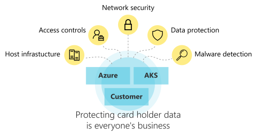

# Introduction to AKS regulated cluster for PCI DSS 4.0.1

This reference architecture describes the considerations for an Azure Kubernetes Service (AKS) cluster designed to run a sensitive workload. The guidance is tied to the regulatory requirements of the Payment Card Industry Data Security Standard (PCI DSS 4.0.1).

PCI DSS 4.0.1 introduces significant changes from previous versions, including:

- The option to use a "customized approach" for meeting security objectives, allowing flexibility in cloud and container environments.
- Enhanced multifactor authentication (MFA) requirements for all access to the cardholder data environment (CDE), including administrative and non-console access.
- Stronger requirements for cryptography, encryption, and key management.
- Expanded and automated logging, monitoring, and tamper-proofing of logs, including ephemeral workloads like containers.
- Emphasis on continuous security, risk-based scoping, and regular validation of environment boundaries.
- Secure software development lifecycle (SDLC) practices, including automated vulnerability detection in CI/CD pipelines.
- Improved detection and response capabilities, including leveraging cloud-native and container-native security tools.
- Stronger requirements for remote access, zero trust architecture, and third-party/service provider management.

These changes are especially relevant for AKS and cloud-native architectures, where automation, dynamic scaling, and shared responsibility models are common. This guidance reflects the major updates in PCI DSS 4.0.1 and provides recommendations for leveraging Azure and AKS features to meet compliance objectives.

It's ***not* our goal to replace your configuration and/or setup of your compliance** with this series. The intent is to assist customers in getting started on architectural design by addressing the applicable PCI DSS 4.0.1 control objectives as a tenant on the AKS environment. The guidance covers compliance aspects of the environment, including infrastructure, workload interactions, operations, management, and service integrations, with a focus on the new requirements and flexibility introduced in PCI DSS 4.0.1.

> [!IMPORTANT]
>
> The reference architecture and implementation haven't been certified by an official authority. By completing this series and deploying the code assets, you don't clear audit for PCI DSS 4.0.1. Acquire compliance attestations from a third-party auditor. Always consult with a Qualified Security Assessor (QSA) familiar with cloud and containerized environments.

## Shared responsibility model

[**Microsoft Trust Center**](https://www.microsoft.com/trust-center/product-overview) provides specific principles for compliance-related cloud deployments. The security assurances, provided by Azure as the cloud platform and AKS as the host container, are regularly audited and attested by third-party Qualified Security Assessors (QSAs) for PCI DSS 4.0.1 compliance.

- **Shared responsibility with Azure**

  The Microsoft Compliance team ensures all documentation of Microsoft Azure regulatory compliance is publicly available to customers. You can download the PCI DSS Attestation of Compliance for Azure under the PCI DSS section from the [Service Trust portal](https://servicetrust.microsoft.com). The responsibility matrix outlines who, between Azure and the customer, is responsible for each of the PCI DSS 4.0.1 requirements. For more information, see [Managing compliance in the cloud](https://www.microsoft.com/trust-center/compliance/compliance-overview).

- **Shared responsibility with AKS**

  Kubernetes is an open-source system for automating deployment, scaling, and management of containerized applications. AKS makes it simple to deploy a managed Kubernetes cluster on Azure. The AKS fundamental infrastructure supports large-scale applications in the cloud, and is a natural choice for running enterprise-scale applications in the cloud, including PCI workloads. Applications deployed in AKS clusters have certain complexities when deploying PCI-classified workloads, especially under the new requirements and flexibility of PCI DSS 4.0.1.

- **Your responsibility**

  As a workload owner, you're ultimately responsible for your own PCI DSS 4.0.1 compliance. Have a clear understanding of your responsibilities by reading the PCI DSS 4.0.1 requirements to understand the intent, studying the [matrix for Azure](https://servicetrust.microsoft.com), and completing this series to understand the AKS nuances. This process will help prepare your implementation for a successful assessment under PCI DSS 4.0.1.

## Before you begin

Before you begin this series, ensure that:

- You're familiar with Kubernetes concepts and workings of an [AKS cluster](/azure/aks).
- You've read the [AKS baseline reference architecture](/azure/architecture/reference-architectures/containers/aks/baseline-aks).
- You've deployed the [AKS baseline reference implementation](https://github.com/mspnp/aks-secure-baseline).
- You're familiar with the official [PCI DSS 4.0.1 specification](https://www.pcisecuritystandards.org/document_library?category=pcidss)
- You've read the [Azure security baseline for Azure Kubernetes Service](/security/benchmark/azure/baselines/aks-security-baseline).

## Series overview

This series is split into several articles. Each article outlines the high-level PCI DSS 4.0.1 requirement followed by guidance about how to address the AKS-specific requirement, with a focus on the new and updated controls:

|Area of responsibility|Description|
|---|---|
|[Network segmentation](pci-network.md)|Protect cardholder data with firewall configuration and other network controls. Remove vendor-supplied defaults. Address dynamic segmentation and risk-based scoping as required by PCI DSS 4.0.1.|
|[Data protection](pci-data.md)|Encrypt all information, storage objects, containers, and physical media. Add security controls for data in transit and at rest, using updated cryptographic standards.|
|[Vulnerability management](pci-malware.md)|Run antivirus software, file integrity monitoring tools, and container scanners as part of your vulnerability detection and secure SDLC.|
|[Access controls](pci-identity.md)|Secure access through identity controls, including enhanced MFA and zero trust principles, for all access to the CDE.|
|[Monitoring operations](pci-monitor.md)|Maintain the security posture through automated and continuous monitoring operations, log integrity, and regular testing of your security design and implementation.|
|[Policy management](pci-policy.md)|Maintain thorough and updated documentation about your security processes and policies, including the use of the customized approach where applicable.|

## Next steps

Start by reviewing the regulated architecture and design choices for PCI DSS 4.0.1.

> [!div class="nextstepaction"]
> [Architecture of an AKS regulated cluster for PCI DSS 4.0.1](pci-ra-code-assets.md)
