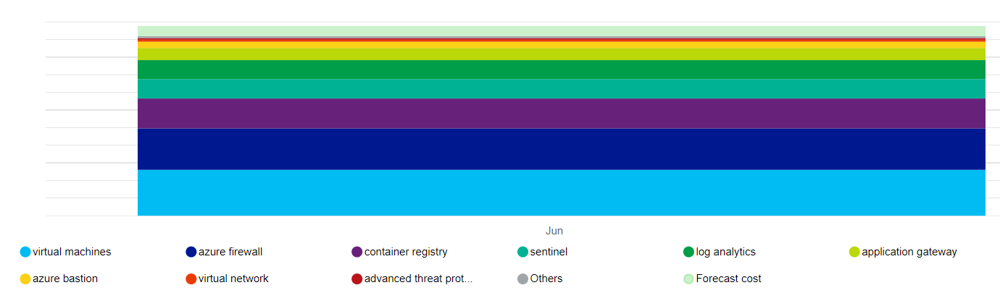
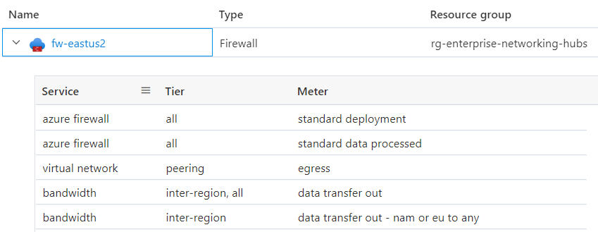

# AKS regulated cluster for PCI DSS 4.0.1 summary

The guidance provided in this series incorporates well-architected principles in all design choices. This article summarizes those choices.

> This article ends this series. Read the [introduction](pci-intro.md).

>  **Reference Implementation Coming Soon**: The Azure Kubernetes Service (AKS) baseline cluster for regulated workloads reference implementation for PCI DSS 4.0.1 is currently being updated and will be available soon. This implementation will demonstrate a regulated infrastructure that illustrates the use of various network and security controls within your CDE. This includes both network controls native to Azure and controls native to Kubernetes. It will also include an application to demonstrate the interactions between the environment and a sample workload. The focus of this article is the infrastructure. The sample will not be indicative of an actual PCI-DSS 4.0.1 workload.

## Well-architected framework

The [Microsoft Azure Well-Architected Framework](/azure/well-architected) is a set of guiding tenets that can be used to assess a solution through the quality pillars of architecture excellence:

- [Reliability](#reliability)
- [Security](#security)
- [Cost optimization](#cost-optimization)
- [Operational excellence](#operational-excellence)
- [Performance efficiency](#performance-efficiency)

PCI DSS 4.0.1 workloads demand the rigor of being a well-architected solution. Although aligning the infrastructure with PCI requirements is critical, compliance doesn't stop at the hosting infrastructure. Not addressing the quality pillars, specifically security, can jeopardize compliance. Well-architected solutions combine both the infrastructure and workload perspectives to arrive at the rigor necessary for achieving compliant outcomes. PCI DSS 4.0.1 introduces new requirements for continuous compliance, risk-based scoping, enhanced monitoring, and secure software development, all of which are addressed in this guidance.

Key enhancements in PCI DSS 4.0.1 relevant to cloud and container environments include:

- **Customized approach**: Flexibility to meet security objectives through alternative controls suitable for cloud-native architectures.
- **Enhanced authentication**: Strengthened multifactor authentication requirements for all access to the cardholder data environment.
- **Continuous validation**: Ongoing monitoring and validation of security controls rather than point-in-time assessments.
- **Automated security**: Integration of security into DevSecOps pipelines with automated vulnerability scanning and security testing.
- **Container security**: Specific guidance for containerized workloads and ephemeral infrastructure.
- **Zero trust principles**: Emphasis on verify-first approaches and least privilege access.

## Reliability

The reliability of regulated environments needs to be predictable so that they can be explained consistently for auditing purposes. Follow the fundamental guidance provided in the [reliability principles](/azure/architecture/framework/resiliency/principles). The following sections summarize reliability best practices for a regulated environment.

### Recovery targets and disaster recovery

Due to the sensitive nature of the data handled in regulated workloads, recovery targets and recovery point objectives (RPOs) are critical to define. What's acceptable loss of CHD? Recovery efforts within the CDE are still subject to the standard requirements. Expect failures and have a clear recovery plan for those failures that align with roles, responsibilities, and justified data access. Live-site issues aren't justification for deviating from any regulations. This is especially important in a full disaster recovery situation. Have clear disaster recovery documentation that adheres to the requirements and minimizes unexpected CDE or CHD access. After recovery, always review the recovery process steps to ensure that no unexpected access occurred. Document business justifications for those instances.

### Recovery

Adding resilience and recovery strategies to your architecture can prevent the need for ad hoc access to the CDE. The system should be able to self-recover at the defined RPO without the need for direct human intervention. This way, you can eliminate unnecessary exposure of CHD, even to those individuals who are authorized to have emergency access. The recovery process must be auditable.

### Addressing security-related risks

Review security risks because they can be a source of workload downtime and data loss. The investments in security also have an impact on workload reliability.

### Operational processes

Reliability extends to all operational processes in and adjacent to the CDE. Well-defined, automated, and tested processes for concerns like image building and jump box management factor into a well-architected solution.

## Security

Follow the fundamental guidance provided in the [Security design principles](/azure/architecture/framework/security/security-principles). The following sections summarize security best practices for a regulated environment.

### Governance

The governance implementation is driven by the compliance requirements in PCI DSS 4.0.1. This influences the technical controls for maintaining segmentation, accessing resources, detecting vulnerabilities, and most importantly protecting customer data. PCI DSS 4.0.1 emphasizes shared responsibility, continuous monitoring, and the use of automated tools for inventory and configuration management in cloud and container environments.

**Continuous compliance monitoring**: Unlike the periodic assessment approach of previous versions, PCI DSS 4.0.1 requires ongoing validation of security controls. This aligns well with cloud-native monitoring capabilities like Azure Monitor, Microsoft Defender for Cloud, and automated policy enforcement through Azure Policy.

**Risk-based scoping**: The standard now allows for more dynamic scoping based on actual data flows and risk assessments, which is particularly relevant for containerized workloads where components might be ephemeral and dynamically orchestrated.

#### Enterprise segmentation strategy

To maintain complete isolation, we recommend deploying the regulated infrastructure in a standalone subscription. If you have multiple subscriptions that are necessary for compliance, consider grouping them under a management group hierarchy that uniformly applies the relevant Azure policies across your in-scope subscriptions. Within the subscription, apply related Azure policies at a subscription level to capture the broad policies that should apply to all clusters in the cardholder data environment (CDE). Apply related Azure policies at the resource group level to capture policies that apply to a specific cluster instance. These policies build the core guardrails of a landing zone.

Isolate the PCI workload (in-scope) from other (out-of-scope) workloads in terms of operations and connectivity. You can create isolation by deploying separate clusters or use segmentation strategies to maintain the separation. For example, the clusters use separate node pools so that workloads never share a node virtual machine (VM).

#### Policy enforcement

Enforce security controls by enabling Azure policies. For example, in this regulated architecture, you can prevent misconfiguration of the cardholder data environment. You can apply an Azure policy that doesn't allow public IP allocations on the VM nodes. Such allocations are detected and reported or blocked.

For information about policies you can enable for AKS, see
[Azure Policy built-in definitions for Azure Kubernetes Service (AKS)](/azure/aks/policy-reference).

Azure provides several built-in policies for most services. Review the [Azure Policy built-in policy definitions](/azure/governance/policy/samples/built-in-policies) and apply them as appropriate.

#### Compliance monitoring

Compliance must be systematically monitored and maintained. Regular compliance attestations are performed. Knowing whether your cloud resources are in compliance will help prepare for attestations and audit.

Take advantage the regulatory compliance dashboard in Microsoft Defender for Cloud. By continuously monitoring the dashboard, you can keep track of the compliance status of your workload.

:::image type="content" source="media/pci-dss/regulatory-compliance-pci.png" alt-text="Screenshot of an example compliance monitoring dashboard in the Azure portal." border ="true":::

### Network security

In a hub-spoke topology, having separate virtual networks for each entity provides basic segmentation in the networking footprint. Each network is further segmented into subnets.

The AKS cluster forms the core of the CDE. It shouldn't be accessible from public IP addresses, and connectivity must be secured. Typical flows in and out of CDE can be categorized as:

- Inbound traffic to the cluster.
- Outbound traffic from the cluster.
- In-cluster traffic between pods.

To meet the requirements of a regulated environment, the cluster is deployed as a private cluster. In this mode, traffic to and from the public internet is restricted. Even communication with the AKS-managed Kubernetes API server is private. Security is further enhanced with strict network controls and IP firewall rules:

- Network Security Groups (NSGs) to help secure communication between resources within a network.
- Azure Firewall to filter any outbound traffic between cloud resources, the internet, and on-premises.
- Azure Application Gateway integrated with Azure Web Application Framework to filter all inbound traffic from the internet that Azure Application Gateway intercepts.
- Kubernetes `NetworkPolicy` to allow only certain paths between the pods in the cluster.
- Azure Private Link to connect to other Azure platform as a service (PaaS) services, such as Azure Key Vault and Azure Container Registry, for operational tasks.

Monitoring processes are in place to make sure that traffic flows as expected and that any anomaly is detected and reported.

For more information on network security, see [Network segmentation](./pci-network.md).

### Data security

PCI DSS 4.0.1 requires that all cardholder data (CHD) is never clear, whether in transit or in storage.

Because this architecture and the implementation are focused on infrastructure and not the workload, data management isn't demonstrated. The following sections outline some well-architected recommendations.

#### Data at rest

The data must be encrypted through industry-standard encryption algorithms.

- Don't store data in the cardholder environment.
- Encrypt outside the storage layer.
- Write only encrypted data into the storage medium.
- Don't store the keys in the storage layer.

All data in Azure Storage is encrypted and decrypted by using strong cryptography. Self-managed encryption keys are preferred.

If you need to store data temporarily, apply the same considerations to that data. We strongly recommend enabling the [host-encryption feature](/azure/aks/enable-host-encryption) of AKS. You can enforce encryption of temporary data with built-in Azure policies.

When you're choosing a storage technology, explore the retention features. Make sure all data is safely removed when the configured time expires.

The standard also requires that sensitive authentication data (SAD) isn't stored. Make sure that the data isn't exposed in logs, file names, cache, and other data.

#### Data in transit

All communication with entities that interact with the CDE must be over encrypted channels. PCI DSS 4.0.1 strengthens encryption requirements with updated cipher suites and protocol standards.

- Only HTTPS traffic must be allowed to flow into the CDE. In this architecture, Azure Application Gateway denies all traffic over port 80.
- Preferably, don't encrypt and decrypt data outside the CDE. If you do, consider that entity to be a part of the CDE.
- Within the CDE, provide secure communication between pods with mTLS. You can choose to implement a service mesh for this purpose.
- Only allow secure ciphers and TLS 1.2 or later. PCI DSS 4.0.1 provides updated guidance on acceptable encryption protocols and cipher suites.
- PCI DSS 4.0.1 requires more rigorous key lifecycle management, including automated key rotation and hardware security module (HSM) integration where applicable.

### Identity

Follow these security principles when you're designing access policies:

- Start with zero-trust policies. Make exceptions as needed.
- Grant the least privileges - just enough to complete a task.
- Minimize standing access.

PCI DSS 4.0.1 significantly strengthens authentication requirements, mandating multifactor authentication (MFA) for all access to the cardholder data environment, including administrative access and all non-console access.

Kubernetes role-based access control (RBAC) manages permissions to the Kubernetes API. AKS supports those Kubernetes roles. AKS is fully integrated with Microsoft Entra ID. You can assign Microsoft Entra identities to the roles and also take advantage of other capabilities.

#### Zero-trust access

Kubernetes RBAC, Azure RBAC, and Azure services implement *deny all* by default. Override that setting with caution, allowing access to only those entities who need it. Another area for implementing zero-trust is to disable SSH access to the cluster nodes.

### Least privileges

You can use managed identities for Azure resources and pods and scope them to the expected tasks. For example, Azure Application Gateway must have permissions to get secrets (TLS certificates) from Azure Key Vault. It must not have permissions to modify secrets.

### Minimizing standing access

Minimize standing access by using [just-in-time Microsoft Entra group membership](/azure/aks/managed-aad#use-conditional-access-with-azure-ad-and-aks). Harden the control with [Conditional Access Policies in Microsoft Entra ID](/azure/aks/managed-aad#use-conditional-access-with-azure-ad-and-aks). This option supports many use cases, such as multifactor authentication, restricting authentication to devices that are managed by your Microsoft Entra tenant, or blocking atypical sign-in attempts.

### Secret management

Store secrets, certificates, keys, and passwords outside the CDE. You can use native Kubernetes secrets objects or a managed key store, such as Azure Key Vault. Using a managed store will help in secret management tasks, such as key rotation and certificate renewal.

Make sure access to the key store has a combination of network and access controls. When you enable managed identities, the cluster has to authenticate itself against Key Vault to get access. Also, the connectivity to the key store must not be over the public internet. Use a private network, such as Private Link.

## Cost optimization

Follow the fundamental guidance provided in the [Cost Optimization principles](/azure/architecture/framework/cost/overview).

Because of the compliance requirements and strict security controls, a clear tradeoff is cost. We recommend that you establish initial estimates using the [Pricing Calculator](https://azure.microsoft.com/pricing/calculator/).

The following diagram provides a high-level representation of the cost impact of the main resources that this architecture uses:

The main drivers are the virtual machine scale sets that make up the node pools and Azure Firewall. Another contributor is Log Analytics. There are also incremental costs associated with Microsoft Defender for Cloud, depending on your choice of plans.

Have a clear understanding of what constitutes the price of a service. Azure tracks metered usage. The following diagram provides a breakdown of Azure Firewall for this architecture:

The cost associated with some resources, such as Azure Firewall, can be spread across multiple business units or applications. Another way to optimize cost might be to host a multitenant cluster within an organization, maximizing density with workload diversity. However, we do *not* recommend this approach for regulated workloads. Always prioritize compliance and segmentation over cost benefits.

To keep within the budget constraints, some ways to control cost are by adjusting the Azure Application Gateway infrastructure, setting the instance count for autoscaling, and reducing the log output as long as they still meet the audit trail required by PCI DSS 4.0.1. Always evaluate those choices against the tradeoffs on other aspects of the design that allow you to meet your SLA. For example, are you still able to scale appropriately to meet spikes in traffic?

As you create groups of Azure resources, apply tags so that they can be tracked for cost. Use cost management tools like [Azure Advisor](/azure/advisor/advisor-cost-recommendations) and [Microsoft Cost Management](/azure/cost-management-billing/costs/cost-mgt-best-practices) for tracking and analyzing cost.

Consider enabling [AKS cost analysis](/azure/aks/cost-analysis) for granular cluster infrastructure cost allocation by Kubernetes specific constructs.

## Operational excellence

Follow the fundamental guidance provided in the [Operational excellence principles](/azure/architecture/framework/devops/principles). The following sections summarize operational excellence best practices for a regulated environment.

### Separation of roles

Enforcing clear segregation of duties for regulated environments is key. Have definitions of roles and responsibilities based on the needs of the workload and interaction with the CDE. For instance, you might need an infrastructure operator or site reliability engineer (SRE) role for operations related to the cluster and dependent services. The role is responsible for maintaining security, isolation, deployment, and observability. Formalize those definitions and decide the permissions that those roles need. For example, SREs are highly privileged for cluster access but need read access to workload namespaces.

### Workload isolation

PCI DSS 4.0.1 requires isolation of the PCI workload from other workloads in terms of operations. In this implementation, the in-scope and out-of-scope workloads are segmented in two separate user node pools. Application developers for in-scope and developers for out-of-scope workloads might have different sets of permissions. Also, there will be separate quality gates. For example, the in-scope code is subject to upholding compliance and attestation, whereas the out-of-scope code isn't. There's also a need to have separate build pipelines and release management processes.

PCI DSS 4.0.1 introduces comprehensive requirements for secure software development, including:

- Automated security testing integrated into CI/CD pipelines.
- Static and dynamic application security testing (SAST/DAST).
- Container image vulnerability scanning before deployment.
- Dependency scanning for third-party components.
- Code review processes with security focus.
- Secure coding training for development teams.

### Operational metadata

Requirement 12 of the PCI DSS 4.0.1 standard requires you to maintain information about workload inventory and personnel access documentation. We strongly recommend using Azure tags because you can collate environment information with Azure resources, resource groups, and subscriptions.

Maintain information about approved solutions that are part of the infrastructure and workload. This includes a list of VM images, databases, and third-party solutions of your choice that you bring to the CDE. You can even automate that process by building a service catalog. It provides self-service deployment by using those approved solutions in a specific configuration, which adheres to ongoing platform operations.

### Observability

To fulfill Requirement 10, observability into the CDE is critical for compliance. Activity logs provide information about operations related to account and secret management, diagnostic setting management, server management, and other resource access operations. All logs are recorded with date, time, identity, and other detailed information. Retain logs for up to a year by configuring [data retention and archive policies](/azure/azure-monitor/logs/data-retention-archive) in Azure Monitor Logs.

Make sure logs are only accessed by roles that need them. Log Analytics and Microsoft Sentinel support various role-based access controls to manage audit trail access.

### Response and remediation

The Azure monitoring services, Azure Monitor and Microsoft Defender for Cloud, can generate notifications or alerts when they detect anomalous activity. Those alerts include context information such as severity, status, and activity time. As alerts are generated, have a remediation strategy and review progress. We recommend centralizing data in a security information and event management (SIEM) solution because integrating data can provide rich alert context.

From the **Security alerts** view in Microsoft Defender for Cloud, you have access to all alerts that Microsoft Defender for Cloud detects on your resources. Have a triage process to address the issue. Work with your security team to understand how relevant alerts will be made available to the workload owners.

## Performance efficiency

Follow the fundamental guidance provided in the [Performance efficiency principles](/azure/architecture/framework/scalability/principles). The following sections summarize performance efficiency best practices for a regulated environment.

### Scaling

Observing how the environment adjusts to changing demands will indicate the expected runtime behavior of the environment under high load. Autoscaling resources in the workload will minimize human interaction in the CDE. An added security benefit is reducing the attack surface at all times. You can maximize the benefit by taking advantage of resources that support the scale-to-zero approach. For example, AKS supports scaling down the user node pools to 0. For more information, see [Scale user node pools to 0](/azure/aks/scale-cluster#scale-user-node-pools-to-0).

### Partitioning

Partitioning is a key factor for performance efficiency in regulated workloads. Having discrete components allows for crisp definition of responsibility and helps in precise controls, such as network policies. Similar to any segmentation strategy, partitioning isolates components and controls the impact of blast radius on unexpected failures or system compromise.

### Shared-nothing architecture

The shared-nothing architecture is designed to remove contention between colocated workloads. Also, this is a strategy for removing single points of failure. In a regulated environment, components are required to be isolated by logical or physical boundaries. This aligns with the shared-nothing architecture, resulting in scalability benefits. It allows for targeting of relevant security controls and tighter auditing capabilities of the various components.

### Lightweight workloads

Complexity of workloads is hard to document and to audit. Strive for simplicity because of the performance benefits and ease of auditing regulatory requirements. Reconsider choices that have more breadth than is needed, because that increases the attack surface area and the potential for misuse or misconfiguration.

## Bringing it all together

Implementing PCI DSS 4.0.1 compliance on Azure Kubernetes Service requires a comprehensive approach that addresses all aspects of the well-architected framework while meeting the specific requirements of the standard. This series has provided detailed guidance across multiple domains, from network security and data protection to identity management and continuous monitoring.

### Key takeaways

The journey to PCI DSS 4.0.1 compliance on AKS involves several critical considerations:

- **Infrastructure as the foundation**: A secure, compliant AKS infrastructure is essential but not sufficient. The architecture must support the security controls, monitoring capabilities, and operational processes required by the standard.
- **Continuous compliance**: Unlike previous versions, PCI DSS 4.0.1 emphasizes continuous validation and monitoring rather than point-in-time assessments. This requires automated tools, real-time alerting, and proactive security measures.
- **Shared responsibility**: While Azure provides a secure platform, your organization remains responsible for properly configuring and maintaining the security controls, implementing appropriate access policies, and ensuring ongoing compliance.
- **Well-architected principles**: Security, reliability, cost optimization, operational excellence, and performance efficiency must all be considered together to create a sustainable, compliant solution.

### Integration points

The various components discussed throughout this series work together to create a comprehensive compliance framework:

- **Network security** provides the foundation for isolating the cardholder data environment.
- **Data protection** ensures CHD is properly encrypted and managed throughout its lifecycle.
- **Cryptography and key management** enables secure storage and transmission of sensitive data.
- **Identity and access management** with enhanced MFA controls who can access the CDE.
- **Malware protection** defends against threats that could compromise the environment.
- **Monitoring and logging** provides visibility into all activities within the CDE.
- **Continuous security monitoring** enables real-time threat detection and response.
- **Security policies** establish the governance framework for ongoing compliance.

## Next steps

To begin implementing PCI DSS 4.0.1 compliance on AKS, follow these recommended steps:

### Phase 1: Foundation and planning (Weeks 1-4)

1. **Assess current state**: Evaluate your existing AKS infrastructure against PCI DSS 4.0.1 requirements.
2. **Define scope**: Clearly identify which components are in-scope for PCI DSS compliance.
3. **Review the implementation guide**: Study the detailed guidance provided in each article of this series.
4. **Plan your architecture**: Design your hub-spoke network topology and security controls.
5. **Establish governance**: Define roles, responsibilities, and approval processes.

### Phase 2: Infrastructure implementation (Weeks 5-12)

1. **Deploy reference architecture**: Start with the AKS baseline architecture and apply PCI DSS enhancements.
2. **Implement network security**: Configure private clusters, firewalls, and network policies.
3. **Set up identity management**: Configure Azure AD integration and MFA requirements.
4. **Deploy monitoring infrastructure**: Set up Azure Monitor, Log Analytics, and Microsoft Defender for Cloud.
5. **Implement data protection**: Configure encryption at rest and in transit.

### Phase 3: Security and compliance (Weeks 13-20)

1. **Configure security policies**: Apply Azure Policy and Kubernetes policies for compliance.
2. **Implement key management**: Set up Azure Key Vault and cryptographic controls.
3. **Deploy malware protection**: Configure security scanning and threat detection.
4. **Establish monitoring**: Implement continuous security monitoring and alerting.
5. **Test security controls**: Validate all security measures are working correctly.

### Phase 4: Validation and maintenance (Weeks 21-24)

1. **Conduct security testing**: Perform penetration testing and vulnerability assessments.
2. **Validate compliance**: Ensure all PCI DSS 4.0.1 requirements are met.
3. **Document everything**: Create comprehensive documentation for audit purposes.
4. **Train staff**: Ensure all personnel understand their roles and responsibilities.
5. **Establish ongoing processes**: Implement continuous monitoring and maintenance procedures.

### Ongoing operations

After initial implementation, maintain compliance through:

- **Regular security assessments**: Conduct quarterly security reviews and annual compliance assessments.
- **Continuous monitoring**: Monitor all security controls and respond to alerts promptly.
- **Update management**: Keep all systems and security controls up to date.
- **Incident response**: Maintain and test incident response procedures.
- **Documentation maintenance**: Keep all documentation current and accessible.

### Get help

For additional support in implementing PCI DSS 4.0.1 compliance on AKS:

- **Microsoft FastTrack**: Engage with Microsoft FastTrack for Azure for implementation guidance.
- **Microsoft partners**: Work with certified Microsoft partners who specialize in compliance.
- **Professional services**: Consider engaging professional services for complex implementations.
- **Community resources**: Leverage the Azure and Kubernetes communities for best practices.

### Stay current

PCI DSS standards evolve over time. Stay informed about updates and changes:

- **Subscribe to PCI SSC communications**: Follow the PCI Security Standards Council for updates.
- **Monitor Azure updates**: Stay current with new Azure security features and capabilities.
- **Engage with the community**: Participate in security and compliance forums.
- **Regular training**: Ensure your team stays current with security best practices.

## Related resources

This series provides comprehensive guidance for implementing PCI DSS 4.0.1 compliance on AKS. For additional information:

**PCI DSS 4.0.1 series articles:**

- [Introduction to PCI DSS v4.0.1 on AKS](pci-intro.md)
- [Network security](pci-network.md)
- [Data protection](pci-data.md)
- [Cryptography and key management](pci-cryptography-key-management.md)
- [Identity and access management](pci-identity.md)
- [Enhanced MFA implementation](pci-enhanced-mfa-implementation.md)
- [Malware protection](pci-malware.md)
- [Monitoring and logging](pci-monitor.md)
- [Continuous security monitoring](pci-continuous-security-monitoring.md)
- [Security policies](pci-policy.md)

**Azure documentation:**

- [Azure Kubernetes Service (AKS) documentation](/azure/aks/)
- [Azure Security Center documentation](/azure/security-center/)
- [Azure Monitor documentation](/azure/azure-monitor/)
- [Azure Policy documentation](/azure/governance/policy/)

**Compliance resources:**

- [Official PCI DSS 4.0.1 documentation](https://www.pcisecuritystandards.org/document_library)
- [Microsoft Azure compliance offerings](/azure/compliance/)
- [Azure Architecture Center](/azure/architecture/)
- [Azure Well-Architected Framework](/azure/well-architected/)

Remember that achieving and maintaining PCI DSS 4.0.1 compliance is an ongoing process that requires continuous attention to security, monitoring, and operational excellence. The guidance in this series provides a foundation, but your specific implementation may require additional considerations based on your unique requirements and environment.
