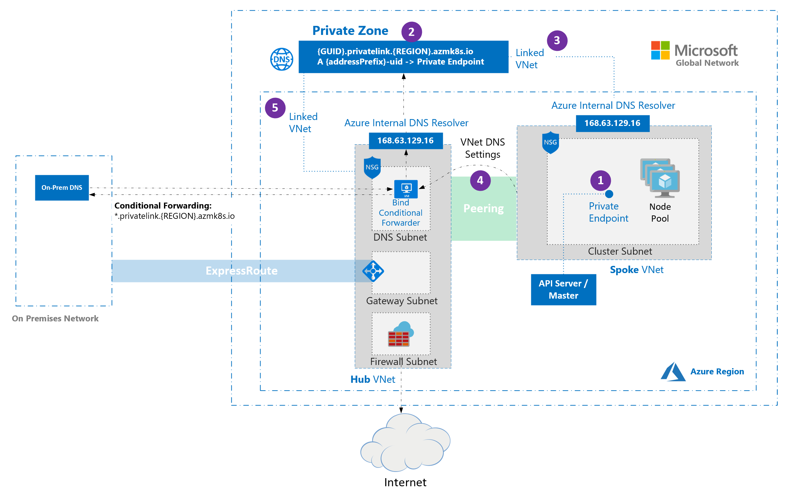

# Create a private Azure Kubernetes Service (AKS) cluster

This article helps you deploy a private link-based AKS cluster using Azure CLI or Terraform. If you're interested in creating an AKS cluster without required private link or tunnel, see [Create an Azure Kubernetes Service (AKS) cluster with API Server VNet integration][create-aks-cluster-api-vnet-integration].

## Overview of private clusters in AKS

In a private cluster, the control plane or API server has internal IP addresses that are defined in the [RFC1918 - Address Allocation for Private Internet][rfc1918-document] document. By using a private cluster, you can ensure network traffic between your API server and your node pools remains only on the private network.

The control plane or API server is in an AKS-managed Azure resource group, and your cluster or node pool is in your resource group. The server and the cluster or node pool can communicate with each other through the [Azure Private Link service][private-link-service] in the API server virtual network and a private endpoint exposed on the subnet of your AKS cluster.

When you create a private AKS cluster, AKS creates both private and public fully qualified domain names (FQDNs) with corresponding DNS zones by default. For detailed DNS configuration options, see [Configure a private DNS zone, private DNS subzone, or custom subdomain](#configuration-options-for-private-dns).

## Region availability

Private clusters are available in public regions, Azure Government, and Microsoft Azure operated by 21Vianet regions where [AKS is supported][aks-supported-regions].

[!INCLUDE [21vianet-retirement](includes/21vianet-retirement.md)]

## Prerequisites for private AKS clusters

- An active Azure subscription. If you don't have an Azure subscription, create a [free account](https://azure.microsoft.com/free/) before you begin.
- Set your subscription context using the [`az account set`](/cli/azure/account#az_account_set) command. For example:

    ```azurecli-interactive
    az account set --subscription "00000000-0000-0000-0000-000000000000"
    ```

- Azure CLI version 2.28.0 or higher. Find your version using the `az --version` command. If you need to install or upgrade, see [Install Azure CLI][install-azure-cli].
- If using Azure Resource Manager (ARM) or the Azure REST API, the AKS API version must be _2021-05-01 or higher_.
- To use a custom DNS server, add the Azure public IP address _168.63.129.16_ as the upstream DNS server in the custom DNS server, and make sure to add this public IP address as the _first_ DNS server. For more information about the Azure IP address, see [What is IP address 168.63.129.16?][virtual-networks-168.63.129.16]
  - The cluster's DNS zone should be what you forward to _168.63.129.16_. You can find more information on zone names in [Azure services DNS zone configuration][az-dns-zone].
- Existing AKS clusters enabled with API Server VNet integration can have private cluster mode enabled. For more information, see [Enable or disable private cluster mode on an existing cluster with API Server VNet integration][api-server-vnet-integration].
- If you need to enable Azure Container Registry on a private AKS cluster, [set up a private link for the container registry in the cluster virtual network (VNet)][container-registry-private-link] or set up peering between the container registry's VNet and the private cluster's VNet.
- [kubectl](https://kubernetes.io/releases/download/) installed. You can install it locally using the [`az aks install-cli`][az-aks-install-cli] command.

:::zone pivot="terraform"

- Terraform installed locally. For installation instructions, see [Install Terraform](https://developer.hashicorp.com/terraform/install).

:::zone-end

[!INCLUDE [azure linux 2.0 retirement](./includes/azure-linux-retirement.md)]

## Limitations

- IP authorized ranges only apply to the public API server. You can't apply these ranges to the private API server endpoint.
- [Azure Private Link service limitations][private-link-service] apply to private clusters.
- There's no support for Azure DevOps Microsoft-hosted Agents with private clusters. Consider using [self-hosted agents](/azure/devops/pipelines/agents/agents).
- Deleting or modifying the private endpoint in the customer subnet causes the cluster to stop functioning.
- Azure Private Link service is supported on Standard Azure Load Balancer only. Basic Azure Load Balancer isn't supported.

## Hub and spoke with custom DNS for private AKS clusters

[Hub and spoke architectures](/azure/architecture/reference-architectures/hybrid-networking/hub-spoke) are commonly used to deploy networks in Azure. In many of these deployments, DNS settings in the spoke VNets are configured to reference a central DNS forwarder to allow for on-premises and Azure-based DNS resolution.

The following diagram illustrates a hub and spoke architecture for a private AKS cluster with custom DNS:



- When a private cluster is created, a private endpoint (1) and a private DNS zone (2) are created in the cluster-managed resource group by default. The cluster uses an `A` record in the private zone to resolve the IP of the private endpoint for communication to the API server.
- The private DNS zone is linked only to the VNet that the cluster nodes are attached to (3), which means that the private endpoint can only be resolved by hosts in that linked VNet. In scenarios where no custom DNS is configured on the VNet (default), it works without issue as hosts point at _168.63.129.16_ for DNS that can resolve records in the private DNS zone because of the link.
- If you keep the default private DNS zone behavior, AKS tries to link the zone directly to the spoke VNet that hosts the cluster even when the zone is already linked to a hub VNet.
  - In spoke VNets that use custom DNS servers, this action can fail if the cluster's managed identity lacks **Network Contributor** on the spoke VNet. To prevent the failure, choose **one** of the following supported configurations:
    - **Custom private DNS zone**: Provide an existing private zone and set `privateDNSZone` / `--private-dns-zone` to its resource ID. Link that zone to the appropriate VNet (for example, the hub VNet) and set `publicDNS` to `false` / use `--disable-public-fqdn`.
    - **Public DNS only**: Disable private zone creation by setting `privateDNSZone` / `--private-dns-zone` to `none` **and** leave `publicDNS` at its default value (`true`) / don't use `--disable-public-fqdn`.
- If you're using [bring your own (BYO) route table with kubenet](./configure-kubenet.md#bring-your-own-subnet-and-route-table-with-kubenet) and BYO DNS with private clusters, cluster creation fails. You need to associate the [`RouteTable`](./configure-kubenet.md#bring-your-own-subnet-and-route-table-with-kubenet) in the node resource group to the subnet after the cluster creation failed to make the creation successful.

### Limitations for private AKS clusters with custom DNS

- Setting `privateDNSZone` / `--private-dns-zone` to `none` **and** `publicDNS: false` / `--disable-public-fqdn` at the same time **isn't supported**.
- Conditional forwarding doesn't support subdomains.

:::zone pivot="azure-cli"

## Create a resource group

Create a resource group using the [`az group create`][az-group-create] command. You can also use an existing resource group for your AKS cluster.

```azurecli-interactive
az group create \
    --name <private-cluster-resource-group> \
    --location <location>
```

:::zone-end

## Create a private AKS cluster with default basic networking

:::zone pivot="azure-cli"

Create a private cluster with default basic networking using the [`az aks create`][az-aks-create] command with the `--enable-private-cluster` flag.

**Key parameters in this command**:

- `--enable-private-cluster`: Enables private cluster mode.

```azurecli-interactive
az aks create \
    --name <private-cluster-name> \
    --resource-group <private-cluster-resource-group> \
    --load-balancer-sku standard \
    --enable-private-cluster \
    --generate-ssh-keys
```

:::zone-end

:::zone pivot="terraform"

1. Create a file named `main.tf` and add the following code to define the Terraform version and specify the Azure provider:

    ```Terraform
    terraform {
      required_version = ">= 1.3.0"
      required_providers {
        azurerm = {
          source  = "hashicorp/azurerm"
          version = "~> 4.0"
        }
      }
    }
    
    provider "azurerm" {
      features {}
      subscription_id = var.subscription_id
    }
    ```

1. Add the following code to `main.tf` to create input variables for your Azure subscription ID, resource group name, location, and AKS cluster name. You can modify the default values as needed.

    ```Terraform
    variable "subscription_id" {
      description = "The Azure subscription ID."
      type = string
    }
    
    variable "resource_group_name" {
      description = "The name of the resource group for the AKS cluster."
      type        = string
      default     = "rg-private-aks-basic"
    }
    
    variable "location" {
      description = "The Azure region where the resources will be created."
      type        = string
      default     = "eastus"
    }
    
    variable "aks_cluster_name" {
      description = "The name of the AKS cluster."
      type        = string
      default     = "aks-private-basic"
    }
    ```

1. Add the following code to `main.tf` to create an Azure resource group:

    ```Terraform
    resource "azurerm_resource_group" "this" {
      name     = var.resource_group_name
      location = var.location
    }
    ```

1. Add the following code to `main.tf` to create a private AKS cluster with basic networking:

    ```Terraform
    resource "azurerm_kubernetes_cluster" "this" {
      name                = var.aks_cluster_name
      location            = azurerm_resource_group.this.location
      resource_group_name = azurerm_resource_group.this.name
      dns_prefix          = "privatebasicaks"
    
      private_cluster_enabled = true
    
      default_node_pool {
        name       = "system"
        node_count = 1
        vm_size    = "Standard_DS2_v2"
      }
    
      identity {
        type = "SystemAssigned"
      }
    
      network_profile {
        load_balancer_sku = "standard"
        network_plugin    = "kubenet"
      }
    }
    ```

1. Follow the steps to [initialize Terraform](#initialize-terraform), [format and validate the Terraform configuration](#format-and-validate-the-terraform-configuration), [create a Terraform execution plan](#create-a-terraform-execution-plan), [apply the Terraform configuration](#apply-the-terraform-configuration), and [connect to the AKS cluster](#configure-kubectl-to-connect-to-a-private-aks-cluster).

:::zone-end

## Create a private AKS cluster with advanced networking

:::zone pivot="azure-cli"

Create a private cluster with advanced networking using the [`az aks create`][az-aks-create] command.

**Key parameters in this command**:

- `--enable-private-cluster`: Enables private cluster mode.
- `--network-plugin azure`: Specifies the Azure CNI networking plugin.
- `--vnet-subnet-id <subnet-id>`: The resource ID of an existing subnet in a VNet.
- `--dns-service-ip <dns-service-ip>`: An available IP address within the Kubernetes service address range to use for the cluster DNS service. For example, `10.2.0.10`.
- `--service-cidr <service-cidr>`: A CIDR notation IP range from which to assign service cluster IPs. For example, `10.2.0.0/24`.

```azurecli-interactive
az aks create \
    --resource-group <private-cluster-resource-group> \
    --name <private-cluster-name> \
    --load-balancer-sku standard \
    --enable-private-cluster \
    --network-plugin azure \
    --vnet-subnet-id <subnet-id> \
    --dns-service-ip <dns-service-ip> \
    --service-cidr <service-cidr> \
    --generate-ssh-keys
```

:::zone-end

:::zone pivot="terraform"

1. Create a file named `main.tf` and add the following code to define the Terraform version and specify the Azure provider:

    ```Terraform
    terraform {
      required_version = ">= 1.3.0"
      required_providers {
        azurerm = {
          source  = "hashicorp/azurerm"
          version = "~> 4.0"
        }
      }
    }
    
    provider "azurerm" {
      features {}
      subscription_id = var.subscription_id
    }
    ```

1. Add the following code to `main.tf` to create input variables for your Azure subscription ID, resource group name, location, AKS cluster name, virtual network (VNet) name, and subnet name. You can modify the default values as needed.

    ```Terraform
    variable "subscription_id" {
      description = "The Azure subscription ID."
      type = string
    }
    
    variable "resource_group_name" {
      description = "The name of the resource group for the AKS cluster."
      type = string
      default = "rg-private-aks-advanced"
    }
    
    variable "location" {
      description = "The Azure region where the resources will be created."
      type = string
      default = "eastus"
    }
    
    variable "aks_cluster_name" {
      description = "The name of the AKS cluster."
      type = string
      default = "aks-private-advanced"
    }
    
    variable "vnet_name" {
      description = "The name of the virtual network."
      type = string
      default = "vnet-private-aks"
    }
    
    variable "subnet_name" {
      description = "The name of the subnet used by AKS."
      type = string
      default = "snet-aks"
    }
    ```

1. Add the following code to `main.tf` to create an Azure resource group, VNet, and subnet:

    ```Terraform
    resource "azurerm_resource_group" "this" {
      name = var.resource_group_name
      location = var.location
    }
    
    resource "azurerm_virtual_network" "this" {
      name = var.vnet_name
      location = azurerm_resource_group.this.location
      resource_group_name = azurerm_resource_group.this.name
      address_space = ["10.0.0.0/8"]
    }
    
    resource "azurerm_subnet" "aks" {
      name = var.subnet_name
      resource_group_name  = azurerm_resource_group.this.name
      virtual_network_name = azurerm_virtual_network.this.name
      address_prefixes = ["10.240.0.0/16"]
    }
    ```

1. Add the following code to `main.tf` to create the AKS cluster with advanced networking:

    ```Terraform
    resource "azurerm_kubernetes_cluster" "this" {
      name = var.aks_cluster_name
      location = azurerm_resource_group.this.location
      resource_group_name = azurerm_resource_group.this.name
      dns_prefix = "privateadvancedaks"
    
      private_cluster_enabled = true
    
      default_node_pool {
        name = "system"
        node_count = 1
        vm_size = "Standard_DS2_v2"
        vnet_subnet_id = azurerm_subnet.aks.id
      }
    
      identity {
        type = "SystemAssigned"
      }
    
      network_profile {
        load_balancer_sku = "standard"
        network_plugin = "azure"
        dns_service_ip = "10.2.0.10"
        service_cidr = "10.2.0.0/24"
      }
    }
    ```

1. Follow the steps to [initialize Terraform](#initialize-terraform), [format and validate the Terraform configuration](#format-and-validate-the-terraform-configuration), [create a Terraform execution plan](#create-a-terraform-execution-plan), [apply the Terraform configuration](#apply-the-terraform-configuration), and [connect to the AKS cluster](#configure-kubectl-to-connect-to-a-private-aks-cluster).

:::zone-end

## Use custom domains with private AKS clusters

If you want to configure custom domains that can only be resolved internally, see [Use custom domains][use-custom-domains].

## Disable a public FQDN on a private AKS cluster

### Disable a public FQDN on a new cluster

:::zone pivot="azure-cli"

Disable a public FQDN when creating a private AKS cluster using the [`az aks create`][az-aks-create] command with the `--disable-public-fqdn` flag.

**Key parameters in this command**:

- `--disable-public-fqdn`: Disables the public fully qualified domain name (FQDN) for the API server.
- `--assign-identity <resource-id>`: Specifies the managed identity to use for the cluster.
- `--private-dns-zone [system|none]`: Specifies the private DNS zone to use for the cluster. `system` is the default value when configuring a private DNS zone. If you omit `--private-dns-zone`, AKS creates a private DNS zone in the node resource group. `none` disables the creation of a private DNS zone.

```azurecli-interactive
az aks create \
    --name <private-cluster-name> \
    --resource-group <private-cluster-resource-group> \
    --load-balancer-sku standard \
    --enable-private-cluster \
    --assign-identity <resource-id> \
    --private-dns-zone [system|none] \
    --disable-public-fqdn \
    --generate-ssh-keys
```

:::zone-end

:::zone pivot="terraform"

1. Follow steps 1-3 in [Create a private AKS cluster with advanced networking](#create-a-private-aks-cluster-with-advanced-networking) or [Create a private AKS cluster with default basic networking](#create-a-private-aks-cluster-with-default-basic-networking) to set up the Terraform configuration and create the necessary resources depending on your scenario. This example uses advanced networking.
1. Add the following code to `main.tf` to create a private AKS cluster with a user-assigned identity and the public FQDN disabled:

    ```Terraform
    resource "azurerm_user_assigned_identity" "aks" {
      name = "id-private-aks-public-fqdn-off"
      location = azurerm_resource_group.this.location
      resource_group_name = azurerm_resource_group.this.name
    }
    resource "azurerm_kubernetes_cluster" "this" {
      name = var.aks_cluster_name
      location = azurerm_resource_group.this.location
      resource_group_name = azurerm_resource_group.this.name
      dns_prefix = "privateaks"
      private_cluster_enabled = true
      private_cluster_public_fqdn_enabled = false
    
      private_dns_zone_id = "System"
    
      default_node_pool {
        name = "system"
        node_count = 1
        vm_size = "Standard_DS2_v2"
        vnet_subnet_id = azurerm_subnet.aks.id
      }
      identity {
        type = "UserAssigned"
        identity_ids = [azurerm_user_assigned_identity.aks.id]
      }
      network_profile {
        load_balancer_sku = "standard"
        network_plugin = "azure"
        dns_service_ip = "10.2.0.10"
        service_cidr = "10.2.0.0/24"
      }
    }
    ```

1. Follow the steps to [initialize Terraform](#initialize-terraform), [format and validate the Terraform configuration](#format-and-validate-the-terraform-configuration), [create a Terraform execution plan](#create-a-terraform-execution-plan), [apply the Terraform configuration](#apply-the-terraform-configuration), and [connect to the AKS cluster](#configure-kubectl-to-connect-to-a-private-aks-cluster).

:::zone-end

### Disable a public FQDN on an existing cluster

:::zone pivot="azure-cli"

Disable a public FQDN on an existing AKS cluster using the [`az aks update`][az-aks-update] command with the `--disable-public-fqdn` flag.

**Key parameters in this command**:

- `--disable-public-fqdn`: Disables the public fully qualified domain name (FQDN) for the API server.

```azurecli-interactive
az aks update \
    --name <private-cluster-name> \
    --resource-group <private-cluster-resource-group> \
    --disable-public-fqdn
```

:::zone-end

:::zone pivot="terraform"

1. Add the following code to the existing `main.tf` to disable the public FQDN on an existing AKS cluster. This example uses advanced networking. You can modify it to use default basic networking by changing the relevant Terraform resources and parameters.

    ```Terraform
    resource "azurerm_kubernetes_cluster" "this" {
      name = var.aks_cluster_name
      location = azurerm_resource_group.this.location
      resource_group_name = azurerm_resource_group.this.name
      dns_prefix = "privateaks"
    
      private_cluster_enabled = true
      private_cluster_public_fqdn_enabled = false
      private_dns_zone_id = "System"
    
      default_node_pool {
        name = "system"
        node_count = 1
        vm_size = "Standard_DS2_v2"
        vnet_subnet_id = azurerm_subnet.aks.id
      }
    
      identity {
        type = "UserAssigned"
        identity_ids = [azurerm_user_assigned_identity.aks.id]
      }
    
      network_profile {
        load_balancer_sku = "standard"
        network_plugin = "azure"
        dns_service_ip = "10.2.0.10"
        service_cidr = "10.2.0.0/24"
      }
    }
    ```

1. Apply the updated Terraform configuration using the `terraform plan` and `terraform apply` commands.

    ```console
    terraform plan
    terraform apply
    ```

:::zone-end

:::zone pivot="azure-cli"

## Configuration options for private DNS

You can configure private DNS settings for a private AKS cluster using the Azure CLI (with the `--private-dns-zone` parameter) or an Azure Resource Manager (ARM) template (with the `privateDNSZone` property). The following table outlines the options available for the `--private-dns-zone` parameter / `privateDNSZone` property:

| Setting | Description |
| ------- | ----------- |
| `system` | The default value when configuring a private DNS zone. If you omit `--private-dns-zone` / `privateDNSZone`, AKS creates a private DNS zone in the node resource group. |
| `none` | If you set `--private-dns-zone` / `privateDNSZone` to `none`, AKS doesn't create a private DNS zone. |
| `<custom-private-dns-zone-resource-id>` | To use this parameter, you need to create a private DNS zone in the following format for Azure global cloud: `privatelink.<region>.azmk8s.io` or `<subzone>.privatelink.<region>.azmk8s.io`. You need the resource ID of the private DNS zone for future use. You also need a user-assigned identity or service principal with the [Private DNS Zone Contributor][private-dns-zone-contributor-role] and [Network Contributor][network-contributor-role] roles. For clusters using API Server VNet integration, a private DNS zone supports the naming format of `private.<region>.azmk8s.io` or `<subzone>.private.<region>.azmk8s.io`. You **can't change or delete these resources resource after creating the cluster**, as it can cause performance issues and cluster upgrade failures. You can use `--fqdn-subdomain <subdomain>` with `<custom-private-dns-zone-resource-id>` only to provide subdomain capabilities to `privatelink.<region>.azmk8s.io`. If you're specifying a subzone, there's a 32 character limit for the `<subzone>` name. |

### Considerations for private DNS

Keep the following considerations in mind when configuring private DNS for a private AKS cluster:

- If the private DNS zone is in a different subscription than the AKS cluster, you need to register the `Microsoft.ContainerService` Azure provider in both subscriptions.
- If your AKS cluster is configured with an Active Directory service principal, AKS doesn't support using a system-assigned managed identity with custom private DNS zone. The cluster must use [user-assigned managed identity authentication](./use-managed-identity.md).

:::zone-end

## Create a private AKS cluster with a private DNS zone

:::zone pivot="azure-cli"

Create a private AKS cluster with a private DNS zone using the [`az aks create`][az-aks-create] command.

**Key parameters in this command**:

- `--enable-private-cluster`: Enables private cluster mode.
- `--private-dns-zone [system|none]`: Configures the private DNS zone for the cluster. `system` is the default value when configuring a private DNS zone. If you omit `--private-dns-zone`, AKS creates a private DNS zone in the node resource group. `none` disables the creation of a private DNS zone.
- `--assign-identity <resource-id>`: The resource ID of a user-assigned managed identity with the [Private DNS Zone Contributor][private-dns-zone-contributor-role] and [Network Contributor][network-contributor-role] roles.

```azurecli-interactive
az aks create \
    --name <private-cluster-name> \
    --resource-group <private-cluster-resource-group> \
    --load-balancer-sku standard \
    --enable-private-cluster \
    --assign-identity <resource-id> \
    --private-dns-zone [system|none] \
    --generate-ssh-keys
```

:::zone-end

:::zone pivot="terraform"

1. Follow steps 1-3 in [Create a private AKS cluster with advanced networking](#create-a-private-aks-cluster-with-advanced-networking) or [Create a private AKS cluster with default basic networking](#create-a-private-aks-cluster-with-default-basic-networking) to set up the Terraform configuration and create the necessary resources depending on your scenario. This example uses advanced networking.
1. Add the following code to `main.tf` to create a private AKS cluster with an AKS-managed private DNS zone:

    ```Terraform
    resource "azurerm_kubernetes_cluster" "this" {
     name                = var.aks_cluster_name
     location            = azurerm_resource_group.this.location
     resource_group_name = azurerm_resource_group.this.name
     dns_prefix          = "aks-system-dns"
     private_cluster_enabled = true
     private_dns_zone_id     = "System"
     default_node_pool {
       name           = "system"
       node_count     = 1
       vm_size        = "Standard_DS2_v2"
       vnet_subnet_id = azurerm_subnet.aks.id
     }
     identity {
       type = "SystemAssigned"
     }
     network_profile {
       network_plugin    = "azure"
       load_balancer_sku = "standard"
       dns_service_ip    = "10.2.0.10"
       service_cidr      = "10.2.0.0/24"
     }
    }
    ```

1. Follow the steps to [initialize Terraform](#initialize-terraform), [format and validate the Terraform configuration](#format-and-validate-the-terraform-configuration), [create a Terraform execution plan](#create-a-terraform-execution-plan), [apply the Terraform configuration](#apply-the-terraform-configuration), and [connect to the AKS cluster](#configure-kubectl-to-connect-to-a-private-aks-cluster).

## Create a private AKS cluster without a private DNS zone

1. Follow steps 1-3 in [Create a private AKS cluster with advanced networking](#create-a-private-aks-cluster-with-advanced-networking) or [Create a private AKS cluster with default basic networking](#create-a-private-aks-cluster-with-default-basic-networking) to set up the Terraform configuration and create the necessary resources depending on your scenario. This example uses advanced networking.
1. Add the following code to `main.tf` to create the AKS cluster without a private DNS zone:

    ```Terraform
    resource "azurerm_kubernetes_cluster" "this" {
     name                = var.aks_cluster_name
     location            = azurerm_resource_group.this.location
     resource_group_name = azurerm_resource_group.this.name
     dns_prefix          = "aks-no-dns"
     private_cluster_enabled = true
     private_dns_zone_id     = "None"
     default_node_pool {
       name           = "system"
       node_count     = 1
       vm_size        = "Standard_DS2_v2"
       vnet_subnet_id = azurerm_subnet.aks.id
     }
     identity {
       type = "SystemAssigned"
     }
     network_profile {
       network_plugin    = "azure"
       load_balancer_sku = "standard"
       dns_service_ip    = "10.2.0.10"
       service_cidr      = "10.2.0.0/24"
     }
    }
    ```

1. Follow the steps to [initialize Terraform](#initialize-terraform), [format and validate the Terraform configuration](#format-and-validate-the-terraform-configuration), [create a Terraform execution plan](#create-a-terraform-execution-plan), [apply the Terraform configuration](#apply-the-terraform-configuration), and [connect to the AKS cluster](#configure-kubectl-to-connect-to-a-private-aks-cluster).

:::zone-end

## Create a private AKS cluster with a custom private DNS zone or private DNS subzone

:::zone pivot="azure-cli"

Create a private AKS cluster with a custom private DNS zone or subzone using the [`az aks create`][az-aks-create] command.

**Key parameters in this command**:

- `--enable-private-cluster`: Enables private cluster mode.
- `--private-dns-zone [<custom-private-dns-zone-resource-id>|<custom-private-dns-subzone-resource-id>]`: The resource ID of an existing private DNS zone or subzone in the following format for Azure global cloud: `privatelink.<region>.azmk8s.io` or `<subzone>.privatelink.<region>.azmk8s.io`.
- `--assign-identity <resource-id>`: The resource ID of a user-assigned managed identity with the [Private DNS Zone Contributor][private-dns-zone-contributor-role] and [Network Contributor][network-contributor-role] roles.

```azurecli-interactive
az aks create \
    --name <private-cluster-name> \
    --resource-group <private-cluster-resource-group> \
    --load-balancer-sku standard \
    --enable-private-cluster \
    --assign-identity <resource-id> \
    --private-dns-zone [<custom-private-dns-zone-resource-id>|<custom-private-dns-subzone-resource-id>] \
    --generate-ssh-keys
```

:::zone-end

:::zone pivot="terraform"

When using a custom private DNS zone, you're responsible for creating and managing the DNS infrastructure instead of relying on Azure-managed DNS. This includes creating the DNS zone, linking it to your VNet, and assigning the necessary permissions for AKS to manage records.

For custom DNS configurations, you must use a user-assigned managed identity with the [Private DNS Zone Contributor][private-dns-zone-contributor-role] and [Network Contributor][network-contributor-role] roles.

1. Follow steps 1-3 in [Create a private AKS cluster with advanced networking](#create-a-private-aks-cluster-with-advanced-networking) or [Create a private AKS cluster with default basic networking](#create-a-private-aks-cluster-with-default-basic-networking) to set up the Terraform configuration and create the necessary resources depending on your scenario. This example uses advanced networking.
1. Add the code to `main.tf` to create a private AKS cluster with a custom private DNS zone or subzone:

    ```Terraform
    resource "azurerm_user_assigned_identity" "aks" {
     name                = "aks-custom-dns-id"
     location            = azurerm_resource_group.this.location
     resource_group_name = azurerm_resource_group.this.name
    }
    resource "azurerm_private_dns_zone" "aks" {
     name                = "privatelink.eastus.azmk8s.io"
     resource_group_name = azurerm_resource_group.this.name
    }
    resource "azurerm_private_dns_zone_virtual_network_link" "link" {
     name                  = "aks-dns-link"
     resource_group_name   = azurerm_resource_group.this.name
     private_dns_zone_name = azurerm_private_dns_zone.aks.name
     virtual_network_id    = azurerm_virtual_network.this.id
    }
    resource "azurerm_role_assignment" "dns" {
     scope                = azurerm_private_dns_zone.aks.id
     role_definition_name = "Private DNS Zone Contributor"
     principal_id         = azurerm_user_assigned_identity.aks.principal_id
    }
    resource "azurerm_role_assignment" "network" {
     scope                = azurerm_virtual_network.this.id
     role_definition_name = "Network Contributor"
     principal_id         = azurerm_user_assigned_identity.aks.principal_id
    }
    resource "azurerm_kubernetes_cluster" "this" {
     name                = var.aks_cluster_name
     location            = azurerm_resource_group.this.location
     resource_group_name = azurerm_resource_group.this.name
     dns_prefix          = "aks-custom-dns"
     private_cluster_enabled = true
     private_dns_zone_id     = azurerm_private_dns_zone.aks.id
     default_node_pool {
       name           = "system"
       node_count     = 1
       vm_size        = "Standard_DS2_v2"
       vnet_subnet_id = azurerm_subnet.aks.id
     }
     identity {
       type         = "UserAssigned"
       identity_ids = [azurerm_user_assigned_identity.aks.id]
     }
     network_profile {
       network_plugin    = "azure"
       load_balancer_sku = "standard"
       dns_service_ip    = "10.2.0.10"
       service_cidr      = "10.2.0.0/24"
     }
     depends_on = [
       azurerm_role_assignment.dns,
       azurerm_role_assignment.network
     ]
    }
    ```

1. Follow the steps to [initialize Terraform](#initialize-terraform), [format and validate the Terraform configuration](#format-and-validate-the-terraform-configuration), [create a Terraform execution plan](#create-a-terraform-execution-plan), [apply the Terraform configuration](#apply-the-terraform-configuration), and [connect to the AKS cluster](#configure-kubectl-to-connect-to-a-private-aks-cluster).

:::zone-end

## Create a private AKS cluster with a custom private DNS zone and custom subdomain

:::zone pivot="azure-cli"

Create a private AKS cluster with a custom private DNS zone and subdomain using the [`az aks create`][az-aks-create] command.

**Key parameters in this command**:

- `--enable-private-cluster`: Enables private cluster mode.
- `--private-dns-zone <custom-private-dns-zone-resource-id>`: The resource ID of an existing private DNS zone in the following format for Azure global cloud: `privatelink.<region>.azmk8s.io`.
- `--fqdn-subdomain <subdomain>`: The subdomain to use for the cluster FQDN within the custom private DNS zone.
- `--assign-identity <resource-id>`: The resource ID of a user-assigned managed identity with the [Private DNS Zone Contributor][private-dns-zone-contributor-role] and [Network Contributor][network-contributor-role] roles.

```azurecli-interactive
az aks create \
    --name <private-cluster-name> \
    --resource-group <private-cluster-resource-group> \
    --load-balancer-sku standard \
    --enable-private-cluster \
    --assign-identity <resource-id> \
    --private-dns-zone <custom-private-dns-zone-resource-id> \
    --fqdn-subdomain <subdomain> \
    --generate-ssh-keys
```

:::zone-end

:::zone pivot="terraform"

1. Follow steps 1-3 in [Create a private AKS cluster with advanced networking](#create-a-private-aks-cluster-with-advanced-networking) or [Create a private AKS cluster with default basic networking](#create-a-private-aks-cluster-with-default-basic-networking) to set up the Terraform configuration and create the necessary resources depending on your scenario. This example uses advanced networking.
1. Add the following code to `main.tf` to create a private AKS cluster with a custom private DNS zone and subdomain:

    ```Terraform
    resource "azurerm_kubernetes_cluster" "this" {
     name                = var.aks_cluster_name
     location            = azurerm_resource_group.this.location
     resource_group_name = azurerm_resource_group.this.name
     dns_prefix          = "aks-subdomain"
     private_cluster_enabled = true
     private_dns_zone_id     = azurerm_private_dns_zone.aks.id
     fqdn_subdomain          = "team1"
     default_node_pool {
       name           = "system"
       node_count     = 1
       vm_size        = "Standard_DS2_v2"
       vnet_subnet_id = azurerm_subnet.aks.id
     }
     identity {
       type         = "UserAssigned"
       identity_ids = [azurerm_user_assigned_identity.aks.id]
     }
     network_profile {
       network_plugin    = "azure"
       load_balancer_sku = "standard"
       dns_service_ip    = "10.2.0.10"
       service_cidr      = "10.2.0.0/24"
     }
    }
    ```

1. Follow the steps to [initialize Terraform](#initialize-terraform), [format and validate the Terraform configuration](#format-and-validate-the-terraform-configuration), [create a Terraform execution plan](#create-a-terraform-execution-plan), [apply the Terraform configuration](#apply-the-terraform-configuration), and [connect to the AKS cluster](#configure-kubectl-to-connect-to-a-private-aks-cluster).

:::zone-end

## Update an existing private AKS cluster from a private DNS zone to public

:::zone pivot="azure-cli"

You can only update from `byo` (bring your own) or `system` to `none`. No other combination of update values is supported.

> [!WARNING]
> When you update a private cluster from `byo` or `system` to `none`, the agent nodes change to use a public FQDN. In an AKS cluster that uses Azure Virtual Machine Scale Sets, a [node image upgrade][node-image-upgrade] is performed to update your nodes with the public FQDN.

Update a private cluster from `byo` or `system` to `none` using the [`az aks update`][az-aks-update] command with the `--private-dns-zone` parameter set to `none`.

```azurecli-interactive
az aks update \
    --name <private-cluster-name> \
    --resource-group <private-cluster-resource-group> \
    --private-dns-zone none
```

:::zone-end

:::zone pivot="terraform"

1. Add the following code to the existing `main.tf` to update the private AKS cluster from a private DNS zone to public. This example uses advanced networking. You can modify it to use default basic networking by changing the relevant Terraform resources and parameters.

    ```Terraform
    resource "azurerm_kubernetes_cluster" "this" {
     name                = var.aks_cluster_name
     location            = azurerm_resource_group.this.location
     resource_group_name = azurerm_resource_group.this.name
     dns_prefix          = "aks-update"
     private_cluster_enabled = true
     private_dns_zone_id     = "None"
     default_node_pool {
       name           = "system"
       node_count     = 1
       vm_size        = "Standard_DS2_v2"
       vnet_subnet_id = azurerm_subnet.aks.id
     }
     identity {
       type         = "UserAssigned"
       identity_ids = [azurerm_user_assigned_identity.aks.id]
     }
     network_profile {
       network_plugin    = "azure"
       load_balancer_sku = "standard"
       dns_service_ip    = "10.2.0.10"
       service_cidr      = "10.2.0.0/24"
     }
    }
    ```

1. Apply the updated Terraform configuration using the `terraform plan` and `terraform apply` commands.

    ```console
    terraform plan
    terraform apply
    ```

## Initialize Terraform

Initialize Terraform in the directory containing your `main.tf` file using the `terraform init` command. This command downloads the Azure provider required to manage Azure resources with Terraform.

```console
terraform init
```

## Format and validate the Terraform configuration

Format and validate the Terraform configuration using the `terraform fmt` and `terraform validate` commands.

```console
terraform fmt
terraform validate
```

## Create a Terraform execution plan

Create a Terraform execution plan using the `terraform plan` command. This command shows you the resources that Terraform will create or modify in your Azure subscription.

```console
terraform plan -var="subscription_id=<your-subscription-id>"
```

## Apply the Terraform configuration

After reviewing and confirming the execution plan, apply the Terraform configuration using the `terraform apply` command. This command creates or modifies the resources defined in your main.tf file in your Azure subscription.

```console
terraform apply -var="subscription_id=<your-subscription-id>"
```

:::zone-end

## Configure kubectl to connect to a private AKS cluster

To manage a Kubernetes cluster, use the Kubernetes command-line client, [kubectl][kubectl]. `kubectl` is already installed if you use Azure Cloud Shell. To install `kubectl` locally, use the [`az aks install-cli`][az-aks-install-cli] command.

1. Configure `kubectl` to connect to your Kubernetes cluster using the [`az aks get-credentials`][az-aks-get-credentials] command. This command downloads credentials and configures the Kubernetes CLI to use them.

    ```azurecli-interactive
    az aks get-credentials --resource-group <private-cluster-resource-group> --name <private-cluster-name>
    ```

1. Verify the connection to your cluster using the [`kubectl get`][kubectl-get] command. This command returns a list of the cluster nodes.

    ```bash
    kubectl get nodes
    ```

    The command returns output similar to the following example output:

    ```output
    NAME                                STATUS   ROLES   AGE    VERSION
    aks-nodepool1-12345678-vmss000000   Ready    agent   3h6m   v1.15.11
    aks-nodepool1-12345678-vmss000001   Ready    agent   3h6m   v1.15.11
    aks-nodepool1-12345678-vmss000002   Ready    agent   3h6m   v1.15.11
    ```

## Related content

- [Establish network connectivity to a private AKS cluster][private-cluster-connect]

<!-- LINKS - external -->
[rfc1918-document]: https://tools.ietf.org/html/rfc1918
[aks-supported-regions]: https://azure.microsoft.com/global-infrastructure/services/?products=kubernetes-service
[kubectl]: https://kubernetes.io/docs/reference/kubectl/
[kubectl-get]: https://kubernetes.io/docs/reference/generated/kubectl/kubectl-commands#get

<!-- LINKS - internal -->
[private-link-service]: /azure/private-link/private-link-service-overview#limitations
[container-registry-private-link]: /azure/container-registry/container-registry-private-link
[virtual-networks-168.63.129.16]: /azure/virtual-network/what-is-ip-address-168-63-129-16
[use-custom-domains]: coredns-custom.md#use-custom-domains
[create-aks-cluster-api-vnet-integration]: api-server-vnet-integration.md
[install-azure-cli]: /cli/azure/install-azure-cli
[private-dns-zone-contributor-role]: /azure/role-based-access-control/built-in-roles#dns-zone-contributor
[network-contributor-role]: /azure/role-based-access-control/built-in-roles#network-contributor
[az-group-create]: /cli/azure/group#az-group-create
[az-aks-create]: /cli/azure/aks#az-aks-create
[az-aks-update]: /cli/azure/aks#az-aks-update
[az-dns-zone]: /azure/private-link/private-endpoint-dns#azure-services-dns-zone-configuration
[api-server-vnet-integration]: ./api-server-vnet-integration.md#enable-or-disable-private-cluster-mode-on-an-existing-cluster-with-api-server-vnet-integration
[node-image-upgrade]: ./node-image-upgrade.md
[az-aks-install-cli]: /cli/azure/aks#az-aks-install-cli
[az-aks-get-credentials]: /cli/azure/aks#az-aks-get-credentials
[private-cluster-connect]: ./private-cluster-connect.md
