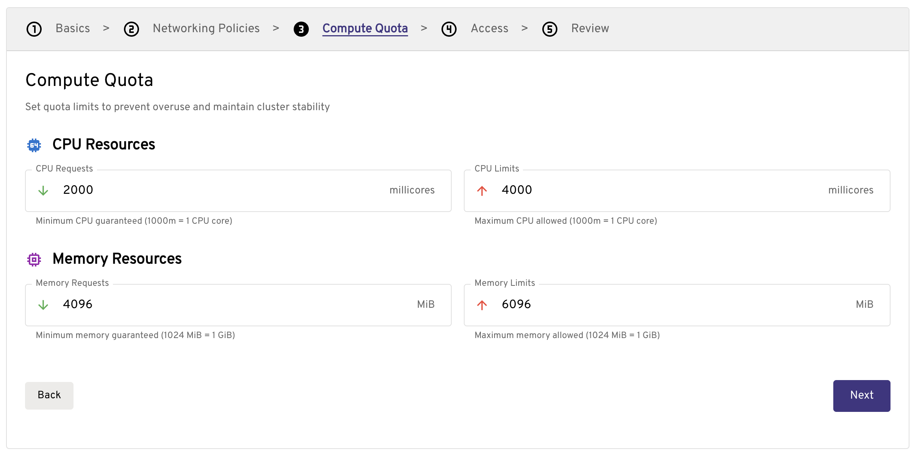
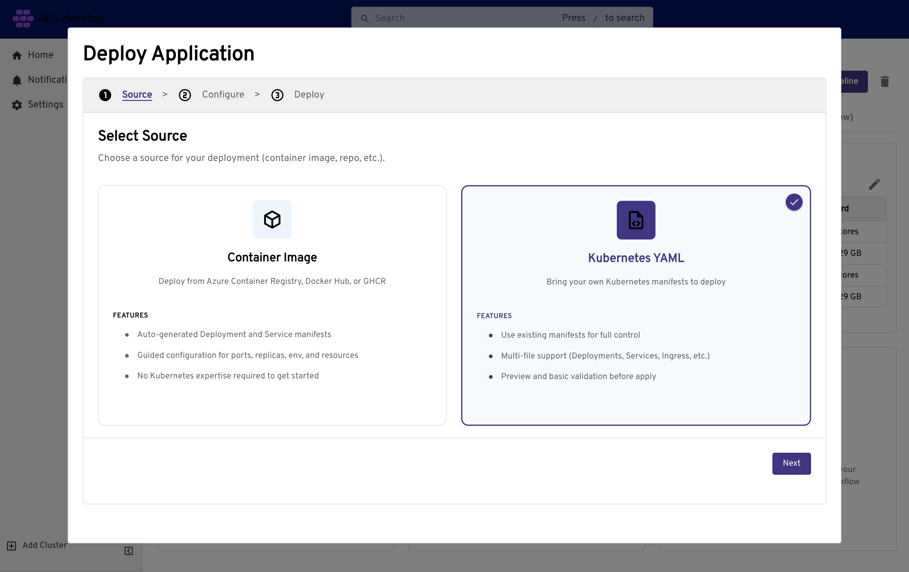
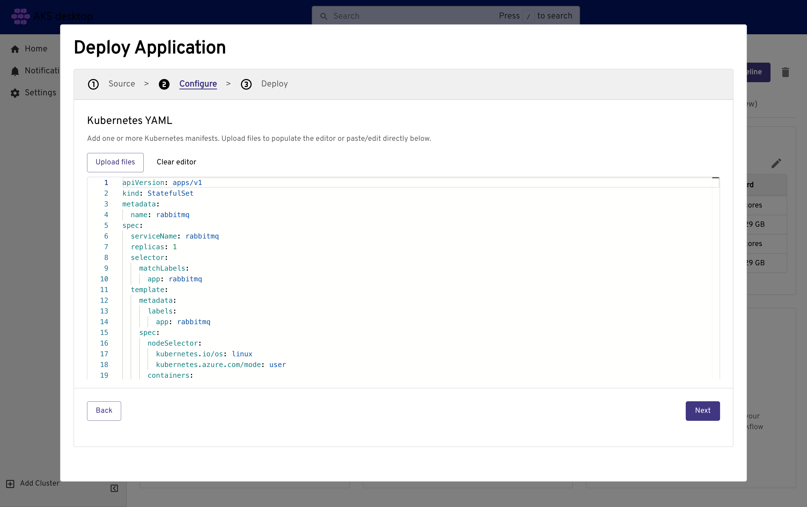
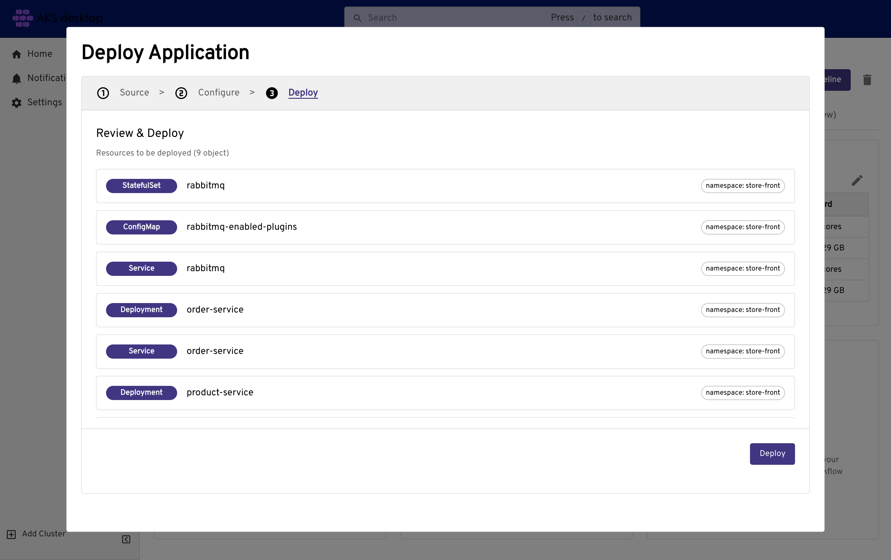
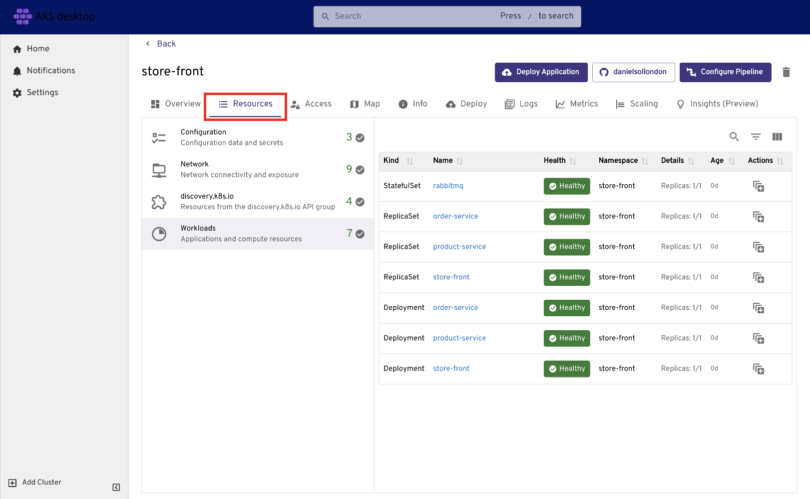
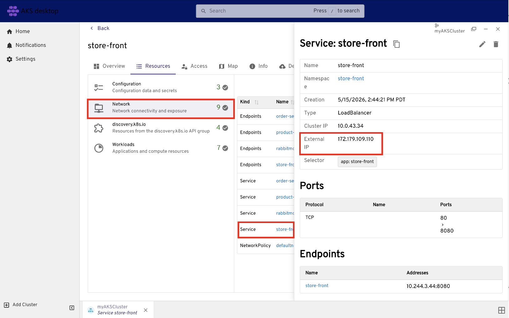
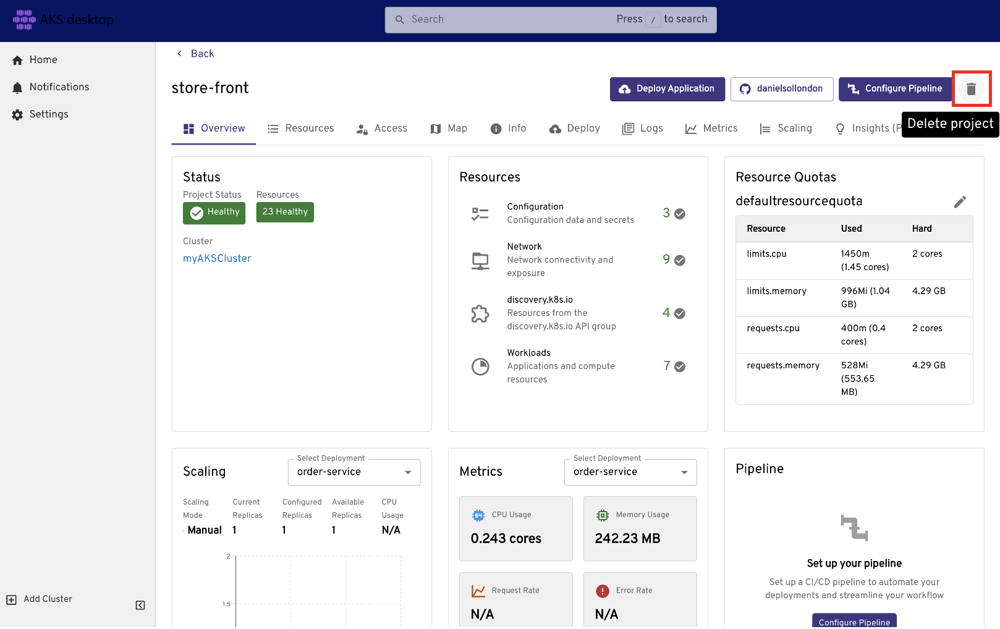

# Tutorial - Deploy an application to Azure Kubernetes Service (AKS)

Kubernetes provides a distributed platform for containerized applications. You build and deploy your own applications and services into a Kubernetes cluster and let the cluster manage the availability and connectivity.

You can deploy the sample application in two ways:
- Deploy directly to the AKS cluster from your workstation.
- Deploy by using automation deployment pipelines. In Azure, you can use:
    - [Azure Pipelines](./devops-pipeline.md)
    - [GitHub Actions](./kubernetes-action.md)
    - [Cloud Native GitOps](/azure/azure-arc/kubernetes/conceptual-gitops-flux2)

In this tutorial, you deploy a sample application into a Kubernetes cluster directly from your workstation and manage the application by using [AKS desktop](./aks-desktop-app.md). You learn how to:

> [!div class="checklist"]
>
> * Update a Kubernetes manifest file.
> * Deploy an application in Kubernetes.
> * Test the application.
> * View application health, logs, metrics, and composition in AKS desktop.

## Before you begin

In previous tutorials, you packaged an application into a container image, uploaded the image to Azure Container Registry, and created a Kubernetes cluster. To complete this tutorial, you need the precreated `aks-store-quickstart.yaml` Kubernetes manifest file. This file was downloaded in the application source code from [Tutorial 1 - Prepare application for AKS][aks-tutorial-prepare-app].

This tutorial creates and updates billable resources, such as LoadBalancer services. Use an identity with permissions to deploy workloads to AKS and read cluster resources.

### [AKS desktop](#tab/aks-desktop)
This tutorial requires the installation of [AKS desktop](./aks-desktop-overview.md).

### [Azure CLI](#tab/azure-cli)

This tutorial requires Azure CLI version 2.0.53 or later. Check your version with `az --version`. To install or upgrade, see [Install Azure CLI][azure-cli-install].

### [Azure PowerShell](#tab/azure-powershell)

This tutorial requires Azure PowerShell version 5.9.0 or later. Check your version with `Get-InstalledModule -Name Az`. To install or upgrade, see [Install Azure PowerShell][azure-powershell-install].

### [Azure Developer CLI](#tab/azure-azd)

This tutorial requires Azure Developer CLI (`azd`) version 1.5.1 or later. Check your version with `azd version`. To install or upgrade, see [Install Azure Developer CLI][azure-azd-install].

---

## Update the manifest file

In these tutorials, your Azure Container Registry (ACR) instance stores the container images for the sample application. To deploy the application, you must update the image names in the Kubernetes manifest file to include your ACR login server name.

### [AKS desktop](#tab/aks-desktop)

1. Make sure you're in the cloned _aks-store-demo_ directory, and then open the `aks-store-quickstart.yaml` manifest file with a text editor.

1. Update the `image` property for the containers by replacing _ghcr.io/azure-samples_ with your ACR login server name.

    ```yaml
    containers:
    ...
    - name: order-service
      image: <acrName>.azurecr.io/aks-store-demo/order-service:1.0
    ...
    - name: product-service
      image: <acrName>.azurecr.io/aks-store-demo/product-service:1.0
    ...
    - name: store-front
      image: <acrName>.azurecr.io/aks-store-demo/store-front:1.0
    ...
    ```

### [Azure CLI](#tab/azure-cli)

1. Make sure you're in the cloned _aks-store-demo_ directory, and then open the `aks-store-quickstart.yaml` manifest file with a text editor.

1. Update the `image` property for the containers by replacing _ghcr.io/azure-samples_ with your ACR login server name.

    ```yaml
    containers:
    ...
    - name: order-service
      image: <acrName>.azurecr.io/aks-store-demo/order-service:1.0
    ...
    - name: product-service
      image: <acrName>.azurecr.io/aks-store-demo/product-service:1.0
    ...
    - name: store-front
      image: <acrName>.azurecr.io/aks-store-demo/store-front:1.0
    ...
    ```

1. Save and close the file.

1. Verify that `aks-store-quickstart.yaml` is in your current directory before you continue.

### [Azure PowerShell](#tab/azure-powershell)


1. Make sure you're in the cloned _aks-store-demo_ directory, and then open the `aks-store-quickstart.yaml` manifest file with a text editor.

1. Update the `image` property for the containers by replacing _ghcr.io/azure-samples_ with your ACR login server name.

    ```yaml
    containers:
    ...
    - name: order-service
      image: <acrName>.azurecr.io/aks-store-demo/order-service:1.0
    ...
    - name: product-service
      image: <acrName>.azurecr.io/aks-store-demo/product-service:1.0
    ...
    - name: store-front
      image: <acrName>.azurecr.io/aks-store-demo/store-front:1.0
    ...
    ```

1. Save and close the file.

1. Verify that `aks-store-quickstart.yaml` is in your current directory before you continue.

### [Azure Developer CLI](#tab/azure-azd)

`azd` doesn't require a container registry step since it's in the template.

---

## Run the application
### [AKS desktop](#tab/aks-desktop)
#### Deploy and manage the application by using AKS desktop
AKS desktop is an application-focused developer portal for Azure Kubernetes Service (AKS) that simplifies application deployment and management without requiring deep Kubernetes expertise.

#### Register your cluster with AKS desktop

1. Make sure you're signed in to AKS desktop with the same account that has access to the AKS cluster. Once signed in, select **Add from Azure Subscription**.
1. Enter the name of your Azure subscription if you have more than one. (Alternatively, select the arrow to open the drop-down list, and then select your Azure subscription.)
1. Select your cluster, and then select **Register Cluster**.

Continue when the cluster status appears as connected in AKS desktop.


#### Create a managed Project in AKS desktop

1. In AKS desktop, go to the **Projects** tab and select **Create a New Managed Project**.
1. Configure the following Project settings:

   - **Basics**:
     - Project Name: For example, `my-dev-frontend`
     - Subscription: `<your-subscription-name>`
     - Cluster: `<your-cluster-name>`

    > [!NOTE]
    > When you set the Azure subscription and AKS cluster, AKS desktop checks for required cluster and subscription feature [support](./aks-desktop-install-cluster-setup.md).

   - **Networking Policies**: You can leave the default settings for this quickstart or update them as needed.
     - To expose the application publicly, change **Ingress** to `Allow all traffic`.

   - **Compute Quota**: Set the values for the test application.
        
   - **Access**: Add someone or delete the entry by deleting the line item.

1. Under **Review**, verify the settings for your Project, and then select **Create Project**.

    :::image type="content" source="./media/aks-desktop-app/aks-desktop-new-project.png" alt-text="Screenshot of creating a new Project in AKS desktop.":::

#### Deploy an application

1. Provide an application name, and then select **Create Application**.

    :::image type="content" source="./media/aks-desktop-app/aks-desktop-deploy-app.png" alt-text="Screenshot of creating a new application in AKS desktop.":::

1. Select a source for your application. For this example, select **Kubernetes YAML** > **Next**.


1. Open `aks-store-quickstart.yaml`, copy and paste its contents into the editor, and then select **Next**.


1. Review the resources that are created, and then select **Deploy** and **Close**.


1. The resources can take a few minutes to deploy. During this time, the project status might show `Degraded` while the cluster scales.

1. Check the status of application resources by selecting **Resources** and then **Workloads**.

    
    You can force a screen refresh by selecting the top window menu option **Navigate** > **Reload**.

1. Select individual workload resources to view their details and events.

### [Azure CLI](#tab/azure-cli)

1. Deploy the application using the [`kubectl apply`][kubectl-apply] command, which parses the manifest file and creates the defined Kubernetes objects.

    ```console
    kubectl apply -f aks-store-quickstart.yaml
    ```

    The following example output shows the resources successfully created in the AKS cluster:

    ```output
    statefulset.apps/rabbitmq created
    service/rabbitmq created
    deployment.apps/order-service created
    service/order-service created
    deployment.apps/product-service created
    service/product-service created
    deployment.apps/store-front created
    service/store-front created
    ```

2. Check the deployment is successful by viewing the pods with the `kubectl get pods` command.

    ```console
    kubectl get pods
    ```

    Make sure the application pods show a `Running` status before you continue.

### [Azure PowerShell](#tab/azure-powershell)

1. Deploy the application using the [`kubectl apply`][kubectl-apply] command, which parses the manifest file and creates the defined Kubernetes objects.

    ```console
    kubectl apply -f aks-store-quickstart.yaml
    ```

    The following example output shows the resources successfully created in the AKS cluster:

    ```output
    statefulset.apps/rabbitmq created
    service/rabbitmq created
    deployment.apps/order-service created
    service/order-service created
    deployment.apps/product-service created
    service/product-service created
    deployment.apps/store-front created
    service/store-front created
    ```

2. Check the deployment is successful by viewing the pods with the `kubectl get pods` command.

    ```console
    kubectl get pods
    ```

    Make sure the application pods show a `Running` status before you continue.

### [Azure Developer CLI](#tab/azure-azd)

Deployment in `azd` is broken down into multiple stages represented by hooks. `azd` deploys with all hooks by default.

1. Deploy the application using the `azd up` command.

    ```azdeveloper
    azd up
    ```

    Continue when `azd up` finishes successfully and prints deployment output.

2. Select which subscription and region to host your Azure resources.

    ```output
    ? Select an Azure Subscription to use:  [Use arrows to move, type to filter]
    > 1. My Azure Subscription (xxxxxxxx-xxxx-xxxx-xxxx-xxxxxxxxxxxx)
    Select an Azure location to use:  [Use arrows to move, type to filter]
    > 43. (US) East US 2 (eastus2)
    ```

    You can update the variables for `AZURE_LOCATION` and `AZURE_SUBSCRIPTION_ID` from inside the `.azure/<your-env-name>/.env` file.

---

## Test the application

When the application runs, a Kubernetes service exposes the application front end to the internet. This process can take a few minutes to complete.

### AKS desktop
1. Get the public IP address from **Resource** > **Network** > **Service: store-front** > **External IP**.
    

1. Explore the application in AKS desktop, such as viewing logs and metrics. For more information, see [AKS desktop overview](./aks-desktop-overview.md).

### Command Line

1. Monitor progress using the [`kubectl get service`][kubectl-get] command with the `--watch` argument.

    ```console
    kubectl get service store-front --watch
    ```

    Initially, the `EXTERNAL-IP` for the `store-front` service shows as `<pending>`:

    ```output
    store-front   LoadBalancer   10.0.34.242   <pending>     80:30676/TCP   5s
    ```

2. When the `EXTERNAL-IP` address changes from `<pending>` to a public IP address, use `CTRL-C` to stop the `kubectl` watch process.

    The following example output shows a valid public IP address assigned to the service:

    ```output
    store-front   LoadBalancer   10.0.34.242   52.179.23.131   80:30676/TCP   67s
    ```

3. View the application in action by opening a web browser and navigating to the external IP address of your service: `http://<external-ip>`.

    :::image type="content" source="./learn/media/quick-kubernetes-deploy-cli/aks-store-application.png" alt-text="Screenshot of AKS Store sample application." lightbox="./learn/media/quick-kubernetes-deploy-cli/aks-store-application.png":::

If the application doesn't load, it might be an authorization problem with your image registry. To view the status of your containers, use the `kubectl get pods` command. If you can't pull the container images, see [Authenticate with Azure Container Registry from Azure Kubernetes Service](cluster-container-registry-integration.md).

### Azure portal

Navigate to the Azure portal to find your deployment information.

1. Navigate to your AKS cluster resource.
2. From the service menu, under **Kubernetes Resources**, select **Services and ingresses**.
3. Copy the External IP shown in the column for the `store-front` service.
4. Paste the IP into your browser to visit your store page.

    :::image type="content" source="./learn/media/quick-kubernetes-deploy-cli/aks-store-application.png" alt-text="Screenshot of AKS Store sample application." lightbox="./learn/media/quick-kubernetes-deploy-cli/aks-store-application.png":::

## Clean up resources

Since you validated the application's functionality, you can now remove the cluster from the application. We will deploy the application again in the next tutorial.

### AKS desktop
> [!NOTE]
> If you want to continue to the next tutorial step, don't delete the AKS desktop project.


If you're finished, select the **Delete** icon. In the confirmation message, select **Also delete the namespace**.


### Command line

1. Stop and remove the container instances and resources using the `kubectl delete` command.

    ```console
    kubectl delete -f aks-store-quickstart.yaml
    ```

2. Check that all the application pods have been removed using the `kubectl get pods` command.

    ```console
    kubectl get pods
    ```

## Next steps

In this tutorial, you deployed a sample Azure application to a Kubernetes cluster in AKS. You learned how to:

> [!div class="checklist"]
>
> * Update a Kubernetes manifest file.
> * Run an application in Kubernetes.
> * Test the application.

In the next tutorial, you learn how to use PaaS services for stateful workloads in Kubernetes.

> [!div class="nextstepaction"]
> [Use PaaS services for stateful workloads in AKS][aks-tutorial-paas]

<!-- LINKS - external -->
[azure-rg]:https://portal.azure.com/#browse/resourcegroups
[kubectl-apply]: https://kubernetes.io/docs/reference/generated/kubectl/kubectl-commands#apply
[kubectl-get]: https://kubernetes.io/docs/reference/generated/kubectl/kubectl-commands#get

<!-- LINKS - internal -->
[aks-tutorial-prepare-app]: ./tutorial-kubernetes-prepare-app.md
[az-acr-list]: /cli/azure/acr
[azure-azd-install]: /azure/developer/azure-developer-cli/install-azd
[azure-cli-install]: /cli/azure/install-azure-cli
[azure-powershell-install]: /powershell/azure/install-az-ps
[get-azcontainerregistry]: /powershell/module/az.containerregistry/get-azcontainerregistry
[gitops-flux-tutorial]: /azure/azure-arc/kubernetes/tutorial-use-gitops-flux2?toc=/azure/aks/toc.json
[gitops-flux-tutorial-aks]: /azure/azure-arc/kubernetes/tutorial-use-gitops-flux2?toc=/azure/aks/toc.json#for-azure-kubernetes-service-clusters
[aks-tutorial-paas]: ./tutorial-kubernetes-paas-services.md
