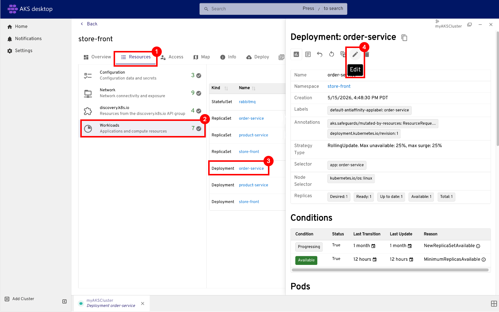
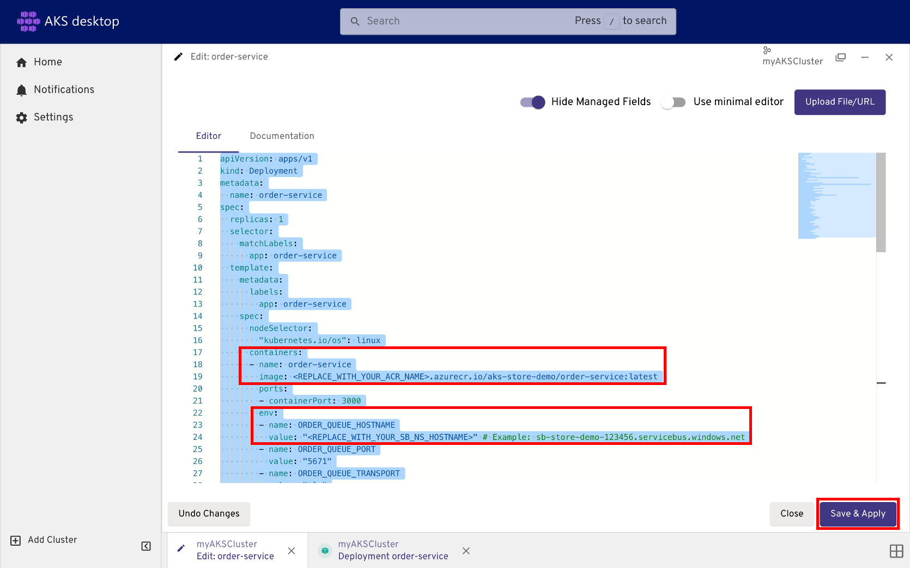

# Tutorial - Use PaaS services with an Azure Kubernetes Service (AKS) cluster

With Kubernetes, you can use PaaS services, such as [Azure Service Bus][azure-service-bus], to develop and run your applications.

In this tutorial, you create an Azure Service Bus namespace and queue to test your application. You learn how to:

> [!div class="checklist"]
>
> * Create an Azure Service Bus namespace and queue.
> * Update the Kubernetes manifest file to use the Azure Service Bus queue.
> * Test the updated application by placing an order.

## Before you begin

In previous tutorials, you packaged an application into a container image, uploaded the image to Azure Container Registry, created a Kubernetes cluster, and deployed an application. To complete this tutorial, you need the pre-created `aks-store-quickstart.yaml` Kubernetes manifest file. This file download was included with the application source code in a previous tutorial. Make sure you cloned the repo and changed directories into the cloned repo. If you haven't completed these steps and want to follow along, start with [Tutorial 1 - Prepare application for AKS][aks-tutorial-prepare-app].

This tutorial creates billable Azure Service Bus resources. To complete these steps, use an identity that can create and manage Service Bus resources and update AKS workloads in your resource group, such as **Contributor** or **Owner**.

### [AKS desktop](#tab/aks-desktop)
This tutorial requires the installation of [AKS desktop](./aks-desktop-overview.md).

### [Azure CLI](#tab/azure-cli)

This tutorial requires Azure CLI version 2.34.1 or later. Run `az --version` to find the version. If you need to install or upgrade, see [Install Azure CLI][azure-cli-install].

### [Azure PowerShell](#tab/azure-powershell)

This tutorial requires Azure PowerShell version 5.9.0 or later. Run `Get-InstalledModule -Name Az` to find the version. If you need to install or upgrade, see [Install Azure PowerShell][azure-powershell-install].

---

## Create environment variables

### [AKS desktop](#tab/aks-desktop)
* Use the Azure CLI to create the following environment variables to use for the commands in this tutorial:

    ```azurecli-interactive
    LOC_NAME=westus2
    RAND=$RANDOM
    RG_NAME=myResourceGroup
    AKS_NAME=myAKSCluster
    SB_NS=sb-store-demo-$RAND
    ```
### [Azure CLI](#tab/azure-cli)

* Create the following environment variables to use for the commands in this tutorial:

    ```azurecli-interactive
    LOC_NAME=westus2
    RAND=$RANDOM
    RG_NAME=myResourceGroup
    AKS_NAME=myAKSCluster
    SB_NS=sb-store-demo-$RAND
    ```

### [Azure PowerShell](#tab/azure-powershell)

* Create the following environment variables to use for the commands in this tutorial:

    ```azurepowershell-interactive
    $LOC_NAME="westus2"
    $rand=New-Object System.Random
    $RAND=$rand.Next()
    $RG_NAME="myResourceGroup"
    $AKS_NAME="myAKSCluster"
    $SB_NS="sb-store-demo-$RAND"
    ```

---

## Create Azure Service Bus namespace and queue

In previous tutorials, you used a RabbitMQ container to store orders submitted by the `order-service`. In this tutorial, you use an Azure Service Bus namespace to provide a scoping container for the Service Bus resources within the application. You also use an Azure Service bus queue to send and receive messages between the application components. For more information on Azure Service Bus, see [Create an Azure Service Bus namespace and queue](/azure/service-bus-messaging/service-bus-quickstart-cli).

In this flow, `order-service` sends messages to the `orders` queue by using the `sender` authorization rule and key that you create in this section.

### [AKS desktop](#tab/aks-desktop)
Use the Azure CLI to create the following environment variables to use for the commands in this tutorial.


1. Create an Azure Service Bus namespace by using the [`az servicebus namespace create`][az-servicebus-namespace-create] command.

    ```azurecli-interactive
    az servicebus namespace create --name $SB_NS --resource-group $RG_NAME --location $LOC_NAME
    ```

    Continue when the command completes successfully and returns the namespace details.

1. Create an Azure Service Bus queue using the [`az servicebus queue create`][az-servicebus-queue-create] command.

    ```azurecli-interactive
    az servicebus queue create --name orders --resource-group $RG_NAME --namespace-name $SB_NS
    ```

    Verify that the queue exists before continuing:

    ```azurecli-interactive
    az servicebus queue show --name orders --resource-group $RG_NAME --namespace-name $SB_NS --query name -o tsv
    ```

1. Create an Azure Service Bus authorization rule using the [`az servicebus queue authorization-rule create`][az-servicebus-queue-authorization-rule-create] command.

    ```azurecli-interactive
    az servicebus queue authorization-rule create \
        --name sender \
        --namespace-name $SB_NS \
        --resource-group $RG_NAME \
        --queue-name orders \
        --rights Send
    ```

1. Get the Azure Service Bus credentials for later use by using the [`az servicebus namespace show`][az-servicebus-namespace-show] and [`az servicebus queue authorization-rule keys list`][az-servicebus-queue-authorization-rule-keys-list] commands.

    ```azurecli-interactive
    az servicebus namespace show --name $SB_NS --resource-group $RG_NAME --query name -o tsv
    az servicebus queue authorization-rule keys list --namespace-name $SB_NS --resource-group $RG_NAME --queue-name orders --name sender --query primaryKey -o tsv
    ```

    Save these values for the manifest update step:
    - `<REPLACE_WITH_YOUR_ACR_NAME>`: your Azure Container Registry name from earlier tutorials.
    - `<REPLACE_WITH_YOUR_SB_NS_HOSTNAME>`: `$SB_NS.servicebus.windows.net`.
    - `<REPLACE_WITH_YOUR_SB_SENDER_PASSWORD>`: the `primaryKey` value from the command output.


### [Azure CLI](#tab/azure-cli)

1. Create an Azure Service Bus namespace using the [`az servicebus namespace create`][az-servicebus-namespace-create] command.

    ```azurecli-interactive
    az servicebus namespace create --name $SB_NS --resource-group $RG_NAME --location $LOC_NAME
    ```

    Continue when the command finishes successfully and returns the namespace details.

2. Create an Azure Service Bus queue using the [`az servicebus queue create`][az-servicebus-queue-create] command.

    ```azurecli-interactive
    az servicebus queue create --name orders --resource-group $RG_NAME --namespace-name $SB_NS
    ```

    Verify that the queue exists before continuing.

    ```azurecli-interactive
    az servicebus queue show --name orders --resource-group $RG_NAME --namespace-name $SB_NS --query name -o tsv
    ```

3. Create an Azure Service Bus authorization rule using the [`az servicebus queue authorization-rule create`][az-servicebus-queue-authorization-rule-create] command.

    ```azurecli-interactive
    az servicebus queue authorization-rule create \
        --name sender \
        --namespace-name $SB_NS \
        --resource-group $RG_NAME \
        --queue-name orders \
        --rights Send
    ```

4. Get the Azure Service Bus credentials for later use by using the [`az servicebus namespace show`][az-servicebus-namespace-show] and [`az servicebus queue authorization-rule keys list`][az-servicebus-queue-authorization-rule-keys-list] commands.

    ```azurecli-interactive
    az servicebus namespace show --name $SB_NS --resource-group $RG_NAME --query name -o tsv
    az servicebus queue authorization-rule keys list --namespace-name $SB_NS --resource-group $RG_NAME --queue-name orders --name sender --query primaryKey -o tsv
    ```

    Save these values for the manifest update step:
    - `<REPLACE_WITH_YOUR_ACR_NAME>`: your Azure Container Registry name from earlier tutorials.
    - `<REPLACE_WITH_YOUR_SB_NS_HOSTNAME>`: `$SB_NS.servicebus.windows.net`.
    - `<REPLACE_WITH_YOUR_SB_SENDER_PASSWORD>`: the `primaryKey` value from the command output.

### [Azure PowerShell](#tab/azure-powershell)

1. Create an Azure Service Bus namespace using the [`New-AzServiceBusNamespace`][new-az-service-bus-namespace] cmdlet.

    ```azurepowershell-interactive
    New-AzServiceBusNamespace -Name $SB_NS -ResourceGroupName $RG_NAME -Location $LOC_NAME
    ```

    Continue when the command completes successfully and returns the namespace details.

2. Create an Azure Service Bus queue using the [`New-AzServiceBusQueue`][new-az-service-bus-queue] cmdlet.

    ```azurepowershell-interactive
    New-AzServiceBusQueue -Name orders -ResourceGroupName $RG_NAME -NamespaceName $SB_NS
    ```

    Verify that the queue exists before continuing:

    ```azurepowershell-interactive
    (Get-AzServiceBusQueue -Name orders -ResourceGroupName $RG_NAME -NamespaceName $SB_NS).Name
    ```

3. Create an Azure Service Bus authorization rule using the [`New-AzServiceBusAuthorizationRule`][new-az-service-bus-authorization-rule] cmdlet.

    ```azurepowershell-interactive
    New-AzServiceBusAuthorizationRule `
        -Name sender `
        -NamespaceName $SB_NS `
        -ResourceGroupName $RG_NAME `
        -QueueName orders `
        -Rights Send
    ```

4. Get the Azure Service Bus credentials for later use by using the [`Get-AzServiceBusNamespace`][get-az-service-bus-namespace] and [`Get-AzServiceBusKey`][get-az-service-bus-key] cmdlets.

    ```azurepowershell-interactive
    (Get-AzServiceBusNamespace -Name $SB_NS -ResourceGroupName $RG_NAME).Name 
    (Get-AzServiceBusKey -NamespaceName $SB_NS -ResourceGroupName $RG_NAME -Name sender -QueueName orders).PrimaryKey
    ```

    Save these values for the manifest update step:
    - `<REPLACE_WITH_YOUR_ACR_NAME>`: your Azure Container Registry name from earlier tutorials.
    - `<REPLACE_WITH_YOUR_SB_NS_HOSTNAME>`: `$SB_NS.servicebus.windows.net`.
    - `<REPLACE_WITH_YOUR_SB_SENDER_PASSWORD>`: the `PrimaryKey` value from the command output.

---
## Update Kubernetes manifest file

### [AKS desktop](#tab/aks-desktop)
1. Go to **Projects** in AKS desktop and select the one you created in the previous tutorial, `my-dev-frontend`.

1. Select the **Resources** tab, and then select **Workloads** > **Deployment: order-service**.


1. Select the **Editor**.

1. Remove the existing `rabbitmq` StatefulSet, ConfigMap, and Service sections. Replace the existing `order-service` Deployment section with the following content. Copy and paste the content:

    ```yaml
    apiVersion: apps/v1
    kind: Deployment
    metadata:
      name: order-service
    spec:
      replicas: 1
      selector:
        matchLabels:
          app: order-service
      template:
        metadata:
          labels:
            app: order-service
        spec:
          nodeSelector:
            "kubernetes.io/os": linux
          containers:
          - name: order-service
            image: <REPLACE_WITH_YOUR_ACR_NAME>.azurecr.io/aks-store-demo/order-service:latest
            ports:
            - containerPort: 3000
            env:
            - name: ORDER_QUEUE_HOSTNAME
              value: "<REPLACE_WITH_YOUR_SB_NS_HOSTNAME>" # Example: sb-store-demo-123456.servicebus.windows.net
            - name: ORDER_QUEUE_PORT
              value: "5671"
            - name: ORDER_QUEUE_TRANSPORT
              value: "tls"
            - name: ORDER_QUEUE_USERNAME
              value: "sender"
            - name: ORDER_QUEUE_PASSWORD
              value: "<REPLACE_WITH_YOUR_SB_SENDER_PASSWORD>"
            - name: ORDER_QUEUE_NAME
              value: "orders"
            - name: FASTIFY_ADDRESS
              value: "0.0.0.0"
            resources:
              requests:
                cpu: 1m
                memory: 50Mi
              limits:
                cpu: 75m
                memory: 128Mi
            startupProbe:
              httpGet:
                path: /health
                port: 3000
              failureThreshold: 5
              initialDelaySeconds: 20
              periodSeconds: 10
            readinessProbe:
              httpGet:
                path: /health
                port: 3000
              failureThreshold: 3
              initialDelaySeconds: 3
              periodSeconds: 5
            livenessProbe:
              httpGet:
                path: /health
                port: 3000
              failureThreshold: 5
              initialDelaySeconds: 3
              periodSeconds: 3
    ```
    
    
    > [!NOTE]
    > Directly adding sensitive information, such as API keys, to your Kubernetes manifest files isn't secure and might accidentally get committed to code repositories. This example adds it for simplicity. For production workloads, use [Managed Identity](./use-managed-identity.md) to authenticate with Azure Service Bus or store your secrets in [Azure Key Vault](./csi-secrets-store-driver.md).

1. Persist the update by selecting **Save & Apply**.

1. Verify that the updated `order-service` deployment reaches a healthy state in the workload view before continuing.


### [Azure CLI](#tab/azure-cli)

1. Configure `kubectl` to connect to your cluster using the [`az aks get-credentials`][az-aks-get-credentials] command.

    ```azurecli-interactive
    az aks get-credentials --resource-group myResourceGroup --name myAKSCluster
    ```

1. Open the `aks-store-quickstart.yaml` file in a text editor.
1. Remove the existing `rabbitmq` StatefulSet, ConfigMap, and Service sections. Replace the existing `order-service` Deployment section with the following content:

  Replace the placeholders in the YAML with the values you saved earlier before you apply the manifest.

  ```yaml
    apiVersion: apps/v1
    kind: Deployment
    metadata:
      name: order-service
    spec:
      replicas: 1
      selector:
        matchLabels:
          app: order-service
      template:
        metadata:
          labels:
            app: order-service
        spec:
          nodeSelector:
            "kubernetes.io/os": linux
          containers:
          - name: order-service
            image: <REPLACE_WITH_YOUR_ACR_NAME>.azurecr.io/aks-store-demo/order-service:latest
            ports:
            - containerPort: 3000
            env:
            - name: ORDER_QUEUE_HOSTNAME
              value: "<REPLACE_WITH_YOUR_SB_NS_HOSTNAME>" # Example: sb-store-demo-123456.servicebus.windows.net
            - name: ORDER_QUEUE_USERNAME
              value: "sender"
            - name: ORDER_QUEUE_PASSWORD
              value: "<REPLACE_WITH_YOUR_SB_SENDER_PASSWORD>"
            - name: ORDER_QUEUE_NAME
              value: "orders"
            - name: FASTIFY_ADDRESS
              value: "0.0.0.0"
            resources:
              requests:
                cpu: 1m
                memory: 50Mi
              limits:
                cpu: 75m
                memory: 128Mi
            startupProbe:
              httpGet:
                path: /health
                port: 3000
              failureThreshold: 5
              initialDelaySeconds: 20
              periodSeconds: 10
            readinessProbe:
              httpGet:
                path: /health
                port: 3000
              failureThreshold: 3
              initialDelaySeconds: 3
              periodSeconds: 5
            livenessProbe:
              httpGet:
                path: /health
                port: 3000
              failureThreshold: 5
              initialDelaySeconds: 3
              periodSeconds: 3
  ```

  > [!NOTE]
  > Directly adding sensitive information, such as API keys, to your Kubernetes manifest files isn't secure and may accidentally get committed to code repositories. We added it here for simplicity. For production workloads, use [Managed Identity](./use-managed-identity.md) to authenticate with Azure Service Bus or store your secrets in [Azure Key Vault](./csi-secrets-store-driver.md).

1. Save and close the updated `aks-store-quickstart.yaml` file.

### [Azure PowerShell](#tab/azure-powershell)

1. Configure `kubectl` to connect to your cluster using the [`Import-AzAksCredential`][import-azakscredential] cmdlet.

    ```azurepowershell-interactive
    Import-AzAksCredential -ResourceGroupName myResourceGroup -Name myAKSCluster
    ```

2. Open the `aks-store-quickstart.yaml` file in a text editor.
3. Remove the existing `rabbitmq` Deployment and Service sections and replace the existing `order-service` Deployment section with the following content:

  Replace the placeholders in the YAML with the values you saved earlier before you apply the manifest.

  ```YAML
    apiVersion: apps/v1
    kind: Deployment
    metadata:
      name: order-service
    spec:
      replicas: 1
      selector:
        matchLabels:
          app: order-service
      template:
        metadata:
          labels:
            app: order-service
        spec:
          nodeSelector:
            "kubernetes.io/os": linux
          containers:
          - name: order-service
            image: <REPLACE_WITH_YOUR_ACR_NAME>.azurecr.io/aks-store-demo/order-service:latest
            ports:
            - containerPort: 3000
            env:
            - name: ORDER_QUEUE_HOSTNAME
              value: "<REPLACE_WITH_YOUR_SB_NS_HOSTNAME>" # Example: sb-store-demo-123456.servicebus.windows.net
            - name: ORDER_QUEUE_USERNAME
              value: "sender"
            - name: ORDER_QUEUE_PASSWORD
              value: "<REPLACE_WITH_YOUR_SB_SENDER_PASSWORD>"
            - name: ORDER_QUEUE_NAME
              value: "orders"
            - name: FASTIFY_ADDRESS
              value: "0.0.0.0"
            resources:
              requests:
                cpu: 1m
                memory: 50Mi
              limits:
                cpu: 75m
                memory: 128Mi
  ```

  > [!NOTE]
  > Directly adding sensitive information, such as API keys, to your Kubernetes manifest files isn't secure and may accidentally get committed to code repositories. We added it here for simplicity. For production workloads, use [Managed Identity](./use-managed-identity.md) to authenticate with Azure Service Bus or store your secrets in [Azure Key Vault](./csi-secrets-store-driver.md).

4. Save and close the updated `aks-store-quickstart.yaml` file.

---

## Deploy the updated application

1. Deploy the updated application by using the `kubectl apply` command.

    ```console
    kubectl apply -f aks-store-quickstart.yaml
    ```

    The following example output shows the successfully updated resources:

    ```output
    deployment.apps/order-service configured
    service/order-service unchanged
    deployment.apps/product-service unchanged
    service/product-service unchanged
    deployment.apps/store-front configured
    service/store-front unchanged
    ```

  1. Verify that the updated deployment is running.

      ```console
      kubectl get pods
      ```

  Continue when the application pods are in `Running` state.

## Test the application

### Place a sample order

#### AKS desktop
Get the public IP address by going to **Resource** > **Network** > **Service: store-front** > **External IP**.


#### Command line
1. Get the external IP address of the `store-front` service using the `kubectl get service` command.

    ```console
    kubectl get service store-front
    ```

    If `EXTERNAL-IP` is `<pending>`, wait a minute and run the command again until a public IP address appears.

2. Navigate to the external IP address of the `store-front` service in your browser using `http://<external-ip>`.
3. Place an order by choosing a product and selecting **Add to cart**.
4. Select **Cart** to view your order, and then select **Checkout**.

### View the order in the Azure Service Bus queue

1. Navigate to the Azure portal and open the Azure Service Bus namespace you created earlier.
2. Under **Entities**, select **Queues**, and then select the **orders** queue.
3. In the **orders** queue, select **Service Bus Explorer**.
4. Select **Peek from start** to view the order you submitted.

## Next steps

In this tutorial, you used Azure Service Bus to update and test the sample application. You learned how to:

> [!div class="checklist"]
>
> * Create an Azure Service Bus namespace and queue.
> * Update the Kubernetes manifest file to use the Azure Service Bus queue.
> * Test the updated application by placing an order.

In the next tutorial, you learn how to scale an application in AKS.

> [!div class="nextstepaction"]
> [Scale applications in AKS][aks-tutorial-scale]

<!-- LINKS - external -->

<!-- LINKS - internal -->
[aks-tutorial-prepare-app]: ./tutorial-kubernetes-prepare-app.md
[azure-cli-install]: /cli/azure/install-azure-cli
[azure-powershell-install]: /powershell/azure/install-az-ps
[aks-tutorial-scale]: ./tutorial-kubernetes-scale.md
[azure-service-bus]: /azure/service-bus-messaging/service-bus-messaging-overview
[az-servicebus-namespace-create]: /cli/azure/servicebus/namespace#az-servicebus-namespace-create
[az-servicebus-queue-create]: /cli/azure/servicebus/queue#az-servicebus-queue-create
[az-servicebus-queue-authorization-rule-create]: /cli/azure/servicebus/queue/authorization-rule#az-servicebus-queue-authorization-rule-create
[az-servicebus-namespace-show]: /cli/azure/servicebus/namespace#az-servicebus-namespace-show
[az-servicebus-queue-authorization-rule-keys-list]: /cli/azure/servicebus/queue/authorization-rule/keys#az-servicebus-queue-authorization-rule-keys-list
[new-az-service-bus-namespace]: /powershell/module/az.servicebus/new-azservicebusnamespace
[new-az-service-bus-queue]: /powershell/module/az.servicebus/new-azservicebusqueue
[new-az-service-bus-authorization-rule]: /powershell/module/az.servicebus/new-azservicebusauthorizationrule
[get-az-service-bus-queue]: /powershell/module/az.servicebus/get-azservicebusqueue
[get-az-service-bus-namespace]: /powershell/module/az.servicebus/get-azservicebusnamespace
[get-az-service-bus-key]: /powershell/module/az.servicebus/get-azservicebuskey
[import-azakscredential]: /powershell/module/az.aks/import-azakscredential
[az-aks-get-credentials]: /cli/azure/aks#az-aks-get-credentials
[az-servicebus-queue-show]: /cli/azure/servicebus/queue#az-servicebus-queue-show

