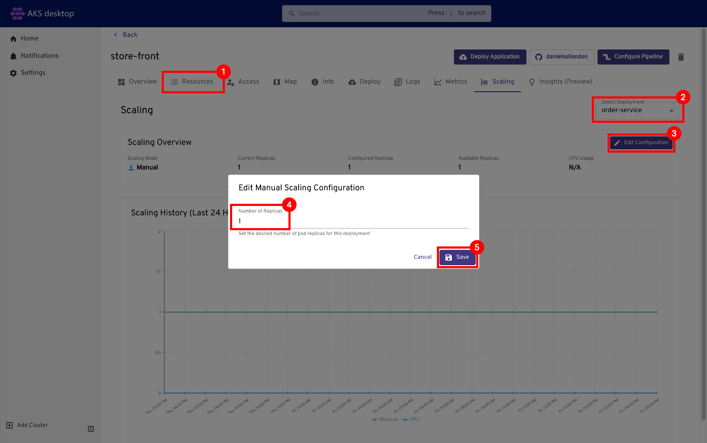
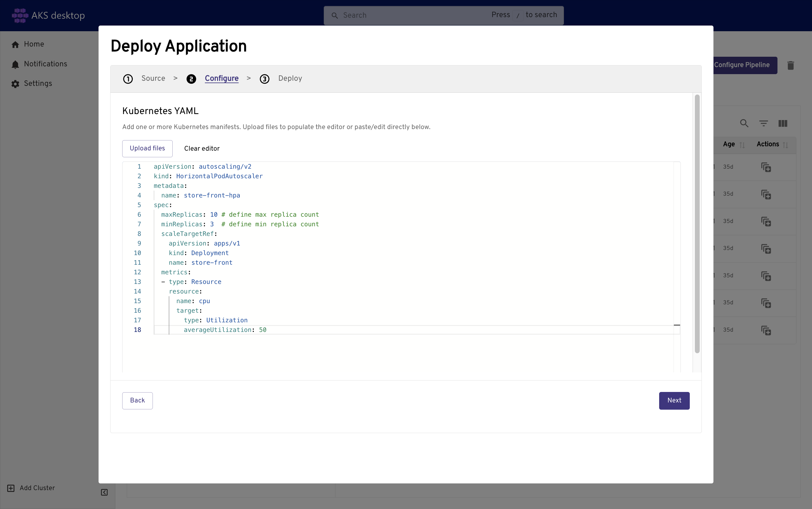
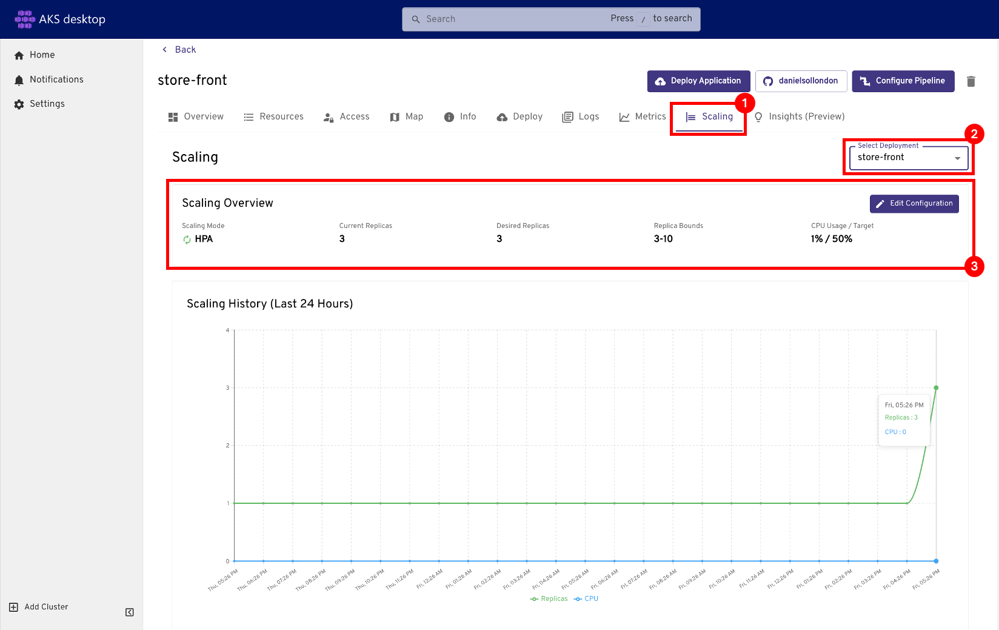

# Tutorial - Scale applications in Azure Kubernetes Service (AKS)

If you followed the previous tutorials, you have a working Kubernetes cluster and Azure Store Front app.

In this tutorial, you scale out the pods in the app, try pod autoscaling, and scale the number of Azure VM nodes to change the cluster's capacity for hosting workloads. You learn how to:

> [!div class="checklist"]
>
> * Scale the Kubernetes nodes.
> * Manually scale Kubernetes pods that run your application.
> * Configure autoscaling pods that run the app front end.

## Before you begin

In previous tutorials, you packaged an application into a container image, uploaded the image to Azure Container Registry, created an AKS cluster, deployed an application, and used Azure Service Bus to redeploy an updated application. If you haven't completed these steps and want to follow along, start with [Tutorial 1 - Prepare application for AKS][aks-tutorial-prepare-app].

This tutorial changes pod and node counts and can increase compute costs. Use an identity with permission to scale AKS workloads and node pools, such as **Contributor** or **Owner** for the resource group.


### [Azure CLI](#tab/azure-cli)

This tutorial requires Azure CLI version 2.34.1 or later. Run `az --version` to find the version. If you need to install or upgrade, see [Install Azure CLI][azure-cli-install].

### [Azure PowerShell](#tab/azure-powershell)

This tutorial requires Azure PowerShell version 5.9.0 or later. Run `Get-InstalledModule -Name Az` to find the version. If you need to install or upgrade, see [Install Azure PowerShell][azure-powershell-install].

---

## Manually scale pods

### AKS desktop
1. Edit the scaling configuration for the order-service by selecting **Scaling** > **Select Deployment: order-service** > **Edit Configuration** > **Number of Replicas: 5**.


1. Verify that the deployment update completes before continuing.

1. View the pods in your cluster using the [`kubectl get`][kubectl-get] command.

    ```console
    kubectl get pods
    ```

    The following example output shows the pods running the Azure Store Front app:

    ```output
    NAME                               READY     STATUS     RESTARTS   AGE
    order-service-848767080-tf34m      1/1       Running    0          31m
    product-service-4019737227-2q2qz   1/1       Running    0          31m
    store-front-2606967446-2q2qz       1/1       Running    0          31m
    ```

2. Manually change the number of pods in the *store-front* deployment using the [`kubectl scale`][kubectl-scale] command.

    ```console
    kubectl scale --replicas=5 deployment.apps/store-front
    ```

3. Verify the additional pods were created using the [`kubectl get pods`][kubectl-get] command.

    ```console
    kubectl get pods --selector app=store-front
    ```

    The following example output shows the additional pods running the Azure Store Front app:

    ```output
    NAME                              READY     STATUS    RESTARTS   AGE
    store-front-3309479140-2hfh0      1/1       Running   0          3m
    store-front-3309479140-bzt05      1/1       Running   0          3m
    store-front-3309479140-fvcvm      1/1       Running   0          3m
    store-front-3309479140-hrbf2      1/1       Running   0          15m
    store-front-3309479140-qphz8      1/1       Running   0          3m
    ```

## Autoscale pods

### AKS desktop
1. Within the Project, select the **Deploy Application** button > **Kubernetes YAML**.


1. Copy and paste this YAML autoscaler manifest and resource limits.
    ```yaml
    apiVersion: autoscaling/v2
    kind: HorizontalPodAutoscaler
    metadata:
      name: store-front-hpa
    spec:
      maxReplicas: 10 # define max replica count
      minReplicas: 3  # define min replica count
      scaleTargetRef:
        apiVersion: apps/v1
        kind: Deployment
        name: store-front
      metrics:
      - type: Resource
        resource:
          name: cpu
          target:
            type: Utilization
            averageUtilization: 50
    ```
1. Select **Next** > **Deploy** > **Close**.
  

1. Select **Scaling** > **Select Deployment: store-front**. You can see the scaling mode is now set to **HPA**, Replica Bounds, and CPU Usage / Target set by the configuration.
  

1. Verify that HPA mode is enabled and the replica bounds match the manifest values.


### Command line

To use the horizontal pod autoscaler, all containers must have defined CPU requests and limits, and pods must have specified requests. In the `aks-store-quickstart` deployment, the *front-end* container requests 1m CPU with a limit of 1000m CPU.

These resource requests and limits are defined for each container, as shown in the following condensed example YAML:

```yaml
...
  containers:
  - name: store-front
    image: ghcr.io/azure-samples/aks-store-demo/store-front:latest
    ports:
    - containerPort: 8080
      name: store-front
...
    resources:
      requests:
        cpu: 1m
...
      limits:
        cpu: 1000m
...
```

### Autoscale pods using a manifest file

1. Create a manifest file to define the autoscaler behavior and resource limits, as shown in the following condensed example manifest file `aks-store-quickstart-hpa.yaml`:

    ```yaml
    apiVersion: autoscaling/v2
    kind: HorizontalPodAutoscaler
    metadata:
      name: store-front-hpa
    spec:
      maxReplicas: 10 # define max replica count
      minReplicas: 3  # define min replica count
      scaleTargetRef:
        apiVersion: apps/v1
        kind: Deployment
        name: store-front
      metrics:
      - type: Resource
        resource:
          name: cpu
          target:
            type: Utilization
            averageUtilization: 50
    ```

2. Apply the autoscaler manifest file using the `kubectl apply` command.

    ```console
    kubectl apply -f aks-store-quickstart-hpa.yaml
    ```

3. Check the status of the autoscaler using the `kubectl get hpa` command.

    ```console
    kubectl get hpa
    ```

    After a few minutes, with minimal load on the Azure Store Front app, the number of pod replicas decreases to three. You can use `kubectl get pods` command again to see the unneeded pods being removed.

    Continue when the `TARGETS` and `REPLICAS` columns show expected autoscaling behavior for `store-front-hpa`.

> [!NOTE]
> You can enable the Kubernetes-based Event-Driven Autoscaler (KEDA) AKS add-on to your cluster to drive scaling based on the number of events needing to be processed. For more information, see [Enable simplified application autoscaling with the Kubernetes Event-Driven Autoscaling (KEDA) add-on (Preview)][keda-addon].

## Manually scale AKS nodes
> [!NOTE]
> If you created an AKS Automatic cluster, these steps don't apply because the cluster autoscales nodes.

If you created your AKS Standard cluster by using the commands in the previous tutorials, your cluster has three nodes. If you want to increase or decrease this amount, you can manually adjust the number of nodes.

The following example increases the number of nodes to five in the Kubernetes cluster named *myAKSCluster*. The command takes a couple of minutes to complete.

### [Azure CLI](#tab/azure-cli)

* Scale your cluster nodes using the [`az aks scale`][az-aks-scale] command.

    Once the cluster scales successfully, your output is similar to the following example output:

  ```azurecli-interactive
  az aks nodepool list --resource-group myResourceGroup --cluster-name myAKSCluster --query "[].{name:name,count:count}" -o table
  ```

    ```azurecli-interactive
    az aks scale --resource-group myResourceGroup --name myAKSCluster --node-count 5
    ```

    Once the cluster successfully scales, your output will be similar to following example output:

    ```output
    "aadProfile": null,
    "addonProfiles": null,
    "agentPoolProfiles": [
      {
        ...
        "count": 5,
        "mode": "System",
        "name": "nodepool1",
        "osDiskSizeGb": 128,
        "osDiskType": "Managed",
        "osType": "Linux",
        "ports": null,
        "vmSize": "Standard_DS2_v2",
        "vnetSubnetId": null
        ...
      }
      ...
    ]
    ```

### [Azure PowerShell](#tab/azure-powershell)

* Scale your cluster nodes using the [`Get-AzAksCluster`][get-azakscluster] and [`Set-AzAksCluster`][set-azakscluster] cmdlets.

    Once the cluster scales successfully, your output is similar to the following example output:

  ```azurepowershell-interactive
  (Get-AzAksCluster -ResourceGroupName myResourceGroup -Name myAKSCluster).AgentPoolProfiles | Select-Object Name,Count
  ```

    ```azurepowershell-interactive
    Get-AzAksCluster -ResourceGroupName myResourceGroup -Name myAKSCluster | Set-AzAksCluster -NodeCount 5
    ```

    Once the cluster successfully scales, your output will be similar to following example output:

    ```output
    ...
    ProvisioningState        : Succeeded
    MaxAgentPools            : 100
    KubernetesVersion        : 1.28
    CurrentKubernetesVersion : 1.28.9
    DnsPrefix                : myAKSCluster
    Fqdn                     : myakscluster-000a0aa0.hcp.eastus.azmk8s.io
    PrivateFQDN              :
    AzurePortalFQDN          : myakscluster-000a0aa0.portal.hcp.eastus.azmk8s.io
    AgentPoolProfiles        : {default}
    ...
    ResourceGroupName        : myResourceGroup
    Id                       : /subscriptions/aaaa0a0a-bb1b-cc2c-dd3d-eeeeee4e4e4e/resourcegroups/myResourceGroup/providers/Mic
                               rosoft.ContainerService/managedClusters/myAKSCluster
    Name                     : myAKSCluster
    Type                     : Microsoft.ContainerService/ManagedClusters
    Location                 : eastus
    Tags                     :
    ```

---

You can also autoscale the nodes in your cluster. For more information, see [Use the cluster autoscaler with node pools](./cluster-autoscaler.md#use-the-cluster-autoscaler-on-node-pools).

## Next steps

In this tutorial, you used different scaling features in your Kubernetes cluster. You learned how to:

> [!div class="checklist"]
>
> * Manually scale Kubernetes pods that run your application.
> * Configure autoscaling pods that run the app front end.
> * Manually scale the Kubernetes nodes.

If you're finished, select the **Delete** icon, and in the confirmation message select **Also delete the namespace**.


In the next tutorial, you learn how to upgrade Kubernetes in your AKS cluster.

> [!div class="nextstepaction"]
> [Upgrade Kubernetes in Azure Kubernetes Service][aks-tutorial-upgrade-kubernetes]

<!-- LINKS - external -->
[kubectl-get]: https://kubernetes.io/docs/reference/generated/kubectl/kubectl-commands#get
[kubectl-scale]: https://kubernetes.io/docs/reference/generated/kubectl/kubectl-commands#scale

<!-- LINKS - internal -->
[aks-tutorial-prepare-app]: ./tutorial-kubernetes-prepare-app.md
[az-aks-scale]: /cli/azure/aks#az-aks-scale
[azure-cli-install]: /cli/azure/install-azure-cli
[azure-powershell-install]: /powershell/azure/install-az-ps
[get-azakscluster]: /powershell/module/az.aks/get-azakscluster
[set-azakscluster]: /powershell/module/az.aks/set-azakscluster
[aks-tutorial-upgrade-kubernetes]: ./tutorial-kubernetes-upgrade-cluster.md
[keda-addon]: ./keda-about.md
