# How Azure Kubernetes Service (AKS) cluster upgrades work

Azure Kubernetes Service (AKS) performs rolling upgrades to minimize disruption to running workloads.

For most production workloads, AKS Automatic is the recommended default where applicable. AKS Automatic includes production-ready defaults for upgrade operations, such as automatic Kubernetes version upgrades, automatic node operating system (OS) image updates, managed system node operations, and built-in safeguards that reduce manual overhead. For more information, see [Introduction to AKS Automatic](./intro-aks-automatic.md).

This article explains AKS upgrade mechanics and highlights where AKS Automatic and AKS Standard differ.

## Prerequisites

- Understanding of [Kubernetes upgrade best practices](./upgrade-cluster.md)
- Familiarity with [Pod Disruption Budgets (PDBs)](./operator-best-practices-scheduler.md#plan-for-availability-using-pod-disruption-budgets)

## Upgrade model: AKS Automatic and AKS Standard

The AKS Automatic and AKS Standard cluster modes use the same Kubernetes upgrade fundamentals, but they differ in defaults and operational ownership.

| Upgrade concern | AKS Automatic | AKS Standard |
| --------------- | ------------- | ------------- |
| Production positioning | Recommended default for most production workloads where applicable | Flexible model with more manual configuration by default |
| Kubernetes minor version upgrades | Preconfigured automatic upgrade channel | Manual by default, optional automatic channel |
| Node OS image upgrades | Preconfigured automatic node OS image channel | Manual by default, optional automatic channel |
| System node pool operations | Managed by AKS | Managed by customer |
| Planned maintenance windows | Available by default | Optional configuration |
| Workload disruption controls | Customer owned, including replica strategy, readiness behavior, and disruption policy | Customer owned, including replica strategy, readiness behavior, and disruption policy |

> [!NOTE]
> AKS Automatic simplifies platform operations, but shared responsibility still applies. Workload-level availability design and eviction policy behavior remain customer responsibilities.

## Rolling upgrade behavior in AKS

AKS upgrades node pools by using a rolling pattern that keeps capacity while it replaces or reimages nodes. This behavior is the same across all AKS cluster modes.

At a high level, AKS:

1. Adds temporary surge capacity based on upgrade settings.
1. Cordons and drains nodes to move workloads.
1. Reimages or replaces nodes to the target version.
1. Removes temporary surge capacity after completion.

### Rolling upgrade example

This example demonstrates upgrading a two-node cluster from Kubernetes 1.30 to 1.31 with `maxSurge` set to `1`.

#### Step 1: Initial setup

The cluster starts with two nodes running version 1.30, each hosting application pods.

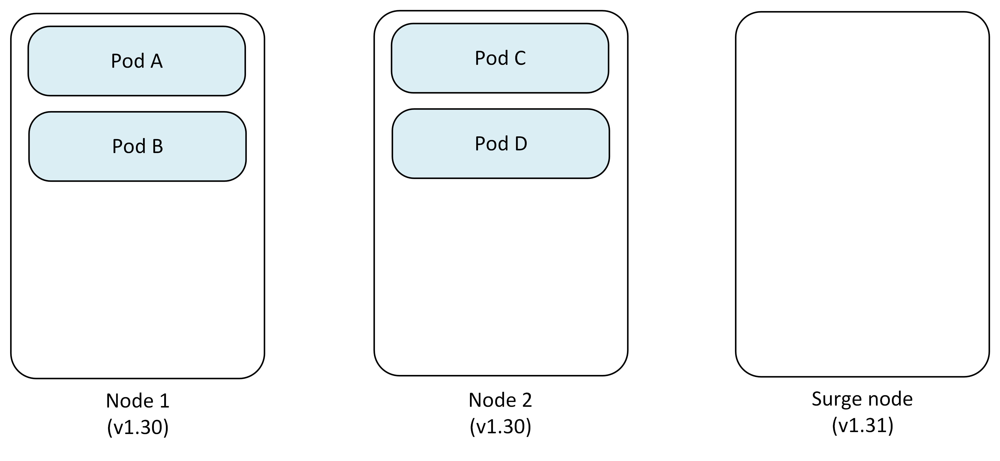

- **Node 1**: Pod A, Pod B
- **Node 2**: Pod C, Pod D
- **Surge Node**: Empty (except for DaemonSets and new pods)

#### Step 2: Cordon and drain first node

AKS cordons Node 1 to prevent new pod scheduling, then drains existing pods.

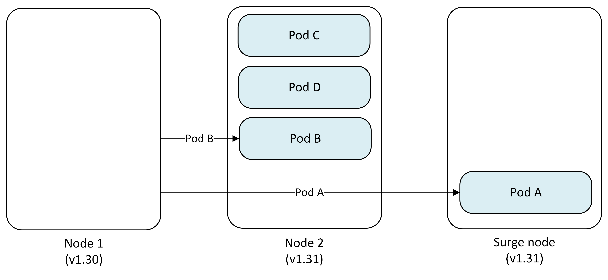

- **Pod A** → Evicted and replaced on Surge Node
- **Pod B** → Evicted and replaced on Node 2

#### Step 3: Upgrade first node

Node 1 is reimaged with Kubernetes version 1.31 while pods continue running on other nodes.

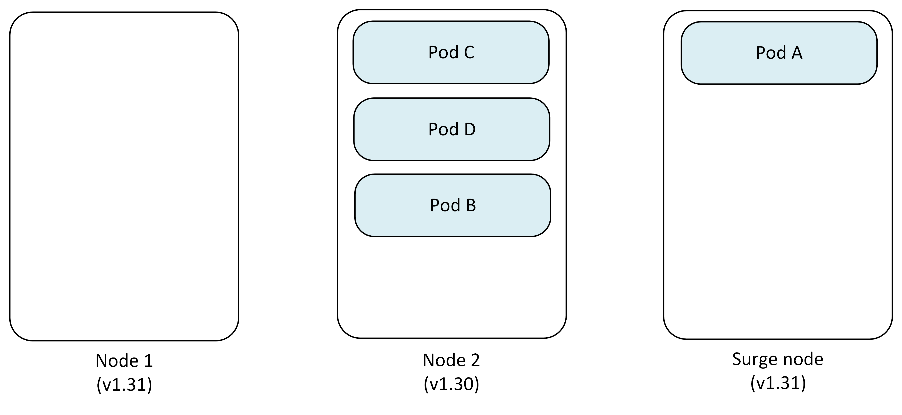

- **Node 1**: Upgraded to v1.31
- **Node 2**: Pod B, Pod C, Pod D
- **Surge Node**: Pod A

#### Step 4: Cordon and drain second node

AKS repeats the process for Node 2, pods get evicted and the scheduler redistributes them to appropriate available nodes.

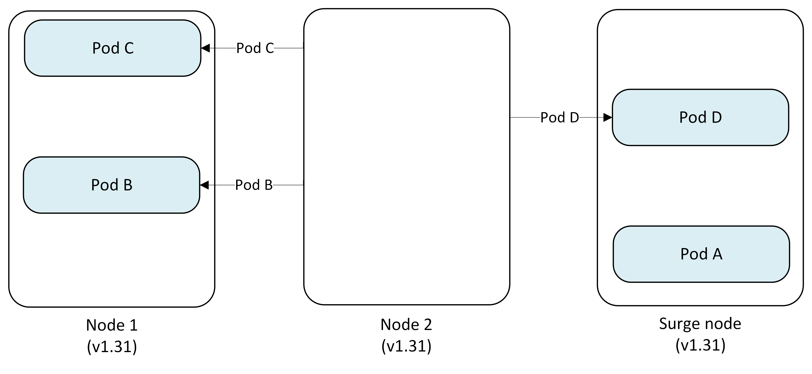

- **Pod C, B** → Evicted and replaced on Node 1
- **Pod D** → Evicted and replaced on Surge Node
- **Node 2**: Cordoned and reimaged to v1.31

#### Step 5: Remove surge node

After all permanent nodes are upgraded, the Surge Node is cordoned, drained and deleted.

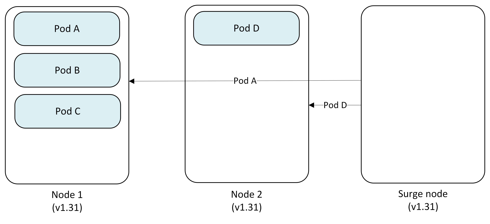

- **Pod A** → Evicted and replaced on Node 1
- **Pod D** → Evicted and replaced on Node 2
- **Surge Node**: Deleted

#### Final state

All nodes are now running Kubernetes version 1.31 with pods scheduled across the cluster.

- **Node 1 (v1.31)**: Pod A, Pod C
- **Node 2 (v1.31)**: Pod B, Pod D

## Restrictive Pod Disruption Budget (PDB) behavior

If a restrictive PDB blocks eviction, node draining can be delayed or prevented. AKS can use the `Cordon` undrainable node behavior to continue upgrading other eligible nodes depending on the configured behavior. Blocked nodes might remain on an older version until the blocking condition is resolved.

### Restrictive PDB example

This example shows upgrading a two-node cluster from Kubernetes 1.30 to 1.31 with `maxSurge` set to `2` and a PDB blocking the first node's drain operation.

#### Step 1: Initial setup with restrictive PDB

The cluster starts with two nodes running version 1.30, with a PDB protecting Pod A from eviction.

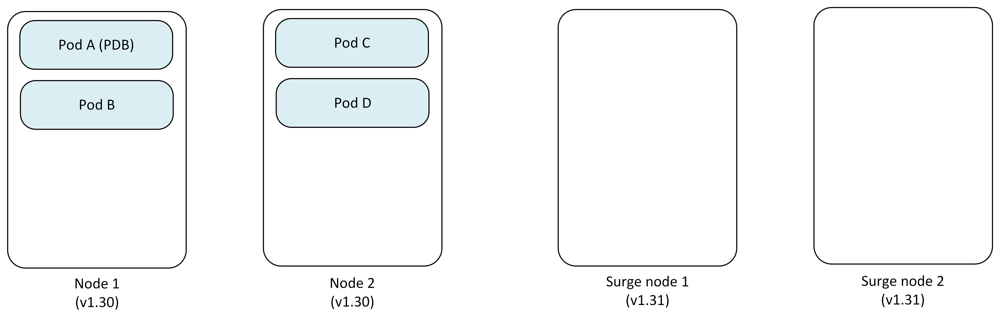

- **Node 1**: Pod A (protected by PDB), Pod B
- **Node 2**: Pod C, Pod D
- **Surge Nodes**: Newly created 2 nodes
- **PDB**: Prevents Pod A eviction

#### Step 2: Attempt to drain first node (blocked)

AKS cordons Node 1 but can't drain Pod A due to PDB restrictions.

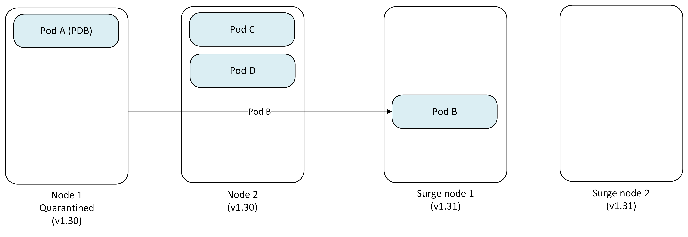

- **Node 1**: Cordoned and marked as quarantined (Pod A stuck)
- **Pod B** → Evicted and replaced on Surge Node 1, while Surge Node 2 temporarily isn't used
- **Status**: Node 1 upgrade blocked

#### Step 3: Proceed to second node

With Node 1 quarantined, AKS continues upgrading Node 2.

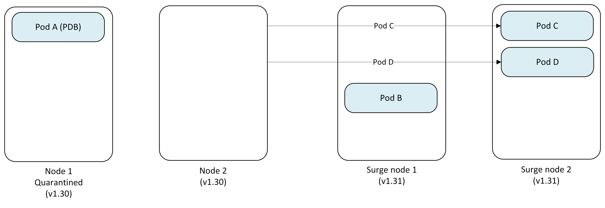

- **Node 1**: Remains quarantined (v1.30)
- **Node 2**: Cordoned and drained successfully
- **Pod C** → Evicted and replaced on Surge Node 2
- **Pod D** → Evicted and replaced on Surge Node 2

#### Step 4: Upgrade second node

Node 2 is successfully reimaged to Kubernetes version 1.31.

- **Node 1**: Still quarantined (v1.30) with Pod A
- **Node 2**: Upgraded to v1.31
- **Surge Node 1**: Pod B
- **Surge Node 2**: Pod C, Pod D

#### Step 5: One Surge Node becomes permanent replacement as another gets removed

Since Node 1 remains quarantined, the Surge Node 1 becomes the permanent replacement running v1.31 and Surge Node 2 gets deleted.

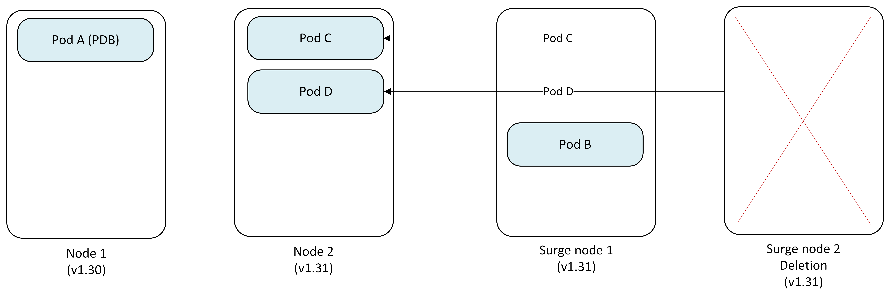

- **Node 1**: Quarantined (v1.30) - requires manual intervention
- **Pod C, Pod D** → Evicted from Surge Node 2 and replaced on Node 2
- **Surge Node 1 (v1.31)**: Pod B (now permanent)
- **Surge Node 2 (v1.31)**: Deleted

#### Final state

The upgrade completes with one quarantined node requiring manual intervention.

- **Node 1**: Quarantined (v1.30) with Pod A - **Customer must manually resolve** (see [Resolve undrainable nodes](./upgrade-cluster.md#resolve-undrainable-nodes))
- **Node 2 (v1.31)**: Running normally
- **Former Surge Node (v1.31)**: Now permanent replacement

> [!IMPORTANT]
> The quarantined node (Node 1) remains the customer's responsibility to handle. You must either:
>
> - Adjust the PDB to allow eviction of Pod A.
> - Manually delete Pod A.
> - Delete and recreate the node after fixing the blocking condition.

### Key considerations for PDB-blocked upgrades

- **Undrainable node behavior**: Set to `Cordon` for the node pool to enable this quarantine behavior.
- **Customer responsibility**: Quarantined nodes require manual intervention to resolve.
- **Cluster capacity**: The surge node becomes permanent, potentially affecting cluster capacity planning.
- **Monitoring**: Track quarantined nodes through Azure Monitor or kubectl to ensure timely resolution.

> [!TIP]
> To avoid the quarantine scenario entirely, you can use [automatic PDB management](automatic-pod-disruption-budget-management.md) to automatically scale up deployment replicas so PDB constraints are satisfied before drain begins. This allows eviction to proceed without blocking, eliminating the need for manual quarantine resolution.

## Blue-Green node pool upgrades (manual control)

Blue-Green upgrades offer a more controlled upgrade approach by manually creating a complete set of new node pools before migrating workloads. This manual approach gives you full control over the upgrade process and timing.

For more information, see [Blue-Green node pool upgrades in AKS](./blue-green-node-pool-upgrade.md).

### When to use Blue-Green upgrades

Manual Blue-Green node pool upgrades are an advanced strategy for specialized requirements, such as explicit migration checkpoints, custom validation gates, or tightly controlled cutovers.

Use manual Blue-Green when you need:

- Operator-controlled migration phases.
- Custom validation and acceptance criteria before commit.
- Explicit rollback choreography tied to internal runbooks.

For most production workloads where applicable, AKS Automatic default upgrade behavior is the preferred starting point, and manual Blue-Green is typically reserved for exceptional cases.

### Key concepts

- **Blue node pool**: Your existing node pool running the current Kubernetes version.
- **Green node pool**: New node pool you create running the target Kubernetes version.
- **Manual control**: You manage all aspects of the migration process.
- **Validation checkpoints**: You decide when to proceed, pause, or rollback.

### Benefits of Blue-Green upgrades

- **Full control**: You decide exactly when each step occurs.
- **Custom validation**: Implement your own validation criteria and timing.
- **Gradual migration**: Move workloads at your preferred pace.
- **Easy rollback**: Original nodes remain available until you delete them.

### Key considerations for Blue-Green upgrades

- **Manual effort**: Requires active management throughout the process.
- **Quota requirements**: Requires 2x the node capacity during upgrade.
- **Planning**: Document your validation criteria and rollback procedures.

### Manual Blue-Green upgrade process example

This example demonstrates manually upgrading a two-node cluster from Kubernetes 1.30 to 1.31 using Blue-Green deployment.

#### Step 1: Create green node pool

You begin by manually creating a new node pool with the target Kubernetes version alongside your existing node pool.

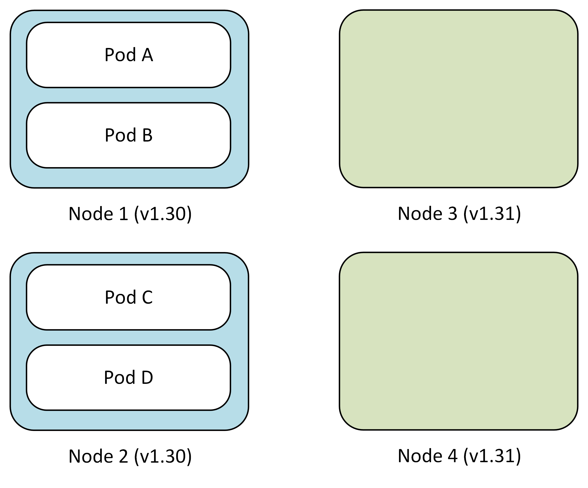

- **Blue node pool (v1.30)**: Pod A, Pod B, Pod C, Pod D (existing)
- **Green node pool (v1.31)**: Empty (manually created by you)
- **Your action**: `az aks nodepool add` with new Kubernetes version

#### Step 2: Manually cordon blue nodes

Cordon the blue nodes to prevent new pod scheduling while keeping existing pods running.

- **Your action**: `kubectl cordon` on each blue node
- **Blue nodes**: Cordoned, no new pods scheduled
- **Green nodes**: Ready to receive workloads

#### Step 3: Manually drain blue nodes (controlled pace)

You control the migration pace by manually draining nodes one at a time or in batches.

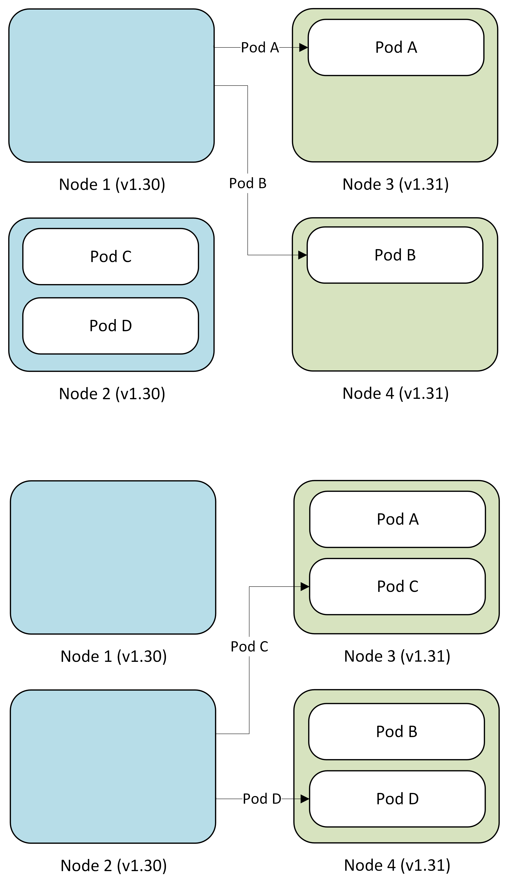

- **Your action**: `kubectl drain` on selected blue nodes
- **Pod migration**: Pods automatically reschedule to green nodes
- **Validation**: Verify workloads on green nodes before proceeding

#### Step 4: Validate and decide

After migrating workloads, validate application performance on green nodes.

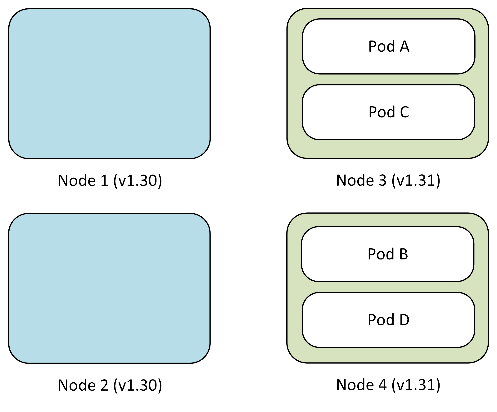

During this phase, you can:

- **Monitor**: Check application metrics and logs
- **Test**: Run validation tests on green node pool
- **Decide**: Commit to green or roll back to blue

#### Step 5: Commit or roll back

Based on your validation, you manually complete the upgrade or roll back.

Option A - Commit (Success):

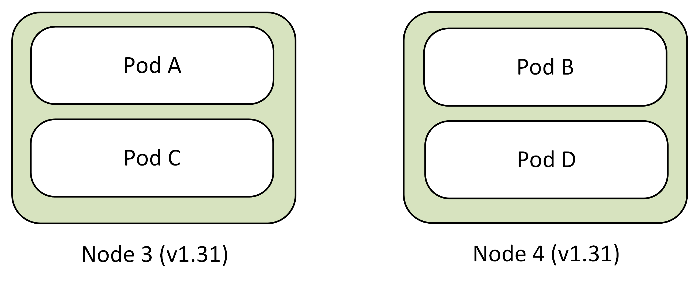

- **Your action**: Delete blue node pool by using `az aks nodepool delete`
- **Result**: Green node pool becomes primary

Option B - Roll back (Issues detected):

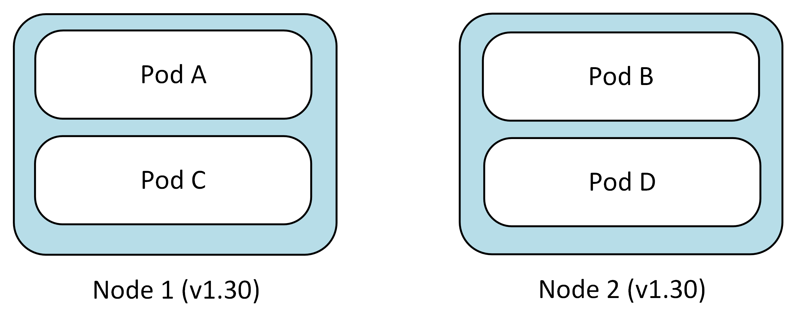

- **Your action**: Uncordon blue nodes by using `kubectl uncordon`, drain green nodes by using `kubectl drain`, and delete green node pool by using `az aks nodepool delete`
- **Result**: Workloads return to Blue nodes

## Production considerations for upgrade planning

- **Surge (`maxSurge`) configuration**: Controls the number of surge nodes created during upgrades. Higher values speed up upgrades but consume more resources.
- **Pod disruption budgets (PDBs)**: Configure PDBs to ensure application availability during the upgrade process.
- **Node pool upgrades**: Each node pool upgrades independently. Plan your upgrade strategy accordingly.
- **Capacity and quota**: Validate temporary and steady-state capacity requirements before upgrade windows.
- **Monitoring and alerts**: Set up monitoring and alerting before the upgrade starts.

In AKS Automatic, several platform-level upgrade choices are preconfigured for production readiness. In AKS Standard, teams typically make these choices explicitly.

## Related content

- [Introduction to AKS Automatic](./intro-aks-automatic.md)
- [Create an AKS Automatic cluster](./automatic/quick-automatic-managed-network.md)
- [AKS Automatic managed system node pools](./automatic/aks-automatic-managed-system-node-pools-about.md)
- [Upgrade an AKS cluster](./upgrade-cluster.md)
- [Configure upgrade settings](./upgrade-aks-cluster.md#customize-node-surge-upgrade)
- [Best practices for cluster upgrades](./operator-best-practices-cluster-isolation.md)
- [Set up cluster autoupgrade](./auto-upgrade-cluster.md)
