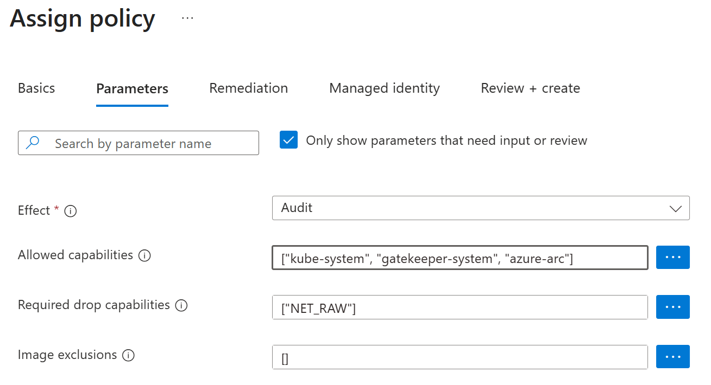

# Use Microsoft Entra pod-managed identities in AKS (Preview)

Microsoft Entra pod-managed identities use Azure Kubernetes Service (AKS) primitives to associate [managed identities for Azure resources][az-managed-identities] and identities in Microsoft Entra ID with pods. Administrators create identities and bindings as Kubernetes primitives that allow pods to access Azure resources that rely on Microsoft Entra ID as an identity provider.

Microsoft Entra pod-managed identities in AKS have the following limitations:

* Each cluster supports up to 200 pod-managed identities.
* Each cluster supports up to 200 pod-managed identity exceptions.
* Pod-managed identities are supported only on Linux node pools.
* This feature is supported only on clusters backed by Virtual Machine Scale Sets.


> [!IMPORTANT]
> We recommend you review [Microsoft Entra Workload ID][workload-identity-overview]. This authentication method replaces pod-managed identity (preview), which integrates with the Kubernetes native capabilities to federate with any external identity providers on behalf of the application.
>
> The open source Microsoft Entra pod-managed identity (preview) in Azure Kubernetes Service was deprecated on October 24, 2022, and the project archived in September 2023. For more information, see the [deprecation notice](https://github.com/Azure/aad-pod-identity#-announcement). The AKS Pod Identity Managed add-on is patched and supported through September 2025 to allow time for customers to move over to [Microsoft Entra Workload ID][workload-identity-overview].

## Operation mode options

Microsoft Entra pod-managed identity supports two modes of operation:

* **Standard Mode**: In this mode, the following two components are deployed to the AKS cluster:

  * [Managed Identity Controller (MIC)](https://azure.github.io/aad-pod-identity/docs/concepts/mic/): An MIC is a Kubernetes controller that watches for changes to pods, [AzureIdentity](https://azure.github.io/aad-pod-identity/docs/concepts/azureidentity/), and [AzureIdentityBinding](https://azure.github.io/aad-pod-identity/docs/concepts/azureidentitybinding/) through the Kubernetes API Server. When it detects a relevant change, the MIC adds or deletes     [AzureAssignedIdentity](https://azure.github.io/aad-pod-identity/docs/concepts/azureassignedidentity/) as needed. Specifically, when a pod is scheduled, the MIC assigns the managed identity on Azure to the underlying Virtual Machine Scale Set used by the node pool during the creation phase. When all pods using the identity are deleted, it removes the identity from the Virtual Machine Scale Set of the node pool, unless the same managed identity is used by other pods. The MIC takes similar actions when AzureIdentity or AzureIdentityBinding are created or deleted.

  * [Node Managed Identity (NMI)](https://azure.github.io/aad-pod-identity/docs/concepts/nmi/): NMI is a pod that runs as a DaemonSet on each node in the AKS cluster. NMI intercepts security token requests to the [Azure Instance Metadata Service](/azure/virtual-machines/linux/instance-metadata-service?tabs=linux) on each node. NMI intercepts token requests and redirects them to itself. It then checks if the pod is authorized to access the requested identity and, if so, retrieves the token from the Microsoft Entra tenant on behalf of the application.

* **Managed Mode**: This mode offers only NMI. When installed via the AKS cluster add-on, Azure manages creation of Kubernetes primitives (AzureIdentity and AzureIdentityBinding) and identity assignment in response to CLI commands by the user. Otherwise, if installed via Helm chart, the identity needs to be manually assigned and managed per the user. For more information, see [Pod identity in managed mode](https://azure.github.io/aad-pod-identity/docs/configure/pod_identity_in_managed_mode/).

When you install the Microsoft Entra pod-managed identity via Helm chart or YAML manifest as shown in the [Installation Guide](https://azure.github.io/aad-pod-identity/docs/getting-started/installation/), you can choose between the `standard` and `managed` mode. If you instead decide to install the
Microsoft Entra pod-managed identity using the AKS cluster add-on as shown in this article, the setup uses the `managed` mode.

## Prerequisites

Your Microsoft Entra pod-managed identities in AKS must meet the following requirements:

* The Azure CLI version 2.20.0 or later is installed.

* Your AKS cluster is at version 1.26 or later.

* You must have the appropriate permissions such as the **Owner** or **Contributor** role.

## Install the aks-preview Azure CLI extension

[!INCLUDE [preview features callout](~/reusable-content/ce-skilling/azure/includes/aks/includes/preview/preview-callout.md)]

To install the aks-preview extension, run the following command:

```azurecli
az extension add --name aks-preview
```

Run the following command to update to the latest version of the extension released:

```azurecli
az extension update --name aks-preview
```

## Register the EnablePodIdentityPreview feature flag

Register the `EnablePodIdentityPreview` feature flag by using the [az feature register][az-feature-register] command as shown in the following example:

```azurecli-interactive
az feature register --namespace "Microsoft.ContainerService" --name "EnablePodIdentityPreview"
```

> [!TIP]
> To disable the AKS Managed add-on, run the following command:
>
> ```azurecli-interactive
> az feature unregister --namespace "Microsoft.ContainerService" --name "EnablePodIdentityPreview"
> ```

It takes a few minutes for the status to show as *Registered*. Verify the registration status by using the [az feature show][az-feature-show] command:

```azurecli-interactive
az feature show --namespace "Microsoft.ContainerService" --name "EnablePodIdentityPreview"
```

When the status reflects *Registered*, refresh the registration of the *Microsoft.ContainerService* resource provider by using the [az provider register][az-provider-register] command:

```azurecli-interactive
az provider register --namespace Microsoft.ContainerService
```

## Manage an AKS cluster with pod-managed identities

You can manage your AKS cluster with either the Azure Container Networking Interface (CNI) or Kubenet network plugin when enabling Microsoft Entra pod-managed identities.

# [Azure CNI](#tab/azurecni)

1. Create an AKS cluster with Azure CNI and pod-managed identity enabled with the default recommended configuration. The following commands use [az group create][az-group-create] to create a resource group named *myResourceGroup* and the [`az aks create`][az-aks-create] command to create an AKS cluster named *myAKSCluster* in the *myResourceGroup* resource group.

   ```azurecli-interactive
   az group create --name myResourceGroup --location eastus
   az aks create \
       --resource-group myResourceGroup \
       --name myAKSCluster \
       --enable-pod-identity \
       --network-plugin azure \
       --generate-ssh-keys
   ```

1. Use [`az aks get-credentials`][az-aks-get-credentials] to sign in to your AKS cluster. This command also downloads and configures the `kubectl` client certificate on your development computer.

   ```azurecli-interactive
   az aks get-credentials --resource-group myResourceGroup --name myAKSCluster
   ```

When you enable pod-managed identity on your AKS cluster, the system adds an `AzurePodIdentityException` named *aks-addon-exception* to the *kube-system* namespace. An `AzurePodIdentityException` lets pods with certain labels access the Azure Instance Metadata Service (IMDS) endpoint without interception by the NMI server. The *aks-addon-exception* allows AKS first-party addons, such as Microsoft Entra pod-managed identity, to operate without requiring you to manually configure an `AzurePodIdentityException`. Optionally, you can add, remove, and update an `AzurePodIdentityException` using:

* `az aks pod-identity exception add`

* `az aks pod-identity exception delete`

* `az aks pod-identity exception update`

* Or `kubectl`

## Update an existing AKS cluster with Azure CNI

To update an existing AKS cluster with Azure CNI to include pod-managed identity, run the following command:

```azurecli-interactive
az aks update --resource-group $MY_RESOURCE_GROUP --name $MY_CLUSTER --enable-pod-identity
```

<a name='using-kubenet-network-plugin-with-azure-active-directory-pod-managed-identities'></a>

# [Kubenet network plugin](#tab/kubenet-np)

> [!WARNING]
> Running Microsoft Entra pod-managed identity in a cluster with Kubenet **isn't recommended** due to security risks. The default Kubenet configuration doesn't prevent Address Resolution Protocol (ARP) spoofing, which could allow a pod to impersonate another pod and access unintended identities. To reduce this risk, implement the mitigation steps and configure appropriate policies **before** enabling Microsoft Entra pod-managed identity with Kubenet.

To mitigate the vulnerability at the cluster level, you can use the Azure built-in policy **Kubernetes cluster containers should only use allowed capabilities** to limit the CAP_NET_RAW attack.

1. In the Azure portal, type **Policy** in the search bar at the top of the page, then select **Policy**.
1. In the left menu, expand **Authoring**, then select **Definitions**.
1. In the right pane, use the search box to filter for the **Kubernetes cluster containers should only use allowed capabilities** policy and select it.
1. Select **Assign policy** at the top left.
1. Progress to **Parameters** and fill in the fields with the following information:

   * **Effect**: `Audit`
   * **Allowed capabilities**: `["kube-system", "gatekeeper-system", "azure-arc"]`
   * **Required drop capabilities**: `["NET_RAW"]`

   

1. Progress through the policy assignment and select **Create**.

If you're not using Azure Policy, you can use the Open Policy Agent (OPA) admission controller with the Gatekeeper validating webhook. If Gatekeeper is already installed in your cluster, add a `ConstraintTemplate` of type `K8sPSPCapabilities`:

```bash
kubectl apply -f https://raw.githubusercontent.com/open-policy-agent/gatekeeper-library/master/library/pod-security-policy/capabilities/template.yaml
```

Add a template to limit the spawning of pods with the `NET_RAW` capability, for example:

```yml
apiVersion: constraints.gatekeeper.sh/v1beta1
kind: K8sPSPCapabilities
metadata:
  name: prevent-net-raw
spec:
  match:
    kinds:
      - apiGroups: [""]
        kinds: ["Pod"]
    excludedNamespaces:
      - "kube-system"
  parameters:
    requiredDropCapabilities: ["NET_RAW"]
```

## Create an AKS cluster with Kubenet network plugin

[!INCLUDE [kubenet retirement](~/reusable-content/ce-skilling/azure/includes/aks/includes/preview/retirement/kubenet-retirement-callout.md)]

To create an AKS cluster with Kubenet network plugin and pod-managed identity enabled, run the following command:

```azurecli-interactive
az aks create \
    --resource-group $MY_RESOURCE_GROUP \
    --name $MY_CLUSTER \
    --enable-pod-identity \
    --enable-pod-identity-with-kubenet \
    --generate-ssh-keys
```

## Update an existing AKS cluster with Kubenet network plugin

To update an existing AKS cluster with Kubenet network plugin to include pod-managed identity, run the following command:

```azurecli-interactive
az aks update --resource-group $MY_RESOURCE_GROUP --name $MY_CLUSTER --enable-pod-identity --enable-pod-identity-with-kubenet
```

---

## Create a managed identity

You must have the relevant permissions (for example, **Owner**) on your subscription to create the identity.

To create an identity to be used by the demo pod with [az identity create][az-identity-create], set the *IDENTITY_CLIENT_ID* and *IDENTITY_RESOURCE_ID* variables, run the following command:

```azurecli-interactive
az group create --name myIdentityResourceGroup --location eastus
export IDENTITY_RESOURCE_GROUP="myIdentityResourceGroup"
export IDENTITY_NAME="application-identity"
az identity create --resource-group ${IDENTITY_RESOURCE_GROUP} --name ${IDENTITY_NAME}
export IDENTITY_CLIENT_ID="$(az identity show --resource-group ${IDENTITY_RESOURCE_GROUP} --name ${IDENTITY_NAME} --query clientId -o tsv)"
export IDENTITY_RESOURCE_ID="$(az identity show --resource-group ${IDENTITY_RESOURCE_GROUP} --name ${IDENTITY_NAME} --query id -o tsv)"
```

## Assign permissions for the managed identity

The managed identity assigned to the pod must be granted appropriate permissions based on the operations the pod performs. Ensure that you assign only the minimum required roles to follow security best practices.

To run the demo, the *IDENTITY_CLIENT_ID* managed identity must have **Virtual Machine Contributor** permissions in the resource group that contains the Virtual Machine Scale Set of your AKS cluster.

```azurecli-interactive
# Obtain the name of the resource group containing the Virtual Machine Scale set of your AKS cluster, commonly called the node resource group
NODE_GROUP=$(az aks show --resource-group myResourceGroup --name myAKSCluster --query nodeResourceGroup -o tsv)

# Obtain the id of the node resource group
NODES_RESOURCE_ID=$(az group show --name $NODE_GROUP -o tsv --query "id")

# Create a role assignment granting your managed identity permissions on the node resource group
az role assignment create --role "Virtual Machine Contributor" --assignee "$IDENTITY_CLIENT_ID" --scope $NODES_RESOURCE_ID
```

## Create a pod-managed identity

To create a pod-managed identity for the cluster using `az aks pod-identity add`, run the following command:

```azurecli-interactive
export POD_IDENTITY_NAME="my-pod-identity"
export POD_IDENTITY_NAMESPACE="my-app"
az aks pod-identity add --resource-group myResourceGroup --cluster-name myAKSCluster --namespace ${POD_IDENTITY_NAMESPACE}  --name ${POD_IDENTITY_NAME} --identity-resource-id ${IDENTITY_RESOURCE_ID}
```

> [!NOTE]
> The "POD_IDENTITY_NAME" has to be a valid Domain Name System [(DNS) subdomain name] as defined in [RFC 1123].
>
> When you assign the pod-managed identity by using `pod-identity add`, the Azure CLI attempts to grant the Managed Identity Operator role over the pod-managed identity (*IDENTITY_RESOURCE_ID*) to the cluster identity.

Azure creates an AzureIdentity resource in your cluster representing the identity in Azure, and an AzureIdentityBinding resource that connects the AzureIdentity to a selector. You can view these resources by running the following command:

```azurecli-interactive
kubectl get azureidentity -n $POD_IDENTITY_NAMESPACE
kubectl get azureidentitybinding -n $POD_IDENTITY_NAMESPACE
```

## Run a sample application

For a pod to use Microsoft Entra pod-managed identity, the pod needs an *aadpodidbinding* label with a value that matches a selector from a *AzureIdentityBinding*. By default, the selector matches the name of the pod-managed identity, but it can also be set using the `--binding-selector` option when calling `az aks pod-identity add`.

To run a sample application using Microsoft Entra pod-managed identity, create a `demo.yaml` file with the following contents. Replace *POD_IDENTITY_NAME*, *IDENTITY_CLIENT_ID*, and *IDENTITY_RESOURCE_GROUP* with the values from the previous steps. Replace *SUBSCRIPTION_ID* with your subscription ID.

> [!NOTE]
> In the previous steps, you created the *POD_IDENTITY_NAME*, *IDENTITY_CLIENT_ID*, and *IDENTITY_RESOURCE_GROUP* variables. You can use a command such as `echo` to display the value you set for variables, for example `echo $POD_IDENTITY_NAME`.

```yml
apiVersion: v1
kind: Pod
metadata:
  name: demo
  labels:
    aadpodidbinding: $POD_IDENTITY_NAME
spec:
  containers:
  - name: demo
    image: mcr.microsoft.com/oss/azure/aad-pod-identity/demo:v1.6.3
    args:
      - --subscriptionid=$SUBSCRIPTION_ID
      - --clientid=$IDENTITY_CLIENT_ID
      - --resourcegroup=$IDENTITY_RESOURCE_GROUP
    env:
      - name: MY_POD_NAME
        valueFrom:
          fieldRef:
            fieldPath: metadata.name
      - name: MY_POD_NAMESPACE
        valueFrom:
          fieldRef:
            fieldPath: metadata.namespace
      - name: MY_POD_IP
        valueFrom:
          fieldRef:
            fieldPath: status.podIP
  nodeSelector:
    kubernetes.io/os: linux
```

Notice the pod definition has an `aadpodidbinding` label with a value that matches the name of the pod-managed identity you ran `az aks pod-identity add` in the previous step.

1. Deploy the `demo.yaml` to the same namespace as your pod-managed identity using `kubectl apply`:

   ```bash
   kubectl apply -f demo.yaml --namespace $POD_IDENTITY_NAMESPACE
   ```

1. Verify the sample application successfully runs using `kubectl logs`:

   ```bash
   kubectl logs demo --follow --namespace $POD_IDENTITY_NAMESPACE
   ```

   Verify that the logs show a token is successfully acquired and that the HTTP *GET* request operation is successful.

   ```output
   ...
   successfully doARMOperations vm count 0
   successfully acquired a token using the MSI, msiEndpoint(http://169.254.169.254/metadata/identity/oauth2/token)
   successfully acquired a token, userAssignedID MSI, msiEndpoint(http://169.254.169.254/metadata/identity/oauth2/token) clientID(xxxxxxxx-xxxx-xxxx-xxxx-xxxxxxxxxxxx)
   successfully made GET on instance metadata
   ...
   ```

## Run an application with multiple identities

To enable an application to use multiple identities, set the `--binding-selector` to the same selector when creating pod identities:

```azurecli-interactive
az aks pod-identity add --resource-group myResourceGroup --cluster-name myAKSCluster --namespace ${POD_IDENTITY_NAMESPACE}  --name ${POD_IDENTITY_NAME_1} --identity-resource-id ${IDENTITY_RESOURCE_ID_1} --binding-selector myMultiIdentitySelector
az aks pod-identity add --resource-group myResourceGroup --cluster-name myAKSCluster --namespace ${POD_IDENTITY_NAMESPACE}  --name ${POD_IDENTITY_NAME_2} --identity-resource-id ${IDENTITY_RESOURCE_ID_2} --binding-selector myMultiIdentitySelector
```

Then set the `aadpodidbinding` field in your pod YAML to the binding selector you specified.

```yml
apiVersion: v1
kind: Pod
metadata:
  name: demo
  labels:
    aadpodidbinding: myMultiIdentitySelector
...
```

## Disable pod-managed identity on an existing cluster

1. To disable pod-managed identity on an existing cluster, remove the pod-managed identities from the cluster by running the following command:

   ```azurecli
   az aks pod-identity delete --name ${POD_IDENTITY_NAME} --namespace ${POD_IDENTITY_NAMESPACE} --resource-group myResourceGroup --cluster-name myAKSCluster
   ```

1. Then disable the feature on the cluster by running the following command:

   ```azurecli
   az aks update --resource-group myResourceGroup --name myAKSCluster --disable-pod-identity
   ```

## Clean up resources

To remove a Microsoft Entra pod-managed identity from your cluster, remove the sample application and the pod-managed identity from the cluster.

```bash
kubectl delete pod demo --namespace $POD_IDENTITY_NAMESPACE
```

Then remove the identity and the role assignment of cluster identity.

```bash
az aks pod-identity delete \
  --name ${POD_IDENTITY_NAME} \
  --namespace ${POD_IDENTITY_NAMESPACE} \
  --resource-group myResourceGroup \
  --cluster-name myAKSCluster

az identity delete \
  --resource-group ${IDENTITY_RESOURCE_GROUP} \
  --name ${IDENTITY_NAME}

az role assignment delete \
  --role "Managed Identity Operator" \
  --assignee "$IDENTITY_CLIENT_ID" \
  --scope "$IDENTITY_RESOURCE_ID"
```

## Next steps

For more information on managed identities, see [Managed identities for Azure resources][az-managed-identities].

<!-- LINKS - internal -->
[workload-identity-overview]: workload-identity-overview.md
[az-aks-create]: /cli/azure/aks#az-aks-create
[az-aks-get-credentials]: /cli/azure/aks#az-aks-get-credentials
[az-extension-add]: /cli/azure/extension#az-extension-add
[az-extension-update]: /cli/azure/extension#az-extension-update
[az-group-create]: /cli/azure/group#az-group-create
[az-identity-create]: /cli/azure/identity#az-identity-create
[az-managed-identities]: /azure/active-directory/managed-identities-azure-resources/overview
[az-provider-register]: /cli/azure/provider#az-provider-register
[az-feature-register]: /cli/azure/feature#az-feature-register
[az-feature-show]: /cli/azure/feature#az-feature-show

<!-- LINKS - external -->
[RFC 1123]: https://tools.ietf.org/html/rfc1123
[(DNS) subdomain name]: https://kubernetes.io/docs/concepts/overview/working-with-objects/names/#dns-subdomain-names
