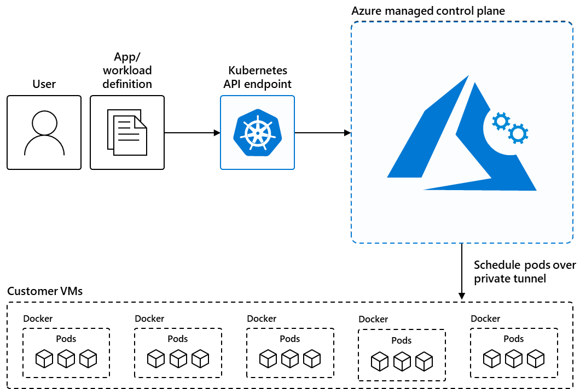

# What is Azure Kubernetes Service (AKS)?

Azure Kubernetes Service (AKS) is a managed Kubernetes service for deploying and managing containerized applications. AKS offloads the complexity and operational overhead of managing Kubernetes to Azure. AKS offers two cluster modes:

- **AKS Automatic**: A fully managed experience with production-ready defaults. Azure handles node management, scaling, security, monitoring, and upgrades automatically. Recommended for most teams and workloads.
- **AKS Standard**: Full control over cluster configuration and node pool management. Recommended when you have specific infrastructure requirements or existing automation.

This article is intended for platform administrators or developers looking for a scalable, automated, managed Kubernetes solution. If you want to minimize operational overhead and get a production-ready cluster fast, [AKS Automatic](./intro-aks-automatic.md) is purpose-built for you.

## Overview of AKS

AKS reduces the complexity and operational overhead of managing Kubernetes by shifting that responsibility to Azure. When you create an AKS cluster, Azure automatically creates and configures a control plane for you at no cost. The Azure platform manages the AKS control plane, which is responsible for the Kubernetes objects and worker nodes that you deploy to run your applications. Azure takes care of critical operations like health monitoring and maintenance, and you only pay for the AKS nodes that run your applications.

> [!NOTE]
> AKS is [CNCF-certified](https://www.cncf.io/training/certification/software-conformance/) and is compliant with SOC, ISO, PCI DSS, and HIPAA. For more information, see the [Microsoft Azure compliance overview](https://azure.microsoft.com/explore/trusted-cloud/compliance/).

## Choose your AKS mode

AKS offers two modes for creating and operating clusters. Use the following table to choose the mode that fits your needs:

| Feature | AKS Automatic | AKS Standard |
| ------- | ------------- | ------------ |
| **Best for** | Developer teams, new workloads, quick onboarding, and production applications | Platform teams that require full infrastructure control |
| **Node management** | Fully managed - Azure provisions, scales, and upgrades nodes automatically using [node auto-provisioning](./node-autoprovision.md) | You create and manage node pools manually |
| **Security defaults** | Azure RBAC, [Workload Identity](./workload-identity-overview.md), [OIDC Issuer](./use-oidc-issuer.md), [deployment safeguards](./deployment-safeguards.md) in enforcement mode, and [Image Cleaner](./image-cleaner.md) are all on by default | Opt-in per feature |
| **Monitoring** | Managed Prometheus, Container Insights, and Azure Monitor dashboards with Grafana are on by default | Opt-in per feature |
| **Cluster upgrades** | Automatic via the stable channel; OS image upgrades run on the NodeImage channel | Manual by default; [automatic upgrade channel](./auto-upgrade-cluster.md) is optional |
| **Scaling** | HPA, [KEDA](./keda-about.md), and [VPA](./vertical-pod-autoscaler.md) are preconfigured; nodes are created on demand | Manual scaling by default; cluster autoscaler and KEDA are optional |
| **Pod readiness SLA** | Financially backed guarantee: [pod readiness SLA](https://www.microsoft.com/licensing/docs/view/Service-Level-Agreements-SLA-for-Online-Services) that guarantees 99.9% of qualifying pods ready within five minutes | Not included |
| **Cluster pricing tier** | Standard pricing tier with uptime SLA - included at no extra charge | Free pricing tier by default; Standard or Premium pricing tier is optional |
| **Ingress** | Managed NGINX with Azure DNS and Key Vault integration - preconfigured | Optional; bring your own ingress controller or use the [application routing add-on](./app-routing.md) |

**Use AKS Automatic** when you want Azure to manage infrastructure operations so your team can focus on applications. **Use AKS Standard** when you need custom networking configurations, Windows node pools, specific VM SKUs not yet available in Automatic, or have existing automation built around manual cluster management.

For a full feature-by-feature comparison, see [AKS Automatic and Standard feature comparison](./intro-aks-automatic.md#aks-automatic-and-standard-feature-comparison).

## Container solutions in Azure

Azure offers a range of container solutions designed to accommodate various workloads, architectures, and business needs.

| Container solution | Resource type |
| --------- | ------------- |
| [Azure Kubernetes Service](#overview-of-aks) | Managed Kubernetes |
| [Azure Red Hat OpenShift](/azure/openshift/intro-openshift) | Managed Kubernetes |
| [Azure Arc-enabled Kubernetes](/azure/azure-arc/kubernetes/overview) | Unmanaged Kubernetes |
| [Azure Container Instances (ACI)](/azure/container-instances/container-instances-overview) | Managed Docker container instance |
| [Azure Container Apps](/azure/container-apps/overview) | Managed Kubernetes |

For more information comparing the various solutions, see the following resources:

- [Comparing the service models of Azure container solutions](/azure/architecture/guide/choose-azure-container-service)
- [Comparing Azure compute service options](/azure/architecture/guide/technology-choices/compute-decision-tree)

## When to use AKS

> [!NOTE]
> For most new workloads, we recommend using **AKS Automatic**. It comes production-ready with automatic node provisioning, built-in security defaults, preconfigured monitoring, automatic upgrades, and a [pod readiness SLA](https://www.microsoft.com/licensing/docs/view/Service-Level-Agreements-SLA-for-Online-Services) that guarantees 99.9% of qualifying pods are ready within five minutes. No additional configuration is required to get these features. For more information, see [What is AKS Automatic?](./intro-aks-automatic.md)

The following list describes some common use cases for AKS:

- **[Lift and shift to containers with AKS](/azure/cloud-adoption-framework/migrate/)**: Migrate existing applications to containers and run them in a fully managed Kubernetes environment.
- **[Microservices with AKS](/azure/architecture/guide/aks/aks-cicd-azure-pipelines)**: Simplify the deployment and management of microservices-based applications with streamlined horizontal scaling, self-healing, load balancing, and secret management.
- **[Secure DevOps for AKS](/azure/architecture/reference-architectures/containers/aks-start-here)**: Efficiently balance speed and security by implementing secure DevOps with Kubernetes.
- **[Bursting from AKS with ACI](/azure/architecture/reference-architectures/containers/aks-start-here)**: Use virtual nodes to provision pods inside ACI that start in seconds and scale to meet demand.
- **[Machine learning model training with AKS](/azure/architecture/ai-ml/idea/machine-learning-model-deployment-aks)**: Train models using large datasets with familiar tools, such as TensorFlow and Kubeflow.
- **[Data streaming with AKS](/azure/architecture/solution-ideas/articles/data-streaming-scenario)**: Ingest and process real-time data streams with millions of data points collected via sensors, and perform fast analyses and computations to develop insights into complex scenarios.
- **[Using Windows containers on AKS](./windows-aks-customer-stories.md)**: Run Windows Server containers on AKS to modernize your Windows applications and infrastructure.

## Features of AKS

The following table lists key features of AKS. Features marked **Automatic: preconfigured** are enabled by default on every AKS Automatic cluster and require no extra configuration.

| Feature | Description |
| ------- | ----------- |
| **Identity and security management** | • Enforce [regulatory compliance controls using Azure Policy](./security-controls-policy.md) with built-in guardrails and internet security benchmarks.   • Integrate with [Kubernetes RBAC](./kubernetes-rbac-entra-id.md) to limit access to cluster resources.   • Use [Microsoft Entra ID](./entra-id-control-plane-authentication.md) to set up Kubernetes access based on existing identity and group membership.   **Automatic: preconfigured** - Azure RBAC for Kubernetes authorization, [Workload Identity](./workload-identity-overview.md), [OIDC Issuer](./use-oidc-issuer.md), [deployment safeguards](./deployment-safeguards.md) in enforcement mode, and [Image Cleaner](./image-cleaner.md) are all on by default. |
| **Logging and monitoring** | • Integrate with [Container Insights](/azure/azure-monitor/containers/kubernetes-monitoring-enable), a feature in Azure Monitor, to monitor the health and performance of your clusters and containerized applications.   • Set up [Advanced Container Networking Services](./advanced-container-networking-services-overview.md) to collect and visualize network traffic data from your clusters.   **Automatic: preconfigured** - Managed Prometheus, Container Insights, and Azure Monitor dashboards with Grafana are on by default. |
| **Streamlined deployments** | • Use prebuilt cluster configurations for Kubernetes with [smart defaults](./quotas-skus-regions.md#cluster-configuration-presets-in-the-azure-portal).   • Autoscale your applications using the [Kubernetes Event-driven Autoscaling (KEDA)](./keda-about.md).   • Use [Draft for AKS](./draft.md) to ready source code and prepare your applications for production.   **Automatic: preconfigured** - HPA, [KEDA](./keda-about.md), and [VPA](./vertical-pod-autoscaler.md) are enabled and ready to use on every Automatic cluster. |
| **Clusters and nodes** | • Connect storage to nodes and pods, upgrade cluster components, and use GPUs.   • Create clusters that run multiple node pools to support mixed operating systems and Windows Server containers.   • Configure automatic scaling using the [cluster autoscaler](./cluster-autoscaler.md) and [horizontal pod autoscaler](./tutorial-kubernetes-scale.md#autoscale-pods).   • Deploy clusters with [confidential computing nodes](/azure/confidential-computing/confidential-nodes-aks-overview) to allow containers to run in a hardware-based trusted execution environment.   **Automatic: preconfigured** - [Node Auto-Provisioning](./node-autoprovision.md) fully manages node creation and scaling; no manual node pool configuration is required. |
| **Storage volume support** | • Mount static or dynamic storage volumes for persistent data.   • Use [Azure Container Storage](/azure/storage/container-storage/container-storage-introduction) for fully managed, cloud-based volume management and orchestration of block storage. Azure Container Storage integrates with Kubernetes, allowing dynamic and automatic provisioning of persistent volumes.   • Use [Azure Disks](./azure-disk-csi.md) CSI driver for single pod access and [Azure Files](./azure-files-csi.md) CSI driver for multiple, concurrent pod access.   • Use [Azure NetApp Files](./azure-netapp-files.md) for high-performance, high-throughput, and low-latency file shares. |
| **Networking** | • Choose from our [networking options](concepts-network-cni-overview.md) for your needs.   • [Bring your own Container Network Interface (CNI)](./use-byo-cni.md) to use a third-party CNI plugin.   • Easily access applications deployed to your clusters using the [application routing add-on with nginx](./app-routing.md).   **Automatic: preconfigured** - [Azure CNI Overlay powered by Cilium](./azure-cni-powered-by-cilium.md) for high-performance networking, managed NGINX ingress with Azure DNS and Key Vault integration, and a managed NAT gateway for egress are configured by default. |
| **Development tooling integration** | • Develop on AKS with [Helm](./quickstart-helm.md).   • Install the [Kubernetes extension for Visual Studio Code](https://marketplace.visualstudio.com/items?itemName=ms-kubernetes-tools.vscode-kubernetes-tools) to manage your workloads.   • Leverage the features of Istio with the [Istio-based service mesh add-on](./istio-about.md). |

## Get started with AKS

### Get started with AKS Automatic (recommended)

AKS Automatic is the fastest path to a production-ready cluster with built-in security, monitoring, and autoscaling. Choose a quickstart based on where you're starting from:

- **Start from a container image**: [Deploy an AKS Automatic cluster](./learn/quick-kubernetes-automatic-deploy.md) - get a fully configured cluster in minutes.
- **Start from source code**: [Go from source code to Kubernetes with AKS Automatic](./automatic/quick-automatic-from-code.md) - automated deployments generate Kubernetes manifests and CI/CD workflows directly from your repository.

### Get started with AKS Standard

Use AKS Standard when you need full control over cluster configuration:

- Learn the [core Kubernetes concepts for AKS](./concepts-clusters-workloads.md).
- Evaluate application deployment on AKS with our [AKS tutorial series](./tutorial-kubernetes-prepare-app.md).

### Resources for all AKS users

- Review the [Azure Well-Architected Framework for AKS](/azure/well-architected/service-guides/azure-kubernetes-service) to learn how to design and operate reliable, secure, efficient, and cost-effective applications on AKS.
- [Plan your design and operations](/azure/architecture/reference-architectures/containers/aks-start-here) for AKS using our reference architectures.
- Explore [configuration options and recommended best practices for cost optimization](./best-practices-cost.md) on AKS.
