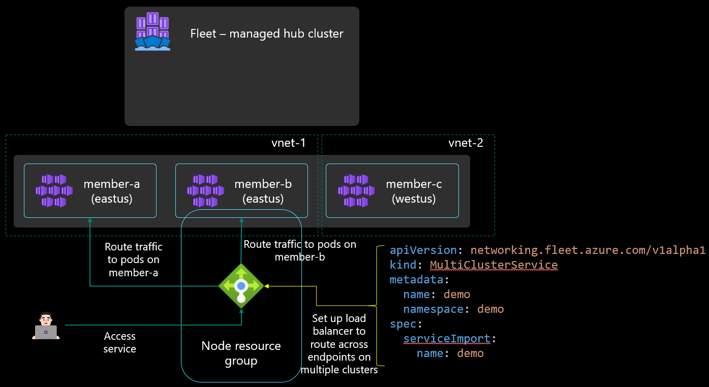

# Multi-cluster layer-4 load balancing (preview)

**Applies to**: :heavy_check_mark: Fleet Manager with hub cluster

Azure Kubernetes Fleet Manager can be used to set up layer 4 multi-cluster load balancing across workloads deployed across member clusters.

[!INCLUDE [preview features note](./includes/preview/preview-callout.md)]

For multi-cluster load balancing, Fleet Manager requires target clusters to be using [Azure CNI networking](/azure/aks/configure-azure-cni). Azure CNI networking enables pod IPs to be directly addressable on the Azure virtual network so that they can be routed to from the Azure Load Balancer.

The `ServiceExport` itself can be distributed from the Fleet Manager hub cluster to one or more member clusters using the Fleet Manager's [resource placement feature](./concepts-resource-placement.md), or it can be created directly on the member cluster. Once the `ServiceExport` is created, it results in a `ServiceImport` being created on the Fleet Manager hub cluster, and all other member clusters to build the awareness of the service.

The user can then create a `MultiClusterService` custom resource to indicate that they want to set up layer 4 multi-cluster load balancing. This `MultiClusterService` configures the Azure Load Balancer in each member cluster to distribute incoming layer 4 traffic across the service’s endpoints in multiple member clusters.

## Next steps

* [Set up multi-cluster layer-4 load balancing](./l4-load-balancing.md).
