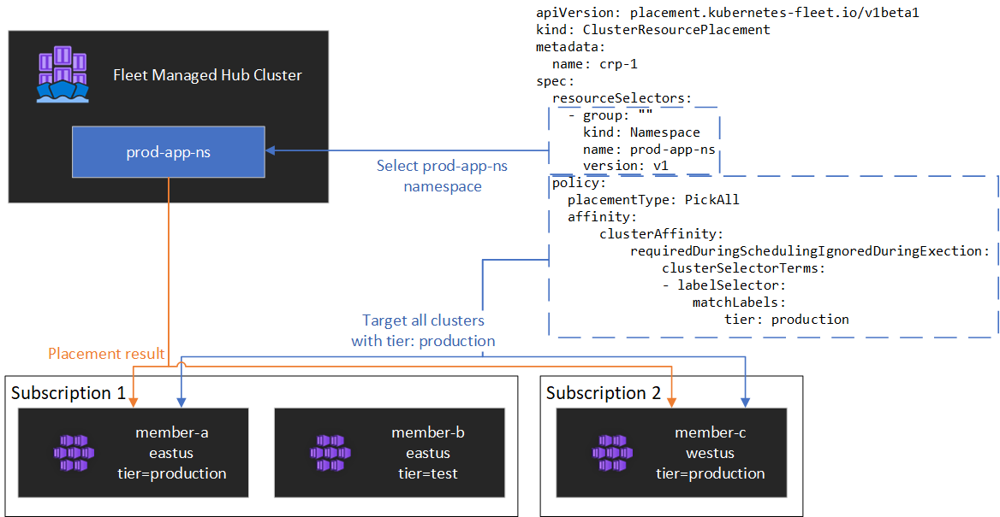

# Kubernetes resource placement from hub cluster to member clusters

This article describes the concept of Kubernetes resource placement from hub clusters to member clusters using Azure Kubernetes Fleet Manager (Kubernetes Fleet).

Platform admins often need to deploy Kubernetes resources onto multiple clusters for various reasons, for example:

* Managing access control using roles and role bindings across multiple clusters.
* Running infrastructure applications, such as Prometheus or Flux, that need to be on all clusters.

Application developers often need to deploy Kubernetes resources onto multiple clusters for various reasons, for example:

* Deploying a video serving application into multiple clusters in different regions for a low latency watching experience.
* Deploying a shopping cart application into two paired regions for customers to continue to shop during a single region outage.
* Deploying a batch compute application into clusters with inexpensive spot node pools available.

It's tedious to create, update, and track these Kubernetes resources across multiple clusters manually. Fleet provides Kubernetes resource propagation to enable at-scale management of Kubernetes resources. With Kubernetes Fleet, you can create Kubernetes resources in the hub cluster and propagate them to selected member clusters via Kubernetes Custom Resources: `MemberCluster` and `ClusterResourcePlacement`.

Kubernetes Fleet supports these custom resources based on an open-source cloud-native solution which you can read more about on the [open source Fleet documentation][fleet-github].

## Introducing ClusterResourcePlacement

A `ClusterResourcePlacement` object is used to tell the fleet scheduler how to place a given set of cluster-scoped objects from the fleet hub cluster onto member clusters. Namespace-scoped objects like Deployments, StatefulSets, DaemonSets, ConfigMaps, Secrets, and PersistentVolumeClaims are included when their containing namespace is selected.

With `ClusterResourcePlacement`, you can:

* Select which cluster-scoped Kubernetes resources to propagate to member clusters.
* Specify placement policies to manually or automatically select member clusters as target clusters.
* Specify rollout strategies to safely roll out any updates of the selected Kubernetes resources to multiple target clusters.
* View the propagation progress towards each target cluster.

An example is shown in the following diagram.

[](./media/conceptual-resource-propagation.png#lightbox)

### Encapsulating resources

`ClusterResourcePlacement` supports using ConfigMap to envelope certain Kubernetes resource types so they can be staged on the hub cluster without any unintended side effects on the hub cluster. For a list of resource types and to understand how this feature works see our [envelope object documentation][envelope-object]

## Placement types

The following placement types are available for controlling the number of clusters to which a specified Kubernetes resource needs to be propagated:

* **[PickFixed](#pickfixed-placement-type)** places the resource onto a specific list of member clusters by name.
* **[PickAll](#pickall-placement-type)** places the resource onto all member clusters, or all member clusters that meet a criteria. This policy is useful for placing infrastructure workloads, like cluster monitoring or reporting applications.
* **[PickN](#pickn-placement-type)** is the most flexible placement option and allows for selection of clusters based on affinity or topology spread constraints and is useful when spreading workloads across multiple appropriate clusters to ensure availability is desired.

### PickFixed placement type

If you want to deploy a workload to a known set of member clusters, you can use a `PickFixed` placement policy to select the clusters by name.

`clusterNames` is the only valid policy option for this placement type.

The following example shows how to deploy the `test-deployment` namespace onto member clusters `cluster1` and `cluster2`.

```yaml
apiVersion: placement.kubernetes-fleet.io/v1
kind: ClusterResourcePlacement
metadata:
  name: crp-fixed
spec:
  policy:
    placementType: PickFixed
    clusterNames:
    - cluster1
    - cluster2
  resourceSelectors:
    - group: ""
      kind: Namespace
      name: test-deployment
      version: v1
```

### PickAll placement type

You can use a `PickAll` placement type to deploy a workload across all member clusters in the fleet or to a subset of clusters that match criteria you set.

When creating this type of placement the following cluster affinity types can be specified:

- **requiredDuringSchedulingIgnoredDuringExecution**: as this policy is required during scheduling, it **filters** the clusters based on the specified criteria.

The following example shows how to deploy a `prod-deployment` namespace and all of its objects across all clusters labeled with `environment: production`:

```yaml
apiVersion: placement.kubernetes-fleet.io/v1
kind: ClusterResourcePlacement
metadata:
  name: crp-pickall
spec:
  policy:
    placementType: PickAll
    affinity:
        clusterAffinity:
            requiredDuringSchedulingIgnoredDuringExecution:
                clusterSelectorTerms:
                - labelSelector:
                    matchLabels:
                        environment: production
  resourceSelectors:
    - group: ""
      kind: Namespace
      name: prod-deployment
      version: v1
```

### PickN placement type

The `PickN` placement type is the most flexible option and allows for placement of resources into a configurable number of clusters based on both affinities and topology spread constraints.

When creating this type of placement the following cluster affinity types can be specified:

- **requiredDuringSchedulingIgnoredDuringExecution**: as this policy is required during scheduling, it **filters** the clusters based on the specified criteria.
- **preferredDuringSchedulingIgnoredDuringExecution**: as this policy is preferred, but not required during scheduling, it **ranks** clusters based on specified criteria.

You can set both required and preferred affinities. Required affinities prevent placement to clusters that don't match, and preferred affinities provide ordering of valid clusters.

#### `PickN` with affinities

Using affinities with a `PickN` placement policy functions similarly to using affinities with pod scheduling. 

The following example shows how to deploy a workload onto three clusters. Only clusters with the `critical-allowed: "true"` label are valid placement targets, and preference is given to clusters with the label `critical-level: 1`:

```yaml
apiVersion: placement.kubernetes-fleet.io/v1
kind: ClusterResourcePlacement
metadata:
  name: crp-pickn-01
spec:
  resourceSelectors:
    - ...
  policy:
    placementType: PickN
    numberOfClusters: 3
    affinity:
        clusterAffinity:
            preferredDuringSchedulingIgnoredDuringExecution:
              weight: 20
              preference:
              - labelSelector:
                  matchLabels:
                    critical-level: 1
            requiredDuringSchedulingIgnoredDuringExecution:
                clusterSelectorTerms:
                - labelSelector:
                    matchLabels:
                      critical-allowed: "true"
```

#### `PickN` with topology spread constraints

You can use topology spread constraints to force the division of the cluster placements across topology boundaries to satisfy availability requirements. For example, use these constraints to split placements across regions or update rings. You can also configure topology spread constraints to prevent scheduling if the constraint can't be met (`whenUnsatisfiable: DoNotSchedule`) or schedule as best possible (`whenUnsatisfiable: ScheduleAnyway`).

The following example shows how to spread a given set of resources out across multiple regions and attempts to schedule across member clusters with different update days.

```yaml
apiVersion: placement.kubernetes-fleet.io/v1
kind: ClusterResourcePlacement
metadata:
  name: crp-pickn-02
spec:
  resourceSelectors:
    - ...
  policy:
    placementType: PickN
    topologySpreadConstraints:
    - maxSkew: 2
      topologyKey: region
      whenUnsatisfiable: DoNotSchedule
    - maxSkew: 2
      topologyKey: updateDay
      whenUnsatisfiable: ScheduleAnyway
```

For more information, see the [open-source Fleet documentation topology spread constraints][crp-topo].

## Placement policy options

The table summarizes the available scheduling policy fields for each placement type.

|       Policy Field          | PickFixed | PickAll | PickN |
|-----------------------------|-----------|---------|-------|
| `placementType`             | ✅ | ✅ | ✅ |
| `affinity`                  | ❌ | ✅ | ✅ |
| `clusterNames`              | ✅ | ❌ | ❌ |
| `numberOfClusters`          | ❌ | ❌ | ✅ |
| `topologySpreadConstraints` | ❌ | ❌ | ✅ | 

### Selecting clusters based on labels and properties 

#### Available labels and properties to select clusters  

When using the `PickN` and `PickAll` placement types, you can use the following labels and properties as part of your policies.

##### Labels

The following labels are automatically added to all member clusters and can be used for target cluster selection in resource placement policies. 

| Label | Description |
|----------|-------------|
| fleet.azure.com/location | Azure Region of the cluster (westus) |
| fleet.azure.com/resource-group | Azure Resource Group of the cluster (rg_prodapps_01) |
| fleet.azure.com/subscription-id | Azure Subscription Identifier the cluster resides in. Formatted as UUID/GUID. |

You can also use any custom labels you apply to your clusters.

##### Properties

The following properties are available for use as part of placement policies. 

CPU and memory properties are represented as [Kubernetes resource units](https://kubernetes.io/docs/concepts/configuration/manage-resources-containers/#resource-units-in-kubernetes).

Cost properties are decimals which represent a per-hour cost in US Dollars for the Azure compute utilized for nodes within the cluster. Cost is based on Azure public pricing.

| Property Name | Description |
|----------|-------------|
| kubernetes-fleet.io/node-count | Available nodes on the member cluster. |
| resources.kubernetes-fleet.io/total-cpu | Total CPU resource units of cluster. | 
| resources.kubernetes-fleet.io/allocatable-cpu | Allocatable CPU resource units of cluster. |
| resources.kubernetes-fleet.io/available-cpu | Available CPU resource units of cluster. |
| resources.kubernetes-fleet.io/total-memory | Total memory resource unit of cluster. |
| resources.kubernetes-fleet.io/allocatable-memory | Allocatable memory resource units of cluster. |
| resources.kubernetes-fleet.io/available-memory | Available memory resource units of cluster. |
| kubernetes.azure.com/per-cpu-core-cost | The per-CPU core cost of the cluster.  |
| kubernetes.azure.com/per-gb-memory-cost | The per-GiB memory cost of the cluster. | 

#### Specifying selection matching criteria

When using cluster properties in a policy criteria, you specify:

* **Name**: Name of the property, which is one the properties [listed in properties](#properties) in this article. 

* **Operator**: An operator used to express the condition between the constraint/desired value and the observed value on the cluster. The following operators are currently supported:

    * `Gt` (Greater than): a cluster's observed value of the given property must be greater than the value in the condition before it can be picked for resource placement.
    * `Ge` (Greater than or equal to): a cluster's observed value of the given property must be greater than or equal to the value in the condition before it can be picked for resource placement.
    * `Lt` (Less than): a cluster's observed value of the given property must be less than the value in the condition before it can be picked for resource placement.
    * `Le` (Less than or equal to): a cluster's observed value of the given property must be less than or equal to the value in the condition before it can be picked for resource placement.
    * `Eq` (Equal to): a cluster's observed value of the given property must be equal to the value in the condition before it can be picked for resource placement.
    * `Ne` (Not equal to): a cluster's observed value of the given property must be not equal to the value in the condition before it can be picked for resource placement.

    If you use the operator `Gt`, `Ge`, `Lt`, `Le`, `Eq`, or `Ne`, the list of values in the condition should have exactly one value.

* **Values:** A list of values, which are possible values of the property.

Fleet evaluates each cluster based on the properties specified in the condition. Failure to satisfy conditions listed under `requiredDuringSchedulingIgnoredDuringExecution` excludes this member cluster from resource placement.

> [!NOTE]
> If a member cluster does not possess the property expressed in the condition, it will automatically fail the condition.

Here's an example placement policy to select only clusters with five or more nodes.

```yaml
apiVersion: placement.kubernetes-fleet.io/v1
kind: ClusterResourcePlacement
metadata:
  name: crp
spec:
  resourceSelectors:
    - ...
  policy:
    placementType: PickAll
    affinity:
        clusterAffinity:
            requiredDuringSchedulingIgnoredDuringExecution:
                clusterSelectorTerms:
                - propertySelector:
                    matchExpressions:
                    - name: "kubernetes-fleet.io/node-count"
                      operator: Ge
                      values:
                      - "5"
```

#### How property ranking works

When `preferredDuringSchedulingIgnoredDuringExecution` is used, a property sorter ranks all the clusters in the fleet based on their values in an ascending or descending order. The weights used for ordering are calculated based on the value specified.

A property sorter consists of:

* **Name**: Name of the cluster property.
* **Sort order**: Sort order can be either `Ascending` or `Descending`. When `Ascending` order is used, member clusters with lower observed values are preferred. When `Descending` order is used, member clusters with higher observed value are preferred.

##### Descending order

For sort order Descending, the proportional weight is calculated using the formula:

```
((Observed Value - Minimum observed value) / (Maximum observed value - Minimum observed value)) * Weight
```

For example, let's say you want to rank clusters based on the property of available CPU capacity in descending order and that you have a fleet of three clusters with the following available CPU:

| Cluster | Available CPU capacity |
| -------- | ------- |
| `cluster-a` | 100 |
| `cluster-b` | 20 |
| `cluster-c` | 10 |

In this case, the sorter computes the following weights:

| Cluster | Available CPU capacity | Calculation | Weight |
| -------- | ------- | ------- | ------- | 
| `cluster-a` | 100 | (100 - 10) / (100 - 10) | 100% |
| `cluster-b` | 20 | (20 - 10) / (100 - 10) | 11.11% |
| `cluster-c` | 10 | (10 - 10) / (100 - 10) | 0% |

##### Ascending order

For sort order Ascending, the proportional weight is calculated using the formula:

```
(1 - ((Observed Value - Minimum observed value) / (Maximum observed value - Minimum observed value))) * Weight
```

For example, let's say you want to rank clusters based on their per-CPU-core-cost in ascending order and that you have a fleet of three clusters with the following CPU core costs:

| Cluster | Per-CPU core cost |
| -------- | ------- |
| `cluster-a` | 1 |
| `cluster-b` | 0.2 |
| `cluster-c` | 0.1 |

In this case, the sorter computes the following weights:

| Cluster | Per-CPU core cost | Calculation | Weight |
| -------- | ------- | ------- | ------- | 
| `cluster-a` | 1 | 1 - ((1 - 0.1) / (1 - 0.1)) | 0% |
| `cluster-b` | 0.2 | 1 - ((0.2 - 0.1) / (1 - 0.1)) | 88.89% |
| `cluster-c` | 0.1 | 1 - (0.1 - 0.1) / (1 - 0.1) | 100% |


## Using Tolerations

`ClusterResourcePlacement` objects support the specification of tolerations, which apply to the `ClusterResourcePlacement` object. Each toleration object consists of the following fields:

* `key`: The key of the toleration.
* `value`: The value of the toleration.
* `effect`: The effect of the toleration, such as `NoSchedule`.
* `operator`: The operator of the toleration, such as `Exists` or `Equal`.

Each toleration is used to tolerate one or more specific taint applied on the `ClusterResourcePlacement`. Once all taints on a [`MemberCluster`](./concepts-fleet.md#what-are-member-clusters) are tolerated, the scheduler can then propagate resources to the cluster. You can't update or remove tolerations from a `ClusterResourcePlacement` object once created.

For more information, see the [open-source Fleet documentation on tolerations][fleet-tolerations].

## Configuring rollout strategy

Fleet uses a rolling update strategy to control how updates are rolled out across clusters.

In the following example, the fleet scheduler rolls out updates to each cluster sequentially, waiting at least `unavailablePeriodSeconds` between clusters. Rollout status is considered successful if all resources were correctly applied to the cluster. Rollout status checking doesn't cascade to child resources, so for example, it doesn't confirm that pods created by a deployment become ready.

```yaml
apiVersion: placement.kubernetes-fleet.io/v1
kind: ClusterResourcePlacement
metadata:
  name: crp
spec:
  resourceSelectors:
    - ...
  policy:
    ...
  strategy:
    type: RollingUpdate
    rollingUpdate:
      maxUnavailable: 25%
      maxSurge: 25%
      unavailablePeriodSeconds: 60
```

For more information, see the [open-source Fleet documentation on rollout strategy][fleet-rollout].


## Determine placement status

The Fleet scheduler updates details and status on placement decisions onto the `ClusterResourcePlacement` object. The output includes the following information:

* The conditions that currently apply to the placement, which include if the placement was successfully completed.
* A placement status section for each member cluster, which shows the status of deployment to that cluster.

The following example shows a `ClusterResourcePlacement` that deployed the `test` namespace and the `test-1` ConfigMap into two member clusters using `PickN`. The placement was successfully completed and the resources were placed into the `aks-member-1` and `aks-member-2` clusters.

 You can view this information using the `kubectl describe crp <name>` command.

```azurecli-interactive
kubectl describe crp crp-1
```

```
Name:         crp-1
Namespace:
Labels:       <none>
Annotations:  <none>
API Version:  placement.kubernetes-fleet.io/v1
Kind:         ClusterResourcePlacement
Metadata:
  ...
Spec:
  Policy:
    Number Of Clusters:  2
    Placement Type:      PickN
  Resource Selectors:
    Group:
    Kind:                  Namespace
    Name:                  test
    Version:               v1
  Revision History Limit:  10
Status:
  Conditions:
    Last Transition Time:  2023-11-10T08:14:52Z
    Message:               found all the clusters needed as specified by the scheduling policy
    Observed Generation:   5
    Reason:                SchedulingPolicyFulfilled
    Status:                True
    Type:                  ClusterResourcePlacementScheduled
    Last Transition Time:  2023-11-10T08:23:43Z
    Message:               All 2 cluster(s) are synchronized to the latest resources on the hub cluster
    Observed Generation:   5
    Reason:                SynchronizeSucceeded
    Status:                True
    Type:                  ClusterResourcePlacementSynchronized
    Last Transition Time:  2023-11-10T08:23:43Z
    Message:               Successfully applied resources to 2 member clusters
    Observed Generation:   5
    Reason:                ApplySucceeded
    Status:                True
    Type:                  ClusterResourcePlacementApplied
  Placement Statuses:
    Cluster Name:  aks-member-1
    Conditions:
      Last Transition Time:  2023-11-10T08:14:52Z
      Message:               Successfully scheduled resources for placement in aks-member-1 (affinity score: 0, topology spread score: 0): picked by scheduling policy
      Observed Generation:   5
      Reason:                ScheduleSucceeded
      Status:                True
      Type:                  ResourceScheduled
      Last Transition Time:  2023-11-10T08:23:43Z
      Message:               Successfully Synchronized work(s) for placement
      Observed Generation:   5
      Reason:                WorkSynchronizeSucceeded
      Status:                True
      Type:                  WorkSynchronized
      Last Transition Time:  2023-11-10T08:23:43Z
      Message:               Successfully applied resources
      Observed Generation:   5
      Reason:                ApplySucceeded
      Status:                True
      Type:                  ResourceApplied
    Cluster Name:            aks-member-2
    Conditions:
      Last Transition Time:  2023-11-10T08:14:52Z
      Message:               Successfully scheduled resources for placement in aks-member-2 (affinity score: 0, topology spread score: 0): picked by scheduling policy
      Observed Generation:   5
      Reason:                ScheduleSucceeded
      Status:                True
      Type:                  ResourceScheduled
      Last Transition Time:  2023-11-10T08:23:43Z
      Message:               Successfully Synchronized work(s) for placement
      Observed Generation:   5
      Reason:                WorkSynchronizeSucceeded
      Status:                True
      Type:                  WorkSynchronized
      Last Transition Time:  2023-11-10T08:23:43Z
      Message:               Successfully applied resources
      Observed Generation:   5
      Reason:                ApplySucceeded
      Status:                True
      Type:                  ResourceApplied
  Selected Resources:
    Kind:       Namespace
    Name:       test
    Version:    v1
    Kind:       ConfigMap
    Name:       test-1
    Namespace:  test
    Version:    v1
Events:
  Type    Reason                     Age                    From                                   Message
  ----    ------                     ----                   ----                                   -------
  Normal  PlacementScheduleSuccess   12m (x5 over 3d22h)    cluster-resource-placement-controller  Successfully scheduled the placement
  Normal  PlacementSyncSuccess       3m28s (x7 over 3d22h)  cluster-resource-placement-controller  Successfully synchronized the placement
  Normal  PlacementRolloutCompleted  3m28s (x7 over 3d22h)  cluster-resource-placement-controller  Resources have been applied to the selected clusters
```

## Placement change triggers

The Fleet scheduler prioritizes the stability of existing workload placements. This prioritization can limit the number of changes that cause a workload to be removed and rescheduled. The following scenarios can trigger placement changes:

* Placement policy changes in the `ClusterResourcePlacement` object can trigger removal and rescheduling of a workload.
  * Scale out operations (increasing `numberOfClusters` with no other changes) places workloads only on new clusters and doesn't affect existing placements.
* Cluster changes, including:
  * A new cluster becoming eligible can trigger placement if the new cluster meets the placement policy, for example, a `PickAll` policy.
  * A cluster with a placement is removed from the fleet. Depending on the policy, the scheduler attempts to place all affected workloads on remaining clusters without affecting existing placements.

Resource-only changes (updating the resources or updating the `ResourceSelector` in the `ClusterResourcePlacement` object) roll out gradually in existing placements but do **not** trigger rescheduling of the workload.

## Next steps

* [Set up Kubernetes resource propagation from hub cluster to member clusters](./resource-propagation.md).
* [Intelligent cross-cluster Kubernetes resource placement based on member clusters properties](./intelligent-resource-placement.md)

<!-- LINKS - external -->
[fleet-github]: https://github.com/Azure/fleet
[envelope-object]: https://github.com/Azure/fleet/blob/main/docs/concepts/ClusterResourcePlacement/README.md#envelope-object
[crp-topo]: https://github.com/Azure/fleet/blob/main/docs/howtos/topology-spread-constraints.md
[fleet-rollout]: https://github.com/Azure/fleet/blob/main/docs/howtos/crp.md#rollout-strategy
[fleet-tolerations]: https://github.com/Azure/fleet/blob/main/docs/concepts/ClusterResourcePlacement/README.md#tolerations